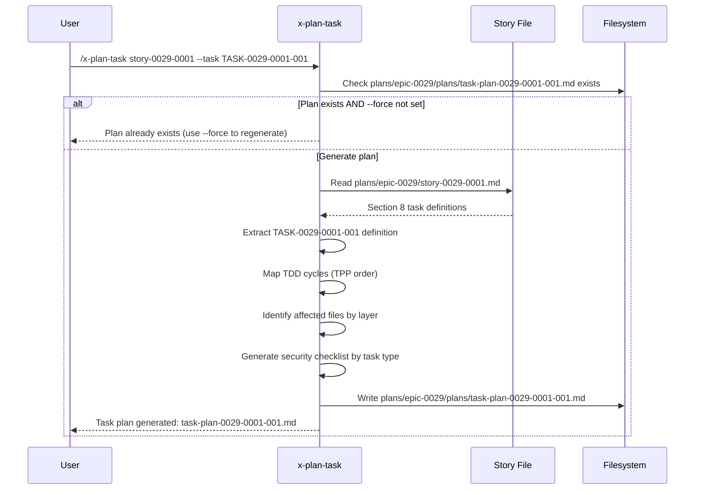
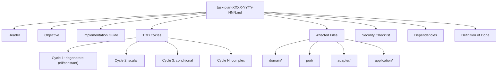

# Historia: x-plan-task — Task Planning Skill

**ID:** story-0029-0007
**Chave Jira:** —
**Status:** Pendente

## 1. Dependencias

| Blocked By | Blocks |
| :--- | :--- |
| story-0029-0001 | story-0029-0008, story-0029-0013 |

## 2. Regras Transversais Aplicaveis

| ID | Titulo |
| :--- | :--- |
| RULE-001 | Task como Unidade de Entrega |
| RULE-002 | Testabilidade Obrigatoria |
| RULE-008 | TDD Strict |

## 3. Descricao

Como **desenvolvedor usando ia-dev-env**, eu quero invocar `/x-plan-task story-0029-0001 --task TASK-0029-0001-001` para gerar um plano detalhado de implementacao para uma task individual, garantindo que cada task tenha ciclos TDD mapeados, arquivos afetados, camada arquitetural, e checklist de seguranca antes da implementacao.

Esta historia cria a skill `x-plan-task` que recebe um Story ID e um Task ID, le a definicao da task na Section 8 da story, e produz um plano de implementacao detalhado no formato `task-plan-XXXX-YYYY-NNN.md`. O plano contem: objetivo, guia de implementacao com classe/metodo/padrao, ciclos TDD mapeados na ordem TPP (degenerate -> constants -> conditionals -> iterations -> complex), arquivos afetados por camada, checklist de seguranca, dependencias, e criterios de conclusao.

### 3.1 Requisitos

1. A skill DEVE ler a story file para extrair a definicao formal da task (Section 8)
2. A skill DEVE gerar um plano com TDD cycles mapeados na ordem TPP
3. O plano DEVE listar arquivos afetados organizados por camada arquitetural (domain -> port -> adapter -> application -> config)
4. O plano DEVE incluir security checklist baseado no tipo de task (endpoint, persistence, domain logic, etc.)
5. A skill DEVE usar template variables `{{LANGUAGE}}`, `{{ARCHITECTURE}}`, `{{COMPILE_COMMAND}}`, `{{TEST_COMMAND}}` para adaptar o plano a linguagem e stack do projeto
6. O output DEVE ser salvo em `plans/epic-XXXX/plans/task-plan-XXXX-YYYY-NNN.md`
7. A skill DEVE suportar flag `--force` para regenerar plano existente (idempotency check via mtime)

### 3.2 TDD Cycle Mapping

Cada ciclo TDD no plano contem:
- **Cycle N:** Descricao do que sera testado
- **RED:** Teste esperado (nome do metodo de teste, assertion principal)
- **GREEN:** Implementacao minima necessaria
- **REFACTOR:** Oportunidades de refactoring identificadas
- **Commit message:** Formato Conventional Commits com task ID

### 3.3 Security Checklist por Tipo de Task

| Tipo de Task | Itens de Seguranca |
| :--- | :--- |
| Endpoint / API | Input validation, output encoding, auth check, rate limiting |
| Persistence / DB | SQL injection, parameterized queries, sensitive data encryption |
| Domain Logic | Business rule bypass, state manipulation, privilege escalation |
| Config | Hardcoded secrets, default credentials, insecure defaults |
| Integration | TLS validation, certificate pinning, timeout configuration |

## 3.5 Entrega de Valor

- **Valor Principal:** Cada task tem um plano de implementacao detalhado com ciclos TDD pre-mapeados, eliminando decisoes ad-hoc durante a codificacao e garantindo cobertura de seguranca
- **Metrica de Sucesso:** Plano gerado contem pelo menos 3 ciclos TDD na ordem TPP, lista de arquivos por camada, e security checklist especifico para o tipo de task
- **Impacto no Negocio:** Reduz tempo de implementacao por task em ~30% ao eliminar a fase de "descobrir o que fazer" e garante que aspectos de seguranca nao sejam esquecidos

## 4. Definicoes de Qualidade Locais

### DoR Local (Definition of Ready)

- [ ] Story template com Section 8 formal disponivel (story-0029-0001)
- [ ] Formato de Task ID (TASK-XXXX-YYYY-NNN) definido e documentado
- [ ] Template variables ({{LANGUAGE}}, {{ARCHITECTURE}}, {{COMPILE_COMMAND}}, {{TEST_COMMAND}}) compreendidos
- [ ] Estrutura de diretorios `plans/epic-XXXX/plans/` compreendida

### DoD Local (Definition of Done)

- [ ] SKILL.md criado em `java/src/main/resources/targets/claude/skills/core/x-plan-task/`
- [ ] README.md criado com descricao, flags e exemplos de invocacao
- [ ] Skill le story file e extrai definicao da task de Section 8
- [ ] Plano gerado contem: Objective, Implementation Guide, TDD Cycles, Affected Files, Security Checklist, Dependencies, Definition of Done
- [ ] TDD cycles seguem ordem TPP (degenerate -> constants -> conditionals -> complex)
- [ ] Template variables {{LANGUAGE}}, {{ARCHITECTURE}}, {{COMPILE_COMMAND}}, {{TEST_COMMAND}} usados no SKILL.md
- [ ] Output salvo em `plans/epic-XXXX/plans/task-plan-XXXX-YYYY-NNN.md`
- [ ] Idempotency check via mtime com flag `--force`
- [ ] Pelo menos 1 teste automatizado validando o SKILL.md gerado
- [ ] Smoke test: golden file match para 8 perfis

### Global Definition of Done (DoD)

- **Cobertura:** >= 95% Line, >= 90% Branch
- **Testes Automatizados:** Unitarios + golden file match
- **Documentacao:** SKILL.md + README.md
- **TDD Compliance:** Test-first commits, refactoring explicito apos green
- **Double-Loop TDD:** Acceptance tests from Gherkin (outer), unit tests by TPP (inner)

## 5. Contratos de Dados (Data Contract)

### 5.1 Input — Argumentos CLI

| Campo | Tipo | M/O | Validacoes | Exemplo |
| :--- | :--- | :--- | :--- | :--- |
| `story-id` | `String` | M | Pattern: story-XXXX-YYYY, arquivo deve existir | `story-0029-0001` |
| `--task` | `String` | M | Pattern: TASK-XXXX-YYYY-NNN, deve existir na Section 8 da story | `TASK-0029-0001-001` |
| `--force` | `Boolean` | O | Flag sem valor, regenera mesmo se plano existente | `--force` |

### 5.2 Output — task-plan-XXXX-YYYY-NNN.md

| Secao (H2) | Conteudo Esperado | M/O |
| :--- | :--- | :--- |
| `Header` | Tabela com Task ID, Story ID, Epic ID, Layer, Type, TDD Phase, Estimated Effort, Date | M |
| `Objective` | Descricao do objetivo da task extraido da Section 8 | M |
| `Implementation Guide` | Classe/metodo/padrao a implementar, com exemplos em {{LANGUAGE}} | M |
| `TDD Cycles` | Lista ordenada por TPP com RED/GREEN/REFACTOR/commit para cada ciclo | M |
| `Affected Files` | Tabela de arquivos organizados por camada (domain, port, adapter, application, config) | M |
| `Security Checklist` | Itens de seguranca baseados no tipo de task (endpoint, persistence, domain, etc.) | M |
| `Dependencies` | Tabela Depends On / Reason (tasks dentro da mesma story e cross-story) | M |
| `Definition of Done` | Criterios de conclusao da task (testes passam, cobertura, lint clean) | M |

### 5.3 Template Variables Utilizados no SKILL.md

| Variable | Onde eh usado |
| :--- | :--- |
| `{{LANGUAGE}}` | Implementation Guide (exemplos de codigo), TDD Cycles (test framework) |
| `{{ARCHITECTURE}}` | Affected Files (estrutura de pacotes), layer order |
| `{{COMPILE_COMMAND}}` | TDD Cycles (verificacao pos-GREEN) |
| `{{TEST_COMMAND}}` | TDD Cycles (execucao de testes RED/GREEN) |

## 6. Diagramas

### 6.1 Workflow x-plan-task



### 6.2 Estrutura do Plano Gerado



## 7. Criterios de Aceite (Gherkin)

```gherkin
Cenario: Task inexistente na story retorna erro
  DADO que story-0029-0001.md existe
  MAS Section 8 nao contem TASK-0029-0001-099
  QUANDO /x-plan-task story-0029-0001 --task TASK-0029-0001-099 eh invocado
  ENTAO a execucao aborta com mensagem "Task TASK-0029-0001-099 not found in story-0029-0001 Section 8"

Cenario: Plano gerado contem todas as secoes obrigatorias
  DADO que story-0029-0001.md existe com TASK-0029-0001-001 na Section 8
  QUANDO /x-plan-task story-0029-0001 --task TASK-0029-0001-001 eh invocado
  ENTAO o arquivo plans/epic-0029/plans/task-plan-0029-0001-001.md eh criado
  E contem os headings H2: Header, Objective, Implementation Guide, TDD Cycles, Affected Files, Security Checklist, Dependencies, Definition of Done

Cenario: TDD Cycles seguem ordem TPP
  DADO que TASK-0029-0001-001 eh do tipo Domain model + unit tests
  QUANDO o plano eh gerado
  ENTAO os TDD cycles estao na ordem: degenerate/nil, constant, scalar, conditional, collection
  E cada cycle contem RED, GREEN, REFACTOR, e commit message

Cenario: Idempotency check previne regeneracao
  DADO que task-plan-0029-0001-001.md ja existe
  E mtime(task-plan) >= mtime(story file)
  QUANDO /x-plan-task story-0029-0001 --task TASK-0029-0001-001 eh invocado SEM --force
  ENTAO o plano NAO eh regenerado
  E o log contem "Task plan already exists and is up-to-date"

Cenario: Flag --force regenera plano existente
  DADO que task-plan-0029-0001-001.md ja existe
  QUANDO /x-plan-task story-0029-0001 --task TASK-0029-0001-001 --force eh invocado
  ENTAO o plano eh regenerado com conteudo atualizado
  E o log contem "Regenerating task plan (--force)"

Cenario: Security checklist adaptado ao tipo de task
  DADO que TASK-0029-0001-002 eh do tipo Endpoint + API test
  QUANDO o plano eh gerado
  ENTAO o Security Checklist contem: Input validation, output encoding, authentication check, rate limiting
  E NAO contem itens de persistence (SQL injection, parameterized queries)
```

## 8. Sub-tarefas

- [ ] [Dev] Criar `x-plan-task/SKILL.md` com frontmatter YAML (name, description, allowed-tools, argument-hint)
- [ ] [Dev] Implementar Phase 0 — Validacao de argumentos (story ID, task ID) e idempotency check
- [ ] [Dev] Implementar Phase 1 — Leitura da story file e extracao da definicao da task de Section 8
- [ ] [Dev] Implementar Phase 2 — Mapeamento de TDD cycles na ordem TPP com RED/GREEN/REFACTOR
- [ ] [Dev] Implementar Phase 3 — Identificacao de arquivos afetados por camada ({{ARCHITECTURE}})
- [ ] [Dev] Implementar Phase 4 — Geracao de security checklist baseado no tipo de task
- [ ] [Dev] Implementar Phase 5 — Escrita do plano em `plans/epic-XXXX/plans/task-plan-XXXX-YYYY-NNN.md`
- [ ] [Dev] Criar `x-plan-task/README.md` com descricao, flags e exemplos
- [ ] [Test] Unitario: SKILL.md contem frontmatter valido e todas as fases
- [ ] [Test] Integracao: Golden file byte-for-byte match do SKILL.md gerado para 8 perfis
- [ ] [Test] Smoke/E2E: SKILL.md gerado pelo pipeline contem template variables ({{LANGUAGE}}, {{ARCHITECTURE}}, etc.)
- [ ] [Doc] Documentar formato de output (task-plan-XXXX-YYYY-NNN.md) e flags suportadas
