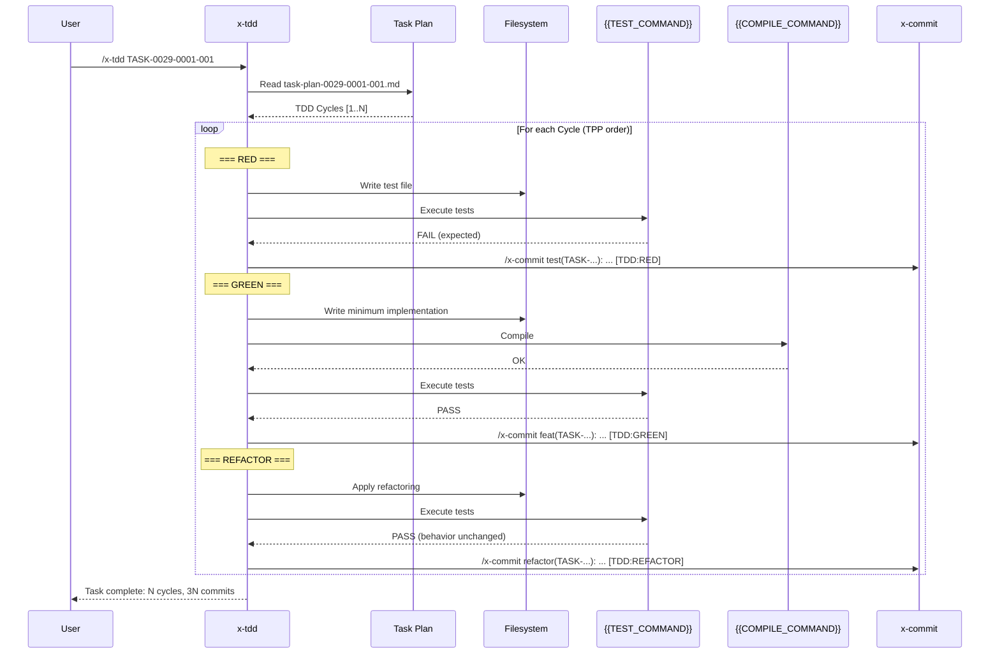
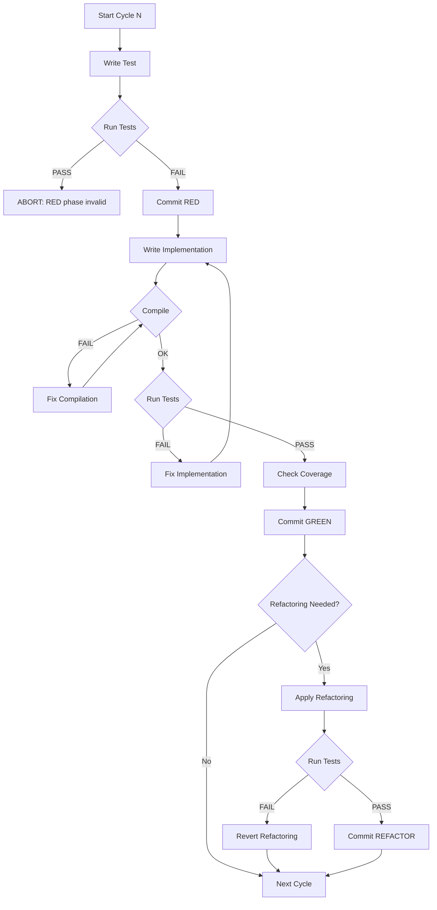

# Historia: x-tdd — TDD Execution Skill

**ID:** story-0029-0008
**Chave Jira:** —
**Status:** Pendente

## 1. Dependencias

| Blocked By | Blocks |
| :--- | :--- |
| story-0029-0005, story-0029-0007 | story-0029-0015 |

## 2. Regras Transversais Aplicaveis

| ID | Titulo |
| :--- | :--- |
| RULE-007 | Pre-Commit Chain |
| RULE-008 | TDD Strict |
| RULE-016 | Conventional Commits com Task ID |

## 3. Descricao

Como **desenvolvedor usando ia-dev-env**, eu quero invocar `/x-tdd TASK-0029-0001-001` para executar ciclos Red-Green-Refactor sistematicos para uma task, garantindo que cada ciclo produza um commit atomico com tag TDD e que a cobertura seja verificada apos cada fase GREEN.

Esta historia cria a skill `x-tdd` que le o task plan gerado por `x-plan-task`, executa os ciclos TDD mapeados na ordem TPP, e delega commits para `x-commit`. Cada ciclo segue rigorosamente: RED (teste que falha) -> GREEN (codigo minimo para passar) -> REFACTOR (melhoria sem mudar comportamento) -> commit. A skill verifica que RED realmente falha (RED que passa = ciclo invalido), que GREEN nao tem gold-plating (apenas o minimo), e que REFACTOR nao altera comportamento (testes continuam passando).

### 3.1 Requisitos

1. A skill DEVE ler o task plan (`task-plan-XXXX-YYYY-NNN.md`) para obter os ciclos TDD pre-mapeados
2. Cada ciclo DEVE seguir a sequencia: RED -> GREEN -> REFACTOR -> commit
3. Na fase RED, o teste DEVE falhar quando executado (`{{TEST_COMMAND}}`). Se o teste passa, o ciclo eh invalido e a skill DEVE abortar com erro
4. Na fase GREEN, o codigo implementado DEVE ser o minimo para fazer o teste passar. Apos GREEN, rodar `{{COMPILE_COMMAND}}` e `{{TEST_COMMAND}}`
5. Na fase GREEN, verificar cobertura via `{{COVERAGE_COMMAND}}` (quando disponivel). Se cobertura cai abaixo do threshold, emitir warning
6. Na fase REFACTOR, testes DEVEM continuar passando. Se um teste falha apos refactoring, reverter e reportar
7. Cada commit DEVE ser delegado para `/x-commit` com TDD tag: `[TDD:RED]`, `[TDD:GREEN]`, ou `[TDD:REFACTOR]`
8. A skill DEVE suportar `--from-cycle N` para retomar de um ciclo especifico (resume)
9. A skill DEVE suportar `--dry-run` para listar ciclos sem executar

### 3.2 Processo por Ciclo

```
1. Ler definicao do Cycle N do task plan
2. RED:
   a. Escrever teste conforme definido no plano (nome, assertion)
   b. Executar {{TEST_COMMAND}} — DEVE falhar
   c. Se passa: ABORT com "RED phase failed: test passes before implementation"
   d. Commit via /x-commit: test(TASK-XXXX-YYYY-NNN): add test for [cycle description] [TDD:RED]
3. GREEN:
   a. Implementar codigo minimo conforme Implementation Guide
   b. Executar {{COMPILE_COMMAND}} — DEVE compilar
   c. Executar {{TEST_COMMAND}} — DEVE passar
   d. Verificar cobertura (se {{COVERAGE_COMMAND}} disponivel)
   e. Commit via /x-commit: feat(TASK-XXXX-YYYY-NNN): implement [cycle description] [TDD:GREEN]
4. REFACTOR:
   a. Aplicar melhorias (extract method, rename, simplify)
   b. Executar {{TEST_COMMAND}} — DEVE continuar passando
   c. Se falha: reverter refactoring, log warning
   d. Commit via /x-commit: refactor(TASK-XXXX-YYYY-NNN): [refactoring description] [TDD:REFACTOR]
   e. Se nenhum refactoring necessario: pular com log "No refactoring needed for Cycle N"
```

### 3.3 Ordem TPP (Transformation Priority Premise)

| Prioridade | Transformacao | Exemplo |
| :--- | :--- | :--- |
| 1 | {} -> nil | Metodo retorna null/void |
| 2 | nil -> constant | Retorna valor fixo |
| 3 | constant -> constant+ | Retorna outro valor fixo |
| 4 | constant -> scalar | Retorna variavel |
| 5 | statement -> statements | Adiciona instrucoes |
| 6 | unconditional -> conditional | Adiciona if/switch |
| 7 | scalar -> collection | Lista/Map/Set |
| 8 | collection -> recursion | Iteracao/recursao |

## 3.5 Entrega de Valor

- **Valor Principal:** Ciclos Red-Green-Refactor sistematicos com commits atomicos, garantindo que cada incremento de codigo eh testado e rastreavel via task ID
- **Metrica de Sucesso:** Cada task executada via x-tdd produz N commits atomicos com tags [TDD:RED], [TDD:GREEN], [TDD:REFACTOR], com cobertura verificada apos cada GREEN
- **Impacto no Negocio:** Elimina TDD ad-hoc e garante compliance com TDD strict (RULE-008), produzindo historico de commits que comprova a pratica test-first

## 4. Definicoes de Qualidade Locais

### DoR Local (Definition of Ready)

- [ ] Skill x-commit disponivel (story-0029-0005)
- [ ] Skill x-plan-task disponivel e task plans gerados (story-0029-0007)
- [ ] Template variables {{COMPILE_COMMAND}}, {{TEST_COMMAND}}, {{COVERAGE_COMMAND}} compreendidos
- [ ] Formato Conventional Commits com TDD tags definido (RULE-016)

### DoD Local (Definition of Done)

- [ ] SKILL.md criado em `java/src/main/resources/targets/claude/skills/core/x-tdd/`
- [ ] README.md criado com descricao, flags e exemplos
- [ ] Ciclo RED valida que teste falha (RED que passa = abort)
- [ ] Ciclo GREEN executa compile + test + coverage check
- [ ] Ciclo REFACTOR verifica que testes continuam passando (revert se falha)
- [ ] Commits delegados para /x-commit com TDD tags
- [ ] Suporta --from-cycle N para resume
- [ ] Suporta --dry-run para listagem de ciclos
- [ ] Template variables {{TEST_COMMAND}}, {{COMPILE_COMMAND}}, {{COVERAGE_COMMAND}} usados
- [ ] Pelo menos 1 teste automatizado validando o SKILL.md gerado
- [ ] Smoke test: golden file match para 8 perfis

### Global Definition of Done (DoD)

- **Cobertura:** >= 95% Line, >= 90% Branch
- **Testes Automatizados:** Unitarios + golden file match
- **Documentacao:** SKILL.md + README.md
- **TDD Compliance:** Test-first commits, refactoring explicito apos green
- **Double-Loop TDD:** Acceptance tests from Gherkin (outer), unit tests by TPP (inner)

## 5. Contratos de Dados (Data Contract)

### 5.1 Input — Argumentos CLI

| Campo | Tipo | M/O | Validacoes | Exemplo |
| :--- | :--- | :--- | :--- | :--- |
| `task-id` | `String` | M | Pattern: TASK-XXXX-YYYY-NNN, task plan deve existir | `TASK-0029-0001-001` |
| `--from-cycle` | `Integer` | O | >= 1, ciclo deve existir no task plan | `--from-cycle 3` |
| `--dry-run` | `Boolean` | O | Flag sem valor, lista ciclos sem executar | `--dry-run` |

### 5.2 Input — Task Plan (lido automaticamente)

| Campo | Tipo | Sempre presente | Descricao |
| :--- | :--- | :--- | :--- |
| `TDD Cycles` | `List<Cycle>` | Sim | Lista de ciclos TDD ordenados por TPP |
| `Cycle.description` | `String` | Sim | O que sera testado neste ciclo |
| `Cycle.red` | `String` | Sim | Nome do teste e assertion principal |
| `Cycle.green` | `String` | Sim | Implementacao minima esperada |
| `Cycle.refactor` | `String` | Nao | Oportunidades de refactoring (pode ser vazio) |
| `Cycle.commit_message` | `String` | Sim | Mensagem de commit template |

### 5.3 Output — Commits Gerados

| Fase | Formato do Commit | Tag TDD |
| :--- | :--- | :--- |
| RED | `test(TASK-XXXX-YYYY-NNN): add test for [description]` | `[TDD:RED]` |
| GREEN | `feat(TASK-XXXX-YYYY-NNN): implement [description]` | `[TDD:GREEN]` |
| REFACTOR | `refactor(TASK-XXXX-YYYY-NNN): [refactoring description]` | `[TDD:REFACTOR]` |

### 5.4 Template Variables Utilizados no SKILL.md

| Variable | Onde eh usado |
| :--- | :--- |
| `{{TEST_COMMAND}}` | Fase RED (rodar teste para verificar falha), Fase GREEN/REFACTOR (verificar que passa) |
| `{{COMPILE_COMMAND}}` | Fase GREEN (verificar compilacao antes de rodar testes) |
| `{{COVERAGE_COMMAND}}` | Fase GREEN (verificar cobertura apos testes passarem) |

## 6. Diagramas

### 6.1 Workflow x-tdd por Ciclo



### 6.2 Validacao RED-GREEN-REFACTOR



## 7. Criterios de Aceite (Gherkin)

```gherkin
Cenario: Task plan inexistente retorna erro
  DADO que nenhum arquivo task-plan-0029-0001-099.md existe
  QUANDO /x-tdd TASK-0029-0001-099 eh invocado
  ENTAO a execucao aborta com mensagem "Task plan not found: task-plan-0029-0001-099.md"

Cenario: RED que passa aborta o ciclo
  DADO que o task plan tem Cycle 1 com teste para metodo isEmpty()
  E o metodo isEmpty() ja existe e retorna true
  QUANDO x-tdd executa Cycle 1 fase RED
  ENTAO o teste PASSA (inesperado)
  E a execucao aborta com "RED phase failed: test passes before implementation"
  E nenhum commit eh criado

Cenario: Ciclo completo RED-GREEN-REFACTOR produz 3 commits
  DADO que o task plan tem Cycle 1 definido
  QUANDO x-tdd executa Cycle 1 completo
  ENTAO 3 commits sao criados via /x-commit:
    | commit | tag |
    | test(TASK-...): add test for ... | [TDD:RED] |
    | feat(TASK-...): implement ... | [TDD:GREEN] |
    | refactor(TASK-...): ... | [TDD:REFACTOR] |

Cenario: Cobertura verificada apos GREEN
  DADO que {{COVERAGE_COMMAND}} esta configurado
  E o threshold de cobertura eh 95% line
  QUANDO x-tdd executa a fase GREEN do Cycle 1
  E a cobertura apos GREEN eh 87%
  ENTAO um warning eh emitido: "Coverage below threshold: 87% < 95%"
  E o ciclo NAO aborta (warning only)

Cenario: REFACTOR que falha eh revertido
  DADO que x-tdd executa a fase REFACTOR do Cycle 1
  E o refactoring causa falha em um teste
  QUANDO os testes sao executados apos refactoring
  ENTAO o refactoring eh revertido automaticamente
  E o log contem "Refactoring reverted: tests failed after refactoring"
  E nenhum commit REFACTOR eh criado para este ciclo

Cenario: Resume de ciclo especifico com --from-cycle
  DADO que Cycles 1 e 2 ja foram executados (commits existem)
  QUANDO /x-tdd TASK-0029-0001-001 --from-cycle 3 eh invocado
  ENTAO Cycles 1 e 2 sao pulados
  E a execucao comeca do Cycle 3

Cenario: Dry-run lista ciclos sem executar
  DADO que o task plan tem 5 ciclos TDD
  QUANDO /x-tdd TASK-0029-0001-001 --dry-run eh invocado
  ENTAO os 5 ciclos sao listados com descricao e transformacao TPP
  E nenhum arquivo eh criado ou modificado
  E nenhum commit eh criado
```

## 8. Sub-tarefas

- [ ] [Dev] Criar `x-tdd/SKILL.md` com frontmatter YAML (name, description, allowed-tools, argument-hint)
- [ ] [Dev] Implementar Phase 0 — Validacao de argumentos e leitura do task plan
- [ ] [Dev] Implementar Cycle RED — Escrita de teste, verificacao que falha, commit via /x-commit [TDD:RED]
- [ ] [Dev] Implementar Cycle GREEN — Implementacao minima, compile, test, coverage check, commit [TDD:GREEN]
- [ ] [Dev] Implementar Cycle REFACTOR — Refactoring, verificacao, revert se falha, commit [TDD:REFACTOR]
- [ ] [Dev] Implementar --from-cycle N para resume de ciclo especifico
- [ ] [Dev] Implementar --dry-run para listagem de ciclos sem execucao
- [ ] [Dev] Integrar com /x-commit para delegacao de commits com TDD tags (RULE-016)
- [ ] [Dev] Criar `x-tdd/README.md` com descricao, flags, exemplos e tabela TPP
- [ ] [Test] Unitario: SKILL.md contem frontmatter valido e todas as fases do ciclo TDD
- [ ] [Test] Integracao: Golden file byte-for-byte match do SKILL.md gerado para 8 perfis
- [ ] [Test] Smoke/E2E: SKILL.md gerado contem template variables ({{TEST_COMMAND}}, {{COMPILE_COMMAND}}, etc.)
- [ ] [Doc] Documentar tabela TPP e formato de commits TDD no README.md
