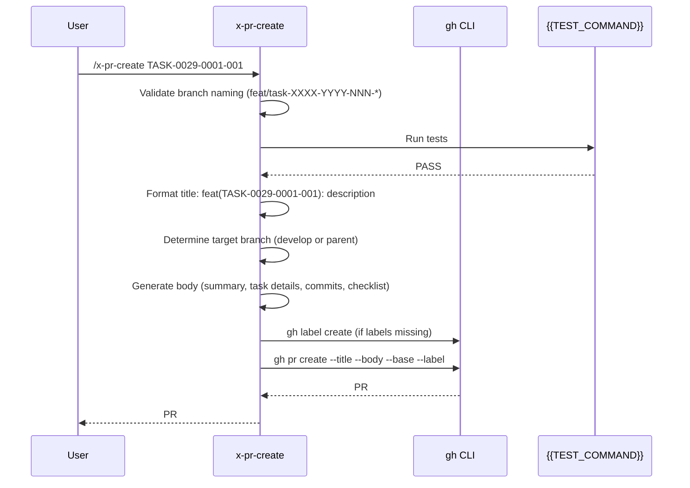
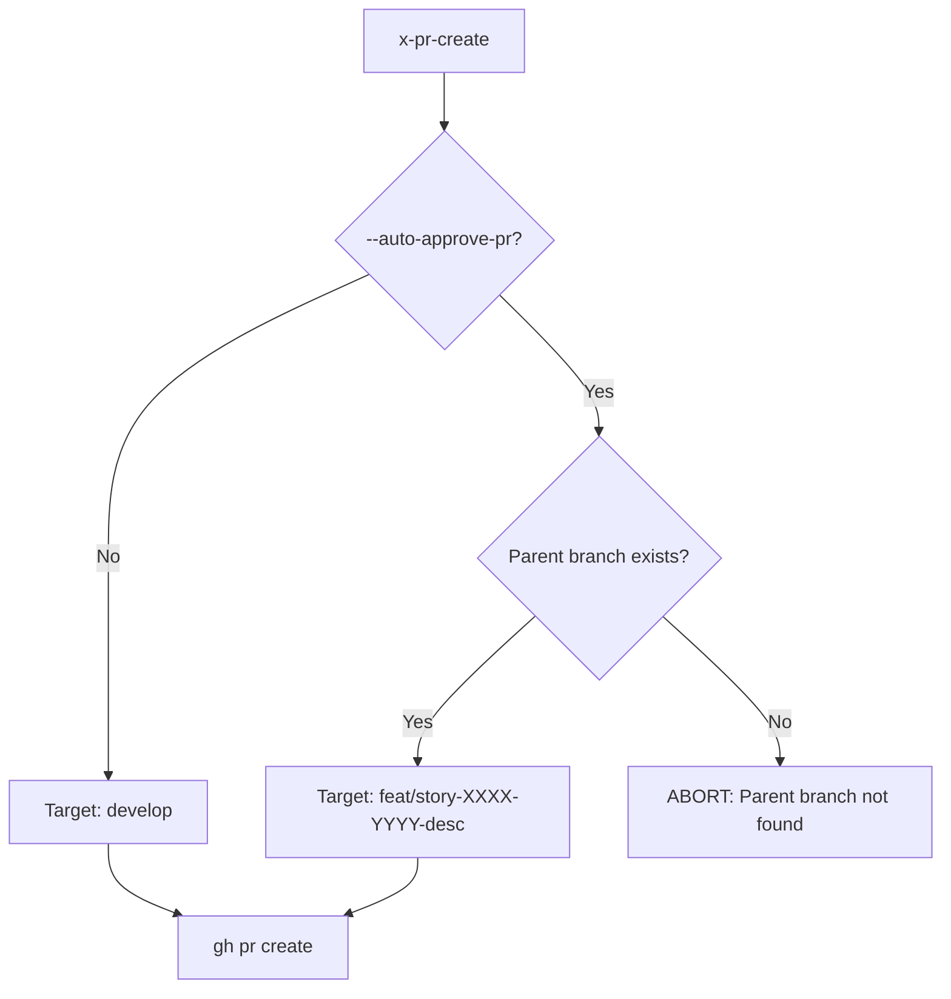

# Historia: x-pr-create — Task PR Creation Skill

**ID:** story-0029-0009
**Chave Jira:** —
**Status:** Pendente

## 1. Dependencias

| Blocked By | Blocks |
| :--- | :--- |
| story-0029-0005 | story-0029-0015, story-0029-0017 |

## 2. Regras Transversais Aplicaveis

| ID | Titulo |
| :--- | :--- |
| RULE-001 | Task como Unidade de Entrega |
| RULE-005 | Git Flow Compliance |
| RULE-006 | Task ID Format |

## 3. Descricao

Como **desenvolvedor usando ia-dev-env**, eu quero invocar `/x-pr-create TASK-0029-0001-001` para criar um Pull Request padronizado com titulo formatado, labels automaticos e target branch correto, garantindo que cada task PR seja rastreavel e revisavel independentemente.

Esta historia cria a skill `x-pr-create` que automatiza a criacao de PRs para tasks individuais. A skill formata o titulo no padrao `feat(TASK-XXXX-YYYY-NNN): description` (<=70 chars), adiciona labels automaticos (`task`, `story-XXXX-YYYY`, `epic-XXXX`), define o target branch correto (`develop` por padrao ou parent branch em modo `--auto-approve-pr`), gera o body do PR com checklist de review e referencia ao task plan, e cria o PR via `gh pr create`.

### 3.1 Requisitos

1. A skill DEVE formatar o titulo do PR como `feat(TASK-XXXX-YYYY-NNN): description` com no maximo 70 caracteres
2. A skill DEVE adicionar labels automaticos: `task`, `story-XXXX-YYYY`, `epic-XXXX`
3. O target branch DEVE ser `develop` por padrao (Git Flow compliance)
4. Quando `--auto-approve-pr` eh passado, o target branch DEVE ser a parent branch (`feat/story-XXXX-YYYY-desc`)
5. O body do PR DEVE conter: resumo da task, link para task plan, checklist de review, lista de commits
6. A skill DEVE verificar que o branch atual segue o naming convention `feat/task-XXXX-YYYY-NNN-desc`
7. A skill DEVE verificar que todos os testes passam antes de criar o PR (`{{TEST_COMMAND}}`)
8. A skill DEVE suportar `--draft` para criar PR como draft
9. A skill DEVE detectar se labels existem no repositorio e cria-los se necessario (via `gh label create`)

### 3.2 Body Template do PR

```markdown
## Summary

{task_description}

## Task Details

| Field | Value |
|-------|-------|
| Task ID | TASK-XXXX-YYYY-NNN |
| Story | story-XXXX-YYYY |
| Epic | epic-XXXX |
| Task Plan | [task-plan-XXXX-YYYY-NNN.md](link) |

## Changes

{list of commits in this branch}

## Review Checklist

- [ ] Tests pass locally
- [ ] Coverage thresholds met (>=95% line, >=90% branch)
- [ ] TDD commits present (RED -> GREEN -> REFACTOR)
- [ ] No TODO/FIXME/HACK comments
- [ ] Conventional Commits format followed
```

## 3.5 Entrega de Valor

- **Valor Principal:** PRs padronizados com task ID, labels automaticos e body estruturado, garantindo rastreabilidade completa de cada entrega atômica
- **Metrica de Sucesso:** Cada PR criado via x-pr-create tem titulo no formato correto (<=70 chars), 3 labels automaticos, body com checklist e referencia ao task plan, e target branch correto
- **Impacto no Negocio:** Elimina PRs manuais com titulos inconsistentes e sem labels, reduzindo tempo de triagem e melhorando rastreabilidade de entregas por task

## 4. Definicoes de Qualidade Locais

### DoR Local (Definition of Ready)

- [ ] Skill x-commit disponivel (story-0029-0005)
- [ ] Formato de Task ID (TASK-XXXX-YYYY-NNN) definido (RULE-006)
- [ ] Branch naming convention definida (feat/task-XXXX-YYYY-NNN-desc)
- [ ] `gh` CLI disponivel e autenticado

### DoD Local (Definition of Done)

- [ ] SKILL.md criado em `java/src/main/resources/targets/claude/skills/core/x-pr-create/`
- [ ] README.md criado com descricao, flags e exemplos
- [ ] Titulo do PR formatado como `feat(TASK-XXXX-YYYY-NNN): description` (<=70 chars)
- [ ] Labels automaticos: `task`, `story-XXXX-YYYY`, `epic-XXXX`
- [ ] Target branch: `develop` (padrao) ou parent branch (--auto-approve-pr)
- [ ] Body do PR com summary, task details table, commits, review checklist
- [ ] Pre-check: `{{TEST_COMMAND}}` passa antes de criar PR
- [ ] Suporta --draft para PR como draft
- [ ] Suporta --auto-approve-pr para target parent branch
- [ ] Labels criados automaticamente se inexistentes
- [ ] Pelo menos 1 teste automatizado validando o SKILL.md gerado
- [ ] Smoke test: golden file match para 8 perfis

### Global Definition of Done (DoD)

- **Cobertura:** >= 95% Line, >= 90% Branch
- **Testes Automatizados:** Unitarios + golden file match
- **Documentacao:** SKILL.md + README.md
- **TDD Compliance:** Test-first commits, refactoring explicito apos green
- **Double-Loop TDD:** Acceptance tests from Gherkin (outer), unit tests by TPP (inner)

## 5. Contratos de Dados (Data Contract)

### 5.1 Input — Argumentos CLI

| Campo | Tipo | M/O | Validacoes | Exemplo |
| :--- | :--- | :--- | :--- | :--- |
| `task-id` | `String` | M | Pattern: TASK-XXXX-YYYY-NNN, branch deve existir | `TASK-0029-0001-001` |
| `--auto-approve-pr` | `Boolean` | O | Flag sem valor, target = parent branch | `--auto-approve-pr` |
| `--draft` | `Boolean` | O | Flag sem valor, cria PR como draft | `--draft` |
| `--description` | `String` | O | Descricao curta para o titulo do PR | `"add user validation"` |

### 5.2 Output — PR Criado

| Campo | Tipo | Sempre presente | Descricao |
| :--- | :--- | :--- | :--- |
| `pr_url` | `String` | Sim | URL do PR criado |
| `pr_number` | `Integer` | Sim | Numero do PR |
| `title` | `String` | Sim | Titulo formatado do PR |
| `target_branch` | `String` | Sim | Branch alvo (develop ou parent) |
| `labels` | `List<String>` | Sim | Labels aplicados |

### 5.3 Branch Naming Validation

| Validacao | Pattern | Exemplo Valido | Exemplo Invalido |
| :--- | :--- | :--- | :--- |
| Task branch | `feat/task-XXXX-YYYY-NNN-*` | `feat/task-0029-0001-001-add-validation` | `feature/add-validation` |
| Parent branch | `feat/story-XXXX-YYYY-*` | `feat/story-0029-0001-user-auth` | `feat/user-auth` |
| Max length | <=60 chars | — | — |

### 5.4 Label Auto-Creation

| Label | Color | Descricao |
| :--- | :--- | :--- |
| `task` | `#0075ca` | Individual task PR |
| `story-XXXX-YYYY` | `#e4e669` | Parent story reference |
| `epic-XXXX` | `#d73a4a` | Parent epic reference |

## 6. Diagramas

### 6.1 Workflow x-pr-create



### 6.2 Target Branch Decision



## 7. Criterios de Aceite (Gherkin)

```gherkin
Cenario: Branch com naming invalido retorna erro
  DADO que o branch atual eh "feature/add-stuff"
  E NAO segue o pattern "feat/task-XXXX-YYYY-NNN-*"
  QUANDO /x-pr-create TASK-0029-0001-001 eh invocado
  ENTAO a execucao aborta com "Current branch does not match task naming convention: feat/task-XXXX-YYYY-NNN-*"

Cenario: PR criado com titulo formatado e labels
  DADO que o branch atual eh "feat/task-0029-0001-001-add-validation"
  E todos os testes passam
  QUANDO /x-pr-create TASK-0029-0001-001 eh invocado
  ENTAO um PR eh criado com titulo "feat(TASK-0029-0001-001): add validation"
  E o PR tem labels: task, story-0029-0001, epic-0029
  E o target branch eh "develop"

Cenario: Titulo truncado para 70 caracteres
  DADO que a descricao da task eh muito longa (>70 chars no titulo)
  QUANDO /x-pr-create TASK-0029-0001-001 --description "implement comprehensive user input validation with sanitization" eh invocado
  ENTAO o titulo eh truncado para no maximo 70 caracteres
  E o titulo termina com "..." se truncado

Cenario: Auto-approve mode usa parent branch como target
  DADO que o branch atual eh "feat/task-0029-0001-001-add-validation"
  E o parent branch "feat/story-0029-0001-user-auth" existe
  QUANDO /x-pr-create TASK-0029-0001-001 --auto-approve-pr eh invocado
  ENTAO o target branch eh "feat/story-0029-0001-user-auth"
  E NAO eh "develop"

Cenario: Testes falhando impedem criacao do PR
  DADO que o branch atual eh "feat/task-0029-0001-001-add-validation"
  MAS {{TEST_COMMAND}} retorna falha
  QUANDO /x-pr-create TASK-0029-0001-001 eh invocado
  ENTAO a execucao aborta com "Tests failed. Fix tests before creating PR."
  E nenhum PR eh criado

Cenario: Labels inexistentes sao criados automaticamente
  DADO que o label "task" NAO existe no repositorio
  E o label "story-0029-0001" NAO existe no repositorio
  QUANDO /x-pr-create TASK-0029-0001-001 eh invocado
  ENTAO os labels sao criados via "gh label create"
  E o PR eh criado com os labels recem-criados

Cenario: Draft PR criado com flag --draft
  DADO que o branch atual segue naming convention
  E todos os testes passam
  QUANDO /x-pr-create TASK-0029-0001-001 --draft eh invocado
  ENTAO o PR eh criado como draft
  E o body contem "[DRAFT] This PR is not ready for review"
```

## 8. Sub-tarefas

- [ ] [Dev] Criar `x-pr-create/SKILL.md` com frontmatter YAML (name, description, allowed-tools, argument-hint)
- [ ] [Dev] Implementar Phase 0 — Validacao de branch naming e argumentos
- [ ] [Dev] Implementar Phase 1 — Pre-check: executar {{TEST_COMMAND}} antes de criar PR
- [ ] [Dev] Implementar Phase 2 — Formatacao do titulo (<=70 chars, Conventional Commits format)
- [ ] [Dev] Implementar Phase 3 — Geracao do body com summary, task details, commits, checklist
- [ ] [Dev] Implementar Phase 4 — Label auto-creation via `gh label create`
- [ ] [Dev] Implementar Phase 5 — Criacao do PR via `gh pr create` com --draft support
- [ ] [Dev] Implementar target branch logic (develop vs parent branch com --auto-approve-pr)
- [ ] [Dev] Criar `x-pr-create/README.md` com descricao, flags e exemplos
- [ ] [Test] Unitario: SKILL.md contem frontmatter valido e todas as fases
- [ ] [Test] Integracao: Golden file byte-for-byte match do SKILL.md gerado para 8 perfis
- [ ] [Test] Smoke/E2E: SKILL.md gerado contem template variable {{TEST_COMMAND}}
- [ ] [Doc] Documentar body template e label auto-creation no README.md
