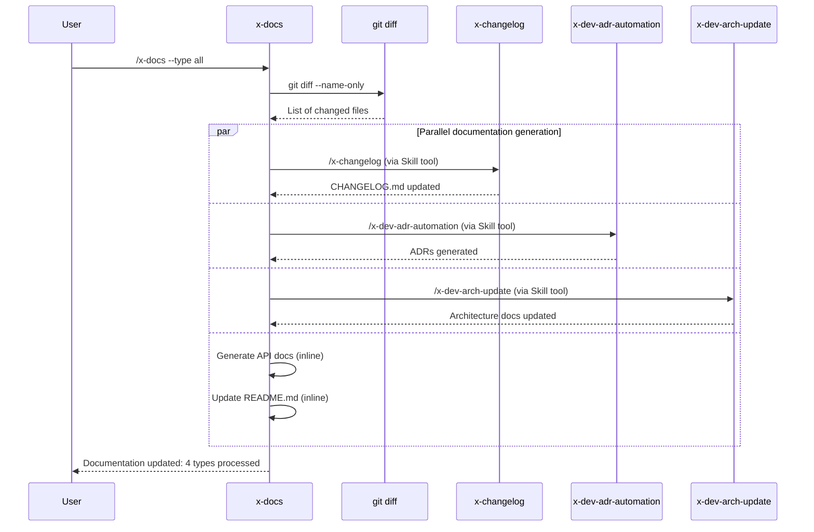
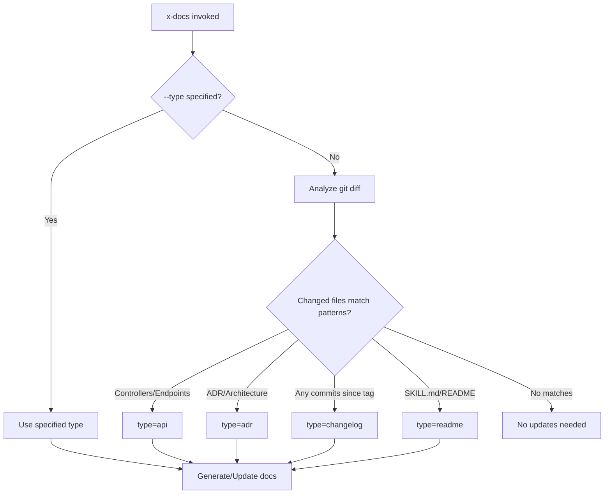

# Historia: x-docs — Documentation Skill

**ID:** story-0029-0010
**Chave Jira:** —
**Status:** Pendente

## 1. Dependencias

| Blocked By | Blocks |
| :--- | :--- |
| — | — |

## 2. Regras Transversais Aplicaveis

| ID | Titulo |
| :--- | :--- |
| RULE-017 | Documentation Sync |

## 3. Descricao

Como **desenvolvedor usando ia-dev-env**, eu quero invocar `/x-docs --type api` para gerar ou atualizar documentacao especifica em sincronia com mudancas de codigo, garantindo que a documentacao nunca fique desatualizada em relacao a implementacao.

Esta historia cria a skill `x-docs` que serve como ponto unico de entrada para geracao e atualizacao de documentacao. A skill detecta o tipo de documentacao necessario (API, README, ADR, changelog, ou todos) e delega para skills especializadas existentes: `/x-changelog` para changelogs, `/x-dev-adr-automation` para ADRs, e `/x-dev-arch-update` para documentacao de arquitetura. Para API docs e READMEs, a skill gera diretamente baseando-se nas mudancas de codigo detectadas via `git diff`.

### 3.1 Requisitos

1. A skill DEVE suportar o parametro `--type` com valores: `api`, `readme`, `adr`, `changelog`, `all`
2. Quando `--type all` eh especificado, TODOS os tipos de documentacao aplicaveis DEVEM ser gerados/atualizados
3. Para `--type changelog`, a skill DEVE delegar para `/x-changelog`
4. Para `--type adr`, a skill DEVE delegar para `/x-dev-adr-automation`
5. Para `--type api`, a skill DEVE detectar endpoints alterados via `git diff` e atualizar documentacao OpenAPI/Swagger
6. Para `--type readme`, a skill DEVE atualizar o README.md do projeto com novas features/skills/configuracoes
7. A skill DEVE detectar automaticamente o tipo de doc necessario quando `--type` nao eh especificado (auto-detect baseado em arquivos alterados)
8. A skill DEVE ser idempotente: re-executar nao deve duplicar conteudo

### 3.2 Auto-Detection Logic

| Arquivos Alterados | Tipo de Doc Inferido |
| :--- | :--- |
| Endpoints (Controller, Resource, Handler) | `api` |
| Decision records, architecture changes | `adr` |
| Conventional Commits desde ultima tag | `changelog` |
| SKILL.md, configuration, public API | `readme` |
| Nenhuma mudanca detectada | Nenhuma acao (log: "No documentation updates needed") |

### 3.3 Delegacao para Skills Existentes

| Tipo | Skill Delegada | Invocacao |
| :--- | :--- | :--- |
| `changelog` | `/x-changelog` | Via Skill tool |
| `adr` | `/x-dev-adr-automation` | Via Skill tool |
| `api` + architecture | `/x-dev-arch-update` | Via Skill tool (quando mudancas arquiteturais detectadas) |
| `api` (endpoints only) | Inline | Gera/atualiza diretamente |
| `readme` | Inline | Gera/atualiza diretamente |

## 3.5 Entrega de Valor

- **Valor Principal:** Documentacao sempre atualizada em sincronia com codigo, com ponto unico de entrada que detecta e delega o tipo correto de atualizacao
- **Metrica de Sucesso:** Invocacao de `/x-docs` apos implementacao resulta em documentacao atualizada para todos os tipos aplicaveis, sem lacunas entre codigo e docs
- **Impacto no Negocio:** Elimina documentacao desatualizada que causa onboarding lento e erros de integracao, reduzindo tempo de ramp-up de novos desenvolvedores

## 4. Definicoes de Qualidade Locais

### DoR Local (Definition of Ready)

- [ ] Skills existentes lidas e compreendidas: x-changelog, x-dev-adr-automation, x-dev-arch-update
- [ ] Formato de documentacao API (OpenAPI/Swagger) compreendido
- [ ] Auto-detection logic baseado em git diff definido

### DoD Local (Definition of Done)

- [ ] SKILL.md criado em `java/src/main/resources/targets/claude/skills/core/x-docs/`
- [ ] README.md criado com descricao, flags e exemplos
- [ ] Suporta --type api|readme|adr|changelog|all
- [ ] Auto-detect funciona quando --type nao eh especificado
- [ ] Delegacao para /x-changelog, /x-dev-adr-automation, /x-dev-arch-update funciona via Skill tool
- [ ] Geracao inline de API docs e README funciona
- [ ] Idempotente: re-execucao nao duplica conteudo
- [ ] Pelo menos 1 teste automatizado validando o SKILL.md gerado
- [ ] Smoke test: golden file match para 8 perfis

### Global Definition of Done (DoD)

- **Cobertura:** >= 95% Line, >= 90% Branch
- **Testes Automatizados:** Unitarios + golden file match
- **Documentacao:** SKILL.md + README.md
- **TDD Compliance:** Test-first commits, refactoring explicito apos green
- **Double-Loop TDD:** Acceptance tests from Gherkin (outer), unit tests by TPP (inner)

## 5. Contratos de Dados (Data Contract)

### 5.1 Input — Argumentos CLI

| Campo | Tipo | M/O | Validacoes | Exemplo |
| :--- | :--- | :--- | :--- | :--- |
| `--type` | `Enum` | O | Valores: api, readme, adr, changelog, all. Default: auto-detect | `--type api` |
| `--scope` | `String` | O | Path para limitar analise de mudancas | `--scope src/main/java/com/example/api/` |
| `--force` | `Boolean` | O | Flag sem valor, regenera mesmo se docs atualizados | `--force` |

### 5.2 Output — Arquivos Gerados/Atualizados

| Tipo | Arquivo de Output | Gerado Por |
| :--- | :--- | :--- |
| `api` | `docs/api/openapi.yaml` ou inline no README | Inline (x-docs) |
| `readme` | `README.md` (raiz do projeto) | Inline (x-docs) |
| `adr` | `docs/adr/NNNN-*.md` | Delegado: /x-dev-adr-automation |
| `changelog` | `CHANGELOG.md` | Delegado: /x-changelog |
| `architecture` | `docs/architecture.md` | Delegado: /x-dev-arch-update |

### 5.3 Auto-Detection — Mapeamento de Arquivos para Tipo

| Pattern de Arquivo Alterado | Tipo Inferido |
| :--- | :--- |
| `*Controller*`, `*Resource*`, `*Handler*`, `*Endpoint*` | api |
| `*ADR*`, `*Decision*`, `architecture*` | adr |
| Qualquer commit desde ultima tag | changelog |
| `SKILL.md`, `README*`, `config*`, `setup*` | readme |

## 6. Diagramas

### 6.1 Workflow x-docs



### 6.2 Auto-Detection Decision Tree



## 7. Criterios de Aceite (Gherkin)

```gherkin
Cenario: Tipo especificado delega para skill correta
  DADO que o usuario invoca /x-docs --type changelog
  QUANDO x-docs processa o comando
  ENTAO /x-changelog eh invocado via Skill tool
  E os demais tipos (api, readme, adr) NAO sao processados

Cenario: Tipo "all" processa todos os tipos aplicaveis
  DADO que existem mudancas em endpoints, ADRs, e commits desde a ultima tag
  QUANDO /x-docs --type all eh invocado
  ENTAO /x-changelog eh invocado para changelog
  E /x-dev-adr-automation eh invocado para ADRs
  E API docs sao gerados inline
  E README.md eh atualizado inline

Cenario: Auto-detect infere tipo correto de mudancas
  DADO que git diff mostra alteracoes em UserController.java e UserResource.java
  E --type NAO eh especificado
  QUANDO /x-docs eh invocado
  ENTAO o tipo "api" eh inferido automaticamente
  E documentacao de API eh gerada/atualizada
  E o log contem "Auto-detected documentation type: api"

Cenario: Sem mudancas nao gera documentacao
  DADO que git diff nao retorna nenhum arquivo alterado
  E --force NAO eh especificado
  QUANDO /x-docs eh invocado
  ENTAO nenhuma documentacao eh gerada
  E o log contem "No documentation updates needed"

Cenario: Flag --force regenera documentacao mesmo sem mudancas
  DADO que git diff nao retorna alteracoes
  QUANDO /x-docs --type readme --force eh invocado
  ENTAO o README.md eh regenerado
  E o log contem "Forcing documentation regeneration"

Cenario: Idempotencia na geracao de API docs
  DADO que /x-docs --type api foi executado anteriormente
  E nenhuma mudanca ocorreu desde a ultima execucao
  QUANDO /x-docs --type api eh invocado novamente SEM --force
  ENTAO a documentacao NAO eh modificada
  E o log contem "API documentation is up-to-date"
```

## 8. Sub-tarefas

- [ ] [Dev] Criar `x-docs/SKILL.md` com frontmatter YAML (name, description, allowed-tools, argument-hint)
- [ ] [Dev] Implementar Phase 0 — Parsing de argumentos (--type, --scope, --force)
- [ ] [Dev] Implementar auto-detection logic baseado em git diff --name-only
- [ ] [Dev] Implementar delegacao para /x-changelog via Skill tool
- [ ] [Dev] Implementar delegacao para /x-dev-adr-automation via Skill tool
- [ ] [Dev] Implementar delegacao para /x-dev-arch-update via Skill tool
- [ ] [Dev] Implementar geracao inline de API docs (detectar endpoints, gerar OpenAPI stubs)
- [ ] [Dev] Implementar geracao inline de README updates
- [ ] [Dev] Implementar idempotency check (mtime comparison)
- [ ] [Dev] Criar `x-docs/README.md` com descricao, flags, exemplos e tabela de delegacao
- [ ] [Test] Unitario: SKILL.md contem frontmatter valido e todas as fases
- [ ] [Test] Integracao: Golden file byte-for-byte match do SKILL.md gerado para 8 perfis
- [ ] [Test] Smoke/E2E: SKILL.md gerado contem instrucoes de delegacao para skills existentes
- [ ] [Doc] Documentar auto-detection patterns e tabela de delegacao no README.md
