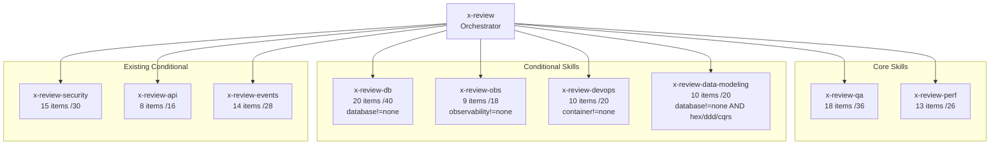
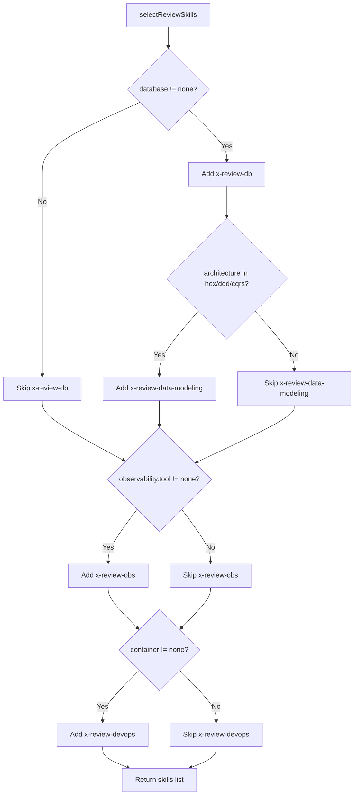

# Historia: Individual Review Skills Extraction

**ID:** story-0029-0011
**Chave Jira:** —
**Status:** Pendente

## 1. Dependencias

| Blocked By | Blocks |
| :--- | :--- |
| — | story-0029-0012 |

## 2. Regras Transversais Aplicaveis

| ID | Titulo |
| :--- | :--- |
| RULE-009 | Review Modular |

## 3. Descricao

Como **desenvolvedor usando ia-dev-env**, eu quero que cada especialista de review tenha sua propria skill independente (x-review-qa, x-review-perf, x-review-db, x-review-obs, x-review-devops, x-review-data-modeling), garantindo que reviews sejam modulares, reutilizaveis e ativaveis condicionalmente por feature gates.

Esta historia extrai as checklists de 6 especialistas que atualmente vivem inline no `x-review/SKILL.md` para skills individuais. Duas skills sao core (sempre incluidas): `x-review-qa` (18 items, /36) e `x-review-perf` (13 items, /26). Quatro skills sao condicionais (feature-gated): `x-review-db` (20 items, /40, quando database!=none), `x-review-obs` (9 items, /18, quando observability configurado), `x-review-devops` (10 items, /20, quando container!=none), e `x-review-data-modeling` (10 items, /20, quando database!=none AND architecture hexagonal/ddd/cqrs). A classe Java `SkillsSelection.java` recebe novos predicados condicionais para as 4 skills condicionais.

### 3.1 Skills Core (Sempre Incluidas)

| Skill | Itens | Score Max | Knowledge Pack |
| :--- | :--- | :--- | :--- |
| `x-review-qa` | 18 | /36 | testing/ |
| `x-review-perf` | 13 | /26 | resilience/ |

### 3.2 Skills Condicionais (Feature-Gated)

| Skill | Itens | Score Max | Condicao de Ativacao | Knowledge Pack |
| :--- | :--- | :--- | :--- | :--- |
| `x-review-db` | 20 | /40 | `database != "none"` | database-patterns/ |
| `x-review-obs` | 9 | /18 | `observability.tool != "none"` | observability/ |
| `x-review-devops` | 10 | /20 | `container != "none"` | infrastructure/ |
| `x-review-data-modeling` | 10 | /20 | `database != "none"` AND `architecture in [hexagonal, ddd, cqrs]` | data-modeling/ |

### 3.3 Java Code Changes

Adicionar novos metodos em `SkillsSelection.java`:

```java
// Novo metodo para review skills condicionais
public static List<String> selectReviewSkills(
        ProjectConfig config) {
    List<String> skills = new ArrayList<>();
    if (!"none".equals(config.databaseName())) {
        skills.add("x-review-db");
    }
    if (!"none".equals(config.observabilityTool())) {
        skills.add("x-review-obs");
    }
    if (!"none".equals(
            config.infrastructure().container())) {
        skills.add("x-review-devops");
    }
    if (!"none".equals(config.databaseName())
            && isHexagonalOrDdd(config)) {
        skills.add("x-review-data-modeling");
    }
    return skills;
}
```

Integrar `selectReviewSkills()` no metodo `selectConditionalSkills()`.

### 3.4 Formato de Cada Skill de Review

Cada skill de review individual segue o mesmo formato:
1. Frontmatter YAML (name, description, user-invocable, allowed-tools, argument-hint)
2. Global Output Policy
3. Purpose + When to Use + Triggers
4. Activation Condition (para condicionais)
5. Checklist completo com itens numerados e score por item (0/1/2)
6. Output format (ENGINEER, STORY, SCORE, STATUS, PASSED, FAILED, PARTIAL)
7. Knowledge Pack reference

## 3.5 Entrega de Valor

- **Valor Principal:** Reviews modulares e independentes por especialista, permitindo invocacao individual, manutencao isolada e ativacao condicional por feature gates
- **Metrica de Sucesso:** 6 skills de review criadas (2 core + 4 condicionais), cada uma com checklist completo e score maximo correto, ativaveis individualmente via `/x-review-{specialist}`
- **Impacto no Negocio:** Reduz acoplamento no x-review, permite reviews parciais (apenas QA, apenas perf), e habilita feature-gating para skills nao aplicaveis ao stack do projeto

## 4. Definicoes de Qualidade Locais

### DoR Local (Definition of Ready)

- [ ] x-review/SKILL.md atual lido e compreendido (checklists inline de cada especialista)
- [ ] SkillsSelection.java lido e compreendido (metodos de selecao condicional existentes)
- [ ] ProjectConfig.java lido (campos database, observability, container, architecture)
- [ ] Skills condicionais existentes analisadas como referencia de formato (x-review-security, x-review-api)

### DoD Local (Definition of Done)

- [ ] 2 skills core criadas: `x-review-qa/SKILL.md`, `x-review-perf/SKILL.md` em `skills/core/`
- [ ] 4 skills condicionais criadas: `x-review-db/SKILL.md`, `x-review-obs/SKILL.md`, `x-review-devops/SKILL.md`, `x-review-data-modeling/SKILL.md` em `skills/conditional/`
- [ ] Cada skill tem frontmatter YAML, checklist completo, output format, KP reference
- [ ] README.md criado para cada skill
- [ ] `SkillsSelection.java` atualizado com metodo `selectReviewSkills()`
- [ ] `selectConditionalSkills()` integra `selectReviewSkills()`
- [ ] Testes unitarios para cada predicado condicional em SkillsSelection
- [ ] Testes de integracao: golden files incluem novas skills para perfis aplicaveis
- [ ] Smoke test: skills condicionais aparecem apenas quando feature gate ativo

### Global Definition of Done (DoD)

- **Cobertura:** >= 95% Line, >= 90% Branch
- **Testes Automatizados:** Unitarios para SkillsSelection + golden file match
- **Documentacao:** SKILL.md + README.md por skill
- **TDD Compliance:** Test-first commits, refactoring explicito apos green
- **Double-Loop TDD:** Acceptance tests from Gherkin (outer), unit tests by TPP (inner)

## 5. Contratos de Dados (Data Contract)

### 5.1 Skills Core — Localicacao

| Skill | Caminho | Score |
| :--- | :--- | :--- |
| `x-review-qa` | `java/src/main/resources/targets/claude/skills/core/x-review-qa/SKILL.md` | 18 items, /36 |
| `x-review-perf` | `java/src/main/resources/targets/claude/skills/core/x-review-perf/SKILL.md` | 13 items, /26 |

### 5.2 Skills Condicionais — Localizacao e Feature Gates

| Skill | Caminho | Score | Feature Gate |
| :--- | :--- | :--- | :--- |
| `x-review-db` | `java/src/main/resources/targets/claude/skills/conditional/x-review-db/SKILL.md` | 20 items, /40 | `config.databaseName() != "none"` |
| `x-review-obs` | `java/src/main/resources/targets/claude/skills/conditional/x-review-obs/SKILL.md` | 9 items, /18 | `config.observabilityTool() != "none"` |
| `x-review-devops` | `java/src/main/resources/targets/claude/skills/conditional/x-review-devops/SKILL.md` | 10 items, /20 | `config.infrastructure().container() != "none"` |
| `x-review-data-modeling` | `java/src/main/resources/targets/claude/skills/conditional/x-review-data-modeling/SKILL.md` | 10 items, /20 | `config.databaseName() != "none" && isHexagonalOrDdd(config)` |

### 5.3 Checklist Items — x-review-qa (18 Items, /36)

| # | Item | Score |
| :--- | :--- | :--- |
| QA-01 | Test exists for each acceptance criterion | /2 |
| QA-02 | Line coverage >= 95% | /2 |
| QA-03 | Branch coverage >= 90% | /2 |
| QA-04 | Test naming convention followed | /2 |
| QA-05 | AAA pattern (Arrange-Act-Assert) | /2 |
| QA-06 | Parametrized tests for data-driven scenarios | /2 |
| QA-07 | Exception paths tested | /2 |
| QA-08 | No test interdependency | /2 |
| QA-09 | Fixtures centralized | /2 |
| QA-10 | Unique test data | /2 |
| QA-11 | Edge cases covered | /2 |
| QA-12 | Integration tests for DB/API | /2 |
| QA-13 | Commits show test-first pattern | /2 |
| QA-14 | Explicit refactoring after green | /2 |
| QA-15 | Tests follow TPP progression | /2 |
| QA-16 | No test written after implementation | /2 |
| QA-17 | Acceptance tests validate E2E behavior | /2 |
| QA-18 | TDD coverage thresholds maintained | /2 |

### 5.4 Checklist Items — x-review-perf (13 Items, /26)

| # | Item | Score |
| :--- | :--- | :--- |
| PERF-01 | No N+1 queries | /2 |
| PERF-02 | Connection pool sized | /2 |
| PERF-03 | Async where applicable | /2 |
| PERF-04 | Pagination on collections | /2 |
| PERF-05 | Caching strategy | /2 |
| PERF-06 | No unbounded lists | /2 |
| PERF-07 | Timeout on external calls | /2 |
| PERF-08 | Circuit breaker on external | /2 |
| PERF-09 | Thread safety | /2 |
| PERF-10 | Resource cleanup | /2 |
| PERF-11 | Lazy loading | /2 |
| PERF-12 | Batch operations | /2 |
| PERF-13 | Index usage | /2 |

### 5.5 SkillsSelection.java — Novo Metodo

| Metodo | Input | Output | Condicoes |
| :--- | :--- | :--- | :--- |
| `selectReviewSkills(ProjectConfig)` | ProjectConfig | `List<String>` | 4 predicados condicionais (database, observability, container, architecture) |

### 5.6 Integracao em selectConditionalSkills

```java
// Adicionar ao metodo existente:
skills.addAll(selectReviewSkills(config));
```

## 6. Diagramas

### 6.1 Arquitetura de Skills de Review



### 6.2 Feature Gate Decision em SkillsSelection.java



## 7. Criterios de Aceite (Gherkin)

```gherkin
Cenario: Skills core sempre incluidas independente da configuracao
  DADO que o projeto tem database=none, observability=none, container=none
  QUANDO o pipeline de geracao executa
  ENTAO x-review-qa/SKILL.md eh gerado em skills/core/
  E x-review-perf/SKILL.md eh gerado em skills/core/
  E x-review-db, x-review-obs, x-review-devops NAO sao gerados

Cenario: x-review-db ativado quando database configurado
  DADO que o projeto tem database="postgresql"
  QUANDO SkillsSelection.selectReviewSkills(config) eh invocado
  ENTAO a lista retornada contem "x-review-db"
  E x-review-db/SKILL.md eh gerado em skills/conditional/
  E o SKILL.md contem 20 items de checklist com score maximo /40

Cenario: x-review-data-modeling requer database E architecture hexagonal
  DADO que o projeto tem database="postgresql" e architecture="hexagonal"
  QUANDO SkillsSelection.selectReviewSkills(config) eh invocado
  ENTAO a lista retornada contem "x-review-data-modeling"
  E x-review-data-modeling/SKILL.md eh gerado em skills/conditional/

Cenario: x-review-data-modeling NAO ativado com architecture monolith
  DADO que o projeto tem database="postgresql" e architecture="monolith"
  QUANDO SkillsSelection.selectReviewSkills(config) eh invocado
  ENTAO a lista retornada NAO contem "x-review-data-modeling"

Cenario: x-review-obs ativado quando observability configurado
  DADO que o projeto tem observability.tool="opentelemetry"
  QUANDO SkillsSelection.selectReviewSkills(config) eh invocado
  ENTAO a lista retornada contem "x-review-obs"
  E o SKILL.md gerado contem 9 items com score maximo /18

Cenario: x-review-devops ativado quando container configurado
  DADO que o projeto tem container="docker"
  QUANDO SkillsSelection.selectReviewSkills(config) eh invocado
  ENTAO a lista retornada contem "x-review-devops"
  E o SKILL.md gerado contem 10 items com score maximo /20

Cenario: Cada skill de review tem output format padronizado
  DADO que x-review-qa/SKILL.md foi gerado
  QUANDO o conteudo eh analisado
  ENTAO contem secoes: Purpose, Checklist, Output Format
  E o Output Format inclui: ENGINEER, STORY, SCORE, STATUS, PASSED, FAILED, PARTIAL
  E o SCORE eh no formato "XX/36"

Cenario: selectConditionalSkills integra selectReviewSkills
  DADO que o projeto tem database="postgresql" e container="docker"
  QUANDO SkillsSelection.selectConditionalSkills(config) eh invocado
  ENTAO a lista retornada contem "x-review-db" e "x-review-devops"
  E a lista tambem contem skills de outros metodos (interface, infra, testing, security)
```

## 8. Sub-tarefas

- [ ] [Dev] Criar `x-review-qa/SKILL.md` em skills/core/ com 18 items de checklist (/36)
- [ ] [Dev] Criar `x-review-perf/SKILL.md` em skills/core/ com 13 items de checklist (/26)
- [ ] [Dev] Criar `x-review-db/SKILL.md` em skills/conditional/ com 20 items (/40) e activation condition
- [ ] [Dev] Criar `x-review-obs/SKILL.md` em skills/conditional/ com 9 items (/18) e activation condition
- [ ] [Dev] Criar `x-review-devops/SKILL.md` em skills/conditional/ com 10 items (/20) e activation condition
- [ ] [Dev] Criar `x-review-data-modeling/SKILL.md` em skills/conditional/ com 10 items (/20) e activation condition dupla
- [ ] [Dev] Criar README.md para cada uma das 6 skills de review
- [ ] [Dev] Adicionar metodo `selectReviewSkills(ProjectConfig)` em SkillsSelection.java
- [ ] [Dev] Adicionar helper `isHexagonalOrDdd(ProjectConfig)` em SkillsSelection.java
- [ ] [Dev] Integrar `selectReviewSkills()` no metodo `selectConditionalSkills()`
- [ ] [Test] Unitario: 4 predicados condicionais em SkillsSelection (database, observability, container, architecture combo)
- [ ] [Test] Unitario: `selectReviewSkills()` retorna lista vazia quando nenhum feature gate ativo
- [ ] [Test] Integracao: Golden files para perfis com database (java-spring, java-quarkus) incluem x-review-db
- [ ] [Test] Integracao: Golden files para perfis sem database (python-click-cli) NAO incluem x-review-db
- [ ] [Test] Smoke/E2E: Skills condicionais aparecem no output apenas quando feature gate ativo
- [ ] [Doc] Documentar activation conditions e checklist items em cada README.md
