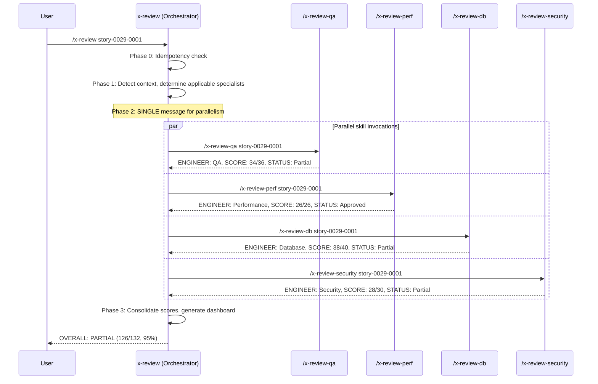

# Historia: x-review Orchestrator Refactor

**ID:** story-0029-0012
**Chave Jira:** —
**Status:** Pendente

## 1. Dependencias

| Blocked By | Blocks |
| :--- | :--- |
| story-0029-0011 | story-0029-0015 |

## 2. Regras Transversais Aplicaveis

| ID | Titulo |
| :--- | :--- |
| RULE-009 | Review Modular |

## 3. Descricao

Como **desenvolvedor usando ia-dev-env**, eu quero que o `x-review` orquestrador seja simplificado para delegar reviews a skills individuais (`/x-review-qa`, `/x-review-perf`, `/x-review-db`, etc.) em vez de conter checklists inline, garantindo manutencao isolada e reutilizacao independente de cada especialista.

Esta historia modifica o `x-review/SKILL.md` existente para remover todos os checklists de especialistas que foram extraidos na story-0029-0011 e substituir por invocacoes via Skill tool. O orquestrador mantem sua responsabilidade de: detectar contexto (Phase 1), determinar quais especialistas sao aplicaveis, invocar skills de review em paralelo (Phase 2 via single message com Skill tool), e consolidar resultados em dashboard e remediation tracking (Phase 3). As sections de Engineer Checklists e Engineer -> Knowledge Pack Mapping sao removidas do SKILL.md, substituidas por uma tabela de referencia que aponta para as skills individuais.

### 3.1 Requisitos

1. REMOVER do x-review/SKILL.md: secao "Engineer Checklists" com todos os checklists inline (Security 15 items, QA 18 items, Performance 13 items, Database 20 items, Data Modeling 10 items, Observability 9 items, DevOps 10 items, API 8 items, Event 14 items)
2. REMOVER do x-review/SKILL.md: secao "Engineer -> Knowledge Pack Mapping" (KP mapping agora vive em cada skill individual)
3. MANTER: Phase 0 (Idempotency Pre-Check) intacto
4. MANTER: Phase 1 (Detect Context) — logica de determinacao de especialistas aplicaveis
5. MODIFICAR: Phase 2 (Parallel Reviews) — substituir lancamento de subagents com checklists inline por invocacao de `/x-review-{specialist}` via Skill tool em paralelo (single message)
6. MANTER: Phase 3 (Consolidation) — dashboard, remediation tracking, threat model update
7. MANTER: Phase 4 (Story Generation) — geracao de correction stories
8. A invocacao paralela DEVE ser em uma UNICA mensagem (single message) para garantir true parallelism
9. O score total e dashboard DEVEM continuar funcionando com os mesmos campos (ENGINEER, STORY, SCORE, STATUS)

### 3.2 Phase 2 Refatorada

Substituir o template de subagent (prompt com {CHECKLIST}) por invocacao direta de skills:

```
# Phase 2 — Parallel Reviews (Skills via Skill Tool)

For each applicable specialist, invoke the corresponding review skill
in a SINGLE message for true parallelism:

- /x-review-qa {STORY_ID}
- /x-review-perf {STORY_ID}
- /x-review-db {STORY_ID}        (if database != none)
- /x-review-obs {STORY_ID}       (if observability != none)
- /x-review-devops {STORY_ID}    (if container != none)
- /x-review-data-modeling {STORY_ID} (if database AND hex/ddd/cqrs)
- /x-review-security {STORY_ID}  (if security frameworks configured)
- /x-review-api {STORY_ID}       (if REST interface)
- /x-review-events {STORY_ID}    (if event interfaces)
```

### 3.3 Tabela de Referencia (Substitui Engineer Checklists)

| Specialist | Skill | Score | Condition |
| :--- | :--- | :--- | :--- |
| QA | `/x-review-qa` | /36 | Always |
| Performance | `/x-review-perf` | /26 | Always |
| Database | `/x-review-db` | /40 | database != none |
| Observability | `/x-review-obs` | /18 | observability != none |
| DevOps | `/x-review-devops` | /20 | container != none |
| Data Modeling | `/x-review-data-modeling` | /20 | database AND hex/ddd/cqrs |
| Security | `/x-review-security` | /30 | security frameworks |
| API | `/x-review-api` | /16 | REST interface |
| Event | `/x-review-events` | /28 | event interfaces |

### 3.4 Impacto no Tamanho do SKILL.md

| Metrica | Antes | Depois | Reducao |
| :--- | :--- | :--- | :--- |
| Linhas do SKILL.md (estimado) | ~450 | ~250 | ~45% |
| Checklists inline | 9 especialistas | 0 (delegados) | 100% |
| KP Mapping | 9 entries | 0 (em cada skill) | 100% |

## 3.5 Entrega de Valor

- **Valor Principal:** Orquestrador simplificado que delega para skills individuais, reduzindo o SKILL.md em ~45% e habilitando manutencao isolada de cada checklist de review
- **Metrica de Sucesso:** x-review/SKILL.md reduzido de ~450 para ~250 linhas, com 0 checklists inline, mantendo dashboard e consolidation funcionais
- **Impacto no Negocio:** Manutencao de checklists de review desacoplada do orquestrador — adicionar/modificar items de um especialista nao requer tocar no x-review principal

## 4. Definicoes de Qualidade Locais

### DoR Local (Definition of Ready)

- [ ] Skills individuais de review criadas (story-0029-0011)
- [ ] x-review/SKILL.md atual lido e compreendido (todas as phases)
- [ ] Output format de cada skill de review padronizado (ENGINEER, STORY, SCORE, STATUS)

### DoD Local (Definition of Done)

- [ ] x-review/SKILL.md modificado: checklists inline removidos
- [ ] x-review/SKILL.md modificado: KP mapping removido
- [ ] Phase 2 usa Skill tool para invocar /x-review-{specialist} em paralelo
- [ ] Tabela de referencia substituindo checklists inline
- [ ] Phase 0, 1, 3, 4 mantidos intactos
- [ ] Dashboard e consolidation continuam funcionando com mesmo formato
- [ ] Invocacao paralela em single message (true parallelism)
- [ ] Backward compatibility: --scope flag continua filtrando especialistas
- [ ] Pelo menos 1 teste automatizado validando o SKILL.md modificado
- [ ] Smoke test: golden file match para 8 perfis

### Global Definition of Done (DoD)

- **Cobertura:** >= 95% Line, >= 90% Branch
- **Testes Automatizados:** Unitarios + golden file match
- **Documentacao:** SKILL.md atualizado
- **TDD Compliance:** Test-first commits, refactoring explicito apos green
- **Double-Loop TDD:** Acceptance tests from Gherkin (outer), unit tests by TPP (inner)

## 5. Contratos de Dados (Data Contract)

### 5.1 Secoes Removidas do x-review/SKILL.md

| Secao | Conteudo Removido | Motivo |
| :--- | :--- | :--- |
| Engineer Checklists | 9 checklists inline (Security, QA, Performance, Database, Data Modeling, Observability, DevOps, API, Event) | Extraidos para skills individuais (story-0029-0011) |
| Engineer -> Knowledge Pack Mapping | Tabela de 9 entries (Engineer -> KP Paths) | KP mapping agora vive em cada skill individual |
| Subagent prompt template | Template com {CHECKLIST} placeholder | Substituido por invocacao de Skill tool |

### 5.2 Secoes Mantidas/Modificadas do x-review/SKILL.md

| Secao | Status | Mudanca |
| :--- | :--- | :--- |
| Phase 0 — Idempotency Pre-Check | Mantido | Nenhuma |
| Phase 1 — Detect Context | Mantido | Nenhuma (logica de specialist detection permanece) |
| Phase 2 — Parallel Reviews | Modificado | Subagents -> Skill tool invocations |
| Phase 3 — Consolidation (3a-3f) | Mantido | Nenhuma (parse output format identico) |
| Phase 4 — Story Generation | Mantido | Nenhuma |
| Specialist Reference Table | Novo | Tabela com skill name, score, condition |

### 5.3 Output Format (Nao Muda)

O output de cada skill de review segue o mesmo formato que os subagents produziam:

```
ENGINEER: {ENGINEER}
STORY: {STORY_ID}
SCORE: XX/YY
STATUS: Approved | Rejected | Partial
---
PASSED:
- [ID] Description (2/2)
FAILED:
- [ID] Description (0/2) — file:line — Fix: suggestion [SEVERITY]
PARTIAL:
- [ID] Description (1/2) — file:line — Improvement: suggestion [SEVERITY]
```

### 5.4 Consolidation Input (Nao Muda)

| Campo | Tipo | Source | Descricao |
| :--- | :--- | :--- | :--- |
| `engineer` | String | Cada skill output | Nome do especialista |
| `score` | String (XX/YY) | Cada skill output | Score individual |
| `status` | Enum | Cada skill output | Approved, Rejected, Partial |
| `findings` | List | Cada skill output | PASSED, FAILED, PARTIAL items |

## 6. Diagramas

### 6.1 Antes vs Depois — Phase 2

```mermaid
graph TD
    subgraph "ANTES (inline checklists)"
        XR1[x-review] --> SA1[Subagent: Security<br/>checklist inline]
        XR1 --> SA2[Subagent: QA<br/>checklist inline]
        XR1 --> SA3[Subagent: Perf<br/>checklist inline]
        XR1 --> SA4[Subagent: DB<br/>checklist inline]
    end

    subgraph "DEPOIS (skill delegation)"
        XR2[x-review] -->|Skill tool| S1[/x-review-security]
        XR2 -->|Skill tool| S2[/x-review-qa]
        XR2 -->|Skill tool| S3[/x-review-perf]
        XR2 -->|Skill tool| S4[/x-review-db]
    end
```

### 6.2 Workflow Refatorado



## 7. Criterios de Aceite (Gherkin)

```gherkin
Cenario: Checklists inline nao existem mais no x-review/SKILL.md
  DADO que x-review/SKILL.md foi modificado
  QUANDO o conteudo eh analisado
  ENTAO NAO contem a secao "Engineer Checklists"
  E NAO contem a secao "Engineer -> Knowledge Pack Mapping"
  E NAO contem o template de subagent com {CHECKLIST} placeholder

Cenario: Phase 2 invoca skills via Skill tool
  DADO que x-review/SKILL.md foi modificado
  QUANDO Phase 2 eh analisada
  ENTAO contem instrucoes para invocar /x-review-qa, /x-review-perf via Skill tool
  E contem instrucao "SINGLE message for true parallelism"
  E NAO contem lancamento de subagents com prompt template

Cenario: Tabela de referencia lista todas as skills de review
  DADO que x-review/SKILL.md foi modificado
  QUANDO a tabela de referencia eh analisada
  ENTAO contem 9 entries: QA, Performance, Database, Observability, DevOps, Data Modeling, Security, API, Event
  E cada entry tem: Specialist, Skill name, Score, Condition

Cenario: Dashboard continua funcionando com skill-based output
  DADO que cada skill de review produz output no formato ENGINEER/STORY/SCORE/STATUS
  QUANDO Phase 3 (Consolidation) processa os outputs
  ENTAO o dashboard eh gerado com tabela de scores por especialista
  E o OVERALL status eh calculado corretamente (Approved/Rejected/Partial)

Cenario: --scope filtra skills invocadas
  DADO que o usuario invoca /x-review story-0029-0001 --scope qa,perf
  QUANDO Phase 2 executa
  ENTAO apenas /x-review-qa e /x-review-perf sao invocados
  E /x-review-db, /x-review-security NAO sao invocados

Cenario: Skills condicionais so invocadas quando feature gate ativo
  DADO que o projeto tem database=none
  QUANDO /x-review eh invocado sem --scope
  ENTAO /x-review-db NAO eh invocado
  E /x-review-data-modeling NAO eh invocado
  E /x-review-qa e /x-review-perf sao sempre invocados

Cenario: Phase 0 e Phase 3 mantidos intactos
  DADO que x-review/SKILL.md foi modificado
  QUANDO Phase 0 (Idempotency) eh analisada
  ENTAO o conteudo eh identico ao original (pre-refactor)
  E Phase 3 (Consolidation 3a-3f) eh identica ao original
```

## 8. Sub-tarefas

- [ ] [Dev] Remover secao "Engineer Checklists" do x-review/SKILL.md (9 checklists inline)
- [ ] [Dev] Remover secao "Engineer -> Knowledge Pack Mapping" do x-review/SKILL.md
- [ ] [Dev] Remover template de subagent com {CHECKLIST} placeholder
- [ ] [Dev] Reescrever Phase 2 — substituir subagent dispatch por Skill tool invocations
- [ ] [Dev] Adicionar instrucao "SINGLE message for true parallelism" em Phase 2
- [ ] [Dev] Adicionar Specialist Reference Table com skill name, score, condition
- [ ] [Dev] Verificar que Phase 0, 1, 3, 4 permancem intactas apos refactoring
- [ ] [Dev] Verificar backward compatibility: --scope flag filtra skills invocadas
- [ ] [Test] Unitario: SKILL.md NAO contem checklists inline (grep negativo)
- [ ] [Test] Unitario: SKILL.md contem instrucoes de Skill tool invocation para cada especialista
- [ ] [Test] Integracao: Golden file byte-for-byte match do x-review/SKILL.md modificado
- [ ] [Test] Smoke/E2E: SKILL.md gerado contem Specialist Reference Table com 9 entries
- [ ] [Doc] Atualizar README.md do x-review com nova arquitetura de delegacao
