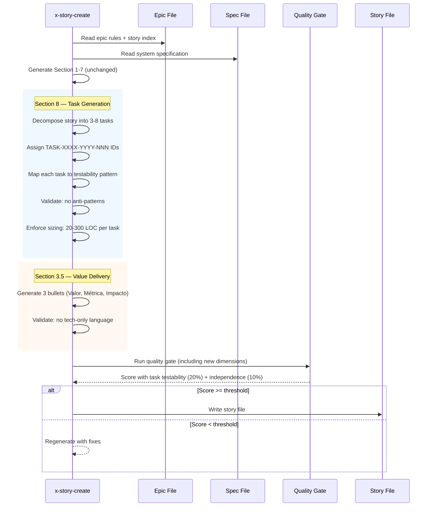
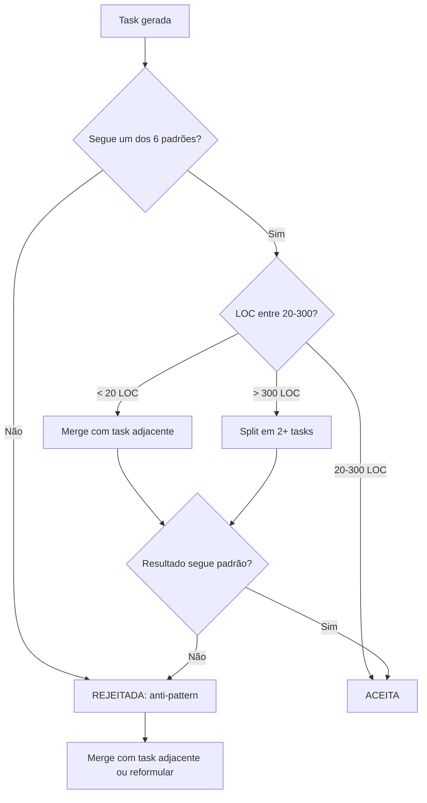

# História: x-story-create — Testable Tasks & Value Delivery

**ID:** story-0029-0013
**Chave Jira:** —
**Status:** Pendente

## 1. Dependências

| Blocked By | Blocks |
| :--- | :--- |
| story-0029-0001, story-0029-0007 | story-0029-0014 |

## 2. Regras Transversais Aplicáveis

| ID | Título |
| :--- | :--- |
| RULE-001 | Task como Unidade de Entrega |
| RULE-002 | Testabilidade Obrigatória |
| RULE-006 | Task ID Format |
| RULE-011 | Sizing Constraints |
| RULE-015 | Value Delivery |

## 3. Descrição

Como **desenvolvedor**, eu quero que o `x-story-create` gere histórias com tasks formais, testáveis e com valor de negócio explícito na Seção 3.5, garantindo que cada task tenha ID formal, critérios de testabilidade e que a Seção 8 siga o formato TASK-XXXX-YYYY-NNN.

Esta história modifica a skill `x-story-create` para:

1. **Geração de Section 8 com Task IDs formais:** Cada task recebe ID no formato `TASK-XXXX-YYYY-NNN` (epic 4 dígitos, story 4 dígitos, sequencial 3 dígitos). Tabela com colunas: ID, Descrição, Camada, Dependências, Tag [Dev]/[Test]/[Doc], Testabilidade (padrão válido)
2. **Validação de testabilidade:** Cada task DEVE seguir um dos padrões válidos (Domain+UnitTest, Port+Adapter+IT, UseCase+AT, Endpoint+APITest, Migration+Smoke, Config+VerificationTest). Anti-patterns detectados e rejeitados: interface-only, DTO-only, test-only (exceto Layer 4), config-only sem teste
3. **Quality gate dimensions adicionais:** Dimensão "Task testability" (20%) — verifica que toda task tem critérios de testabilidade explícitos. Dimensão "Task independence" (10%) — verifica que tasks podem ser implementadas e verificadas independentemente
4. **Seção 3.5 (Entrega de Valor) obrigatória:** Toda story gerada DEVE conter Section 3.5 com 3 bullets: Valor Principal, Métrica de Sucesso, Impacto no Negócio. Proibido: linguagem técnica sem valor de negócio (ex: "Implementar repositório"). Correto: valor mensurável (ex: "Persistência com integridade referencial")
5. **Sizing enforcement:** Mínimo 3 tasks por story, máximo 8. Tasks com estimativa < 20 LOC devem ser agrupadas com adjacentes. Tasks com estimativa > 300 LOC devem ser divididas

## 3.5 Entrega de Valor

- **Valor Principal:** Stories geradas automaticamente com tasks formais, testáveis e rastreáveis, eliminando tasks informais que não podem ser verificadas ou rastreadas
- **Métrica de Sucesso:** 100% das tasks geradas seguem um dos 6 padrões válidos de testabilidade, com IDs formais TASK-XXXX-YYYY-NNN e Section 3.5 presente em toda story
- **Impacto no Negócio:** Reduz retrabalho por tasks não-testáveis de ~30% para 0%, habilitando o modelo PR-por-task com confiança de que cada PR é verificável

## 4. Definições de Qualidade Locais

### DoR Local (Definition of Ready)

- [ ] Template de story com formal task definition disponível (story-0029-0001)
- [ ] Skill x-plan-task implementada e testada (story-0029-0007)
- [ ] x-story-create SKILL.md atual lido e compreendido (seções de geração de Section 8 e quality gates)
- [ ] Lista de anti-patterns de testabilidade definida e revisada

### DoD Local (Definition of Done)

- [ ] x-story-create SKILL.md modificado com geração de Section 8 usando TASK-XXXX-YYYY-NNN
- [ ] Validação de testabilidade integrada ao quality gate (rejeita anti-patterns)
- [ ] Dimensões "Task testability" (20%) e "Task independence" (10%) adicionadas ao quality gate
- [ ] Seção 3.5 (Entrega de Valor) gerada obrigatoriamente em toda story com 3 bullets
- [ ] Sizing enforcement: mín 3, máx 8 tasks, merge/split para tasks fora do range
- [ ] Pelo menos 1 teste automatizado validando a presença das novas instruções no SKILL.md
- [ ] Smoke test: golden file match

### Global Definition of Done (DoD)

- **Cobertura:** ≥ 95% Line, ≥ 90% Branch
- **Testes Automatizados:** Unitários + golden file match
- **Documentação:** SKILL.md atualizado
- **TDD Compliance:** Test-first, refactoring explícito, TPP order
- **Double-Loop TDD:** Acceptance from Gherkin, unit by TPP

## 5. Contratos de Dados (Data Contract)

### 5.1 Section 8 — Formato de Tasks Formais (Output)

| Coluna | Tipo | M/O | Descrição |
| :--- | :--- | :--- | :--- |
| ID | `String` | M | TASK-XXXX-YYYY-NNN (ex: TASK-0029-0013-001) |
| Descrição | `String` | M | Descrição concisa da task |
| Camada | `Enum` | M | domain, port, adapter, application, config, test, doc |
| Dependências | `String[]` | O | Lista de TASK IDs predecessores |
| Tag | `Enum` | M | [Dev], [Test], [Doc] |
| Padrão de Testabilidade | `Enum` | M | Um dos 6 padrões válidos |
| Estimativa LOC | `Integer` | M | 20-300 (range válido) |

### 5.2 Padrões Válidos de Testabilidade

| Padrão | Componente | Teste Esperado |
| :--- | :--- | :--- |
| Domain+UnitTest | Entidade, VO, Engine | Teste unitário de lógica de negócio |
| Port+Adapter+IT | Interface + Implementação | Teste de integração com dependência real |
| UseCase+AT | Use case de aplicação | Acceptance test end-to-end |
| Endpoint+APITest | Controller/Resource | Teste HTTP com status/body/errors |
| Migration+Smoke | Schema migration | Smoke test de conectividade |
| Config+VerificationTest | Configuração | Teste de verificação de loading |

### 5.3 Anti-Patterns Rejeitados

| Anti-Pattern | Motivo da Rejeição |
| :--- | :--- |
| Interface-only | Port sem adapter não é testável isoladamente |
| DTO-only | DTO sem uso em endpoint/service não tem valor verificável |
| Test-only (exceto Layer 4) | Teste sem código de produção viola TDD |
| Config-only sem teste | Configuração sem verificação pode falhar silenciosamente |

### 5.4 Quality Gate — Novas Dimensões

| Dimensão | Peso | Critério |
| :--- | :--- | :--- |
| Task testability | 20% | Todas as tasks seguem um dos 6 padrões válidos |
| Task independence | 10% | Tasks podem ser implementadas e testadas independentemente |

### 5.5 Seção 3.5 — Formato Obrigatório

| Bullet | Conteúdo | Anti-Pattern |
| :--- | :--- | :--- |
| Valor Principal | Benefício de negócio mensurável | "Implementar repositório" |
| Métrica de Sucesso | KPI ou critério verificável | "Código funciona" |
| Impacto no Negócio | Melhoria quantificável | "Melhorar o sistema" |

## 6. Diagramas

### 6.1 Fluxo de Geração de Section 8 com Tasks Formais



### 6.2 Decisão de Testabilidade por Task



## 7. Critérios de Aceite (Gherkin)

```gherkin
Cenario: Task IDs formais gerados no formato correto
  DADO que x-story-create está gerando story-0029-0013
  E o épico é epic-0029
  QUANDO Section 8 é gerada
  ENTÃO cada task tem ID no formato TASK-0029-0013-NNN
  E NNN é sequencial iniciando em 001
  E a tabela contém colunas: ID, Descrição, Camada, Dependências, Tag, Padrão de Testabilidade, Estimativa LOC

Cenario: Anti-pattern de testabilidade é detectado e rejeitado
  DADO que uma task candidata é "Criar interface OrderPort" (interface-only)
  QUANDO a validação de testabilidade executa
  ENTÃO a task é rejeitada como anti-pattern "interface-only"
  E a task é reformulada para incluir adapter + integration test
  E o log contém "Anti-pattern detected: interface-only task reformulated"

Cenario: Sizing enforcement agrupa tasks pequenas
  DADO que uma task candidata tem estimativa de 10 LOC
  E a task adjacente na mesma camada tem estimativa de 15 LOC
  QUANDO o sizing enforcement executa
  ENTÃO as duas tasks são agrupadas em uma única task
  E a task resultante tem estimativa de 25 LOC
  E a task resultante segue um dos 6 padrões válidos

Cenario: Sizing enforcement divide tasks grandes
  DADO que uma task candidata tem estimativa de 400 LOC
  QUANDO o sizing enforcement executa
  ENTÃO a task é dividida em 2 ou mais tasks
  E cada task resultante tem estimativa entre 20 e 300 LOC
  E todas as tasks resultantes seguem padrões válidos

Cenario: Seção 3.5 gerada com valor de negócio
  DADO que x-story-create está gerando uma story
  QUANDO a Seção 3.5 é gerada
  ENTÃO contém exatamente 3 bullets: Valor Principal, Métrica de Sucesso, Impacto no Negócio
  E nenhum bullet contém linguagem puramente técnica sem valor de negócio
  E "Implementar repositório" seria rejeitado como anti-pattern de valor

Cenario: Quality gate inclui novas dimensões
  DADO que todas as tasks de uma story seguem padrões válidos de testabilidade
  E todas as tasks são independentemente verificáveis
  QUANDO o quality gate executa
  ENTÃO a dimensão "Task testability" contribui 20% do score total
  E a dimensão "Task independence" contribui 10% do score total
  E o score final reflete as novas dimensões

Cenario: Story com menos de 3 tasks é rejeitada
  DADO que uma story tem apenas 2 tasks geradas
  QUANDO a validação de sizing executa
  ENTÃO a story é rejeitada com mensagem "Minimum 3 tasks required, found 2"
  E a geração tenta decompor tasks existentes para atingir o mínimo
```

## 8. Sub-tarefas

- [ ] [Dev] Modificar x-story-create SKILL.md — adicionar geração de Section 8 com TASK-XXXX-YYYY-NNN IDs e tabela formal
- [ ] [Dev] Implementar validação de testabilidade — 6 padrões válidos e 4 anti-patterns rejeitados
- [ ] [Dev] Implementar sizing enforcement — merge para tasks < 20 LOC, split para tasks > 300 LOC, min 3 / max 8
- [ ] [Dev] Adicionar geração obrigatória de Seção 3.5 (Entrega de Valor) com validação de linguagem de negócio
- [ ] [Dev] Adicionar dimensões "Task testability" (20%) e "Task independence" (10%) ao quality gate
- [ ] [Test] Unitário: SKILL.md contém instruções de geração de tasks formais com IDs, testabilidade e sizing
- [ ] [Test] Integração: Golden file match do x-story-create SKILL.md modificado
- [ ] [Test] Smoke/E2E: Story gerada pelo skill contém Section 8 com formato TASK-XXXX-YYYY-NNN e Section 3.5
- [ ] [Doc] Documentar padrões válidos de testabilidade e anti-patterns no SKILL.md
