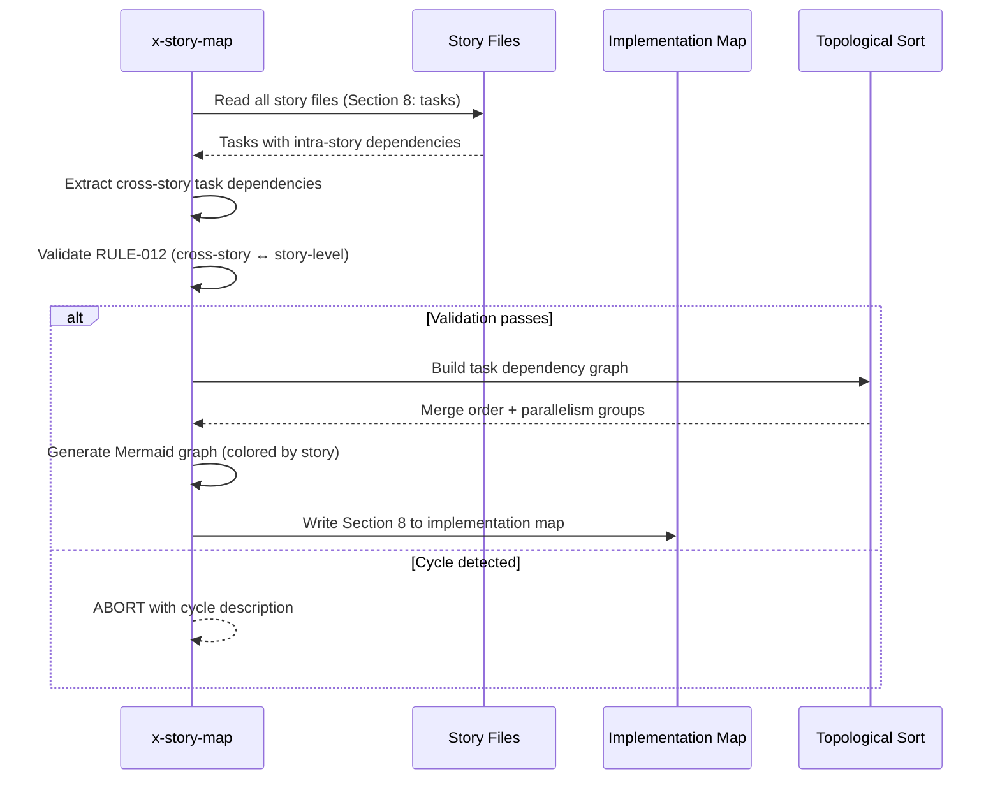
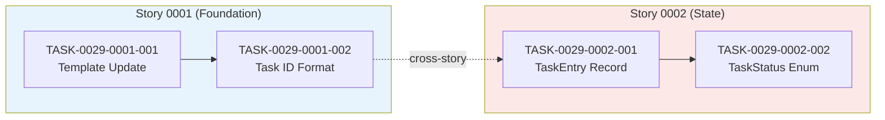

# História: x-story-map — Task-Level Dependency Graph

**ID:** story-0029-0014
**Chave Jira:** —
**Status:** Pendente

## 1. Dependências

| Blocked By | Blocks |
| :--- | :--- |
| story-0029-0001, story-0029-0013 | — |

## 2. Regras Transversais Aplicáveis

| ID | Título |
| :--- | :--- |
| RULE-001 | Task como Unidade de Entrega |
| RULE-006 | Task ID Format |
| RULE-012 | Cross-Story Task Dependencies |

## 3. Descrição

Como **desenvolvedor**, eu quero que o `x-story-map` gere um grafo de dependências no nível de tasks, incluindo dependências cross-story, para que o paralelismo de execução seja otimizado e a ordem de merge seja computada automaticamente via topological sort.

Esta história modifica a skill `x-story-map` e o template `_TEMPLATE-IMPLEMENTATION-MAP.md` para:

1. **Section 8 no Implementation Map — Cross-Story Task Dependencies:** Tabela com dependências entre tasks de stories diferentes no formato `TASK-XXXX-YYYY-NNN depends on TASK-XXXX-ZZZZ-MMM`. Valida que toda dependência cross-story task é refletida como dependência story-level (RULE-012)
2. **Computed Merge Order via Topological Sort:** Algoritmo de topological sort aplicado ao grafo de tasks para determinar a ordem exata de merge. O resultado é uma lista ordenada de tasks que respeita todas as dependências (intra-story e cross-story). Ciclos detectados e reportados como erro
3. **Mermaid Task Dependency Graph colorido por story:** Diagrama Mermaid com nós representando tasks e arestas representando dependências. Nós coloridos por story (cada story tem uma cor distinta). Subgraphs agrupam tasks por story. Arestas cross-story são tracejadas
4. **Paralelismo otimizado:** Tasks sem dependências entre si são marcadas como parallelizáveis. O grafo indica quais tasks podem executar simultaneamente em cada fase

## 3.5 Entrega de Valor

- **Valor Principal:** Grafo de dependências no nível de tasks permite paralelismo granular e ordem de merge determinística, eliminando conflitos de integração
- **Métrica de Sucesso:** Implementation map contém Section 8 com topological sort, Mermaid graph colorido por story, e zero ciclos não detectados
- **Impacto no Negócio:** Reduz tempo de integração de épicos em ~40% ao permitir execução paralela de tasks independentes de stories diferentes

## 4. Definições de Qualidade Locais

### DoR Local (Definition of Ready)

- [ ] Template de story com formal task definition disponível (story-0029-0001)
- [ ] x-story-create gerando tasks com IDs formais (story-0029-0013)
- [ ] x-story-map SKILL.md atual lido e compreendido (formato do implementation map)
- [ ] _TEMPLATE-IMPLEMENTATION-MAP.md lido e compreendido

### DoD Local (Definition of Done)

- [ ] x-story-map SKILL.md modificado com geração de Section 8 (task-level dependencies)
- [ ] _TEMPLATE-IMPLEMENTATION-MAP.md atualizado com Section 8 template
- [ ] Cross-story task dependencies tabuladas com validação contra story-level deps (RULE-012)
- [ ] Topological sort computa merge order e detecta ciclos
- [ ] Mermaid graph colorido por story com subgraphs e arestas tracejadas para cross-story
- [ ] Pelo menos 1 teste automatizado validando a presença das novas instruções
- [ ] Smoke test: golden file match para ambos SKILL.md e template

### Global Definition of Done (DoD)

- **Cobertura:** ≥ 95% Line, ≥ 90% Branch
- **Testes Automatizados:** Unitários + golden file match
- **Documentação:** SKILL.md + template atualizados
- **TDD Compliance:** Test-first, refactoring explícito, TPP order
- **Double-Loop TDD:** Acceptance from Gherkin, unit by TPP

## 5. Contratos de Dados (Data Contract)

### 5.1 Section 8 — Cross-Story Task Dependencies (Output)

| Coluna | Tipo | M/O | Descrição |
| :--- | :--- | :--- | :--- |
| Task | `String` | M | TASK-XXXX-YYYY-NNN (task que depende) |
| Depends On | `String` | M | TASK-XXXX-ZZZZ-MMM (task predecessora) |
| Story Source | `String` | M | story-XXXX-YYYY (story da task dependente) |
| Story Target | `String` | M | story-XXXX-ZZZZ (story da task predecessora) |
| Tipo | `Enum` | M | data, interface, schema, config |

### 5.2 Computed Merge Order (Output)

| Coluna | Tipo | M/O | Descrição |
| :--- | :--- | :--- | :--- |
| Ordem | `Integer` | M | Posição no topological sort (1-based) |
| Task ID | `String` | M | TASK-XXXX-YYYY-NNN |
| Story | `String` | M | story-XXXX-YYYY |
| Parallelizable With | `String[]` | O | Lista de TASK IDs que podem executar em paralelo |
| Fase | `Integer` | M | Fase de execução (0-based, derivada do grafo) |

### 5.3 Mermaid Graph — Convenções Visuais

| Elemento | Representação | Exemplo |
| :--- | :--- | :--- |
| Task node | Retângulo com ID e descrição curta | `TASK-0029-0001-001["Domain Model"]` |
| Intra-story edge | Seta sólida | `TASK-001 --> TASK-002` |
| Cross-story edge | Seta tracejada | `TASK-001 -.-> TASK-003` |
| Story subgraph | Subgraph com cor distinta | `subgraph story-0029-0001` |
| Parallelizable | Mesma coluna vertical | Tasks sem deps entre si |

### 5.4 Validação RULE-012

| Validação | Ação |
| :--- | :--- |
| Cross-story task dep sem story-level dep | ERRO: "TASK-X depends on TASK-Y but story-A does not depend on story-B" |
| Ciclo detectado no grafo de tasks | ERRO: "Cycle detected: TASK-A → TASK-B → TASK-C → TASK-A" |
| Story-level dep sem cross-story task dep | WARNING: "story-A depends on story-B but no cross-story task dependencies found" |

## 6. Diagramas

### 6.1 Workflow de Geração de Section 8



### 6.2 Exemplo de Mermaid Task Dependency Graph



## 7. Critérios de Aceite (Gherkin)

```gherkin
Cenario: Section 8 gerada com cross-story task dependencies
  DADO que story-0029-0001 tem TASK-0029-0001-001 e TASK-0029-0001-002
  E story-0029-0002 tem TASK-0029-0002-001 que depende de TASK-0029-0001-002
  QUANDO x-story-map gera o implementation map
  ENTÃO Section 8 contém tabela com "TASK-0029-0002-001 depends on TASK-0029-0001-002"
  E a coluna Story Source é "story-0029-0002"
  E a coluna Story Target é "story-0029-0001"

Cenario: Topological sort computa merge order correta
  DADO que o grafo de tasks contém: T1 → T2 → T4 e T1 → T3 → T4
  QUANDO o topological sort executa
  ENTÃO T1 aparece antes de T2 e T3
  E T2 e T3 são marcados como parallelizáveis (mesma fase)
  E T4 aparece depois de T2 e T3

Cenario: Ciclo no grafo de tasks é detectado e reportado
  DADO que TASK-A depende de TASK-B e TASK-B depende de TASK-A
  QUANDO x-story-map executa o topological sort
  ENTÃO a execução aborta com erro "Cycle detected: TASK-A → TASK-B → TASK-A"
  E o implementation map NÃO é gerado

Cenario: RULE-012 validação de consistência cross-story
  DADO que TASK-0029-0002-001 depende de TASK-0029-0001-002 (cross-story)
  MAS story-0029-0002 NÃO declara dependência em story-0029-0001
  QUANDO a validação RULE-012 executa
  ENTÃO um ERRO é emitido: "TASK-0029-0002-001 depends on TASK-0029-0001-002 but story-0029-0002 does not depend on story-0029-0001"
  E a geração aborta até que a inconsistência seja resolvida

Cenario: Mermaid graph colorido por story com arestas cross-story tracejadas
  DADO que existem 3 stories com tasks e dependências cross-story
  QUANDO o Mermaid graph é gerado
  ENTÃO cada story tem um subgraph com cor distinta
  E arestas intra-story são sólidas (-->)
  E arestas cross-story são tracejadas (-.->)
  E o grafo é sintaticamente válido para Mermaid

Cenario: Implementation map template atualizado com Section 8
  DADO que _TEMPLATE-IMPLEMENTATION-MAP.md é a referência
  QUANDO o template é lido
  ENTÃO contém Section 8 com placeholder para cross-story task dependencies
  E contém placeholder para computed merge order
  E contém placeholder para Mermaid task dependency graph
```

## 8. Sub-tarefas

- [ ] [Dev] Modificar x-story-map SKILL.md — adicionar geração de Section 8 com cross-story task dependencies
- [ ] [Dev] Implementar extração de cross-story task dependencies a partir das Section 8 dos story files
- [ ] [Dev] Implementar topological sort para computar merge order e detectar ciclos
- [ ] [Dev] Implementar geração de Mermaid task dependency graph com cores por story e arestas tracejadas
- [ ] [Dev] Implementar validação RULE-012 (consistência cross-story task deps ↔ story-level deps)
- [ ] [Dev] Atualizar _TEMPLATE-IMPLEMENTATION-MAP.md com Section 8 template (placeholders)
- [ ] [Test] Unitário: SKILL.md contém instruções de geração de Section 8 com task dependencies
- [ ] [Test] Integração: Golden file match do x-story-map SKILL.md e _TEMPLATE-IMPLEMENTATION-MAP.md
- [ ] [Test] Smoke/E2E: Implementation map gerado contém Section 8 com grafo Mermaid válido
- [ ] [Doc] Documentar formato de Section 8 e convenções visuais do Mermaid graph no SKILL.md
