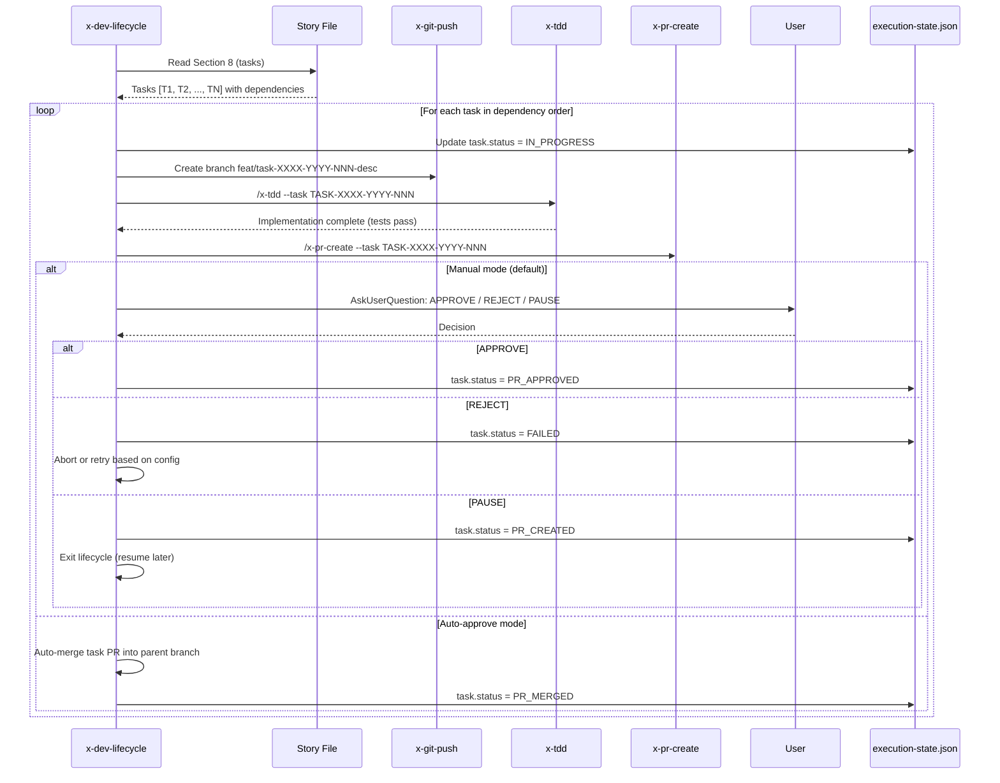
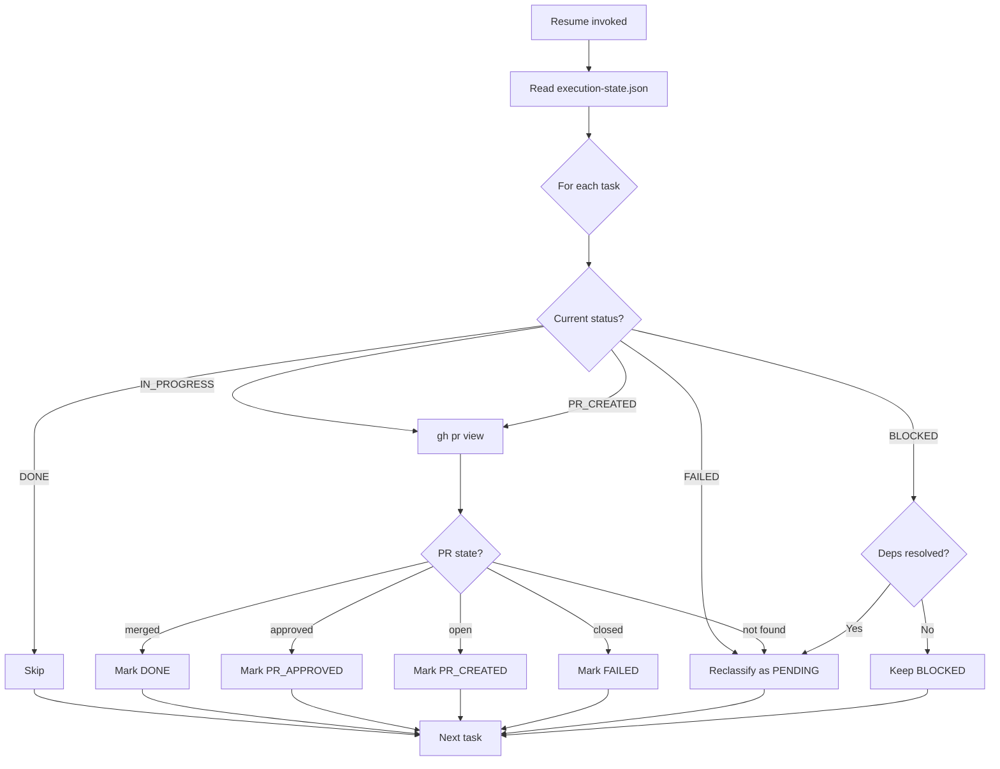

# História: x-dev-lifecycle — Task-Centric Workflow

**ID:** story-0029-0015
**Chave Jira:** —
**Status:** Pendente

## 1. Dependências

| Blocked By | Blocks |
| :--- | :--- |
| story-0029-0002, story-0029-0005, story-0029-0007, story-0029-0008, story-0029-0009, story-0029-0012 | story-0029-0016 |

## 2. Regras Transversais Aplicáveis

| ID | Título |
| :--- | :--- |
| RULE-001 | Task como Unidade de Entrega |
| RULE-002 | Testabilidade Obrigatória |
| RULE-003 | Approval Gate Humano |
| RULE-004 | Auto-Approve com Branch-Mãe |
| RULE-005 | Git Flow Compliance |
| RULE-006 | Task ID Format |
| RULE-007 | Pre-Commit Chain |
| RULE-008 | TDD Strict |
| RULE-014 | Resume por Task |
| RULE-016 | Conventional Commits com Task ID |

## 3. Descrição

Como **desenvolvedor**, eu quero que o `x-dev-lifecycle` execute um workflow task-centric onde cada task gera seu próprio branch e PR com gate de aprovação humana, garantindo entrega granular, rastreabilidade por task e a opção de auto-approve para velocidade.

Esta história é um **MAJOR REWRITE** da skill `x-dev-lifecycle`. As mudanças são:

1. **Phase 2 → Task Execution Loop:** O antigo Phase 2 (TDD Implementation monolítico) é substituído por um loop de tasks. Para cada task na ordem de dependências: (a) criar branch `feat/task-XXXX-YYYY-NNN-desc`, (b) implementar via `x-tdd`, (c) push + criar PR via `x-pr-create`, (d) APPROVAL GATE: `AskUserQuestion` com opções APPROVE/REJECT/PAUSE. Cada iteração atualiza `execution-state.json` com status da task
2. **Phase 3 → Story-Level Verification:** O novo Phase 3 absorve as funcionalidades dos antigos Phases 3-8 (review, fixes, PR creation, verification). Executa após todas as tasks de uma story terem PRs aprovados. Inclui: validação de cobertura consolidada, cross-file consistency check, story-level smoke test
3. **Flag --auto-approve-pr:** Quando presente, cria branch-mãe `feat/story-XXXX-YYYY-desc` a partir de `develop`. Task PRs targetam a branch-mãe em vez de `develop`. Tasks são auto-merged na branch-mãe sem approval gate. A branch-mãe NUNCA é auto-merged para `develop` ou `main` — requer review humano final
4. **Resume por task (RULE-014):** Resume verifica status de cada task via `gh pr view`. IN_PROGRESS → PENDING (re-execute). PR merged → DONE (skip). PR closed → FAILED (retry). BLOCKED → reevaluado se dependências mudaram
5. **Delegação para skills atômicas:** Cada etapa delega para uma skill atômica: `x-tdd` para implementação TDD, `x-pr-create` para criação de PR, `x-commit` para commits, `x-format` + `x-lint` via pre-commit chain. O lifecycle orquestra, não implementa

## 3.5 Entrega de Valor

- **Valor Principal:** Workflow de desenvolvimento com PRs granulares por task, aprovação humana por PR e rastreabilidade completa do progresso task-a-task
- **Métrica de Sucesso:** Cada task produz 1 branch + 1 PR, approval gates funcionam em modo manual e auto-approve, resume retoma da task exata onde parou
- **Impacto no Negócio:** Reduz tamanho médio de PRs de ~500 LOC/story para ~100 LOC/task, acelerando code review em ~60% e reduzindo defeitos de integração

## 4. Definições de Qualidade Locais

### DoR Local (Definition of Ready)

- [ ] Task status model implementado e testado (story-0029-0002)
- [ ] Skill x-commit implementada (story-0029-0005)
- [ ] Skill x-plan-task implementada (story-0029-0007)
- [ ] Skill x-tdd implementada (story-0029-0008)
- [ ] Skill x-pr-create implementada (story-0029-0009)
- [ ] x-review refatorado com skills individuais (story-0029-0012)
- [ ] x-dev-lifecycle SKILL.md atual lido e compreendido (todas as 9 fases atuais)

### DoD Local (Definition of Done)

- [ ] x-dev-lifecycle SKILL.md reescrito com Phase 2 = Task Execution Loop e Phase 3 = Story-Level Verification
- [ ] Phase 2 implementa: para cada task → branch → x-tdd → x-pr-create → APPROVAL GATE
- [ ] Flag --auto-approve-pr cria branch-mãe e auto-merge task PRs
- [ ] Branch-mãe NUNCA auto-merged para develop/main (RULE-004)
- [ ] Resume por task via gh pr view com reclassificação de status (RULE-014)
- [ ] Delegação para x-tdd, x-pr-create, x-commit, x-format, x-lint
- [ ] execution-state.json atualizado com task-level status a cada iteração
- [ ] Backward compatibility: stories sem tasks formais executam como single task implícita
- [ ] Pelo menos 1 teste automatizado validando a presença das novas instruções no SKILL.md
- [ ] Smoke test: golden file match

### Global Definition of Done (DoD)

- **Cobertura:** ≥ 95% Line, ≥ 90% Branch
- **Testes Automatizados:** Unitários + golden file match
- **Documentação:** SKILL.md reescrito
- **TDD Compliance:** Test-first, refactoring explícito, TPP order
- **Double-Loop TDD:** Acceptance from Gherkin, unit by TPP

## 5. Contratos de Dados (Data Contract)

### 5.1 Phase 2 — Task Execution Loop (Novo)

| Step | Ação | Skill Delegada | Input | Output |
| :--- | :--- | :--- | :--- | :--- |
| 2.1 | Ler tasks da story (Section 8) | — | Story file | Lista ordenada de tasks |
| 2.2 | Para cada task: criar branch | x-git-push | TASK-XXXX-YYYY-NNN + desc | Branch `feat/task-XXXX-YYYY-NNN-desc` |
| 2.3 | Implementar task via TDD | x-tdd | Task plan + story context | Código implementado com testes |
| 2.4 | Push + criar PR | x-pr-create | Branch + task metadata | PR URL + PR number |
| 2.5 | Approval gate | AskUserQuestion | PR summary | APPROVE / REJECT / PAUSE |
| 2.6 | Atualizar execution-state | — | Task status | execution-state.json |

### 5.2 Phase 3 — Story-Level Verification (Novo)

| Step | Ação | Descrição |
| :--- | :--- | :--- |
| 3.1 | Coverage consolidation | Rodar testes de cobertura sobre todos os arquivos da story |
| 3.2 | Cross-file consistency | Verificar padrões uniformes entre arquivos da mesma camada |
| 3.3 | Story-level smoke test | Smoke test end-to-end da funcionalidade da story |
| 3.4 | Final report | Relatório com status de todas as tasks, PRs e cobertura |

### 5.3 Flag --auto-approve-pr

| Aspecto | Modo Manual (default) | Modo Auto-Approve |
| :--- | :--- | :--- |
| Branch-mãe | Não criada | `feat/story-XXXX-YYYY-desc` a partir de `develop` |
| Task PR target | `develop` | Branch-mãe |
| Approval gate | AskUserQuestion por task PR | Auto-merge na branch-mãe |
| Merge final | N/A (cada PR vai para develop) | Branch-mãe requer review humano para develop |
| execution-state tracking | task.status = PR_APPROVED | task.status = PR_MERGED (auto) |

### 5.4 Resume — Reclassificação de Task Status

| Status Anterior | Condição | Novo Status |
| :--- | :--- | :--- |
| IN_PROGRESS | Nenhum PR encontrado | PENDING |
| IN_PROGRESS | PR aberto | PR_CREATED |
| PR_CREATED | PR approved | PR_APPROVED |
| PR_CREATED | PR merged | DONE |
| PR_CREATED | PR closed | FAILED |
| BLOCKED | Dependências agora resolvidas | PENDING |
| BLOCKED | Dependências ainda bloqueadas | BLOCKED (mantém) |
| DONE | — | DONE (skip) |

### 5.5 CLI Arguments (Novos)

| Argumento | Tipo | M/O | Default | Descrição |
| :--- | :--- | :--- | :--- | :--- |
| `--auto-approve-pr` | Boolean | O | false | Ativa modo auto-approve com branch-mãe |
| `--task` | String | O | — | Executar apenas uma task específica (TASK-XXXX-YYYY-NNN) |
| `--skip-verification` | Boolean | O | false | Pular Phase 3 (story-level verification) |

## 6. Diagramas

### 6.1 Phase 2 — Task Execution Loop



### 6.2 Auto-Approve Branch Model

```mermaid
gitgraph
    commit id: "develop"
    branch feat/story-0029-0015-lifecycle
    commit id: "parent branch created"

    branch feat/task-0029-0015-001-phase2
    commit id: "TASK-001: RED"
    commit id: "TASK-001: GREEN"
    commit id: "TASK-001: REFACTOR"
    checkout feat/story-0029-0015-lifecycle
    merge feat/task-0029-0015-001-phase2 id: "PR #1 auto-merged"

    branch feat/task-0029-0015-002-phase3
    commit id: "TASK-002: RED"
    commit id: "TASK-002: GREEN"
    checkout feat/story-0029-0015-lifecycle
    merge feat/task-0029-0015-002-phase3 id: "PR #2 auto-merged"

    checkout main
    commit id: "main unchanged"
    checkout develop
    merge feat/story-0029-0015-lifecycle id: "Human review required"
```

### 6.3 Resume Flow



## 7. Critérios de Aceite (Gherkin)

```gherkin
Cenario: Task Execution Loop cria branch e PR por task
  DADO que story-0029-0015 tem 3 tasks: TASK-001, TASK-002, TASK-003
  E TASK-002 depende de TASK-001
  QUANDO x-dev-lifecycle executa Phase 2
  ENTÃO TASK-001 é implementada primeiro
  E branch feat/task-0029-0015-001-desc é criado
  E x-tdd é invocado para TASK-001
  E x-pr-create gera PR para TASK-001
  E AskUserQuestion apresenta opções APPROVE/REJECT/PAUSE

Cenario: Auto-approve cria branch-mãe e auto-merge
  DADO que --auto-approve-pr é passado
  QUANDO x-dev-lifecycle inicia
  ENTÃO branch-mãe feat/story-0029-0015-desc é criado a partir de develop
  E cada task PR targeta a branch-mãe (não develop)
  E cada task PR é auto-merged na branch-mãe
  E a branch-mãe NÃO é auto-merged para develop

Cenario: PAUSE salva estado e permite resume
  DADO que TASK-001 foi aprovada (DONE)
  E TASK-002 está com PR criado
  E o usuário responde PAUSE no approval gate de TASK-002
  QUANDO o lifecycle é interrompido
  ENTÃO execution-state.json mostra TASK-001.status = DONE e TASK-002.status = PR_CREATED
  E resume reinicia a partir de TASK-002

Cenario: Resume reclassifica status de tasks via gh pr view
  DADO que execution-state.json tem TASK-001.status = IN_PROGRESS
  E TASK-002.status = PR_CREATED
  QUANDO resume é invocado
  E gh pr view mostra que o PR de TASK-001 não existe
  E gh pr view mostra que o PR de TASK-002 foi merged
  ENTÃO TASK-001.status é reclassificado para PENDING
  E TASK-002.status é reclassificado para DONE

Cenario: Story sem tasks formais executa como single task implícita
  DADO que story-XXXX-YYYY não tem Section 8 com tasks formais
  QUANDO x-dev-lifecycle executa
  ENTÃO a story é tratada como single task implícita (TASK-XXXX-YYYY-001)
  E o workflow executa normalmente (backward compatibility)

Cenario: REJECT no approval gate marca task como FAILED
  DADO que TASK-001 tem PR criado
  E o usuário responde REJECT no approval gate
  QUANDO o lifecycle processa a resposta
  ENTÃO TASK-001.status = FAILED
  E o lifecycle aborta com mensagem indicando qual task foi rejeitada
  E o log contém instruções para corrigir e retomar via resume

Cenario: Phase 3 executa verificação story-level após todas tasks aprovadas
  DADO que TASK-001, TASK-002 e TASK-003 todas têm status DONE ou PR_APPROVED
  QUANDO Phase 3 (Story-Level Verification) executa
  ENTÃO cobertura consolidada é validada (≥ 95% line, ≥ 90% branch)
  E cross-file consistency check é executado
  E story-level smoke test roda
  E relatório final lista todas tasks com PRs e cobertura
```

## 8. Sub-tarefas

- [ ] [Dev] Reescrever Phase 2 do x-dev-lifecycle como Task Execution Loop (for each task: branch → x-tdd → x-pr-create → approval gate)
- [ ] [Dev] Implementar Phase 3 como Story-Level Verification (absorve antigos Phases 3-8)
- [ ] [Dev] Implementar flag --auto-approve-pr com criação de branch-mãe e auto-merge de task PRs
- [ ] [Dev] Implementar resume por task com reclassificação via gh pr view (RULE-014)
- [ ] [Dev] Implementar backward compatibility: stories sem tasks formais executam como single task implícita
- [ ] [Dev] Implementar delegação para skills atômicas: x-tdd, x-pr-create, x-commit, x-format, x-lint
- [ ] [Dev] Atualizar execution-state.json com task-level status tracking a cada iteração
- [ ] [Test] Unitário: SKILL.md contém instruções de Task Execution Loop, auto-approve e resume
- [ ] [Test] Integração: Golden file match do x-dev-lifecycle SKILL.md reescrito
- [ ] [Test] Smoke/E2E: SKILL.md gerado contém Phase 2 (tasks) e Phase 3 (verification) corretos
- [ ] [Doc] Documentar novo workflow, flags e modo auto-approve no SKILL.md
