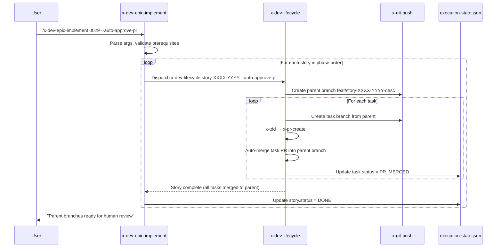
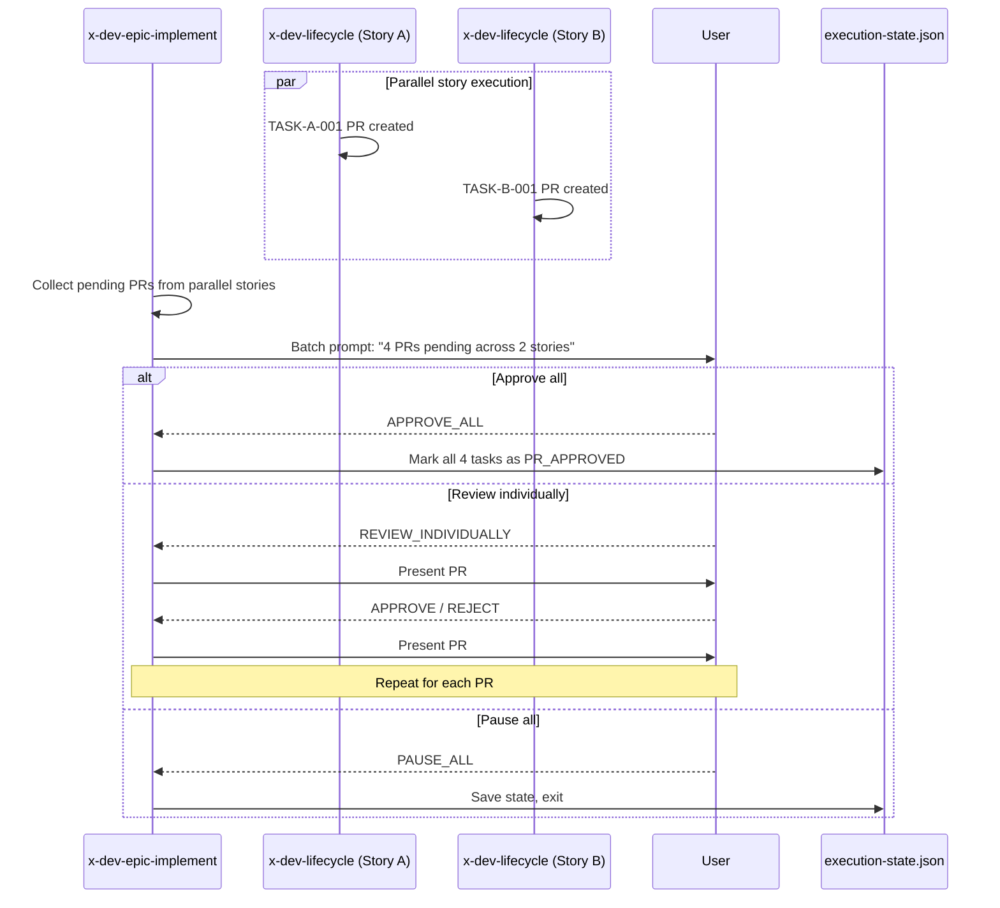
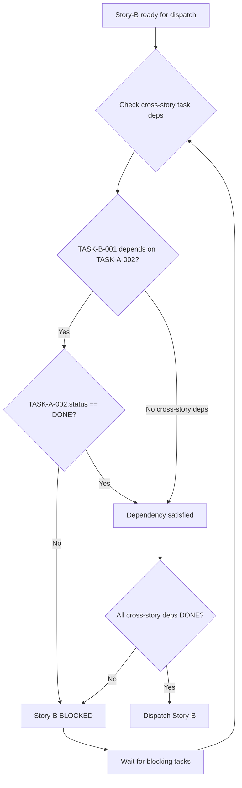

# História: x-dev-epic-implement — Auto-Approve & Task Tracking

**ID:** story-0029-0016
**Chave Jira:** —
**Status:** Pendente

## 1. Dependências

| Blocked By | Blocks |
| :--- | :--- |
| story-0029-0002, story-0029-0006, story-0029-0015 | story-0029-0018 |

## 2. Regras Transversais Aplicáveis

| ID | Título |
| :--- | :--- |
| RULE-001 | Task como Unidade de Entrega |
| RULE-003 | Approval Gate Humano |
| RULE-004 | Auto-Approve com Branch-Mãe |
| RULE-010 | Backward Compatibility |
| RULE-013 | Batch Approval |
| RULE-014 | Resume por Task |

## 3. Descrição

Como **desenvolvedor**, eu quero que o `x-dev-epic-implement` propague o flag `--auto-approve-pr` para os dispatches de `x-dev-lifecycle`, rastreie estado no nível de tasks, suporte batch approval para stories paralelas e execute resume com reclassificação task-level.

Esta história modifica a skill `x-dev-epic-implement` para:

1. **Propagação de --auto-approve-pr:** Quando o flag é passado ao x-dev-epic-implement, ele propaga para cada dispatch de x-dev-lifecycle. Cada story cria sua branch-mãe (`feat/story-XXXX-YYYY-desc`) e tasks auto-merge nela. O epic orchestrator NÃO auto-merge branches-mãe para develop — isso requer review humano
2. **Task-level state tracking em execution-state.json:** O campo `tasks` no `execution-state.json` é preenchido com o status de cada task (PENDING, IN_PROGRESS, PR_CREATED, PR_APPROVED, PR_MERGED, DONE, BLOCKED, FAILED, SKIPPED). O progresso é reportado no nível de tasks, não apenas stories. O campo `tasks` é opcional para backward compatibility (RULE-010)
3. **Batch approval para stories paralelas (RULE-013):** Quando múltiplas stories produzem task PRs simultaneamente (execução paralela via worktrees), o usuário recebe prompt consolidado listando todos os PRs pendentes. Opções: "Approve all N PRs" / "Review individually" / "Pause all". Reduz interrupções de N prompts individuais para 1 prompt consolidado
4. **Cross-story task dependency enforcement:** Antes de dispatch de uma story, verifica que todas as tasks cross-story predecessoras estão DONE. Se uma task de story-B depende de TASK da story-A, story-B só inicia quando essa task específica estiver DONE (não toda story-A)
5. **Resume com task-level reclassification:** Resume verifica cada task individualmente via `gh pr view`. Reclassifica IN_PROGRESS → PENDING, PR merged → DONE, PR closed → FAILED. Stories parcialmente concluídas retomam da task exata onde pararam

## 3.5 Entrega de Valor

- **Valor Principal:** Épicos executados com rastreamento granular por task, modo auto-approve para velocidade e batch approval para reduzir interrupções em execução paralela
- **Métrica de Sucesso:** Flag --auto-approve-pr propaga corretamente, execution-state.json rastreia 18 stories × N tasks cada, batch approval consolida PRs pendentes de stories paralelas em 1 prompt
- **Impacto no Negócio:** Reduz tempo de execução de épicos em ~50% via auto-approve e ~30% menos interrupções via batch approval, mantendo rastreabilidade completa

## 4. Definições de Qualidade Locais

### DoR Local (Definition of Ready)

- [ ] Task status model implementado e testado (story-0029-0002)
- [ ] Skill x-worktree implementada (story-0029-0006)
- [ ] x-dev-lifecycle reescrito com task-centric workflow (story-0029-0015)
- [ ] x-dev-epic-implement SKILL.md atual lido e compreendido (execution loop, state management, resume)

### DoD Local (Definition of Done)

- [ ] x-dev-epic-implement SKILL.md modificado com propagação de --auto-approve-pr
- [ ] Task-level state tracking implementado em execution-state.json
- [ ] Batch approval implementado para stories paralelas (RULE-013)
- [ ] Cross-story task dependency enforcement antes de dispatch
- [ ] Resume com task-level reclassification via gh pr view
- [ ] Backward compatibility: épicos antigos sem campo tasks funcionam normalmente (RULE-010)
- [ ] Pelo menos 1 teste automatizado validando a presença das novas instruções
- [ ] Smoke test: golden file match

### Global Definition of Done (DoD)

- **Cobertura:** ≥ 95% Line, ≥ 90% Branch
- **Testes Automatizados:** Unitários + golden file match
- **Documentação:** SKILL.md atualizado
- **TDD Compliance:** Test-first, refactoring explícito, TPP order
- **Double-Loop TDD:** Acceptance from Gherkin, unit by TPP

## 5. Contratos de Dados (Data Contract)

### 5.1 execution-state.json — Task-Level Tracking (Novos Campos)

| Campo | Tipo | M/O | Descrição |
| :--- | :--- | :--- | :--- |
| `stories[].tasks` | `Map<String, TaskEntry>` | O | Mapa de task ID → TaskEntry (opcional para backward compat) |
| `stories[].parentBranch` | `String` | O | Branch-mãe (presente apenas em modo auto-approve) |
| `stories[].tasks[].status` | `Enum` | M* | PENDING, IN_PROGRESS, PR_CREATED, PR_APPROVED, PR_MERGED, DONE, BLOCKED, FAILED, SKIPPED |
| `stories[].tasks[].prUrl` | `String` | O | URL do PR da task |
| `stories[].tasks[].prNumber` | `Integer` | O | Número do PR |
| `stories[].tasks[].branch` | `String` | O | Nome do branch da task |
| `version` | `String` | M | Schema version (ex: "2.0") para backward compatibility |

\* Mandatório quando o campo `tasks` está presente.

### 5.2 Propagação de --auto-approve-pr

| Nível | Comportamento |
| :--- | :--- |
| Epic → x-dev-lifecycle | Flag propagado como argumento no dispatch |
| x-dev-lifecycle → branch-mãe | Cria `feat/story-XXXX-YYYY-desc` a partir de develop |
| x-dev-lifecycle → task PRs | Target = branch-mãe (não develop) |
| x-dev-lifecycle → auto-merge | Task PRs auto-merged na branch-mãe |
| x-dev-epic-implement → develop | Branch-mãe NÃO auto-merged (requer review humano) |

### 5.3 Batch Approval — Prompt Consolidado

| Campo | Tipo | Descrição |
| :--- | :--- | :--- |
| Título | `String` | "N task PRs pending approval across M stories" |
| PR List | `Table` | Story ID, Task ID, PR #, PR URL, Title, Changed Files |
| Opções | `Enum` | APPROVE_ALL, REVIEW_INDIVIDUALLY, PAUSE_ALL |

### 5.4 Cross-Story Task Dependency Check

| Validação | Condição | Ação |
| :--- | :--- | :--- |
| Pre-dispatch | TASK-A (story-B) depends on TASK-X (story-A) | Verifica TASK-X.status == DONE |
| TASK-X not DONE | story-B não pode iniciar | Marca story-B como BLOCKED com motivo |
| TASK-X DONE | Dependência satisfeita | Libera story-B para dispatch |
| Todos TASK deps DONE | Todas deps cross-story satisfeitas | Story é elegível para execução |

### 5.5 CLI Arguments (Modificados/Novos)

| Argumento | Tipo | M/O | Default | Descrição |
| :--- | :--- | :--- | :--- | :--- |
| `--auto-approve-pr` | Boolean | O | false | Propaga para x-dev-lifecycle dispatches |
| `--batch-approval` | Boolean | O | true | Ativa/desativa batch approval (default: ativo) |
| `--task-tracking` | Boolean | O | true | Ativa/desativa task-level tracking (default: ativo) |

## 6. Diagramas

### 6.1 Propagação de --auto-approve-pr



### 6.2 Batch Approval Flow



### 6.3 Cross-Story Task Dependency Enforcement



## 7. Critérios de Aceite (Gherkin)

```gherkin
Cenario: Flag --auto-approve-pr propagado para x-dev-lifecycle
  DADO que o usuário executa /x-dev-epic-implement 0029 --auto-approve-pr
  QUANDO x-dev-epic-implement faz dispatch de story-0029-0015
  ENTÃO x-dev-lifecycle é invocado com argumento --auto-approve-pr
  E a branch-mãe feat/story-0029-0015-desc é criada
  E task PRs targetam a branch-mãe

Cenario: Task-level state tracking em execution-state.json
  DADO que story-0029-0015 tem 3 tasks
  E TASK-001 foi aprovada e TASK-002 está IN_PROGRESS
  QUANDO execution-state.json é lido
  ENTÃO stories["story-0029-0015"].tasks["TASK-0029-0015-001"].status == "DONE"
  E stories["story-0029-0015"].tasks["TASK-0029-0015-002"].status == "IN_PROGRESS"
  E stories["story-0029-0015"].tasks["TASK-0029-0015-003"].status == "PENDING"

Cenario: Batch approval consolida PRs de stories paralelas
  DADO que story-A e story-B estão executando em paralelo via worktrees
  E story-A tem 2 task PRs pendentes e story-B tem 1 task PR pendente
  QUANDO batch approval é ativado
  ENTÃO o usuário recebe 1 prompt consolidado: "3 task PRs pending across 2 stories"
  E as opções são: Approve all / Review individually / Pause all

Cenario: Cross-story task dependency bloqueia dispatch
  DADO que TASK-0029-0002-001 (story-0029-0002) depende de TASK-0029-0001-002 (story-0029-0001)
  E TASK-0029-0001-002.status == "IN_PROGRESS"
  QUANDO x-dev-epic-implement avalia story-0029-0002 para dispatch
  ENTÃO story-0029-0002 é marcada como BLOCKED
  E o motivo é "Waiting for TASK-0029-0001-002 (status: IN_PROGRESS)"

Cenario: Resume reclassifica tasks via gh pr view
  DADO que execution-state.json tem TASK-001.status = "IN_PROGRESS" e TASK-002.status = "PR_CREATED"
  E gh pr view para TASK-001 retorna "no PR found"
  E gh pr view para TASK-002 retorna "merged"
  QUANDO resume é invocado
  ENTÃO TASK-001.status é reclassificado para PENDING
  E TASK-002.status é reclassificado para DONE

Cenario: Backward compatibility com épicos antigos sem tasks
  DADO que execution-state.json de épico antigo não contém campo "tasks"
  E o campo "version" é "1.0" ou ausente
  QUANDO x-dev-epic-implement processa as stories
  ENTÃO cada story é tratada como single task implícita
  E o workflow executa normalmente sem erros
  E nenhum campo "tasks" é adicionado ao execution-state existente

Cenario: Branch-mãe nunca auto-merged para develop
  DADO que --auto-approve-pr é passado
  E todas as tasks de story-0029-0015 foram auto-merged na branch-mãe
  QUANDO story-0029-0015 completa
  ENTÃO a branch-mãe feat/story-0029-0015-desc NÃO é merged para develop
  E o relatório final lista a branch-mãe como "Pending human review"
```

## 8. Sub-tarefas

- [ ] [Dev] Modificar x-dev-epic-implement SKILL.md — propagar --auto-approve-pr para dispatches de x-dev-lifecycle
- [ ] [Dev] Implementar task-level state tracking em execution-state.json (campo tasks com TaskEntry por story)
- [ ] [Dev] Implementar batch approval para stories paralelas (RULE-013) com prompt consolidado
- [ ] [Dev] Implementar cross-story task dependency enforcement antes de dispatch
- [ ] [Dev] Implementar resume com task-level reclassification via gh pr view (RULE-014)
- [ ] [Dev] Implementar backward compatibility: campo tasks opcional, version check (RULE-010)
- [ ] [Test] Unitário: SKILL.md contém instruções de auto-approve, batch approval e task tracking
- [ ] [Test] Integração: Golden file match do x-dev-epic-implement SKILL.md modificado
- [ ] [Test] Smoke/E2E: SKILL.md gerado contém seções de auto-approve e task-level tracking
- [ ] [Doc] Documentar propagação de flags, batch approval e backward compatibility no SKILL.md
