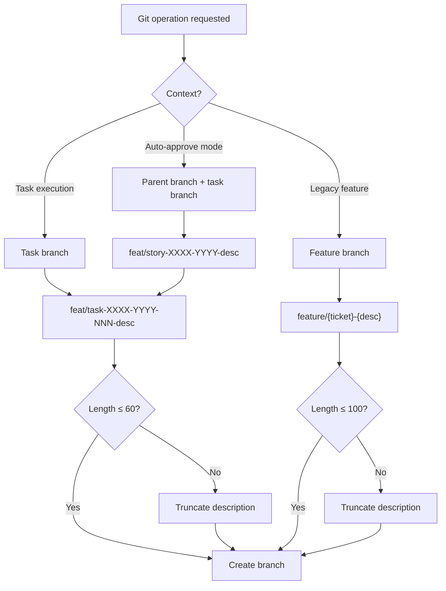
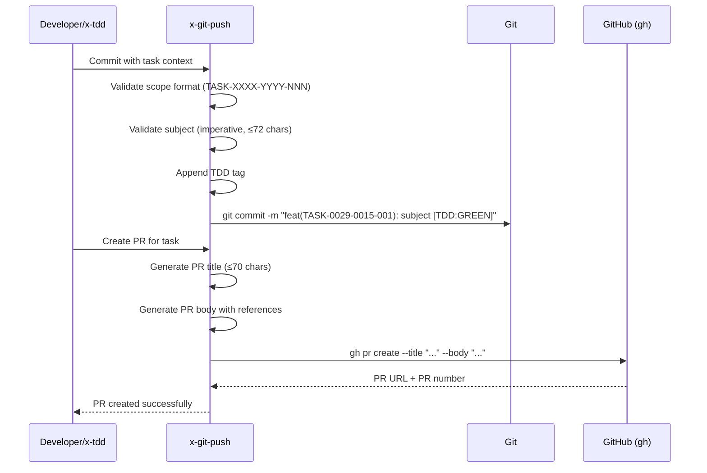

# História: x-git-push — Task Branch Naming & Conventions

**ID:** story-0029-0017
**Chave Jira:** —
**Status:** Pendente

## 1. Dependências

| Blocked By | Blocks |
| :--- | :--- |
| story-0029-0005, story-0029-0009 | — |

## 2. Regras Transversais Aplicáveis

| ID | Título |
| :--- | :--- |
| RULE-005 | Git Flow Compliance |
| RULE-006 | Task ID Format |
| RULE-016 | Conventional Commits com Task ID |

## 3. Descrição

Como **desenvolvedor**, eu quero que o `x-git-push` suporte convenções de branch naming e commit scope para o modelo task-centric, garantindo que branches de task sigam o padrão `feat/task-XXXX-YYYY-NNN-desc` e commits usem o scope `TASK-XXXX-YYYY-NNN`.

Esta história modifica a skill `x-git-push` para:

1. **Branch naming para tasks:** Padrão `feat/task-XXXX-YYYY-NNN-short-desc` com limite de 60 caracteres. Validação de formato: XXXX = epic (4 dígitos), YYYY = story (4 dígitos), NNN = task sequencial (3 dígitos). Short-desc é lowercase-hyphenated, derivado da descrição da task
2. **Branch naming para parent branches (auto-approve):** Padrão `feat/story-XXXX-YYYY-short-desc` com limite de 60 caracteres. Criado automaticamente quando `--auto-approve-pr` é usado em x-dev-lifecycle
3. **Commit scope com task ID:** Formato `feat(TASK-XXXX-YYYY-NNN): subject [TDD:TAG]`. TDD tags obrigatórias: `[TDD]`, `[TDD:RED]`, `[TDD:GREEN]`, `[TDD:REFACTOR]`. Subject em imperative mood, ≤ 72 caracteres
4. **PR title format:** `feat(TASK-XXXX-YYYY-NNN): description` com limite de 70 caracteres. Tipo de commit (feat/fix/refactor) deve corresponder ao conteúdo da task
5. **PR body com referências:** Body do PR DEVE incluir: referência ao story ID (`Story: story-XXXX-YYYY`), referência ao epic ID (`Epic: epic-XXXX`), link para task plan, lista de arquivos modificados com camada (domain/port/adapter/etc.)

## 3.5 Entrega de Valor

- **Valor Principal:** Convenções de branch e PR padronizadas para modelo task-centric, garantindo rastreabilidade completa de task → branch → commit → PR
- **Métrica de Sucesso:** 100% dos branches de task seguem padrão `feat/task-XXXX-YYYY-NNN-desc` (≤60 chars), commits têm scope TASK-XXXX-YYYY-NNN, PRs incluem referências story/epic
- **Impacto no Negócio:** Rastreabilidade bidirecional entre artefatos de planejamento e código, facilitando auditoria e post-mortem em ~70%

## 4. Definições de Qualidade Locais

### DoR Local (Definition of Ready)

- [ ] Skill x-commit implementada e testada (story-0029-0005)
- [ ] Skill x-pr-create implementada e testada (story-0029-0009)
- [ ] x-git-push SKILL.md atual lido e compreendido (branch creation, commit, PR sections)
- [ ] Git Flow branching model compreendido (Rule 09)

### DoD Local (Definition of Done)

- [ ] x-git-push SKILL.md modificado com branch naming para tasks e parent branches
- [ ] Commit scope com TASK-XXXX-YYYY-NNN e TDD tags documentado
- [ ] PR title format (≤70 chars) e PR body com referências story/epic
- [ ] Validação de limite de 60 chars para branch names
- [ ] Validação de formato TASK-XXXX-YYYY-NNN no scope do commit
- [ ] Pelo menos 1 teste automatizado validando a presença das novas convenções
- [ ] Smoke test: golden file match

### Global Definition of Done (DoD)

- **Cobertura:** ≥ 95% Line, ≥ 90% Branch
- **Testes Automatizados:** Unitários + golden file match
- **Documentação:** SKILL.md atualizado
- **TDD Compliance:** Test-first, refactoring explícito, TPP order
- **Double-Loop TDD:** Acceptance from Gherkin, unit by TPP

## 5. Contratos de Dados (Data Contract)

### 5.1 Branch Naming Conventions

| Tipo | Padrão | Limite | Exemplo |
| :--- | :--- | :--- | :--- |
| Task branch | `feat/task-XXXX-YYYY-NNN-short-desc` | ≤ 60 chars | `feat/task-0029-0015-001-phase2-rewrite` |
| Parent branch | `feat/story-XXXX-YYYY-short-desc` | ≤ 60 chars | `feat/story-0029-0015-lifecycle` |
| Feature branch (legacy) | `feature/{ticket}-{desc}` | ≤ 100 chars | `feature/PROJ-123-add-auth` |

### 5.2 Branch Name Validation Rules

| Regra | Validação | Erro |
| :--- | :--- | :--- |
| Formato XXXX | 4 dígitos numéricos | "Invalid epic ID: must be 4 digits" |
| Formato YYYY | 4 dígitos numéricos | "Invalid story ID: must be 4 digits" |
| Formato NNN | 3 dígitos numéricos (001-999) | "Invalid task sequence: must be 3 digits" |
| Short-desc | lowercase, hyphens only, no underscores | "Invalid description: use lowercase-hyphenated" |
| Comprimento | ≤ 60 chars total | "Branch name exceeds 60 chars: truncating description" |
| Caracteres | `[a-z0-9/-]` | "Invalid characters in branch name" |

### 5.3 Commit Scope Format

| Componente | Formato | Exemplo |
| :--- | :--- | :--- |
| Type | Conventional Commit type | `feat`, `fix`, `refactor`, `test`, `docs`, `chore` |
| Scope | `TASK-XXXX-YYYY-NNN` | `TASK-0029-0015-001` |
| Subject | Imperative mood, ≤ 72 chars | `implement task execution loop` |
| TDD Tag | `[TDD]`, `[TDD:RED]`, `[TDD:GREEN]`, `[TDD:REFACTOR]` | `[TDD:GREEN]` |
| Full format | `type(scope): subject [TDD:TAG]` | `feat(TASK-0029-0015-001): implement task loop [TDD:GREEN]` |

### 5.4 PR Title Format

| Componente | Formato | Limite |
| :--- | :--- | :--- |
| Full format | `type(TASK-XXXX-YYYY-NNN): description` | ≤ 70 chars |
| Exemplo | `feat(TASK-0029-0015-001): implement Phase 2 task loop` | 54 chars |

### 5.5 PR Body Template

| Seção | Conteúdo | M/O |
| :--- | :--- | :--- |
| Story reference | `Story: story-XXXX-YYYY` | M |
| Epic reference | `Epic: epic-XXXX` | M |
| Task plan link | `Task Plan: plans/epic-XXXX/plans/task-plan-XXXX-YYYY-NNN.md` | O |
| Changed files | Tabela com arquivo, camada, tipo de mudança | M |
| TDD summary | Número de ciclos RED/GREEN/REFACTOR | M |
| Checklist | DoD items da task | M |

## 6. Diagramas

### 6.1 Branch Naming Decision Flow



### 6.2 Commit & PR Flow



## 7. Critérios de Aceite (Gherkin)

```gherkin
Cenario: Branch de task criado com naming correto
  DADO que a task é TASK-0029-0015-001 com descrição "implement phase2 rewrite"
  QUANDO x-git-push cria o branch
  ENTÃO o branch é "feat/task-0029-0015-001-implement-phase2"
  E o comprimento é ≤ 60 caracteres
  E todos os caracteres são lowercase, hyphens ou dígitos

Cenario: Branch name truncado quando excede 60 caracteres
  DADO que a task é TASK-0029-0015-001 com descrição muito longa
  E o branch name resultante teria 75 caracteres
  QUANDO x-git-push cria o branch
  ENTÃO a descrição é truncada para caber em 60 caracteres
  E o truncamento preserva palavras completas (não corta no meio)
  E o log contém "Branch name truncated to 60 chars"

Cenario: Commit scope contém task ID no formato correto
  DADO que o desenvolvedor está commitando mudanças para TASK-0029-0015-001
  E a fase TDD é GREEN
  QUANDO x-git-push gera o commit
  ENTÃO o commit message é "feat(TASK-0029-0015-001): <subject> [TDD:GREEN]"
  E o subject está em imperative mood
  E o total ≤ 72 caracteres (excluindo TDD tag)

Cenario: PR title gerado com formato task-centric
  DADO que TASK-0029-0015-001 tem PR criado
  QUANDO x-git-push gera o PR
  ENTÃO o PR title é "feat(TASK-0029-0015-001): <description>"
  E o comprimento do title é ≤ 70 caracteres

Cenario: PR body contém referências a story e epic
  DADO que TASK-0029-0015-001 pertence a story-0029-0015 do epic-0029
  QUANDO x-git-push gera o PR body
  ENTÃO o body contém "Story: story-0029-0015"
  E o body contém "Epic: epic-0029"
  E o body contém tabela de arquivos modificados com camada
  E o body contém resumo de ciclos TDD

Cenario: Parent branch criado em modo auto-approve
  DADO que --auto-approve-pr está ativo
  E a story é story-0029-0015 com descrição "lifecycle"
  QUANDO x-git-push cria o parent branch
  ENTÃO o branch é "feat/story-0029-0015-lifecycle"
  E o branch é criado a partir de develop
  E task branches são criados a partir do parent branch

Cenario: Validação rejeita branch name com formato inválido
  DADO que um branch name "feat/task-29-15-1-desc" é proposto
  QUANDO a validação de formato executa
  ENTÃO o branch é rejeitado com "Invalid epic ID: must be 4 digits"
  E a mensagem sugere o formato correto: "feat/task-0029-0015-001-desc"
```

## 8. Sub-tarefas

- [ ] [Dev] Modificar x-git-push SKILL.md — adicionar branch naming para tasks (feat/task-XXXX-YYYY-NNN-desc)
- [ ] [Dev] Implementar branch naming para parent branches (feat/story-XXXX-YYYY-desc) em modo auto-approve
- [ ] [Dev] Implementar commit scope com TASK-XXXX-YYYY-NNN e TDD tags obrigatórias
- [ ] [Dev] Implementar PR title format (≤70 chars) com task ID
- [ ] [Dev] Implementar PR body template com referências story/epic, changed files e TDD summary
- [ ] [Dev] Implementar validação de branch name (formato, comprimento, caracteres permitidos)
- [ ] [Test] Unitário: SKILL.md contém convenções de branch naming, commit scope e PR format
- [ ] [Test] Integração: Golden file match do x-git-push SKILL.md modificado
- [ ] [Test] Smoke/E2E: SKILL.md gerado contém seções de task branch naming e commit conventions
- [ ] [Doc] Documentar todas as convenções de naming e exemplos no SKILL.md
