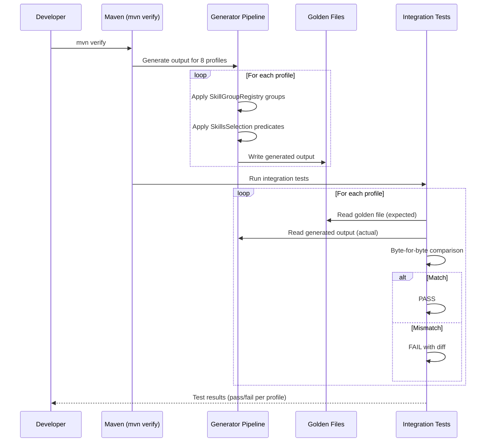
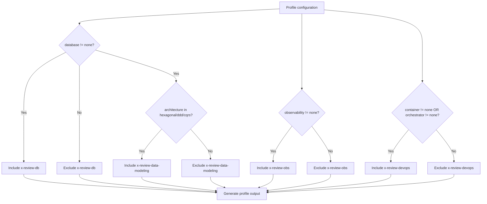

# História: Golden File Regeneration & Integration Tests

**ID:** story-0029-0018
**Chave Jira:** —
**Status:** Pendente

## 1. Dependências

| Blocked By | Blocks |
| :--- | :--- |
| story-0029-0001, story-0029-0002, story-0029-0003, story-0029-0004, story-0029-0005, story-0029-0006, story-0029-0007, story-0029-0008, story-0029-0009, story-0029-0010, story-0029-0011, story-0029-0012, story-0029-0013, story-0029-0014, story-0029-0015, story-0029-0016, story-0029-0017 | — |

## 2. Regras Transversais Aplicáveis

| ID | Título |
| :--- | :--- |
| RULE-010 | Backward Compatibility |

## 3. Descrição

Como **desenvolvedor**, eu quero que todos os golden files sejam regenerados e os testes de integração validem que as mudanças de todas as 17 stories anteriores geram output correto para os 8 perfis (go-gin, java-quarkus, java-spring, kotlin-ktor, python-click-cli, python-fastapi, rust-axum, typescript-nestjs), garantindo byte-for-byte match e detectando regressões.

Esta história é a **capstone** do épico — executa após todas as outras stories e valida a integridade do sistema completo:

1. **Regeneração de golden files para 8 perfis:** Executar a pipeline de geração para cada perfil e atualizar todos os golden files em `java/src/test/resources/golden/{profile}/`. Skills novas (x-format, x-lint, x-commit, x-worktree, x-plan-task, x-tdd, x-pr-create, x-docs) devem aparecer no output. Skills modificadas (x-story-create, x-story-map, x-dev-lifecycle, x-dev-epic-implement, x-git-push, x-review) devem refletir as alterações
2. **Testes para novo formato de tasks em templates:** Validar que `_TEMPLATE-STORY.md` contém Section 8 com formato TASK-XXXX-YYYY-NNN. Validar que `_TEMPLATE-IMPLEMENTATION-MAP.md` contém Section 8 com cross-story task dependencies
3. **Testes para task-level execution state:** Validar que `_TEMPLATE-EXECUTION-STATE.json` (se existir) contém campos de tasks. Validar serialização/deserialização de TaskEntry e TaskStatus em classes Java
4. **Testes para novas SKILL.md presence no output:** Para cada skill nova, validar que SKILL.md aparece no output de pelo menos 1 perfil. Para skills condicionais (x-review-db, x-review-obs, x-review-devops, x-review-data-modeling), validar inclusão/exclusão baseada em feature gates
5. **Atualização de SkillGroupRegistry.java:** Registrar novos grupos de skills (atomic-workflow, review-specialists) no registry
6. **Atualização de SkillsSelection.java:** Adicionar predicados condicionais para review skills (database != none → x-review-db, observability != none → x-review-obs, etc.)

## 3.5 Entrega de Valor

- **Valor Principal:** Validação end-to-end de que todas as 17 stories anteriores produzem output correto para 8 perfis, com golden file byte-for-byte match como gate de regressão
- **Métrica de Sucesso:** 100% dos golden files regenerados, todos os testes de integração passando, novas skills presentes no output, conditional skills corretamente incluídas/excluídas por perfil
- **Impacto no Negócio:** Gate de qualidade final que previne regressões em produção — qualquer mudança futura que quebre o output será detectada por golden file mismatch

## 4. Definições de Qualidade Locais

### DoR Local (Definition of Ready)

- [ ] Todas as stories anteriores (story-0029-0001 a story-0029-0017) concluídas e mergeadas
- [ ] Todas as skills novas e modificadas disponíveis nos recursos
- [ ] Classes Java de checkpoint atualizadas com TaskEntry e TaskStatus
- [ ] SkillGroupRegistry.java e SkillsSelection.java lidos e compreendidos

### DoD Local (Definition of Done)

- [ ] Golden files regenerados para todos os 8 perfis
- [ ] Testes de integração byte-for-byte match para todos os golden files
- [ ] Testes para novo formato de tasks em _TEMPLATE-STORY.md e _TEMPLATE-IMPLEMENTATION-MAP.md
- [ ] Testes para task-level fields em execution state
- [ ] Testes para presença de novas SKILL.md no output (8 skills novas)
- [ ] Testes para inclusão/exclusão condicional de review skills por perfil
- [ ] SkillGroupRegistry.java atualizado com novos grupos
- [ ] SkillsSelection.java atualizado com predicados condicionais
- [ ] Build completo (`mvn verify`) passa sem warnings
- [ ] Cobertura ≥ 95% line, ≥ 90% branch mantida

### Global Definition of Done (DoD)

- **Cobertura:** ≥ 95% Line, ≥ 90% Branch
- **Testes Automatizados:** Unitários + golden file byte-for-byte match para 8 perfis
- **Documentação:** README de novas skills atualizado
- **TDD Compliance:** Test-first, refactoring explícito, TPP order
- **Double-Loop TDD:** Acceptance from Gherkin, unit by TPP

## 5. Contratos de Dados (Data Contract)

### 5.1 Golden File Profiles

| Perfil | Path | Skills Condicionais Esperadas |
| :--- | :--- | :--- |
| go-gin | `golden/go-gin/` | x-review-qa, x-review-perf (core apenas — sem DB) |
| java-quarkus | `golden/java-quarkus/` | x-review-qa, x-review-perf, x-review-db, x-review-obs, x-review-devops |
| java-spring | `golden/java-spring/` | x-review-qa, x-review-perf, x-review-db, x-review-obs, x-review-devops, x-review-data-modeling |
| kotlin-ktor | `golden/kotlin-ktor/` | x-review-qa, x-review-perf, x-review-db, x-review-obs |
| python-click-cli | `golden/python-click-cli/` | x-review-qa, x-review-perf (core apenas — sem DB) |
| python-fastapi | `golden/python-fastapi/` | x-review-qa, x-review-perf, x-review-db, x-review-obs |
| rust-axum | `golden/rust-axum/` | x-review-qa, x-review-perf, x-review-db |
| typescript-nestjs | `golden/typescript-nestjs/` | x-review-qa, x-review-perf, x-review-db, x-review-obs, x-review-devops |

### 5.2 Novas Skills — Presença Esperada no Output

| Skill | Tipo | Path no Output | Todos os perfis? |
| :--- | :--- | :--- | :--- |
| x-format | Core (nova) | `.claude/skills/x-format/SKILL.md` | Sim |
| x-lint | Core (nova) | `.claude/skills/x-lint/SKILL.md` | Sim |
| x-commit | Core (nova) | `.claude/skills/x-commit/SKILL.md` | Sim |
| x-worktree | Core (nova) | `.claude/skills/x-worktree/SKILL.md` | Sim |
| x-plan-task | Core (nova) | `.claude/skills/x-plan-task/SKILL.md` | Sim |
| x-tdd | Core (nova) | `.claude/skills/x-tdd/SKILL.md` | Sim |
| x-pr-create | Core (nova) | `.claude/skills/x-pr-create/SKILL.md` | Sim |
| x-docs | Core (nova) | `.claude/skills/x-docs/SKILL.md` | Sim |
| x-review-qa | Core (nova) | `.claude/skills/x-review-qa/SKILL.md` | Sim |
| x-review-perf | Core (nova) | `.claude/skills/x-review-perf/SKILL.md` | Sim |
| x-review-db | Conditional | `.claude/skills/x-review-db/SKILL.md` | Apenas com database != none |
| x-review-obs | Conditional | `.claude/skills/x-review-obs/SKILL.md` | Apenas com observability != none |
| x-review-devops | Conditional | `.claude/skills/x-review-devops/SKILL.md` | Apenas com container/orchestrator != none |
| x-review-data-modeling | Conditional | `.claude/skills/x-review-data-modeling/SKILL.md` | Apenas com database != none AND architecture hexagonal |

### 5.3 SkillGroupRegistry — Novos Grupos

| Grupo | Skills | Descrição |
| :--- | :--- | :--- |
| atomic-workflow | x-format, x-lint, x-commit, x-worktree, x-plan-task, x-tdd, x-pr-create, x-docs | Skills atômicas do workflow task-centric |
| review-core | x-review-qa, x-review-perf | Review specialists sempre incluídos |
| review-conditional | x-review-db, x-review-obs, x-review-devops, x-review-data-modeling | Review specialists condicionais |

### 5.4 SkillsSelection — Predicados Condicionais

| Skill | Predicado | Config Key |
| :--- | :--- | :--- |
| x-review-db | `database != "none"` | `database` |
| x-review-obs | `observability != "none"` | `observability` |
| x-review-devops | `container != "none" OR orchestrator != "none"` | `container`, `orchestrator` |
| x-review-data-modeling | `database != "none" AND architecture in [hexagonal, ddd, cqrs]` | `database`, `architecture` |

### 5.5 Template Validation Points

| Template | Validação | Campo/Seção |
| :--- | :--- | :--- |
| _TEMPLATE-STORY.md | Section 8 com TASK-XXXX-YYYY-NNN format | Section 8: Sub-tarefas |
| _TEMPLATE-IMPLEMENTATION-MAP.md | Section 8 com cross-story task deps | Section 8: Task Dependencies |
| _TEMPLATE-EXECUTION-STATE.json | Campo tasks com TaskEntry schema | stories[].tasks |
| _TEMPLATE-EXECUTION-STATE.json | Campo version | root.version |

## 6. Diagramas

### 6.1 Workflow de Regeneração e Testes



### 6.2 Conditional Skill Inclusion Decision



## 7. Critérios de Aceite (Gherkin)

```gherkin
Cenario: Golden files regenerados para todos os 8 perfis
  DADO que todas as stories anteriores (0001-0017) foram implementadas
  QUANDO a pipeline de geração executa para todos os 8 perfis
  ENTÃO golden files são atualizados em java/src/test/resources/golden/{profile}/
  E cada perfil contém todas as skills core (novas e existentes)
  E mvn verify passa com 0 falhas

Cenario: Novas skills core aparecem no output de todos os perfis
  DADO que x-format, x-lint, x-commit, x-worktree, x-plan-task, x-tdd, x-pr-create, x-docs foram criadas
  QUANDO o output é gerado para qualquer perfil
  ENTÃO .claude/skills/x-format/SKILL.md está presente
  E .claude/skills/x-lint/SKILL.md está presente
  E .claude/skills/x-commit/SKILL.md está presente
  E .claude/skills/x-worktree/SKILL.md está presente
  E .claude/skills/x-plan-task/SKILL.md está presente
  E .claude/skills/x-tdd/SKILL.md está presente
  E .claude/skills/x-pr-create/SKILL.md está presente
  E .claude/skills/x-docs/SKILL.md está presente

Cenario: Review skills condicionais incluídas para java-spring (full stack)
  DADO que java-spring tem database=postgresql, observability=opentelemetry, container=docker, architecture=hexagonal
  QUANDO o output é gerado para java-spring
  ENTÃO x-review-db SKILL.md está presente
  E x-review-obs SKILL.md está presente
  E x-review-devops SKILL.md está presente
  E x-review-data-modeling SKILL.md está presente

Cenario: Review skills condicionais excluídas para python-click-cli (CLI sem DB)
  DADO que python-click-cli tem database=none, observability=none, container=none
  QUANDO o output é gerado para python-click-cli
  ENTÃO x-review-db SKILL.md NÃO está presente
  E x-review-obs SKILL.md NÃO está presente
  E x-review-devops SKILL.md NÃO está presente
  E x-review-data-modeling SKILL.md NÃO está presente
  E x-review-qa e x-review-perf ESTÃO presentes (core)

Cenario: Template _TEMPLATE-STORY.md contém novo formato de tasks
  DADO que _TEMPLATE-STORY.md foi atualizado na story-0029-0001
  QUANDO o template é lido
  ENTÃO Section 8 contém placeholder para TASK-XXXX-YYYY-NNN
  E o formato inclui colunas: ID, Descrição, Camada, Dependências, Tag, Testabilidade

Cenario: SkillGroupRegistry contém novos grupos
  DADO que SkillGroupRegistry.java foi atualizado
  QUANDO os grupos são listados
  ENTÃO o grupo "atomic-workflow" contém 8 skills (x-format, x-lint, x-commit, x-worktree, x-plan-task, x-tdd, x-pr-create, x-docs)
  E o grupo "review-core" contém 2 skills (x-review-qa, x-review-perf)
  E o grupo "review-conditional" contém 4 skills (x-review-db, x-review-obs, x-review-devops, x-review-data-modeling)

Cenario: SkillsSelection aplica predicados condicionais corretamente
  DADO que a configuração do perfil tem database="postgresql" e observability="none"
  QUANDO SkillsSelection avalia as skills condicionais
  ENTÃO x-review-db é incluída (database != none)
  E x-review-obs é excluída (observability == none)
  E o teste unitário valida a lógica de predicados

Cenario: Byte-for-byte match para todos os golden files
  DADO que os golden files foram regenerados
  QUANDO mvn verify executa os testes de integração
  ENTÃO todos os golden files correspondem byte-for-byte ao output gerado
  E nenhum teste de integração falha
  E o relatório de cobertura mostra ≥ 95% line e ≥ 90% branch
```

## 8. Sub-tarefas

- [ ] [Dev] Regenerar golden files para todos os 8 perfis com novas skills e templates atualizados
- [ ] [Dev] Atualizar SkillGroupRegistry.java com novos grupos: atomic-workflow, review-core, review-conditional
- [ ] [Dev] Atualizar SkillsSelection.java com predicados condicionais para review skills
- [ ] [Dev] Verificar que templates (_TEMPLATE-STORY.md, _TEMPLATE-IMPLEMENTATION-MAP.md) contêm novo formato de tasks
- [ ] [Test] Integração: Byte-for-byte golden file match para 8 perfis
- [ ] [Test] Unitário: SkillGroupRegistry contém novos grupos com skills corretas
- [ ] [Test] Unitário: SkillsSelection aplica predicados condicionais corretamente (inclusão/exclusão)
- [ ] [Test] Integração: Novas skills core presentes no output de todos os perfis
- [ ] [Test] Integração: Review skills condicionais presentes/ausentes conforme configuração do perfil
- [ ] [Test] Smoke/E2E: mvn verify completo passa sem warnings com cobertura ≥ 95%/90%
- [ ] [Doc] Atualizar README com lista de novas skills e grupos no registry
