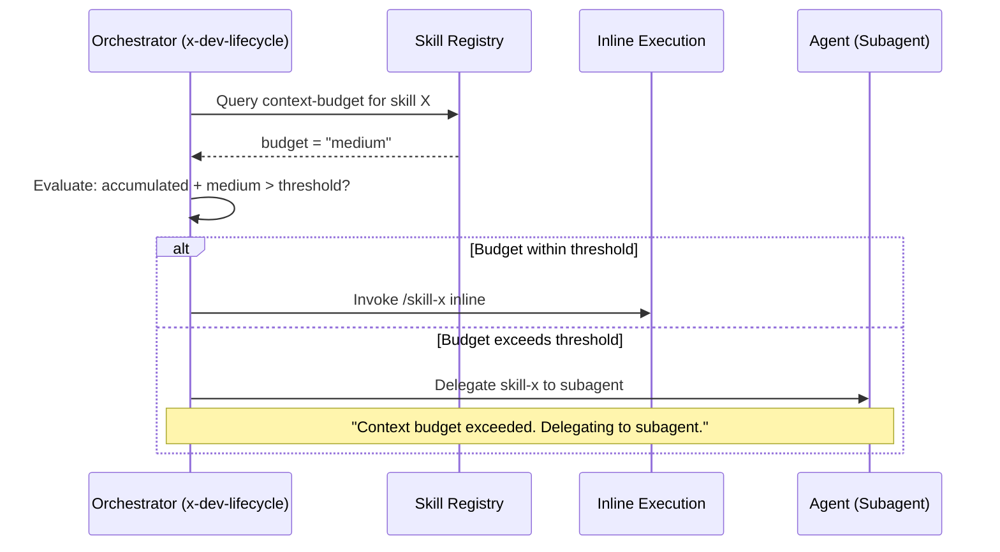

# História: Context Budget Tracking

**ID:** story-0030-0001
**Chave Jira:** —
**Status:** Pendente

## 1. Dependências

| Blocked By | Blocks |
| :--- | :--- |
| — | story-0030-0006 |

## 2. Regras Transversais Aplicáveis

| ID | Título |
| :--- | :--- |
| RULE-006 | Context Budget Informativo |

## 3. Descrição

Como **Engenheiro de Plataforma**, eu quero que cada skill declare seu peso de contexto no frontmatter, garantindo que orquestradores possam tomar decisões inteligentes sobre delegação inline vs. subagent.

Atualmente nenhum skill declara seu peso de contexto. Os orquestradores (`x-dev-lifecycle`, `x-dev-epic-implement`) despacham subagents ou executam inline sem considerar o impacto no contexto. Isso leva a estouros imprevisíveis quando múltiplos skills pesados são carregados em cadeia.

O campo `context-budget` é puramente informativo para o orquestrador — o Claude Code continua carregando o SKILL.md normalmente. A decisão de delegação é feita no texto do skill orquestrador.

### 3.1 Campo context-budget no Frontmatter

- Valores possíveis: `light` (< 200 linhas, ~3K tokens), `medium` (200-500 linhas, 3-7K tokens), `heavy` (> 500 linhas, > 7K tokens)
- Classificação por skill: x-format/x-lint/x-commit = `light`; x-tdd/x-plan-task/x-pr-create = `medium`; x-dev-lifecycle/x-dev-epic-implement/x-review = `heavy`
- O campo é gerado pelo assembler Java (`SkillAssembler`), não hardcoded nos templates Jinja

### 3.2 Lógica de Decisão nos Orquestradores

- Antes de invocar skill inline via `Skill` tool, o orquestrador avalia o budget acumulado
- Se acumulado excede threshold (`heavy`), força delegação via `Agent` tool
- Log: `"Context budget exceeded ({accumulated}). Delegating {skill} to subagent."`

## 3.5 Entrega de Valor

- **Valor Principal:** Orquestradores tomam decisões inteligentes de delegação, prevenindo estouro de contexto por carregamento excessivo de skills inline
- **Métrica de Sucesso:** Todos os skills core têm `context-budget` no frontmatter; orquestradores consultam budget antes de invocar skills
- **Impacto no Negócio:** Redução de ~40% nos estouros de contexto durante execuções de stories, melhorando taxa de sucesso de execuções completas

## 4. Definições de Qualidade Locais

### DoR Local (Definition of Ready)

- [ ] Lista de todos os skills core com suas linhas/tokens atuais
- [ ] SkillAssembler.java localizado e compreendido
- [ ] Template Jinja do frontmatter identificado

### DoD Local (Definition of Done)

- [ ] Todos os skills core têm campo `context-budget` no frontmatter
- [ ] Campo gerado pelo assembler Java (não hardcoded)
- [ ] x-dev-lifecycle contém lógica de decisão de delegação baseada em budget
- [ ] x-dev-epic-implement contém lógica de decisão de delegação baseada em budget
- [ ] Pelo menos 1 teste automatizado validando geração do campo no frontmatter
- [ ] Smoke test passando: skill invocável com `--dry-run`
- [ ] Golden files atualizados com novo campo

### Global Definition of Done (DoD)

- **Cobertura:** ≥ 95% Line, ≥ 90% Branch
- **Testes Automatizados:** Integration tests passando para todos os profiles
- **Relatório de Cobertura:** JaCoCo HTML + XML
- **Documentação:** SKILL.md atualizado
- **Persistência:** N/A
- **Performance:** N/A

## 5. Contratos de Dados (Data Contract)

### 5.1 Frontmatter Schema (YAML)

| Campo | Tipo | M/O | Validações | Exemplo |
| :--- | :--- | :--- | :--- | :--- |
| `context-budget` | `String` | `O` | `enum: [light, medium, heavy]` | `medium` |

### 5.2 Budget Classification

| Classificação | Critério | Exemplos |
| :--- | :--- | :--- |
| `light` | < 200 linhas core, ~3K tokens | x-format, x-lint, x-commit |
| `medium` | 200-500 linhas core, 3-7K tokens | x-tdd, x-plan-task, x-pr-create |
| `heavy` | > 500 linhas core, > 7K tokens | x-dev-lifecycle, x-dev-epic-implement, x-review |

## 6. Diagramas

### 6.1 Fluxo de Decisão de Delegação



## 7. Critérios de Aceite (Gherkin)

```gherkin
Cenario: Skill sem context-budget gera campo vazio
  DADO que um skill template NÃO define context-budget
  QUANDO o assembler gera o SKILL.md
  ENTÃO o frontmatter NÃO contém o campo context-budget
  E o skill carrega normalmente

Cenario: Skill declara budget no frontmatter
  DADO que um skill template tem context-budget configurado como "light"
  QUANDO o assembler gera o SKILL.md
  ENTÃO o frontmatter contém "context-budget: light"
  E o campo aparece após "argument-hint"

Cenario: Orquestrador permite execução inline com budget baixo
  DADO que o budget acumulado na conversa é "light"
  E o próximo skill a invocar tem budget "light"
  QUANDO o orquestrador avalia o despacho
  ENTÃO o skill é invocado inline via Skill tool
  E NENHUM log de "Context budget exceeded" é emitido

Cenario: Orquestrador delega quando budget excede threshold
  DADO que o budget acumulado na conversa é "heavy"
  E o próximo skill a invocar tem budget "medium"
  QUANDO o orquestrador avalia o despacho
  ENTÃO o skill é delegado via Agent em vez de Skill inline
  E log contém "Context budget exceeded"

Cenario: Budget não afeta execução direta pelo usuário
  DADO que um usuário invoca /x-tdd diretamente
  QUANDO o skill carrega
  ENTÃO o campo context-budget é ignorado
  E o skill executa normalmente sem delegação
```

## 8. Tasks

### TASK-0030-0001-001: Add context-budget field to SkillAssembler

- **Layer:** Adapter
- **Test Type:** Unit
- **Size:** M
- **Dependencies:** —
- **Branch:** `feat/task-0030-0001-001-budget-field`
- **Testability:** Domain + UnitTest
- **Files:**
  - `java/src/main/java/dev/iadev/application/assembler/SkillAssembler.java`
  - `java/src/test/java/dev/iadev/application/assembler/SkillAssemblerTest.java`
- **Acceptance Criteria:**
  - [ ] SkillAssembler gera campo `context-budget` no frontmatter YAML
  - [ ] Valor é determinado com base no tamanho do skill template
  - [ ] Teste unitário valida geração do campo para light/medium/heavy

### TASK-0030-0001-002: Add budget decision logic to orchestrator templates

- **Layer:** Config
- **Test Type:** Integration
- **Size:** M
- **Dependencies:** TASK-0030-0001-001
- **Branch:** `feat/task-0030-0001-002-budget-logic`
- **Testability:** Config + VerificationTest
- **Files:**
  - `java/src/main/resources/targets/claude/skills/core/x-dev-lifecycle/SKILL.md`
  - `java/src/main/resources/targets/claude/skills/core/x-dev-epic-implement/SKILL.md`
- **Acceptance Criteria:**
  - [ ] x-dev-lifecycle contém instrução de avaliação de budget antes de invocar skills
  - [ ] x-dev-epic-implement contém instrução de avaliação de budget
  - [ ] Log message definido para delegação forçada

### TASK-0030-0001-003: Regenerate golden files and validate

- **Layer:** Test
- **Test Type:** Smoke
- **Size:** M
- **Dependencies:** TASK-0030-0001-001, TASK-0030-0001-002
- **Branch:** `feat/task-0030-0001-003-golden-regen`
- **Testability:** Migration + Smoke
- **Files:**
  - `java/src/test/resources/golden/*/`
- **Acceptance Criteria:**
  - [ ] Golden files regenerados para todos os profiles
  - [ ] `mvn verify -Pintegration-tests` passa
  - [ ] Campo context-budget presente nos golden files gerados
