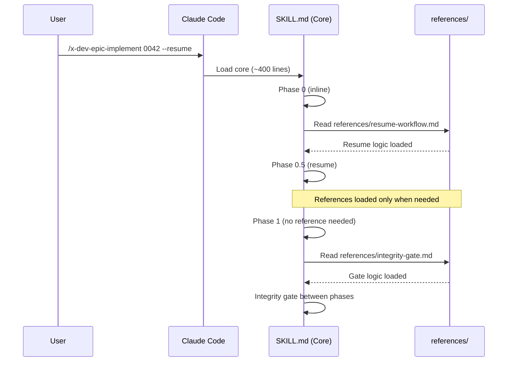

# História: Skill Instruction Compression via References

**ID:** story-0030-0002
**Chave Jira:** —
**Status:** Pendente

## 1. Dependências

| Blocked By | Blocks |
| :--- | :--- |
| — | story-0030-0006 |

## 2. Regras Transversais Aplicáveis

| ID | Título |
| :--- | :--- |
| RULE-001 | Preservação Funcional |
| RULE-002 | Degradação Graceful de References |

## 3. Descrição

Como **Engenheiro de Plataforma**, eu quero que os skills pesados sejam separados em core + reference files sob demanda, garantindo que apenas o workflow essencial é carregado na janela de contexto enquanto detalhes de implementação são lidos on-demand.

O skill `x-dev-epic-implement` tem 1,733 linhas carregadas integralmente quando invocado. Muito desse conteúdo é relevante apenas em fases específicas (resume workflow só importa com `--resume`, preflight analysis só importa com execução paralela, integrity gate só importa entre fases). A separação em core + references permite que o core tenha ~400 linhas, com references carregadas apenas quando a fase correspondente é alcançada.

### 3.1 Decomposição do x-dev-epic-implement

- `SKILL.md` core (~400 linhas): workflow overview, phases 0-4, flags, prerequisites, subagent prompt template
- `references/resume-workflow.md`: Phase 0.5 resume detection, reclassification, PR verification (~200L)
- `references/merge-modes.md`: auto-merge, no-merge, interactive-merge decision mechanism (~200L)
- `references/preflight-analysis.md`: Phase 0.5 conflict analysis, overlap matrix, classification (~200L)
- `references/integrity-gate.md`: gate preconditions, subagent prompt, regression diagnosis, version bump (~200L)
- `references/checkpoint-schema.md`: execution-state.json schema, per-task fields, story entry schema (~200L)
- `references/phase-reports.md`: phase completion report generation, report content (~100L)

### 3.2 Decomposição do x-dev-lifecycle

- `SKILL.md` core (~300 linhas): phases 0-3 overview, task execution loop, flags
- `references/planning-phases.md`: Phase 1A-1F details, subagent prompts (~200L)
- `references/verification-phase.md`: Phase 3 coverage, consistency, review, PR creation (~130L)
- `references/scope-assessment.md`: SIMPLE/STANDARD/COMPLEX classification (~100L)

### 3.3 Referências Condicionais no Core

O core contém instruções de leitura condicional:
```
If --resume: Read references/resume-workflow.md
If Phase 0.5: Read references/preflight-analysis.md
If Phase 1: Read references/planning-phases.md
```

### 3.4 Assembler Java

O assembler DEVE copiar os reference files para o output junto com o SKILL.md, preservando a estrutura `skills/{name}/references/*.md`.

## 3.5 Entrega de Valor

- **Valor Principal:** Redução de ~70% no tamanho carregado dos 2 maiores skills, liberando ~18K tokens para raciocínio do agente
- **Métrica de Sucesso:** x-dev-epic-implement core ≤ 500 linhas; x-dev-lifecycle core ≤ 350 linhas
- **Impacto no Negócio:** Execuções de stories/epics completam com sucesso em maior proporção, reduzindo retrabalho e intervenção manual

## 4. Definições de Qualidade Locais

### DoR Local (Definition of Ready)

- [ ] Conteúdo atual de x-dev-epic-implement e x-dev-lifecycle mapeado por fase
- [ ] Estrutura de references/ definida

### DoD Local (Definition of Done)

- [ ] x-dev-epic-implement core ≤ 500 linhas
- [ ] x-dev-lifecycle core ≤ 350 linhas
- [ ] Todas as reference files existem e são legíveis
- [ ] Nenhuma funcionalidade removida (apenas redistribuída)
- [ ] Skill executa com `--dry-run` lendo references
- [ ] Skill executa com `--resume` lendo resume reference
- [ ] Pelo menos 1 teste automatizado validando geração de reference files
- [ ] Golden files incluem reference files nos diretórios corretos

### Global Definition of Done (DoD)

- **Cobertura:** ≥ 95% Line, ≥ 90% Branch
- **Testes Automatizados:** Integration tests passando
- **Relatório de Cobertura:** JaCoCo HTML + XML
- **Documentação:** SKILL.md core e references documentados
- **Persistência:** N/A
- **Performance:** Redução mensurável no tamanho dos SKILL.md core

## 5. Contratos de Dados (Data Contract)

### 5.1 Estrutura de Diretórios (Output)

| Path | Tipo | Conteúdo |
| :--- | :--- | :--- |
| `skills/x-dev-epic-implement/SKILL.md` | Core | Workflow, phases, flags (~400L) |
| `skills/x-dev-epic-implement/references/resume-workflow.md` | Reference | Resume logic (~200L) |
| `skills/x-dev-epic-implement/references/merge-modes.md` | Reference | Merge decision (~200L) |
| `skills/x-dev-epic-implement/references/preflight-analysis.md` | Reference | Conflict analysis (~200L) |
| `skills/x-dev-epic-implement/references/integrity-gate.md` | Reference | Gate logic (~200L) |
| `skills/x-dev-epic-implement/references/checkpoint-schema.md` | Reference | JSON schema (~200L) |
| `skills/x-dev-epic-implement/references/phase-reports.md` | Reference | Report generation (~100L) |

## 6. Diagramas

### 6.1 Carregamento Sob Demanda



## 7. Critérios de Aceite (Gherkin)

```gherkin
Cenario: Core carregado sem references
  DADO que o skill x-dev-epic-implement tem core de ~400 linhas
  QUANDO o Claude carrega o skill
  ENTÃO apenas o core é carregado (~6K tokens)
  E references NÃO são carregadas automaticamente

Cenario: Reference carregada sob demanda para resume
  DADO que o usuário invoca /x-dev-epic-implement 0042 --resume
  QUANDO a Phase 0.5 é alcançada
  ENTÃO o skill instrui "Read references/resume-workflow.md"
  E a lógica de resume é executada corretamente

Cenario: Reference ausente degrada gracefully
  DADO que references/preflight-analysis.md NÃO existe
  QUANDO Phase 0.5 tenta ler o arquivo
  ENTÃO um WARNING é emitido: "Reference preflight-analysis.md not found"
  E a execução continua sem preflight analysis

Cenario: Assembler gera reference files no output
  DADO que o template contém references/ com 6 arquivos
  QUANDO o assembler executa para profile java-quarkus
  ENTÃO o output contém skills/x-dev-epic-implement/SKILL.md
  E o output contém skills/x-dev-epic-implement/references/resume-workflow.md
  E o output contém skills/x-dev-epic-implement/references/merge-modes.md
  E o output contém skills/x-dev-epic-implement/references/integrity-gate.md

Cenario: Funcionalidade completa preservada
  DADO que x-dev-epic-implement foi separado em core + references
  QUANDO o skill executa com --dry-run
  ENTÃO todas as fases são listadas corretamente
  E NENHUMA funcionalidade está ausente comparado à versão monolítica
```

## 8. Tasks

### TASK-0030-0002-001: Split x-dev-epic-implement into core + references

- **Layer:** Config
- **Test Type:** Integration
- **Size:** L
- **Dependencies:** —
- **Branch:** `feat/task-0030-0002-001-split-epic-implement`
- **Testability:** Config + VerificationTest
- **Files:**
  - `java/src/main/resources/targets/claude/skills/core/x-dev-epic-implement/SKILL.md`
  - `java/src/main/resources/targets/claude/skills/core/x-dev-epic-implement/references/resume-workflow.md`
  - `java/src/main/resources/targets/claude/skills/core/x-dev-epic-implement/references/merge-modes.md`
  - `java/src/main/resources/targets/claude/skills/core/x-dev-epic-implement/references/preflight-analysis.md`
  - `java/src/main/resources/targets/claude/skills/core/x-dev-epic-implement/references/integrity-gate.md`
  - `java/src/main/resources/targets/claude/skills/core/x-dev-epic-implement/references/checkpoint-schema.md`
  - `java/src/main/resources/targets/claude/skills/core/x-dev-epic-implement/references/phase-reports.md`
- **Acceptance Criteria:**
  - [ ] Core SKILL.md ≤ 500 linhas
  - [ ] 6 reference files criados com conteúdo redistribuído
  - [ ] Nenhuma funcionalidade removida

### TASK-0030-0002-002: Split x-dev-lifecycle into core + references

- **Layer:** Config
- **Test Type:** Integration
- **Size:** L
- **Dependencies:** —
- **Branch:** `feat/task-0030-0002-002-split-lifecycle`
- **Testability:** Config + VerificationTest
- **Files:**
  - `java/src/main/resources/targets/claude/skills/core/x-dev-lifecycle/SKILL.md`
  - `java/src/main/resources/targets/claude/skills/core/x-dev-lifecycle/references/planning-phases.md`
  - `java/src/main/resources/targets/claude/skills/core/x-dev-lifecycle/references/verification-phase.md`
  - `java/src/main/resources/targets/claude/skills/core/x-dev-lifecycle/references/scope-assessment.md`
- **Acceptance Criteria:**
  - [ ] Core SKILL.md ≤ 350 linhas
  - [ ] 3 reference files criados
  - [ ] Nenhuma funcionalidade removida

### TASK-0030-0002-003: Update assembler to copy reference files

- **Layer:** Application
- **Test Type:** Unit
- **Size:** M
- **Dependencies:** TASK-0030-0002-001, TASK-0030-0002-002
- **Branch:** `feat/task-0030-0002-003-assembler-refs`
- **Testability:** Domain + UnitTest
- **Files:**
  - `java/src/main/java/dev/iadev/application/assembler/SkillAssembler.java`
  - `java/src/test/java/dev/iadev/application/assembler/SkillAssemblerTest.java`
- **Acceptance Criteria:**
  - [ ] Assembler copia references/ para output junto com SKILL.md
  - [ ] Teste unitário valida presença de reference files no output
  - [ ] Golden files atualizados com references

### TASK-0030-0002-004: Regenerate golden files and validate

- **Layer:** Test
- **Test Type:** Smoke
- **Size:** M
- **Dependencies:** TASK-0030-0002-003
- **Branch:** `feat/task-0030-0002-004-golden-regen`
- **Testability:** Migration + Smoke
- **Files:**
  - `java/src/test/resources/golden/*/`
- **Acceptance Criteria:**
  - [ ] Golden files regenerados para todos os profiles
  - [ ] `mvn verify -Pintegration-tests` passa
  - [ ] Reference files presentes nos golden files
