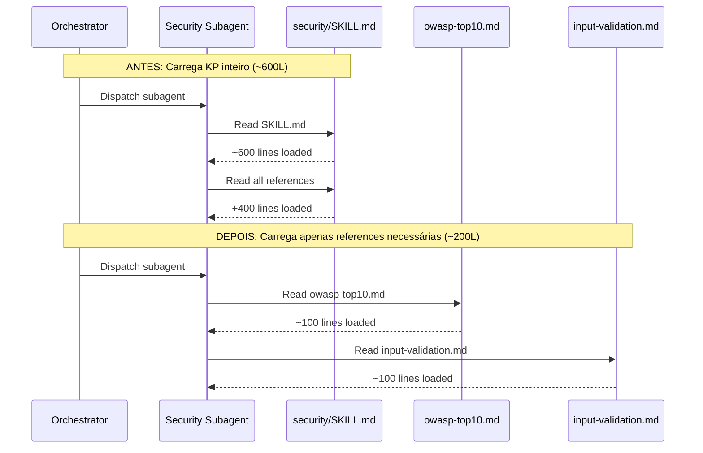

# História: Lazy Knowledge Pack Loading

**ID:** story-0030-0003
**Chave Jira:** —
**Status:** Pendente

## 1. Dependências

| Blocked By | Blocks |
| :--- | :--- |
| — | — |

## 2. Regras Transversais Aplicáveis

| ID | Título |
| :--- | :--- |
| RULE-005 | Isolamento de Subagents |

## 3. Descrição

Como **Engenheiro de Plataforma**, eu quero que subagents das phases de planejamento carreguem apenas as seções relevantes dos knowledge packs, garantindo que cada subagent consome no máximo ~3K tokens de KP em vez de ~24K tokens do KP inteiro.

Subagents da Phase 1B-1F recebem instruções como "Read skills/architecture/SKILL.md -> then read its references". Isso carrega o KP inteiro (~400-600 linhas) no contexto do subagent, mesmo que apenas uma seção específica seja relevante para o artefato sendo produzido.

### 3.1 Mapeamento KP-Subagent

| Subagent (Phase) | KP Atual (inteiro) | References Específicas Necessárias |
| :--- | :--- | :--- |
| Architect (1B) | architecture/SKILL.md + refs | `architecture/references/architecture-principles.md` + `layer-templates/SKILL.md` |
| Test Plan (1B) | testing/SKILL.md + refs | `testing/references/tdd-methodology.md` + `testing/references/test-patterns.md` |
| Security (1E) | security/SKILL.md + refs | `security/references/owasp-top10.md` + `security/references/input-validation.md` |
| Compliance (1F) | compliance/SKILL.md + refs | Seção relevante ao tipo de compliance ativo |

### 3.2 Padrão de Prompt Atualizado

```
Antes: "Read skills/security/SKILL.md -> then read its references"
Depois: "Read skills/security/references/owasp-top10.md and
         skills/security/references/input-validation.md"
```

## 3.5 Entrega de Valor

- **Valor Principal:** Redução de ~24K tokens por subagent da Phase 1, liberando espaço para raciocínio de qualidade nos artefatos de planejamento
- **Métrica de Sucesso:** Cada subagent lê no máximo 3 reference files específicas em vez do KP inteiro
- **Impacto no Negócio:** Artefatos de planejamento (architecture plans, test plans, security assessments) mantêm qualidade com ~75% menos contexto consumido por KPs

## 4. Definições de Qualidade Locais

### DoR Local (Definition of Ready)

- [ ] Mapeamento completo de quais references cada subagent precisa
- [ ] Knowledge packs já possuem references/ separados (verificar)

### DoD Local (Definition of Done)

- [ ] Prompts de subagent em x-dev-lifecycle referenciam arquivos específicos
- [ ] Nenhum subagent recebe instrução "read SKILL.md -> then read its references"
- [ ] Cada subagent lê no máximo 3 reference files do KP
- [ ] Qualidade dos artefatos produzidos preservada
- [ ] Pelo menos 1 teste automatizado validando os prompts gerados
- [ ] Golden files atualizados

### Global Definition of Done (DoD)

- **Cobertura:** ≥ 95% Line, ≥ 90% Branch
- **Testes Automatizados:** Integration tests passando
- **Relatório de Cobertura:** JaCoCo HTML + XML
- **Documentação:** Prompts de subagent atualizados
- **Persistência:** N/A
- **Performance:** N/A

## 5. Contratos de Dados (Data Contract)

### 5.1 Mapeamento Subagent → References

| Campo | Tipo | M/O | Validações | Exemplo |
| :--- | :--- | :--- | :--- | :--- |
| `subagentType` | `String` | `M` | `enum: [architect, test-planner, security, compliance]` | `security` |
| `references` | `List<String>` | `M` | `max: 3 items` | `["owasp-top10.md", "input-validation.md"]` |

## 6. Diagramas

### 6.1 Comparação: Antes vs Depois



## 7. Critérios de Aceite (Gherkin)

```gherkin
Cenario: Prompt vazio não referencia KP
  DADO que um subagent NÃO precisa de knowledge pack
  QUANDO o prompt é gerado
  ENTÃO NENHUMA instrução de leitura de KP está presente

Cenario: Security subagent lê apenas references relevantes
  DADO que um subagent de Security Assessment na Phase 1E
  QUANDO o prompt do subagent é gerado
  ENTÃO o prompt referencia "security/references/owasp-top10.md"
  E o prompt referencia "security/references/input-validation.md"
  E o prompt NÃO referencia "security/SKILL.md"

Cenario: Architect subagent lê apenas architecture principles
  DADO que um subagent de Architecture Planning na Phase 1B
  QUANDO o prompt do subagent é gerado
  ENTÃO o prompt referencia "architecture/references/architecture-principles.md"
  E o prompt referencia "layer-templates/SKILL.md"
  E o prompt NÃO referencia "architecture/SKILL.md" inteiro

Cenario: Máximo de 3 references por subagent
  DADO que qualquer subagent de Phase 1B-1F
  QUANDO o prompt é gerado
  ENTÃO no máximo 3 instruções "Read" de reference files estão presentes

Cenario: Qualidade do artefato preservada
  DADO que o Security subagent lê apenas 2 references
  QUANDO o security assessment é gerado
  ENTÃO o assessment contém seções de OWASP Top 10 mapping
  E o assessment contém seções de input validation review
```

## 8. Tasks

### TASK-0030-0003-001: Map KP references per subagent type

- **Layer:** Doc
- **Test Type:** Verification
- **Size:** S
- **Dependencies:** —
- **Branch:** `feat/task-0030-0003-001-kp-mapping`
- **Testability:** Config + VerificationTest
- **Files:**
  - `java/src/main/resources/targets/claude/skills/core/x-dev-lifecycle/SKILL.md`
- **Acceptance Criteria:**
  - [ ] Mapeamento documentado: qual subagent lê quais references
  - [ ] Verificação de que todas as references existem nos KPs

### TASK-0030-0003-002: Update subagent prompts in x-dev-lifecycle

- **Layer:** Config
- **Test Type:** Integration
- **Size:** M
- **Dependencies:** TASK-0030-0003-001
- **Branch:** `feat/task-0030-0003-002-update-prompts`
- **Testability:** Config + VerificationTest
- **Files:**
  - `java/src/main/resources/targets/claude/skills/core/x-dev-lifecycle/SKILL.md`
- **Acceptance Criteria:**
  - [ ] Prompts de Phase 1B-1F referenciam files específicos
  - [ ] Nenhum prompt referencia KP SKILL.md inteiro
  - [ ] Max 3 references por subagent

### TASK-0030-0003-003: Regenerate golden files and validate

- **Layer:** Test
- **Test Type:** Smoke
- **Size:** M
- **Dependencies:** TASK-0030-0003-002
- **Branch:** `feat/task-0030-0003-003-golden-regen`
- **Testability:** Migration + Smoke
- **Files:**
  - `java/src/test/resources/golden/*/`
- **Acceptance Criteria:**
  - [ ] Golden files regenerados
  - [ ] `mvn verify -Pintegration-tests` passa
