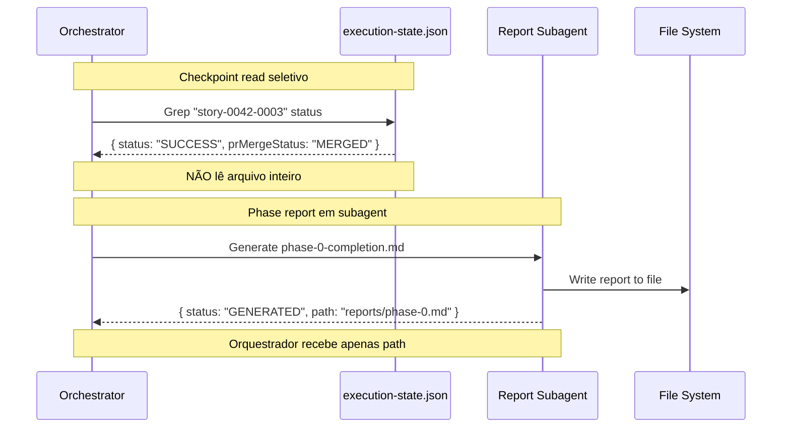

# História: Output Compaction

**ID:** story-0030-0004
**Chave Jira:** —
**Status:** Pendente

## 1. Dependências

| Blocked By | Blocks |
| :--- | :--- |
| — | — |

## 2. Regras Transversais Aplicáveis

| ID | Título |
| :--- | :--- |
| RULE-004 | Output por Referência |

## 3. Descrição

Como **Engenheiro de Plataforma**, eu quero que outputs intermediários durante execuções de epics sejam compactados e referenciados por path em vez de acumulados no contexto, garantindo que o contexto do orquestrador não cresça progressivamente com cada story executada.

Durante a execução de um epic, o orquestrador acumula: execution-state.json completo (lido após cada story), phase reports (gerados inline), review dashboards, e logs detalhados de TDD cycles. Esse acúmulo é cumulativo — cada iteração adiciona mais contexto.

### 3.1 Checkpoint Reads Seletivos

Em vez de ler `execution-state.json` inteiro após cada story, ler apenas campos necessários usando targeted reads (offset/limit) ou `grep` para campos específicos.

### 3.2 Phase Reports em Subagent

Gerar phase completion reports em subagent dedicado que salva em arquivo. O orquestrador recebe apenas `{ "status": "GENERATED", "path": "..." }`.

### 3.3 TDD Cycle Logs Compactos

x-tdd emite log compacto em modo orquestrado: `Cycle N/M: RED ✓ GREEN ✓ REFACTOR skipped → {sha}` em vez de bloco completo com detalhes.

### 3.4 Context Management Instruction

Adicionar instrução nos templates dos orquestradores:
```
CONTEXT MANAGEMENT: Do NOT read full files into context when partial data suffices.
Use targeted reads (offset/limit) or grep for specific fields.
```

## 3.5 Entrega de Valor

- **Valor Principal:** Prevenção de acúmulo progressivo de contexto durante execuções longas, permitindo que epics com 10+ stories executem sem estouro
- **Métrica de Sucesso:** Orquestrador não lê execution-state.json inteiro; TDD logs emitem 1 linha por ciclo
- **Impacto no Negócio:** Epics completos podem ser executados em sessão única, reduzindo necessidade de --resume e intervenção manual

## 4. Definições de Qualidade Locais

### DoR Local (Definition of Ready)

- [ ] Padrões de leitura de checkpoint identificados
- [ ] Formato de log compacto de TDD definido

### DoD Local (Definition of Done)

- [ ] Instrução de CONTEXT MANAGEMENT nos templates de orquestradores
- [ ] Instrução de checkpoint read seletivo nos templates
- [ ] Instrução de TDD log compacto no template de x-tdd
- [ ] Phase report delegado a subagent no template de x-dev-epic-implement
- [ ] Pelo menos 1 teste automatizado validando presença das instruções
- [ ] Golden files atualizados

### Global Definition of Done (DoD)

- **Cobertura:** ≥ 95% Line, ≥ 90% Branch
- **Testes Automatizados:** Integration tests passando
- **Relatório de Cobertura:** JaCoCo HTML + XML
- **Documentação:** Templates atualizados
- **Persistência:** N/A
- **Performance:** N/A

## 5. Contratos de Dados (Data Contract)

### 5.1 TDD Cycle Log (Compact Format)

| Campo | Tipo | M/O | Validações | Exemplo |
| :--- | :--- | :--- | :--- | :--- |
| `cycleNumber` | `Integer` | `M` | `>= 1` | `3` |
| `totalCycles` | `Integer` | `M` | `>= cycleNumber` | `5` |
| `redStatus` | `String` | `M` | `enum: [✓, ✗]` | `✓` |
| `greenStatus` | `String` | `M` | `enum: [✓, ✗]` | `✓` |
| `refactorStatus` | `String` | `M` | `enum: [✓, skipped]` | `skipped` |
| `commitSha` | `String(7)` | `M` | `hex, 7 chars` | `abc1234` |

Formato: `Cycle {cycleNumber}/{totalCycles}: RED {redStatus} GREEN {greenStatus} REFACTOR {refactorStatus} → {commitSha}`

## 6. Diagramas

### 6.1 Fluxo de Output Compactado



## 7. Critérios de Aceite (Gherkin)

```gherkin
Cenario: Checkpoint vazio não causa erro
  DADO que execution-state.json está vazio
  QUANDO o orquestrador tenta ler o checkpoint
  ENTÃO um estado inicial é retornado
  E NENHUM erro é emitido

Cenario: Checkpoint read seletivo
  DADO um execution-state.json com 20 stories
  QUANDO o orquestrador verifica dependências de story-0042-0015
  ENTÃO apenas os campos status e prMergeStatus das dependências são lidos
  E o arquivo inteiro NÃO é carregado no contexto

Cenario: TDD logs compactos em modo orquestrado
  DADO x-tdd executando dentro de x-dev-lifecycle
  QUANDO o Cycle 3 de 5 completa com RED/GREEN/REFACTOR
  ENTÃO o log emitido é "Cycle 3/5: RED ✓ GREEN ✓ REFACTOR ✓ → abc1234"
  E detalhes de test name e implementation NÃO são emitidos

Cenario: Phase report gerado em subagent
  DADO Phase 0 de um epic completa com 3 stories SUCCESS
  QUANDO o phase completion report é gerado
  ENTÃO a geração ocorre em um subagent dedicado
  E o orquestrador recebe apenas path do arquivo gerado

Cenario: Context management instruction presente
  DADO o template de x-dev-epic-implement
  QUANDO o skill é gerado pelo assembler
  ENTÃO o SKILL.md contém instrução "CONTEXT MANAGEMENT"
  E a instrução menciona "targeted reads" e "grep"
```

## 8. Tasks

### TASK-0030-0004-001: Add context management instructions to orchestrators

- **Layer:** Config
- **Test Type:** Integration
- **Size:** M
- **Dependencies:** —
- **Branch:** `feat/task-0030-0004-001-context-mgmt`
- **Testability:** Config + VerificationTest
- **Files:**
  - `java/src/main/resources/targets/claude/skills/core/x-dev-epic-implement/SKILL.md`
  - `java/src/main/resources/targets/claude/skills/core/x-dev-lifecycle/SKILL.md`
- **Acceptance Criteria:**
  - [ ] Instrução CONTEXT MANAGEMENT presente em ambos os skills
  - [ ] Checkpoint reads instruídos como seletivos
  - [ ] Phase report delegado a subagent

### TASK-0030-0004-002: Add compact TDD log mode to x-tdd

- **Layer:** Config
- **Test Type:** Integration
- **Size:** S
- **Dependencies:** —
- **Branch:** `feat/task-0030-0004-002-tdd-compact`
- **Testability:** Config + VerificationTest
- **Files:**
  - `java/src/main/resources/targets/claude/skills/core/x-tdd/SKILL.md`
- **Acceptance Criteria:**
  - [ ] x-tdd contém instrução de log compacto quando invocado de dentro de outro skill
  - [ ] Formato: `Cycle N/M: RED ✓ GREEN ✓ REFACTOR {status} → {sha}`

### TASK-0030-0004-003: Regenerate golden files and validate

- **Layer:** Test
- **Test Type:** Smoke
- **Size:** M
- **Dependencies:** TASK-0030-0004-001, TASK-0030-0004-002
- **Branch:** `feat/task-0030-0004-003-golden-regen`
- **Testability:** Migration + Smoke
- **Files:**
  - `java/src/test/resources/golden/*/`
- **Acceptance Criteria:**
  - [ ] Golden files regenerados
  - [ ] `mvn verify -Pintegration-tests` passa
