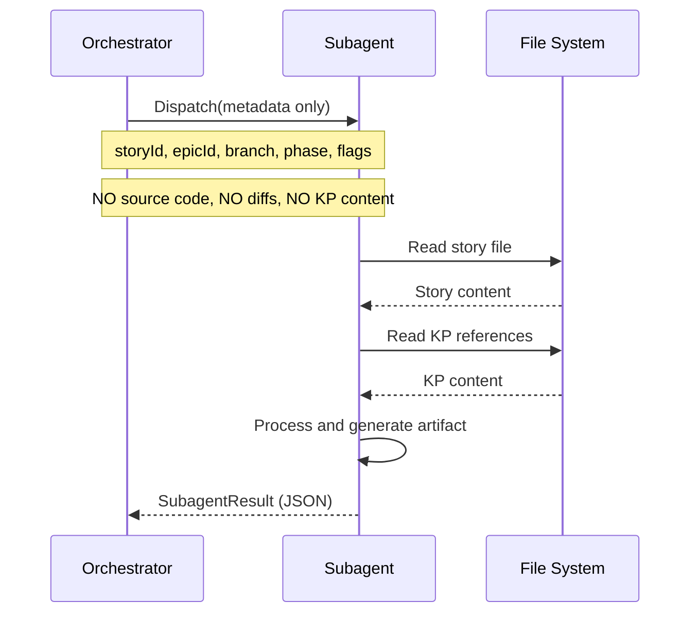

# História: Subagent Context Isolation Enforcement

**ID:** story-0030-0005
**Chave Jira:** —
**Status:** Pendente

## 1. Dependências

| Blocked By | Blocks |
| :--- | :--- |
| — | — |

## 2. Regras Transversais Aplicáveis

| ID | Título |
| :--- | :--- |
| RULE-005 | Isolamento de Subagents |

## 3. Descrição

Como **Engenheiro de Plataforma**, eu quero que todos os prompts de subagent passem apenas metadata e nunca embutam conteúdo de arquivos inline, garantindo que o contexto do orquestrador não vaze para subagents e vice-versa.

RULE-001 do x-dev-epic-implement define: "The orchestrator passes ONLY metadata to the subagent. Never pass source code, knowledge packs, or diffs." Porém não há auditoria sistemática para verificar que todos os prompts de subagent em todos os skills seguem essa regra. Esta story audita todos os prompts e adiciona instrução explícita de context isolation.

### 3.1 Skills a Auditar

- `x-dev-epic-implement`: Section 1.4, 1.4a, 1.4c (dispatch prompts)
- `x-dev-lifecycle`: Phase 1B, 1D, 1E, 1F (planning subagents)
- `x-review`: specialist subagent prompts
- `x-epic-plan`: planning subagents

### 3.2 Checklist de Auditoria por Prompt

- Passa apenas metadata (IDs, paths, flags)? ✓
- Instrui o subagent a ler arquivos por conta própria? ✓
- NÃO embute conteúdo de arquivos no prompt? ✓
- NÃO copia KP content inline? ✓

### 3.3 Instrução de Context Isolation

Adicionar a cada prompt de subagent:
```
CONTEXT ISOLATION: You receive only metadata. Read all files yourself.
Do NOT expect source code, diffs, or knowledge pack content in this prompt.
```

## 3.5 Entrega de Valor

- **Valor Principal:** Eliminação de context leaks entre orquestrador e subagents, garantindo que cada componente consome apenas o contexto necessário
- **Métrica de Sucesso:** 100% dos prompts de subagent passam apenas metadata; cada prompt tem instrução explícita de context isolation
- **Impacto no Negócio:** Subagents iniciam com contexto limpo, produzindo artefatos de melhor qualidade por terem mais espaço para raciocínio

## 4. Definições de Qualidade Locais

### DoR Local (Definition of Ready)

- [ ] Lista de todos os prompts de subagent em todos os skills identificada

### DoD Local (Definition of Done)

- [ ] Todos os prompts de subagent passam apenas metadata
- [ ] Nenhum prompt embute conteúdo de arquivo inline
- [ ] Cada prompt tem instrução explícita de context isolation
- [ ] Pelo menos 1 teste automatizado validando presença da instrução
- [ ] Golden files atualizados

### Global Definition of Done (DoD)

- **Cobertura:** ≥ 95% Line, ≥ 90% Branch
- **Testes Automatizados:** Integration tests passando
- **Relatório de Cobertura:** JaCoCo HTML + XML
- **Documentação:** Prompts auditados e atualizados
- **Persistência:** N/A
- **Performance:** N/A

## 5. Contratos de Dados (Data Contract)

### 5.1 Subagent Prompt Metadata Schema

| Campo | Tipo | M/O | Validações | Exemplo |
| :--- | :--- | :--- | :--- | :--- |
| `storyId` | `String` | `M` | `pattern: story-XXXX-YYYY` | `story-0042-0003` |
| `epicId` | `String` | `M` | `pattern: XXXX` | `0042` |
| `branchName` | `String` | `M` | `max: 100 chars` | `feat/story-0042-0003-desc` |
| `phase` | `Integer` | `M` | `>= 0` | `1` |
| `flags` | `Map<String,Boolean>` | `O` | — | `{ skipReview: false }` |

## 6. Diagramas

### 6.1 Isolamento de Contexto



## 7. Critérios de Aceite (Gherkin)

```gherkin
Cenario: Prompt sem metadata é rejeitado
  DADO que um prompt de subagent NÃO contém storyId
  QUANDO o subagent tenta executar
  ENTÃO um erro é emitido: "Missing required metadata: storyId"

Cenario: Prompt de dispatch contém apenas metadata
  DADO o template de prompt para dispatch de story
  QUANDO o prompt é gerado para story-0042-0003
  ENTÃO o prompt contém storyId, epicId, branchName, phase, flags
  E o prompt NÃO contém código-fonte
  E o prompt NÃO contém conteúdo de knowledge packs
  E o prompt contém "CONTEXT ISOLATION: You receive only metadata"

Cenario: Subagent lê arquivos por conta própria
  DADO um subagent de Architecture Planning
  QUANDO o subagent inicia execução
  ENTÃO o subagent usa Read tool para ler o story file
  E o subagent usa Read tool para ler architecture references
  E nenhum conteúdo foi passado no prompt original

Cenario: Planning subagent respeita isolation
  DADO um subagent de Security Assessment (Phase 1E)
  QUANDO o prompt é gerado
  ENTÃO o prompt contém path "plans/epic-XXXX/story-XXXX-YYYY.md"
  E o prompt NÃO contém conteúdo do story file
  E o prompt contém "CONTEXT ISOLATION"

Cenario: Review subagent respeita isolation
  DADO um subagent de specialist review
  QUANDO o prompt é gerado
  ENTÃO o prompt contém metadata do review scope
  E o prompt NÃO contém source code inline
```

## 8. Tasks

### TASK-0030-0005-001: Audit all subagent prompts in orchestrator skills

- **Layer:** Doc
- **Test Type:** Verification
- **Size:** M
- **Dependencies:** —
- **Branch:** `feat/task-0030-0005-001-audit-prompts`
- **Testability:** Config + VerificationTest
- **Files:**
  - `java/src/main/resources/targets/claude/skills/core/x-dev-epic-implement/SKILL.md`
  - `java/src/main/resources/targets/claude/skills/core/x-dev-lifecycle/SKILL.md`
  - `java/src/main/resources/targets/claude/skills/core/x-review/SKILL.md`
  - `java/src/main/resources/targets/claude/skills/core/x-epic-plan/SKILL.md`
- **Acceptance Criteria:**
  - [ ] Todos os prompts de subagent auditados contra checklist
  - [ ] Violações identificadas e documentadas

### TASK-0030-0005-002: Fix violations and add isolation instruction

- **Layer:** Config
- **Test Type:** Integration
- **Size:** M
- **Dependencies:** TASK-0030-0005-001
- **Branch:** `feat/task-0030-0005-002-fix-isolation`
- **Testability:** Config + VerificationTest
- **Files:**
  - (mesmos arquivos da TASK-001)
- **Acceptance Criteria:**
  - [ ] Todas as violações corrigidas
  - [ ] Cada prompt tem instrução "CONTEXT ISOLATION"
  - [ ] Nenhum conteúdo embutido inline

### TASK-0030-0005-003: Regenerate golden files and validate

- **Layer:** Test
- **Test Type:** Smoke
- **Size:** M
- **Dependencies:** TASK-0030-0005-002
- **Branch:** `feat/task-0030-0005-003-golden-regen`
- **Testability:** Migration + Smoke
- **Files:**
  - `java/src/test/resources/golden/*/`
- **Acceptance Criteria:**
  - [ ] Golden files regenerados
  - [ ] `mvn verify -Pintegration-tests` passa
