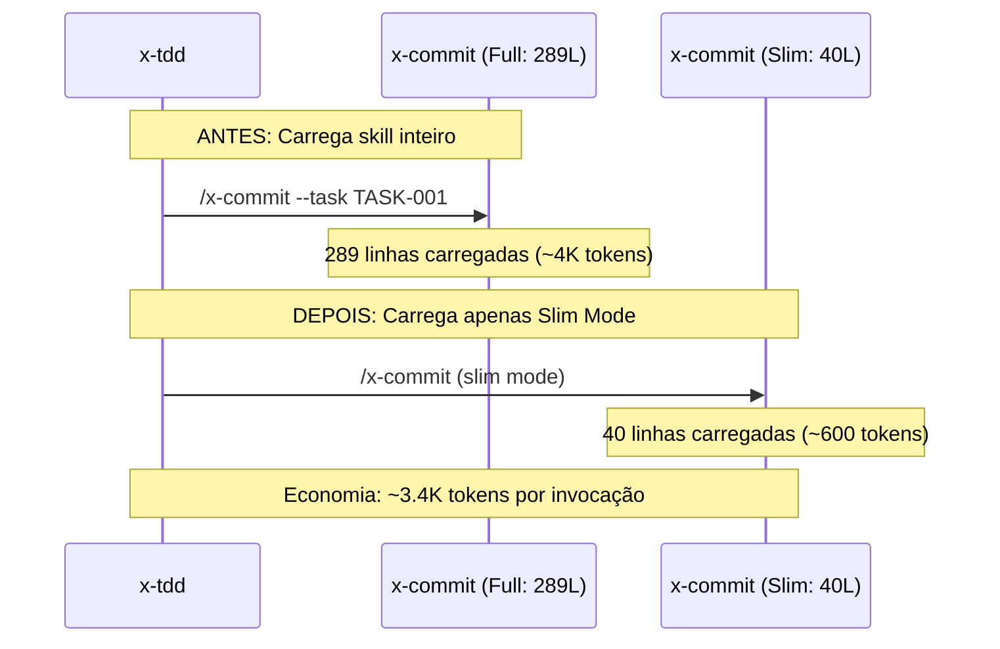

# História: Progressive Skill Loading (Slim Mode)

**ID:** story-0030-0006
**Chave Jira:** —
**Status:** Pendente

## 1. Dependências

| Blocked By | Blocks |
| :--- | :--- |
| story-0030-0002 | — |

## 2. Regras Transversais Aplicáveis

| ID | Título |
| :--- | :--- |
| RULE-003 | Documentação de Contexto Mínimo |

## 3. Descrição

Como **Engenheiro de Plataforma**, eu quero que skills invocados de dentro de outros skills tenham uma seção "Slim Mode" compacta, garantindo que o skill carregue apenas o essencial quando invocado em cadeia (x-tdd → x-commit → x-format → x-lint).

Quando x-tdd invoca x-commit via `Skill` tool, o x-commit inteiro (289 linhas) é carregado. Mas x-tdd só precisa da mecânica de commit, não da explicação de Conventional Commits ou da tabela de prefixos. A seção slim mode é um subset dentro do próprio SKILL.md (evita duplicação), com ≤ 50 linhas contendo apenas o essencial para invocação programática.

### 3.1 Skills com Slim Mode

| Skill | Linhas Atuais | Slim Mode (≤ 50L) | Conteúdo Slim |
| :--- | :--- | :--- | :--- |
| x-commit | 289 | ~40L | Formato do commit, pre-commit chain, error handling |
| x-format | 226 | ~30L | Comando de formatação, formatters por linguagem |
| x-lint | 245 | ~30L | Comando de lint, linters por linguagem |
| x-tdd | 396 | ~45L | Workflow RED/GREEN/REFACTOR, sem TPP reference completo |

### 3.2 Invocação de Slim Mode

Os orquestradores referenciam slim mode ao invocar:
```
Invoke /x-commit: read only the "## Slim Mode" section for minimum context.
```

### 3.3 Execução Direta pelo Usuário

Quando o usuário invoca `/x-commit` diretamente, o SKILL.md completo é carregado. A seção slim mode existe mas é ignorada — não altera o comportamento da execução direta.

## 3.5 Entrega de Valor

- **Valor Principal:** Redução adicional de ~760 linhas carregadas por cadeia x-tdd→x-commit→x-format→x-lint, liberando ~11K tokens para raciocínio
- **Métrica de Sucesso:** Cada seção slim ≤ 50 linhas; orquestradores referenciam slim mode ao invocar
- **Impacto no Negócio:** A cadeia de TDD completa (ciclo RED→GREEN→REFACTOR com commit, format e lint) consome significativamente menos contexto, permitindo mais ciclos por sessão

## 4. Definições de Qualidade Locais

### DoR Local (Definition of Ready)

- [ ] story-0030-0002 concluída (skill compression estabelece pattern de references)
- [ ] Conteúdo essencial por skill identificado

### DoD Local (Definition of Done)

- [ ] x-commit, x-format, x-lint, x-tdd têm seção "## Slim Mode"
- [ ] Cada seção slim ≤ 50 linhas
- [ ] Orquestradores referenciam slim mode ao invocar esses skills
- [ ] Execução direta pelo usuário ignora slim mode
- [ ] Pelo menos 1 teste automatizado validando presença da seção slim
- [ ] Golden files atualizados

### Global Definition of Done (DoD)

- **Cobertura:** ≥ 95% Line, ≥ 90% Branch
- **Testes Automatizados:** Integration tests passando
- **Relatório de Cobertura:** JaCoCo HTML + XML
- **Documentação:** SKILL.md com seção Slim Mode
- **Persistência:** N/A
- **Performance:** Redução mensurável na cadeia de invocação

## 5. Contratos de Dados (Data Contract)

### 5.1 Slim Mode Section Structure

| Campo | Tipo | M/O | Validações | Exemplo |
| :--- | :--- | :--- | :--- | :--- |
| `slim-mode` | `Boolean` | `O` | `true/false` | `true` |
| `slim-sections` | `List<String>` | `O` | `max: 3 items` | `["Workflow", "Commands"]` |

### 5.2 Frontmatter Extensions

```yaml
slim-mode: true
slim-sections: ["Workflow", "Commands", "Error Handling"]
```

## 6. Diagramas

### 6.1 Comparação: Full vs Slim Loading



## 7. Critérios de Aceite (Gherkin)

```gherkin
Cenario: Skill sem slim mode carrega normalmente
  DADO que um skill NÃO tem seção "## Slim Mode"
  QUANDO o skill é invocado de dentro de outro skill
  ENTÃO o SKILL.md completo é carregado
  E NENHUM erro é emitido

Cenario: Skill invocado em slim mode dentro de outro skill
  DADO que x-tdd está executando um ciclo GREEN
  E x-tdd precisa invocar x-commit
  QUANDO x-tdd invoca /x-commit com referência a slim mode
  ENTÃO x-commit carrega apenas a seção "## Slim Mode" (~40 linhas)
  E o commit é criado corretamente

Cenario: Skill invocado diretamente pelo usuário carrega completo
  DADO que um usuário digita /x-commit --task TASK-0042-0001-001
  QUANDO o skill é carregado
  ENTÃO o SKILL.md completo é carregado (289 linhas)
  E a seção "Slim Mode" NÃO é tratada de forma especial

Cenario: Slim mode section é gerada pelo assembler
  DADO que o template de x-commit contém seção "## Slim Mode"
  QUANDO o assembler gera para profile java-quarkus
  ENTÃO o SKILL.md gerado contém seção "## Slim Mode"
  E a seção tem ≤ 50 linhas

Cenario: Slim mode preserva funcionalidade essencial
  DADO que x-commit é invocado em slim mode
  QUANDO um commit Conventional Commits é criado
  ENTÃO o formato do commit está correto (type(scope): description)
  E a pre-commit chain executa (format → lint → compile)
  E erros de compilação são detectados
```

## 8. Tasks

### TASK-0030-0006-001: Add slim mode section to x-commit and x-format

- **Layer:** Config
- **Test Type:** Integration
- **Size:** M
- **Dependencies:** —
- **Branch:** `feat/task-0030-0006-001-slim-commit-format`
- **Testability:** Config + VerificationTest
- **Files:**
  - `java/src/main/resources/targets/claude/skills/core/x-commit/SKILL.md`
  - `java/src/main/resources/targets/claude/skills/core/x-format/SKILL.md`
- **Acceptance Criteria:**
  - [ ] x-commit tem seção "## Slim Mode" ≤ 50 linhas
  - [ ] x-format tem seção "## Slim Mode" ≤ 50 linhas
  - [ ] Seções contêm apenas o essencial para invocação programática

### TASK-0030-0006-002: Add slim mode section to x-lint and x-tdd

- **Layer:** Config
- **Test Type:** Integration
- **Size:** M
- **Dependencies:** —
- **Branch:** `feat/task-0030-0006-002-slim-lint-tdd`
- **Testability:** Config + VerificationTest
- **Files:**
  - `java/src/main/resources/targets/claude/skills/core/x-lint/SKILL.md`
  - `java/src/main/resources/targets/claude/skills/core/x-tdd/SKILL.md`
- **Acceptance Criteria:**
  - [ ] x-lint tem seção "## Slim Mode" ≤ 50 linhas
  - [ ] x-tdd tem seção "## Slim Mode" ≤ 50 linhas

### TASK-0030-0006-003: Update orchestrators to reference slim mode

- **Layer:** Config
- **Test Type:** Integration
- **Size:** M
- **Dependencies:** TASK-0030-0006-001, TASK-0030-0006-002
- **Branch:** `feat/task-0030-0006-003-orchestrator-slim`
- **Testability:** Config + VerificationTest
- **Files:**
  - `java/src/main/resources/targets/claude/skills/core/x-dev-lifecycle/SKILL.md`
  - `java/src/main/resources/targets/claude/skills/core/x-tdd/SKILL.md`
- **Acceptance Criteria:**
  - [ ] x-dev-lifecycle referencia slim mode ao invocar x-commit/x-format/x-lint
  - [ ] x-tdd referencia slim mode ao invocar x-commit

### TASK-0030-0006-004: Regenerate golden files and validate

- **Layer:** Test
- **Test Type:** Smoke
- **Size:** M
- **Dependencies:** TASK-0030-0006-003
- **Branch:** `feat/task-0030-0006-004-golden-regen`
- **Testability:** Migration + Smoke
- **Files:**
  - `java/src/test/resources/golden/*/`
- **Acceptance Criteria:**
  - [ ] Golden files regenerados
  - [ ] `mvn verify -Pintegration-tests` passa
  - [ ] Seções Slim Mode presentes nos golden files
