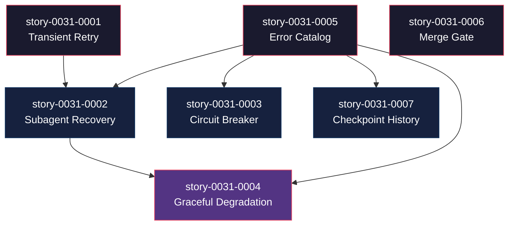

# Mapa de Implementação — Error Resilience & Recovery

**Gerado a partir das dependências BlockedBy/Blocks de cada história do epic-0031.**

---

## 1. Matriz de Dependências

| Story | Título | Chave Jira | Blocked By | Blocks | Status |
| :--- | :--- | :--- | :--- | :--- | :--- |
| story-0031-0001 | Transient Error Retry with Backoff | — | — | story-0031-0002, story-0031-0004 | Pendente |
| story-0031-0002 | Subagent Failure Recovery | — | story-0031-0001, story-0031-0005 | story-0031-0004 | Pendente |
| story-0031-0003 | Circuit Breaker for Epic Execution | — | story-0031-0005 | — | Pendente |
| story-0031-0004 | Graceful Degradation on Context Pressure | — | story-0031-0002, story-0031-0005 | — | Pendente |
| story-0031-0005 | Error Catalog & Standardized Responses | — | — | story-0031-0002, story-0031-0003, story-0031-0004, story-0031-0007 | Pendente |
| story-0031-0006 | Merge Gate Between Phases | — | — | — | Pendente |
| story-0031-0007 | Checkpoint Error History | — | story-0031-0005 | — | Pendente |

> **Nota:** story-0031-0004 (Graceful Degradation) também depende de EPIC-0030/story-0030-0001 (Context Budget Tracking) como dependência cross-epic. Essa dependência não está declarada no BlockedBy formal para evitar acoplamento rígido entre epics, mas DEVE ser implementada antes.

---

## 2. Fases de Implementação

```
╔══════════════════════════════════════════════════════════════════════════════╗
║              FASE 0 — Fundações (3 paralelas)                              ║
║                                                                            ║
║   ┌──────────────┐   ┌──────────────┐   ┌──────────────┐                   ║
║   │ story-0031-  │   │ story-0031-  │   │ story-0031-  │                   ║
║   │ 0001         │   │ 0005         │   │ 0006         │                   ║
║   │ Retry        │   │ Error Catalog│   │ Merge Gate   │                   ║
║   └──────┬───────┘   └──────┬───────┘   └──────────────┘                   ║
║          │                  │                                               ║
╚══════════╪══════════════════╪═══════════════════════════════════════════════╝
           │                  │
           │                  ▼
           │   ╔══════════════════════════════════════════════════════════╗
           │   ║    FASE 1 — Extensões (3 paralelas)                     ║
           │   ║                                                         ║
           └──►║   ┌──────────────┐  ┌──────────────┐  ┌──────────────┐  ║
               ║   │ story-0031-  │  │ story-0031-  │  │ story-0031-  │  ║
               ║   │ 0002         │  │ 0003         │  │ 0007         │  ║
               ║   │ Subagent Rec │  │ Circuit Break│  │ Checkpoint   │  ║
               ║   │ (← 0001+005)│  │ (← 0005)     │  │ (← 0005)    │  ║
               ║   └──────┬───────┘  └──────────────┘  └──────────────┘  ║
               ╚══════════╪══════════════════════════════════════════════╝
                          │
                          ▼
               ╔══════════════════════════════════════════════════════════╗
               ║    FASE 2 — Composição                                   ║
               ║                                                          ║
               ║   ┌──────────────────────────────────────┐               ║
               ║   │ story-0031-0004                      │               ║
               ║   │ Graceful Degradation                 │               ║
               ║   │ (← 0002 + 0005)                     │               ║
               ║   └──────────────────────────────────────┘               ║
               ╚══════════════════════════════════════════════════════════╝
```

---

## 3. Caminho Crítico

```
story-0031-0001 ─┐
                 ├──→ story-0031-0002 → story-0031-0004
story-0031-0005 ─┘
   Fase 0              Fase 1            Fase 2
```

**3 fases no caminho crítico, 4 histórias na cadeia mais longa (0001 + 0005 → 0002 → 0004).**

O caminho crítico passa por Retry → Subagent Recovery → Graceful Degradation, refletindo a progressão natural: primeiro tratar erros simples, depois recuperar subagents, depois degradar gracefully.

---

## 4. Grafo de Dependências (Mermaid)



---

## 5. Resumo por Fase

| Fase | Histórias | Camada | Paralelismo | Pré-requisito |
| :--- | :--- | :--- | :--- | :--- |
| 0 | story-0031-0001, 0005, 0006 | Skill Templates | 3 paralelas | — |
| 1 | story-0031-0002, 0003, 0007 | Skill Templates + Checkpoint | 3 paralelas | Fase 0 concluída |
| 2 | story-0031-0004 | Skill Templates + Checkpoint | 1 | Fase 1 concluída (especificamente 0002) |

**Total: 7 histórias em 3 fases.**

> **Nota:** story-0031-0006 (Merge Gate) é independente de todas as outras e poderia ser implementada em qualquer fase. Está na Fase 0 por não ter dependências.

---

## 6. Detalhamento por Fase

### Fase 0 — Fundações de Resiliência

| Story | Escopo Principal | Artefatos Chave |
| :--- | :--- | :--- |
| story-0031-0001 | Categorias de erro + retry com backoff | x-dev-epic-implement/SKILL.md, x-dev-lifecycle/SKILL.md |
| story-0031-0005 | Catálogo padronizado de 13+ códigos | references/error-catalog.md |
| story-0031-0006 | Local integrity gate com branch temporária | x-dev-epic-implement/SKILL.md (seção integrity gate) |

**Entregas da Fase 0:**

- Categorias de erro (TRANSIENT/CONTEXT/PERMANENT) com padrões de detecção
- Retry com exponential backoff (2s, 4s, 8s) para erros transientes
- Catálogo padronizado com 13+ códigos de erro e ações prescritas
- Integrity gate obrigatório entre fases (nunca DEFERRED por default)

### Fase 1 — Extensões de Resiliência

| Story | Escopo Principal | Artefatos Chave |
| :--- | :--- | :--- |
| story-0031-0002 | Recovery de subagent por tipo de erro | x-dev-epic-implement/SKILL.md (dispatch sections) |
| story-0031-0003 | Circuit breaker com thresholds 1/2/3/5 | x-dev-epic-implement/SKILL.md (core loop) |
| story-0031-0007 | Schema v3.0 com errorHistory | x-dev-epic-implement/SKILL.md (checkpoint schema) |

**Entregas da Fase 1:**

- Subagents re-despachados com contexto adaptado ao tipo de falha
- Circuit breaker pausa após 3 falhas consecutivas, aborta após 5 totais
- execution-state.json v3.0 com histórico de erros e estado de circuit breaker

### Fase 2 — Composição

| Story | Escopo Principal | Artefatos Chave |
| :--- | :--- | :--- |
| story-0031-0004 | 3 níveis de degradação progressiva | x-dev-epic-implement/SKILL.md, x-dev-lifecycle/SKILL.md |

**Entregas da Fase 2:**

- Degradação progressiva (Level 1: verbosidade → Level 2: delegação → Level 3: save & exit)
- Nenhuma execução falha abruptamente por pressão de contexto

---

## 7. Observações Estratégicas

### Gargalo Principal

**story-0031-0005 (Error Catalog)** é o gargalo porque bloqueia 4 outras stories (0002, 0003, 0004, 0007). É a fundação da classificação padronizada que todo o sistema de resiliência consome. Investir mais tempo nesta story compensa porque define os códigos e padrões que todas as outras stories referenciam.

### Histórias Folha (sem dependentes)

- **story-0031-0003** (Circuit Breaker) — sem dependentes, leaf da Fase 1
- **story-0031-0004** (Graceful Degradation) — leaf da Fase 2
- **story-0031-0006** (Merge Gate) — totalmente independente, leaf da Fase 0
- **story-0031-0007** (Checkpoint History) — sem dependentes, leaf da Fase 1

Todas as 4 podem absorver atrasos sem impacto no caminho crítico.

### Otimização de Tempo

- **Paralelismo na Fase 0**: 3 stories podem ser executadas simultaneamente
- **Paralelismo na Fase 1**: 3 stories podem ser executadas simultaneamente
- **story-0031-0006 pode começar imediatamente** e é completamente independente — ideal para um developer paralelo
- **Ponto de aceleração**: Completar story-0031-0005 (Error Catalog) primeiro desbloqueia a maioria das stories da Fase 1

### Dependências Cruzadas

**Cross-Epic**: story-0031-0004 (Graceful Degradation) depende soft de EPIC-0030/story-0030-0001 (Context Budget Tracking). A degradação Level 2 usa o budget tracking para decidir quando forçar delegação a subagents. Se EPIC-0030 não estiver completo, a degradação Level 2 opera em modo simplificado (sem budget, apenas contagem de fases).

**Ponto de convergência**: story-0031-0004 é o ponto onde Retry (0001) + Subagent Recovery (0002) + Error Catalog (0005) convergem em um sistema unificado de degradação.

### Marco de Validação Arquitetural

**story-0031-0001 (Transient Retry) + story-0031-0005 (Error Catalog)** juntas servem como checkpoint. Elas validam:
- O padrão de classificação de erros funciona contra mensagens reais
- O mecanismo de retry não introduz loops infinitos ou timeouts excessivos
- O catálogo cobre os erros mais comuns observados em execuções anteriores

Se essas duas stories passarem, o framework de resiliência está validado e pode ser estendido com circuit breaker, recovery e degradation.

---

## 8. Dependências entre Tasks (Cross-Story)

> Tasks neste epic são independentes entre stories. Não há dependências cross-story entre tasks.

### 8.1 Dependências Cross-Story entre Tasks

| Task | Depends On | Story Source | Story Target | Tipo |
| :--- | :--- | :--- | :--- | :--- |
| — | — | — | — | — |

> **Validação RULE-012:** Sem dependências cross-story entre tasks. As dependências são no nível de story (0001→0002, 0005→0002, etc.), não entre tasks individuais.

### 8.2 Ordem de Merge (Topological Sort)

| Ordem | Task ID | Story | Parallelizável Com | Fase |
| :--- | :--- | :--- | :--- | :--- |
| 1 | TASK-0031-0001-* | story-0031-0001 | TASK-0031-0005-*, 0006-* | 0 |
| 1 | TASK-0031-0005-* | story-0031-0005 | TASK-0031-0001-*, 0006-* | 0 |
| 1 | TASK-0031-0006-* | story-0031-0006 | TASK-0031-0001-*, 0005-* | 0 |
| 2 | TASK-0031-0002-* | story-0031-0002 | TASK-0031-0003-*, 0007-* | 1 |
| 2 | TASK-0031-0003-* | story-0031-0003 | TASK-0031-0002-*, 0007-* | 1 |
| 2 | TASK-0031-0007-* | story-0031-0007 | TASK-0031-0002-*, 0003-* | 1 |
| 3 | TASK-0031-0004-* | story-0031-0004 | — | 2 |

**Total: ~21 tasks em 3 fases de execução.**
