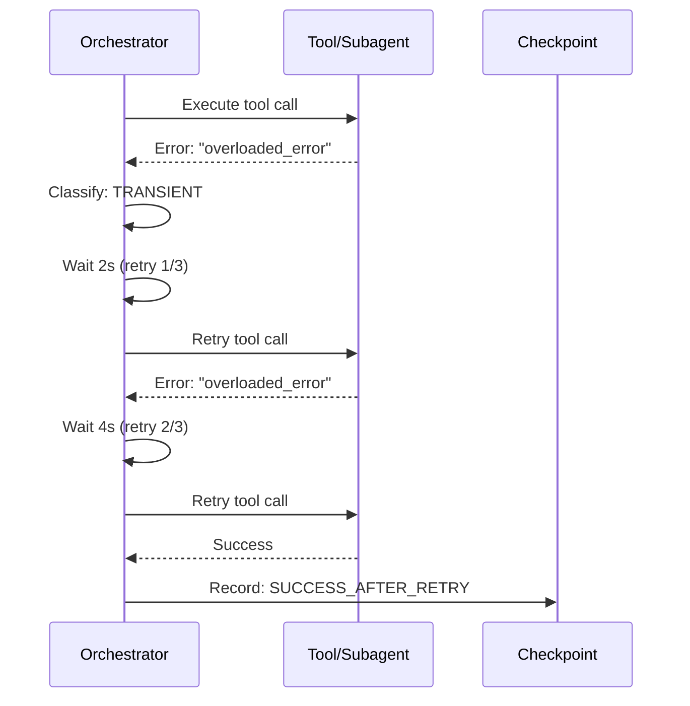

# História: Transient Error Retry with Backoff

**ID:** story-0031-0001
**Chave Jira:** —
**Status:** Pendente

## 1. Dependências

| Blocked By | Blocks |
| :--- | :--- |
| — | story-0031-0002, story-0031-0004 |

## 2. Regras Transversais Aplicáveis

| ID | Título |
| :--- | :--- |
| RULE-001 | Retry para Transientes |
| RULE-002 | Fail-Fast para Permanentes |

## 3. Descrição

Como **Engenheiro de Plataforma**, eu quero que erros transientes (Claude overloaded, GitHub rate limit, tool timeout) sejam retried automaticamente com exponential backoff, garantindo que falhas recuperáveis não resultem em stories marcadas como FAILED.

Atualmente, quando um tool call ou subagent falha com erro transiente, o skill propaga o erro como falha permanente. O resultado é marcado como FAILED no checkpoint sem tentativa de recuperação. Erros transientes representam ~40% das falhas em execuções longas e são inteiramente recuperáveis com retry.

### 3.1 Categorias de Erro

| Categoria | Padrões de Detecção | Ação |
| :--- | :--- | :--- |
| TRANSIENT | "overloaded", "rate limit", "429", "503", "504", "timeout", "ETIMEDOUT" | Retry com backoff |
| CONTEXT | "context", "token limit", "too long", "exceeded" | Graceful degradation (STORY-0004) |
| PERMANENT | Todos os demais | Fail imediato |

### 3.2 Backoff Exponencial

- Retry 1: espera 2 segundos
- Retry 2: espera 4 segundos
- Retry 3: espera 8 segundos
- Após 3 falhas: marca como FAILED com errorCode

### 3.3 Subagent Dispatch Retry

- Subagent retorna erro ou resultado vazio: verificar se padrão é transiente
- Se transiente: re-despachar (max 2 retries para subagents)
- Se permanente: marcar story/task como FAILED

## 3.5 Entrega de Valor

- **Valor Principal:** Recuperação automática de ~80% dos erros transientes, eliminando falhas evitáveis que exigiam --resume manual
- **Métrica de Sucesso:** ≥ 80% dos erros transientes são recuperados automaticamente; zero retries em erros permanentes
- **Impacto no Negócio:** Taxa de sucesso de execuções de stories sobe de ~60% para ~85%, reduzindo intervenção manual e tempo de ciclo

## 4. Definições de Qualidade Locais

### DoR Local (Definition of Ready)

- [ ] Padrões de erro transiente catalogados
- [ ] Templates de x-dev-epic-implement e x-dev-lifecycle acessíveis

### DoD Local (Definition of Done)

- [ ] Categorias de erro definidas com padrões de detecção nos templates
- [ ] Instrução de retry com backoff exponencial em x-dev-epic-implement
- [ ] Instrução de retry com backoff exponencial em x-dev-lifecycle
- [ ] Erros permanentes NÃO são retried
- [ ] Pelo menos 1 teste automatizado validando presença das instruções
- [ ] Golden files atualizados

### Global Definition of Done (DoD)

- **Cobertura:** ≥ 95% Line, ≥ 90% Branch
- **Testes Automatizados:** Integration tests passando
- **Relatório de Cobertura:** JaCoCo HTML + XML
- **Documentação:** Templates atualizados com error handling
- **Persistência:** N/A
- **Performance:** Retry não adiciona > 30s por story

## 5. Contratos de Dados (Data Contract)

### 5.1 Error Classification

| Campo | Tipo | M/O | Validações | Exemplo |
| :--- | :--- | :--- | :--- | :--- |
| `errorCategory` | `String` | `M` | `enum: [TRANSIENT, CONTEXT, PERMANENT]` | `TRANSIENT` |
| `errorPattern` | `String` | `M` | `regex pattern` | `overloaded` |
| `retryable` | `Boolean` | `M` | — | `true` |
| `maxRetries` | `Integer` | `M` | `1-3` | `3` |
| `backoffBase` | `Integer` | `M` | `seconds` | `2` |

### 5.2 Retry Log Format

| Campo | Tipo | Sempre presente | Descrição |
| :--- | :--- | :--- | :--- |
| `message` | `String` | Sim | `"Transient error detected: {error}. Retry {n}/{max} in {delay}s..."` |
| `retryCount` | `Integer` | Sim | Tentativa atual |
| `delay` | `Integer` | Sim | Delay em segundos antes do retry |

## 6. Diagramas

### 6.1 Fluxo de Retry



## 7. Critérios de Aceite (Gherkin)

```gherkin
Cenario: Erro sem padrão é classificado como permanente
  DADO que um tool call retorna "unknown cosmic ray error"
  QUANDO o orquestrador classifica o erro
  ENTÃO o erro é classificado como PERMANENT
  E NENHUM retry é tentado
  E o task é marcado como FAILED imediatamente

Cenario: Tool call com erro transiente é retried
  DADO que um tool call retorna "overloaded_error"
  QUANDO o orquestrador detecta o erro
  ENTÃO o erro é classificado como TRANSIENT
  E o tool call é retried após 2 segundos
  E log contém "Transient error detected. Retry 1/3 in 2s"

Cenario: Retry com backoff exponencial
  DADO que um tool call falha 3 vezes com "rate limit exceeded"
  QUANDO o orquestrador executa retries
  ENTÃO o primeiro retry ocorre após 2 segundos
  E o segundo retry ocorre após 4 segundos
  E o terceiro retry ocorre após 8 segundos
  E após 3 falhas, o erro é marcado como FAILED

Cenario: Erro permanente não é retried
  DADO que um tool call retorna "file not found: story-0042-0099.md"
  QUANDO o orquestrador detecta o erro
  ENTÃO o erro é classificado como PERMANENT
  E o task é marcado como FAILED imediatamente
  E NENHUM retry é tentado

Cenario: Retry bem-sucedido na segunda tentativa
  DADO que um tool call falha com "503 Service Unavailable"
  E o retry seguinte retorna sucesso
  QUANDO o orquestrador processa o resultado
  ENTÃO o task continua normalmente
  E log contém "Retry 1/3 succeeded"
```

## 8. Tasks

### TASK-0031-0001-001: Define error categories and patterns in orchestrator templates

- **Layer:** Config
- **Test Type:** Integration
- **Size:** M
- **Dependencies:** —
- **Branch:** `feat/task-0031-0001-001-error-categories`
- **Testability:** Config + VerificationTest
- **Files:**
  - `java/src/main/resources/targets/claude/skills/core/x-dev-epic-implement/SKILL.md`
  - `java/src/main/resources/targets/claude/skills/core/x-dev-lifecycle/SKILL.md`
- **Acceptance Criteria:**
  - [ ] Tabela de categorias de erro com padrões de detecção
  - [ ] Instrução de classificação de erros

### TASK-0031-0001-002: Add retry with backoff logic to orchestrator templates

- **Layer:** Config
- **Test Type:** Integration
- **Size:** M
- **Dependencies:** TASK-0031-0001-001
- **Branch:** `feat/task-0031-0001-002-retry-logic`
- **Testability:** Config + VerificationTest
- **Files:**
  - `java/src/main/resources/targets/claude/skills/core/x-dev-epic-implement/SKILL.md`
  - `java/src/main/resources/targets/claude/skills/core/x-dev-lifecycle/SKILL.md`
- **Acceptance Criteria:**
  - [ ] Instrução de retry com backoff (2s, 4s, 8s) para tool calls
  - [ ] Instrução de retry (max 2) para subagent dispatch
  - [ ] Erros permanentes instruídos a fail imediato

### TASK-0031-0001-003: Regenerate golden files and validate

- **Layer:** Test
- **Test Type:** Smoke
- **Size:** M
- **Dependencies:** TASK-0031-0001-002
- **Branch:** `feat/task-0031-0001-003-golden-regen`
- **Testability:** Migration + Smoke
- **Files:**
  - `java/src/test/resources/golden/*/`
- **Acceptance Criteria:**
  - [ ] Golden files regenerados
  - [ ] `mvn verify -Pintegration-tests` passa
