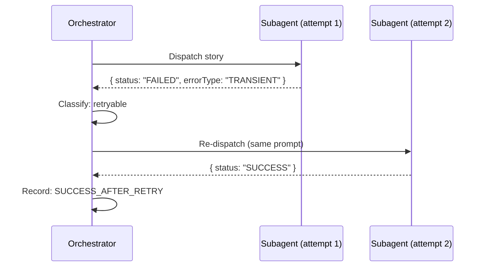

# História: Subagent Failure Recovery

**ID:** story-0031-0002
**Chave Jira:** —
**Status:** Pendente

## 1. Dependências

| Blocked By | Blocks |
| :--- | :--- |
| story-0031-0001, story-0031-0005 | story-0031-0004 |

## 2. Regras Transversais Aplicáveis

| ID | Título |
| :--- | :--- |
| RULE-001 | Retry para Transientes |
| RULE-005 | Registro de Erros |

## 3. Descrição

Como **Engenheiro de Plataforma**, eu quero que subagents que falham sejam re-despachados com estratégias adaptativas, garantindo que falhas de subagent não resultem automaticamente em stories FAILED quando a falha é recuperável.

Subagents podem falhar por: timeout, crash, resultado inválido, context overflow, ou erro transiente. O orquestrador atual valida o SubagentResult (Section 1.5) mas não tenta recuperação. Esta story implementa recovery baseado no tipo de erro: transient → retry, context → reduzir prompt, timeout → skip verification.

### 3.1 SubagentResult Expandido

Adicionar campos `errorType`, `errorMessage`, `errorCode` ao SubagentResult.

### 3.2 Recovery por Tipo de Erro

| errorType | Ação | Max Retries |
| :--- | :--- | :--- |
| TRANSIENT | Re-despachar com mesmo prompt | 2 |
| CONTEXT | Re-despachar com prompt reduzido + "CONTEXT PRESSURE: minimize output" | 1 |
| TIMEOUT | Re-despachar com --skip-verification | 1 |
| 3 falhas consecutivas do mesmo tipo | Escalar via AskUserQuestion | — |

## 3.5 Entrega de Valor

- **Valor Principal:** Subagents que falham são re-despachados com contexto otimizado, reduzindo falhas de story em ~60%
- **Métrica de Sucesso:** Transient failures retried (max 2); context failures re-dispatched com prompt reduzido; 3 falhas consecutivas escalam
- **Impacto no Negócio:** Stories que antes falhavam por problemas de subagent agora completam automaticamente, reduzindo necessidade de --resume

## 4. Definições de Qualidade Locais

### DoR Local (Definition of Ready)

- [ ] story-0031-0001 (Retry) e story-0031-0005 (Error Catalog) concluídas
- [ ] SubagentResult schema atual revisado

### DoD Local (Definition of Done)

- [ ] SubagentResult template inclui campos errorType, errorMessage, errorCode
- [ ] Recovery logic documentada no template de dispatch
- [ ] Transient retried (max 2), context reduzido, timeout com --skip-verification
- [ ] 3 falhas consecutivas escalam para usuário
- [ ] Pelo menos 1 teste automatizado
- [ ] Golden files atualizados

### Global Definition of Done (DoD)

- **Cobertura:** ≥ 95% Line, ≥ 90% Branch
- **Testes Automatizados:** Integration tests passando
- **Relatório de Cobertura:** JaCoCo HTML + XML
- **Documentação:** Templates atualizados
- **Persistência:** N/A
- **Performance:** N/A

## 5. Contratos de Dados (Data Contract)

### 5.1 SubagentResult (Expanded)

| Campo | Tipo | M/O | Validações | Exemplo |
| :--- | :--- | :--- | :--- | :--- |
| `status` | `String` | `M` | `enum: [SUCCESS, FAILED, PARTIAL]` | `FAILED` |
| `errorType` | `String` | `O` | `enum: [TRANSIENT, CONTEXT, PERMANENT, TIMEOUT, INVALID_RESULT]` | `TRANSIENT` |
| `errorMessage` | `String` | `O` | `max: 500 chars` | `"Claude API overloaded"` |
| `errorCode` | `String` | `O` | `pattern: ERR-[A-Z]+-[0-9]{3}` | `ERR-TRANSIENT-001` |

## 6. Diagramas

### 6.1 Recovery Flow



## 7. Critérios de Aceite (Gherkin)

```gherkin
Cenario: Subagent sem errorType trata como permanente
  DADO um subagent que retorna { status: "FAILED" } sem errorType
  QUANDO o orquestrador processa
  ENTÃO o erro é tratado como PERMANENT
  E NENHUM retry é tentado

Cenario: Subagent com erro transiente é re-despachado
  DADO um subagent que retorna { status: "FAILED", errorType: "TRANSIENT" }
  QUANDO o orquestrador processa o resultado
  ENTÃO o subagent é re-despachado com o mesmo prompt
  E log contém "Retrying subagent dispatch (1/2)"

Cenario: Subagent com context overflow recebe prompt reduzido
  DADO um subagent que retorna { status: "FAILED", errorType: "CONTEXT" }
  QUANDO o orquestrador re-despacha
  ENTÃO o novo prompt inclui "CONTEXT PRESSURE: minimize output"
  E instruções opcionais são removidas

Cenario: 3 falhas consecutivas escalam para usuário
  DADO 3 subagents consecutivos falharam com errorType "TRANSIENT"
  QUANDO o orquestrador detecta o padrão
  ENTÃO AskUserQuestion é apresentada com opções Retry/Skip/Abort

Cenario: Timeout re-despacha com skip verification
  DADO um subagent que retorna { status: "FAILED", errorType: "TIMEOUT" }
  QUANDO o orquestrador re-despacha
  ENTÃO o novo prompt inclui "--skip-verification"
```

## 8. Tasks

### TASK-0031-0002-001: Expand SubagentResult schema in templates

- **Layer:** Config
- **Test Type:** Integration
- **Size:** M
- **Dependencies:** —
- **Branch:** `feat/task-0031-0002-001-subagent-schema`
- **Testability:** Config + VerificationTest
- **Files:**
  - `java/src/main/resources/targets/claude/skills/core/x-dev-epic-implement/SKILL.md`
- **Acceptance Criteria:**
  - [ ] SubagentResult inclui errorType, errorMessage, errorCode

### TASK-0031-0002-002: Add recovery logic to dispatch sections

- **Layer:** Config
- **Test Type:** Integration
- **Size:** M
- **Dependencies:** TASK-0031-0002-001
- **Branch:** `feat/task-0031-0002-002-recovery-logic`
- **Testability:** Config + VerificationTest
- **Files:**
  - `java/src/main/resources/targets/claude/skills/core/x-dev-epic-implement/SKILL.md`
- **Acceptance Criteria:**
  - [ ] Recovery por tipo de erro documentado
  - [ ] Max retries por tipo definido
  - [ ] Escalation para 3 falhas consecutivas

### TASK-0031-0002-003: Regenerate golden files and validate

- **Layer:** Test
- **Test Type:** Smoke
- **Size:** M
- **Dependencies:** TASK-0031-0002-002
- **Branch:** `feat/task-0031-0002-003-golden-regen`
- **Testability:** Migration + Smoke
- **Files:**
  - `java/src/test/resources/golden/*/`
- **Acceptance Criteria:**
  - [ ] Golden files regenerados
  - [ ] `mvn verify -Pintegration-tests` passa
