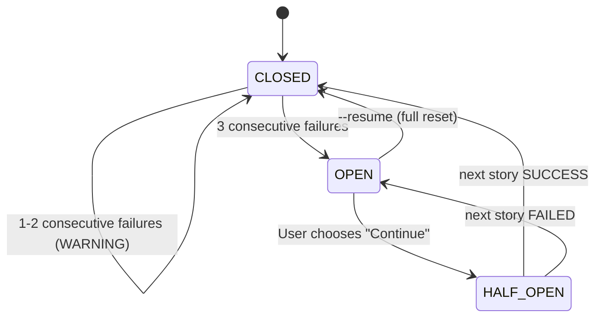

# História: Circuit Breaker for Epic Execution

**ID:** story-0031-0003
**Chave Jira:** —
**Status:** Pendente

## 1. Dependências

| Blocked By | Blocks |
| :--- | :--- |
| story-0031-0005 | — |

## 2. Regras Transversais Aplicáveis

| ID | Título |
| :--- | :--- |
| RULE-003 | Circuit Breaker |
| RULE-005 | Registro de Erros |

## 3. Descrição

Como **Engenheiro de Plataforma**, eu quero que o orquestrador de epics pause automaticamente quando detectar falhas sistêmicas consecutivas, garantindo que recursos não sejam desperdiçados em execuções condenadas.

Se o Claude API está instável ou há um bug sistêmico nos skills, múltiplas stories falham consecutivamente. O orquestrador atual continua tentando indefinidamente. O circuit breaker detecta padrões de falha e escala para o humano.

### 3.1 Thresholds

| Falhas Consecutivas | Ação |
| :--- | :--- |
| 1 | Log WARNING, continuar |
| 2 | Log WARNING com análise de padrão, continuar |
| 3 | PAUSE: AskUserQuestion "3 consecutive failures. Continue?" |
| 5 total na fase | ABORT fase com relatório diagnóstico |

### 3.2 Análise de Padrão

A partir de 2 falhas: verificar se errorType é o mesmo → "provável problema sistêmico"; se errorTypes são diferentes → "provavelmente transiente, continuar".

### 3.3 Reset

- Quando story completa com SUCCESS: `consecutiveFailures = 0`
- Quando `--resume` é usado: full reset
- Quando usuário escolhe "Continue" no prompt: reset

## 3.5 Entrega de Valor

- **Valor Principal:** Detecção automática de falhas sistêmicas em ≤ 3 falhas, prevenindo desperdício de recursos e contexto
- **Métrica de Sucesso:** Circuit breaker abre em 3 falhas consecutivas; reseta com sucesso ou --resume
- **Impacto no Negócio:** Execuções de epics em ambientes instáveis são pausadas automaticamente com diagnóstico, em vez de falharem silenciosamente por 15+ stories

## 4. Definições de Qualidade Locais

### DoR Local (Definition of Ready)

- [ ] story-0031-0005 (Error Catalog) concluída
- [ ] Checkpoint schema atual compreendido

### DoD Local (Definition of Done)

- [ ] Circuit breaker logic no template de x-dev-epic-implement
- [ ] 3 falhas consecutivas pausam com AskUserQuestion
- [ ] 5 falhas totais abortam fase
- [ ] Padrão de falha analisado a partir de 2 falhas
- [ ] Circuit breaker reseta com sucesso ou --resume
- [ ] Pelo menos 1 teste automatizado
- [ ] Golden files atualizados

### Global Definition of Done (DoD)

- **Cobertura:** ≥ 95% Line, ≥ 90% Branch
- **Testes Automatizados:** Integration tests passando
- **Relatório de Cobertura:** JaCoCo HTML + XML
- **Documentação:** Template atualizado
- **Persistência:** circuitBreaker field no checkpoint
- **Performance:** N/A

## 5. Contratos de Dados (Data Contract)

### 5.1 Circuit Breaker State

| Campo | Tipo | M/O | Validações | Exemplo |
| :--- | :--- | :--- | :--- | :--- |
| `consecutiveFailures` | `Integer` | `M` | `>= 0` | `2` |
| `totalFailuresInPhase` | `Integer` | `M` | `>= 0` | `3` |
| `lastFailureAt` | `String` | `O` | `ISO-8601` | `2026-04-08T14:30:00Z` |
| `lastFailurePattern` | `String` | `O` | `enum: [TRANSIENT, CONTEXT, MIXED, null]` | `TRANSIENT` |
| `status` | `String` | `M` | `enum: [CLOSED, OPEN, HALF_OPEN]` | `CLOSED` |

## 6. Diagramas

### 6.1 Circuit Breaker State Machine



## 7. Critérios de Aceite (Gherkin)

```gherkin
Cenario: Primeira falha emite apenas WARNING
  DADO que nenhuma story falhou anteriormente nesta fase
  QUANDO a primeira story falha
  ENTÃO log contém "WARNING: 1 consecutive failure"
  E o circuit breaker permanece CLOSED
  E a execução continua

Cenario: 3 falhas consecutivas pausam execução
  DADO que stories 0001, 0002 e 0003 falharam consecutivamente
  QUANDO a story 0003 falha
  ENTÃO AskUserQuestion é apresentada: "3 consecutive failures"
  E opções incluem "Continue", "Skip phase", "Abort"
  E circuit breaker status é OPEN

Cenario: Sucesso reseta circuit breaker
  DADO 2 stories falharam consecutivamente
  QUANDO a próxima story completa com SUCCESS
  ENTÃO consecutiveFailures reseta para 0
  E status do circuit breaker permanece CLOSED

Cenario: 5 falhas totais abortam a fase
  DADO 5 stories falharam no total na fase atual (não necessariamente consecutivas)
  QUANDO a 5ª falha é registrada
  ENTÃO a fase é abortada com relatório diagnóstico
  E log contém "Circuit breaker OPEN: phase aborted (5 total failures)"

Cenario: --resume reseta circuit breaker
  DADO que o circuit breaker está OPEN
  QUANDO o usuário executa --resume
  ENTÃO consecutiveFailures reseta para 0
  E totalFailuresInPhase reseta para 0
  E status muda para CLOSED
```

## 8. Tasks

### TASK-0031-0003-001: Add circuit breaker logic to x-dev-epic-implement

- **Layer:** Config
- **Test Type:** Integration
- **Size:** M
- **Dependencies:** —
- **Branch:** `feat/task-0031-0003-001-circuit-breaker`
- **Testability:** Config + VerificationTest
- **Files:**
  - `java/src/main/resources/targets/claude/skills/core/x-dev-epic-implement/SKILL.md`
- **Acceptance Criteria:**
  - [ ] Thresholds de 1/2/3/5 falhas documentados
  - [ ] AskUserQuestion format para 3 falhas
  - [ ] Reset logic para sucesso e --resume

### TASK-0031-0003-002: Add checkpoint circuitBreaker field

- **Layer:** Config
- **Test Type:** Integration
- **Size:** S
- **Dependencies:** TASK-0031-0003-001
- **Branch:** `feat/task-0031-0003-002-checkpoint-cb`
- **Testability:** Config + VerificationTest
- **Files:**
  - `java/src/main/resources/targets/claude/skills/core/x-dev-epic-implement/SKILL.md`
- **Acceptance Criteria:**
  - [ ] circuitBreaker field schema documentado no checkpoint
  - [ ] Estados CLOSED/OPEN/HALF_OPEN definidos

### TASK-0031-0003-003: Regenerate golden files and validate

- **Layer:** Test
- **Test Type:** Smoke
- **Size:** M
- **Dependencies:** TASK-0031-0003-002
- **Branch:** `feat/task-0031-0003-003-golden-regen`
- **Testability:** Migration + Smoke
- **Files:**
  - `java/src/test/resources/golden/*/`
- **Acceptance Criteria:**
  - [ ] Golden files regenerados
  - [ ] `mvn verify -Pintegration-tests` passa
