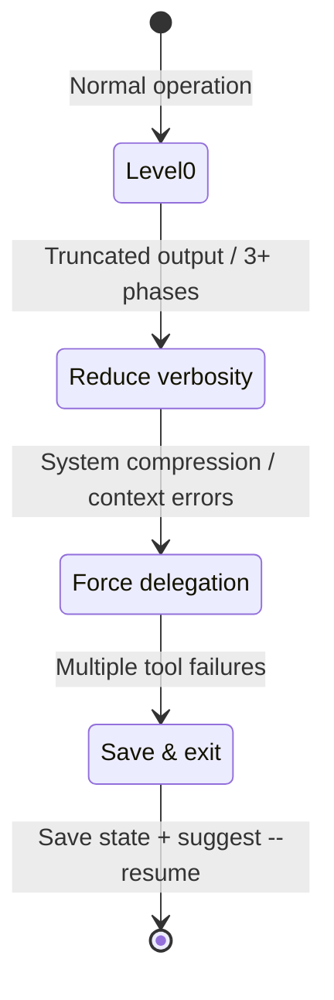

# História: Graceful Degradation on Context Pressure

**ID:** story-0031-0004
**Chave Jira:** —
**Status:** Pendente

## 1. Dependências

| Blocked By | Blocks |
| :--- | :--- |
| story-0031-0002, story-0031-0005 | — |

## 2. Regras Transversais Aplicáveis

| ID | Título |
| :--- | :--- |
| RULE-006 | Degradação Progressiva |

## 3. Descrição

Como **Engenheiro de Plataforma**, eu quero que execuções longas degradem progressivamente quando a janela de contexto se aproxima do limite, garantindo que o progresso seja preservado em vez de perder tudo por um crash abrupto.

Quando a janela de contexto se aproxima do limite, o Claude Code comprime mensagens anteriores automaticamente. Isso pode causar perda de instruções críticas do skill. Esta story define sinais de pressão, 3 níveis de degradação, e ações progressivas.

### 3.1 Sinais de Pressão

**Level 1 (Warning):** Subagent retorna output truncado; tool call retorna "output too large"; 3+ fases completadas na conversa.

**Level 2 (Critical):** System compression detectada; subagent falha com erro de contexto; tool calls com token limit errors.

**Level 3 (Emergency):** Múltiplos tool calls falhando consecutivamente; responses incoerentes ou perdendo instruções.

### 3.2 Ações de Degradação

**Level 1:** Reduzir verbosidade de logs; pular fases opcionais; usar slim mode para skills.

**Level 2:** Forçar delegação a subagents; pular Phase 3 reviews implicitamente.

**Level 3:** Salvar execution state imediatamente; sugerir --resume em nova conversa; parar execução gracefully.

## 3.5 Entrega de Valor

- **Valor Principal:** Execuções longas preservam progresso degradando progressivamente em vez de falhar abruptamente, eliminando perda de trabalho por estouro de contexto
- **Métrica de Sucesso:** 3 níveis de degradação implementados; degradação nunca pula de Level 1 para Level 3
- **Impacto no Negócio:** Epics com 10+ stories que antes falhavam no meio agora completam parcialmente com estado salvo, permitindo retomada sem retrabalho

## 4. Definições de Qualidade Locais

### DoR Local (Definition of Ready)

- [ ] story-0031-0002 (Subagent Recovery) e story-0031-0005 (Error Catalog) concluídas
- [ ] Sinais de pressão validados contra comportamento real do Claude Code

### DoD Local (Definition of Done)

- [ ] 3 níveis de sinais de pressão definidos nos templates
- [ ] 3 níveis de ações de degradação documentados
- [ ] Level 1 reduz verbosidade
- [ ] Level 2 força delegação
- [ ] Level 3 salva estado e sugere --resume
- [ ] Degradação nunca pula de Level 1 para Level 3
- [ ] Pelo menos 1 teste automatizado
- [ ] Golden files atualizados

### Global Definition of Done (DoD)

- **Cobertura:** ≥ 95% Line, ≥ 90% Branch
- **Testes Automatizados:** Integration tests passando
- **Relatório de Cobertura:** JaCoCo HTML + XML
- **Documentação:** Templates atualizados
- **Persistência:** contextPressure field no checkpoint
- **Performance:** N/A

## 5. Contratos de Dados (Data Contract)

### 5.1 Context Pressure State

| Campo | Tipo | M/O | Validações | Exemplo |
| :--- | :--- | :--- | :--- | :--- |
| `currentLevel` | `Integer` | `M` | `enum: [0, 1, 2, 3]` | `1` |
| `degradationActivatedAt` | `String` | `O` | `ISO-8601` | `2026-04-08T14:30:00Z` |
| `phasesCompletedInConversation` | `Integer` | `M` | `>= 0` | `3` |

## 6. Diagramas

### 6.1 Degradação Progressiva



## 7. Critérios de Aceite (Gherkin)

```gherkin
Cenario: Operação normal sem degradação
  DADO que menos de 3 fases foram completadas
  E nenhum sinal de pressão foi detectado
  QUANDO o orquestrador avalia pressão de contexto
  ENTÃO o nível permanece 0
  E NENHUMA ação de degradação é tomada

Cenario: Level 1 — redução de verbosidade
  DADO que 3 fases já foram executadas na conversa atual
  QUANDO o orquestrador detecta signal de Level 1
  ENTÃO logs passam a emitir apenas status lines
  E fases opcionais são puladas
  E currentLevel no checkpoint é 1

Cenario: Level 2 — delegação forçada
  DADO que compressão de sistema foi detectada
  QUANDO o orquestrador detecta signal de Level 2
  ENTÃO todas as fases restantes são delegadas a subagents
  E log contém "CONTEXT PRESSURE Level 2: delegating remaining work"
  E currentLevel no checkpoint é 2

Cenario: Level 3 — salvamento e pausa
  DADO que múltiplos tool calls estão falhando consecutivamente
  QUANDO o orquestrador detecta signal de Level 3
  ENTÃO execution-state.json é salvo imediatamente
  E mensagem sugere "--resume in a new conversation"
  E execução para gracefully
  E currentLevel no checkpoint é 3

Cenario: Degradação nunca pula níveis
  DADO que o nível atual é 0 (normal)
  QUANDO sinais de Level 3 são detectados
  ENTÃO o nível avança para 1 primeiro
  E ações de Level 1 são aplicadas antes de Level 2
```

## 8. Tasks

### TASK-0031-0004-001: Define pressure signals and degradation levels

- **Layer:** Config
- **Test Type:** Integration
- **Size:** M
- **Dependencies:** —
- **Branch:** `feat/task-0031-0004-001-pressure-signals`
- **Testability:** Config + VerificationTest
- **Files:**
  - `java/src/main/resources/targets/claude/skills/core/x-dev-epic-implement/SKILL.md`
  - `java/src/main/resources/targets/claude/skills/core/x-dev-lifecycle/SKILL.md`
- **Acceptance Criteria:**
  - [ ] 3 níveis de sinais definidos
  - [ ] 3 níveis de ações definidos
  - [ ] Progressão obrigatória (sem skip)

### TASK-0031-0004-002: Add contextPressure to checkpoint schema

- **Layer:** Config
- **Test Type:** Integration
- **Size:** S
- **Dependencies:** TASK-0031-0004-001
- **Branch:** `feat/task-0031-0004-002-checkpoint-pressure`
- **Testability:** Config + VerificationTest
- **Files:**
  - `java/src/main/resources/targets/claude/skills/core/x-dev-epic-implement/SKILL.md`
- **Acceptance Criteria:**
  - [ ] contextPressure field schema documentado
  - [ ] Backward compat com schema v2.0

### TASK-0031-0004-003: Regenerate golden files and validate

- **Layer:** Test
- **Test Type:** Smoke
- **Size:** M
- **Dependencies:** TASK-0031-0004-002
- **Branch:** `feat/task-0031-0004-003-golden-regen`
- **Testability:** Migration + Smoke
- **Files:**
  - `java/src/test/resources/golden/*/`
- **Acceptance Criteria:**
  - [ ] Golden files regenerados
  - [ ] `mvn verify -Pintegration-tests` passa
