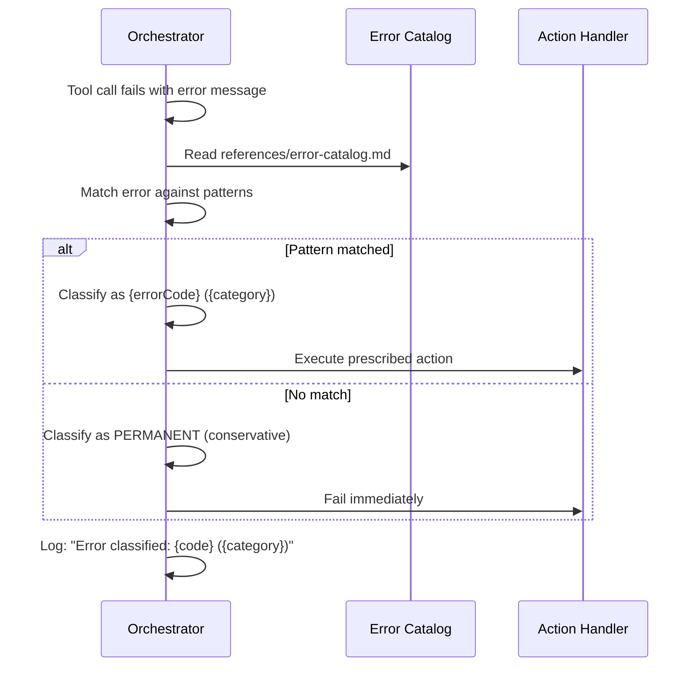

# História: Error Catalog & Standardized Error Responses

**ID:** story-0031-0005
**Chave Jira:** —
**Status:** Pendente

## 1. Dependências

| Blocked By | Blocks |
| :--- | :--- |
| — | story-0031-0002, story-0031-0003, story-0031-0004, story-0031-0007 |

## 2. Regras Transversais Aplicáveis

| ID | Título |
| :--- | :--- |
| RULE-005 | Registro de Erros |
| RULE-007 | Error Catalog como Reference |

## 3. Descrição

Como **Engenheiro de Plataforma**, eu quero um catálogo padronizado de erros para todos os skills de execução, garantindo que o orquestrador possa classificar e reagir a erros de forma sistemática com decisões automáticas de retry/fail/escalate.

Cada skill atualmente trata erros de forma ad-hoc com mensagens diferentes. Não existe padronização que permita ao orquestrador classificar e reagir. O catálogo define códigos, categorias, padrões de detecção e ações para cada tipo de erro.

### 3.1 Error Catalog

| Code | Category | Retryable | Pattern | Action |
| :--- | :--- | :--- | :--- | :--- |
| ERR-TRANSIENT-001 | TRANSIENT | Yes | "overloaded", "capacity" | Retry 3x with backoff |
| ERR-TRANSIENT-002 | TRANSIENT | Yes | "rate limit", "429" | Retry 3x with backoff |
| ERR-TRANSIENT-003 | TRANSIENT | Yes | "timeout", "ETIMEDOUT" | Retry 2x with backoff |
| ERR-TRANSIENT-004 | TRANSIENT | Yes | "503", "504", "502" | Retry 3x with backoff |
| ERR-CONTEXT-001 | CONTEXT | No | "context", "token limit" | Graceful degradation |
| ERR-CONTEXT-002 | CONTEXT | No | "output too large", "truncated" | Re-dispatch reduced |
| ERR-PERM-001 | PERMANENT | No | "not found", "no such file" | Fail with path suggestion |
| ERR-PERM-002 | PERMANENT | No | "invalid", "malformed" | Fail with format guidance |
| ERR-PERM-003 | PERMANENT | No | "compilation", "compile error" | Fail with error details |
| ERR-PERM-004 | PERMANENT | No | "test failure", "assertion" | Fail with test output |
| ERR-PERM-005 | PERMANENT | No | "permission denied", "forbidden" | Fail with access guidance |
| ERR-CIRCUIT-001 | CIRCUIT | No | 3+ consecutive failures | Pause with AskUserQuestion |
| ERR-CIRCUIT-002 | CIRCUIT | No | 5+ total failures in phase | Abort phase |

### 3.2 Reference File

O catálogo é gerado como `references/error-catalog.md` dentro do skill x-dev-epic-implement.

## 3.5 Entrega de Valor

- **Valor Principal:** Classificação padronizada de erros permite decisões automáticas de retry/fail/escalate em todos os skills de execução
- **Métrica de Sucesso:** 13 códigos de erro catalogados; instrução de classificação nos 2 orquestradores principais
- **Impacto no Negócio:** Diagnóstico de falhas passa de "leitura manual de logs" para "consulta de código padronizado com ação prescrita"

## 4. Definições de Qualidade Locais

### DoR Local (Definition of Ready)

- [ ] Lista de erros observados em execuções anteriores
- [ ] Padrões de detecção validados contra mensagens reais

### DoD Local (Definition of Done)

- [ ] Error catalog reference file criado com 13+ códigos
- [ ] Cada código tem: category, retryable, pattern, action
- [ ] Instrução de classificação em x-dev-epic-implement e x-dev-lifecycle
- [ ] Erros sem match classificados como PERMANENT (conservador)
- [ ] Pelo menos 1 teste automatizado validando geração do catalog
- [ ] Golden files atualizados

### Global Definition of Done (DoD)

- **Cobertura:** ≥ 95% Line, ≥ 90% Branch
- **Testes Automatizados:** Integration tests passando
- **Relatório de Cobertura:** JaCoCo HTML + XML
- **Documentação:** Error catalog documentado
- **Persistência:** N/A
- **Performance:** N/A

## 5. Contratos de Dados (Data Contract)

### 5.1 Error Catalog Entry

| Campo | Tipo | M/O | Validações | Exemplo |
| :--- | :--- | :--- | :--- | :--- |
| `code` | `String` | `M` | `pattern: ERR-[A-Z]+-[0-9]{3}` | `ERR-TRANSIENT-001` |
| `category` | `String` | `M` | `enum: [TRANSIENT, CONTEXT, PERMANENT, CIRCUIT]` | `TRANSIENT` |
| `retryable` | `Boolean` | `M` | — | `true` |
| `patterns` | `List<String>` | `M` | `min: 1` | `["overloaded", "capacity"]` |
| `action` | `String` | `M` | — | `Retry 3x with backoff` |
| `messageTemplate` | `String` | `O` | — | `"Error {code}: {message}. Action: {action}"` |

## 6. Diagramas

### 6.1 Fluxo de Classificação



## 7. Critérios de Aceite (Gherkin)

```gherkin
Cenario: Catálogo vazio não causa erro
  DADO que references/error-catalog.md NÃO existe
  QUANDO um erro ocorre
  ENTÃO o erro é classificado como PERMANENT por default
  E um WARNING é emitido: "Error catalog not found, defaulting to PERMANENT"

Cenario: Erro transiente classificado corretamente
  DADO que um tool call retorna "Error: overloaded_error"
  QUANDO o orquestrador classifica o erro
  ENTÃO o erro é mapeado para ERR-TRANSIENT-001
  E a ação é "Retry 3x with backoff"
  E log contém "Error classified: ERR-TRANSIENT-001 (TRANSIENT)"

Cenario: Erro sem match classificado como permanente
  DADO que um tool call retorna "Error: unknown cosmic ray"
  QUANDO o orquestrador classifica o erro
  ENTÃO o erro é classificado como PERMANENT (conservador)
  E NENHUM retry é tentado

Cenario: Error catalog gerado como reference file
  DADO que o assembler executa para profile java-quarkus
  QUANDO os skills são gerados
  ENTÃO x-dev-epic-implement/references/error-catalog.md existe
  E contém pelo menos 13 códigos de erro

Cenario: Múltiplos padrões para mesmo código
  DADO que ERR-TRANSIENT-001 tem padrões ["overloaded", "capacity"]
  QUANDO um erro contém "server at capacity"
  ENTÃO o erro é mapeado para ERR-TRANSIENT-001
```

## 8. Tasks

### TASK-0031-0005-001: Create error catalog reference file

- **Layer:** Config
- **Test Type:** Integration
- **Size:** M
- **Dependencies:** —
- **Branch:** `feat/task-0031-0005-001-error-catalog`
- **Testability:** Config + VerificationTest
- **Files:**
  - `java/src/main/resources/targets/claude/skills/core/x-dev-epic-implement/references/error-catalog.md`
- **Acceptance Criteria:**
  - [ ] 13+ códigos de erro documentados
  - [ ] Cada código tem category, retryable, patterns, action

### TASK-0031-0005-002: Add classification instruction to orchestrators

- **Layer:** Config
- **Test Type:** Integration
- **Size:** M
- **Dependencies:** TASK-0031-0005-001
- **Branch:** `feat/task-0031-0005-002-classification`
- **Testability:** Config + VerificationTest
- **Files:**
  - `java/src/main/resources/targets/claude/skills/core/x-dev-epic-implement/SKILL.md`
  - `java/src/main/resources/targets/claude/skills/core/x-dev-lifecycle/SKILL.md`
- **Acceptance Criteria:**
  - [ ] Instrução de leitura do error catalog nos orquestradores
  - [ ] Instrução de match de padrões e classificação
  - [ ] Default PERMANENT para erros sem match

### TASK-0031-0005-003: Regenerate golden files and validate

- **Layer:** Test
- **Test Type:** Smoke
- **Size:** M
- **Dependencies:** TASK-0031-0005-002
- **Branch:** `feat/task-0031-0005-003-golden-regen`
- **Testability:** Migration + Smoke
- **Files:**
  - `java/src/test/resources/golden/*/`
- **Acceptance Criteria:**
  - [ ] Golden files regenerados
  - [ ] `mvn verify -Pintegration-tests` passa
  - [ ] error-catalog.md presente nos golden files
