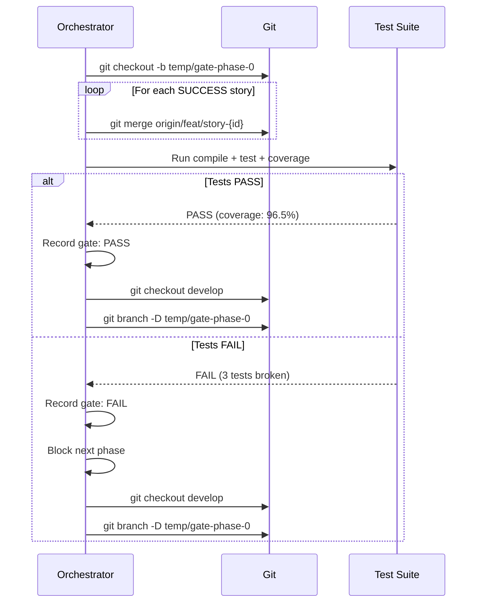

# História: Merge Gate Between Phases

**ID:** story-0031-0006
**Chave Jira:** —
**Status:** Pendente

## 1. Dependências

| Blocked By | Blocks |
| :--- | :--- |
| — | — |

## 2. Regras Transversais Aplicáveis

| ID | Título |
| :--- | :--- |
| RULE-004 | Integrity Gate Obrigatório |

## 3. Descrição

Como **Engenheiro de Plataforma**, eu quero que o integrity gate entre fases execute sempre, mesmo no modo `--no-merge`, garantindo que o código das stories de uma fase integra corretamente antes de avançar para a próxima.

O default `--no-merge` atualmente defere o integrity gate (`integrityGate.status = "DEFERRED"`), permitindo que Phase 2 inicie sem validar que Phase 1 integra corretamente. Isso é perigoso quando stories da Phase 2 dependem de código da Phase 1. A solução é executar um gate com merge local temporário: cria branch temporária, merge todas as branches SUCCESS, testa, e deleta a branch.

### 3.1 Local Integrity Gate

1. Criar branch temporária: `temp/gate-phase-{N}-{timestamp}`
2. Merge todas as story branches com status SUCCESS: `git merge origin/feat/story-{id} --no-edit`
3. Executar compile + test + coverage na branch temporária
4. Se PASS: log e registrar no checkpoint
5. Se FAIL: log com detalhes e bloquear próxima fase
6. Deletar branch temporária: `git branch -D temp/gate-phase-{N}-{timestamp}`

### 3.2 Flag --skip-gate

Para pular explicitamente o gate (opt-out consciente), usar `--skip-gate`. O gate é registrado como SKIPPED (não DEFERRED).

### 3.3 Prompt ao Final de Cada Fase

Após gate PASS, apresentar opções ao usuário.

## 3.5 Entrega de Valor

- **Valor Principal:** Integrity gate obrigatório entre fases garante que código integra antes de avançar, prevenindo propagação de problemas para fases posteriores
- **Métrica de Sucesso:** Integrity gate executa por default (nunca DEFERRED); flag --skip-gate para opt-out explícito
- **Impacto no Negócio:** Problemas de integração detectados na transição entre fases em vez de no final do epic, reduzindo custo de correção

## 4. Definições de Qualidade Locais

### DoR Local (Definition of Ready)

- [ ] Comportamento atual de --no-merge compreendido
- [ ] Seção de integrity gate no x-dev-epic-implement identificada

### DoD Local (Definition of Done)

- [ ] Local integrity gate executa por default quando --no-merge
- [ ] Gate cria branch temporária, merge, testa, e deleta
- [ ] Gate result registrado no checkpoint (nunca DEFERRED por default)
- [ ] Flag --skip-gate permite pular explicitamente
- [ ] Prompt ao final de cada fase com opções
- [ ] Pelo menos 1 teste automatizado validando presença da instrução
- [ ] Golden files atualizados

### Global Definition of Done (DoD)

- **Cobertura:** ≥ 95% Line, ≥ 90% Branch
- **Testes Automatizados:** Integration tests passando
- **Relatório de Cobertura:** JaCoCo HTML + XML
- **Documentação:** Template atualizado
- **Persistência:** N/A
- **Performance:** N/A

## 5. Contratos de Dados (Data Contract)

### 5.1 Gate Result Schema

| Campo | Tipo | M/O | Validações | Exemplo |
| :--- | :--- | :--- | :--- | :--- |
| `status` | `String` | `M` | `enum: [PASS, FAIL, SKIPPED]` | `PASS` |
| `phase` | `Integer` | `M` | `>= 0` | `0` |
| `tempBranch` | `String` | `O` | — | `temp/gate-phase-0-1712592000` |
| `testCount` | `Integer` | `O` | `>= 0` | `145` |
| `coverage` | `Number` | `O` | `0-100` | `96.5` |

## 6. Diagramas

### 6.1 Local Integrity Gate



## 7. Critérios de Aceite (Gherkin)

```gherkin
Cenario: Gate sem stories não executa
  DADO que uma fase não tem stories com status SUCCESS
  QUANDO a transição entre fases ocorre
  ENTÃO o gate NÃO é executado
  E log contém "No SUCCESS stories in phase, skipping gate"

Cenario: Gate local executa no modo no-merge
  DADO que --no-merge está ativo (default)
  E Phase 0 completou com 3 stories SUCCESS
  QUANDO a transição para Phase 1 ocorre
  ENTÃO uma branch temporária é criada
  E as 3 story branches são merged na temp branch
  E compile + test + coverage executam
  E a branch temporária é deletada
  E o gate result é PASS ou FAIL (não DEFERRED)

Cenario: Gate FAIL bloqueia próxima fase
  DADO que o local integrity gate FALHA (testes quebram no merge)
  QUANDO o resultado é registrado
  ENTÃO a próxima fase NÃO inicia
  E o usuário é notificado com detalhes da falha
  E opções incluem "Fix and retry" e "Skip gate (--skip-gate)"

Cenario: --skip-gate permite pular explicitamente
  DADO que o usuário passa --skip-gate
  QUANDO a transição entre fases ocorre
  ENTÃO o integrity gate é pulado
  E log contém "Integrity gate skipped (--skip-gate)"
  E o gate é registrado como SKIPPED (não DEFERRED)

Cenario: Prompt com opções após gate PASS
  DADO que o gate PASS para Phase 0
  QUANDO o resultado é apresentado
  ENTÃO opções incluem "Continue to next phase"
  E opções incluem "Merge PRs now"
  E opções incluem "Pause for manual review"
```

## 8. Tasks

### TASK-0031-0006-001: Implement local integrity gate in x-dev-epic-implement

- **Layer:** Config
- **Test Type:** Integration
- **Size:** L
- **Dependencies:** —
- **Branch:** `feat/task-0031-0006-001-local-gate`
- **Testability:** Config + VerificationTest
- **Files:**
  - `java/src/main/resources/targets/claude/skills/core/x-dev-epic-implement/SKILL.md`
- **Acceptance Criteria:**
  - [ ] Local gate logic com branch temporária documentada
  - [ ] Default: executa gate (não DEFERRED)
  - [ ] --skip-gate flag para opt-out

### TASK-0031-0006-002: Add post-gate prompt with options

- **Layer:** Config
- **Test Type:** Integration
- **Size:** S
- **Dependencies:** TASK-0031-0006-001
- **Branch:** `feat/task-0031-0006-002-gate-prompt`
- **Testability:** Config + VerificationTest
- **Files:**
  - `java/src/main/resources/targets/claude/skills/core/x-dev-epic-implement/SKILL.md`
- **Acceptance Criteria:**
  - [ ] Prompt com 3 opções após gate PASS
  - [ ] AskUserQuestion format correto

### TASK-0031-0006-003: Regenerate golden files and validate

- **Layer:** Test
- **Test Type:** Smoke
- **Size:** M
- **Dependencies:** TASK-0031-0006-002
- **Branch:** `feat/task-0031-0006-003-golden-regen`
- **Testability:** Migration + Smoke
- **Files:**
  - `java/src/test/resources/golden/*/`
- **Acceptance Criteria:**
  - [ ] Golden files regenerados
  - [ ] `mvn verify -Pintegration-tests` passa
