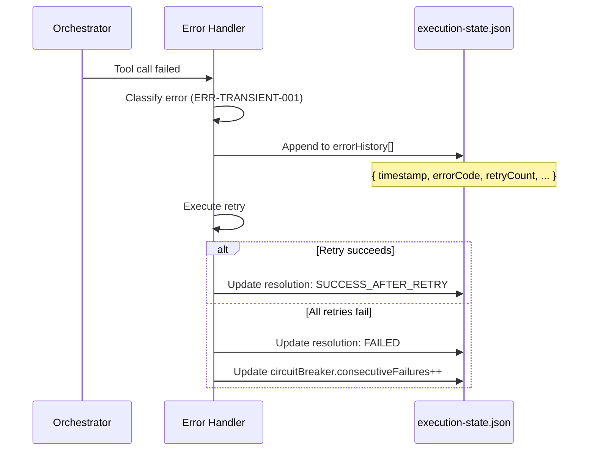

# História: Checkpoint Error History

**ID:** story-0031-0007
**Chave Jira:** —
**Status:** Pendente

## 1. Dependências

| Blocked By | Blocks |
| :--- | :--- |
| story-0031-0005 | — |

## 2. Regras Transversais Aplicáveis

| ID | Título |
| :--- | :--- |
| RULE-005 | Registro de Erros |

## 3. Descrição

Como **Engenheiro de Plataforma**, eu quero que o execution-state.json registre um histórico completo de erros com códigos padronizados, garantindo diagnóstico pós-execução e melhoria contínua dos skills.

O execution-state.json atualmente registra status de stories/tasks mas não registra histórico de erros. Quando um epic falha, não há como diagnosticar padrões de falha sem revisar logs manuais. Esta story adiciona campos `errorHistory`, `circuitBreaker` e `contextPressure` ao checkpoint, com bump de schema version para "3.0".

### 3.1 Schema v3.0

Novos campos top-level no execution-state.json: `errorHistory` (array de entradas de erro), `circuitBreaker` (estado do circuit breaker), `contextPressure` (nível de pressão).

### 3.2 Backward Compatibility

Files com version "2.0" ou ausente continuam funcionando. Novos campos são inicializados como vazios quando não presentes. Version NÃO é auto-upgraded.

### 3.3 Resume Summary

Na retomada (`--resume`), incluir summary de erros anteriores no log.

## 3.5 Entrega de Valor

- **Valor Principal:** Histórico de erros no checkpoint permite diagnóstico pós-execução automatizado e identificação de padrões de falha
- **Métrica de Sucesso:** Schema v3.0 com errorHistory, circuitBreaker, contextPressure; backward compat com v2.0
- **Impacto no Negócio:** Engenheiros podem diagnosticar falhas de epic sem vasculhar logs, acelerando resolução e melhorando skills iterativamente

## 4. Definições de Qualidade Locais

### DoR Local (Definition of Ready)

- [ ] story-0031-0005 (Error Catalog) concluída
- [ ] Schema v2.0 do execution-state.json compreendido

### DoD Local (Definition of Done)

- [ ] Schema version bumped para "3.0" no template
- [ ] Campo errorHistory com estrutura definida
- [ ] Campo circuitBreaker com estados CLOSED/OPEN/HALF_OPEN
- [ ] Campo contextPressure com níveis 0-3
- [ ] Backward compat: files v2.0 sem novos campos funcionam
- [ ] Resume mostra summary de erros anteriores
- [ ] Pelo menos 1 teste automatizado
- [ ] Golden files atualizados

### Global Definition of Done (DoD)

- **Cobertura:** ≥ 95% Line, ≥ 90% Branch
- **Testes Automatizados:** Integration tests passando
- **Relatório de Cobertura:** JaCoCo HTML + XML
- **Documentação:** Schema v3.0 documentado
- **Persistência:** execution-state.json schema v3.0
- **Performance:** N/A

## 5. Contratos de Dados (Data Contract)

### 5.1 Error History Entry

| Campo | Tipo | M/O | Validações | Exemplo |
| :--- | :--- | :--- | :--- | :--- |
| `timestamp` | `String` | `M` | `ISO-8601` | `2026-04-08T14:30:00Z` |
| `storyId` | `String` | `M` | `pattern: story-XXXX-YYYY` | `story-0042-0003` |
| `taskId` | `String` | `O` | `pattern: TASK-XXXX-YYYY-NNN` | `TASK-0042-0003-002` |
| `errorCode` | `String` | `M` | `pattern: ERR-[A-Z]+-[0-9]{3}` | `ERR-TRANSIENT-001` |
| `errorMessage` | `String` | `M` | `max: 500` | `Claude API overloaded` |
| `phase` | `String` | `M` | — | `2.2.5` |
| `retryCount` | `Integer` | `M` | `>= 0` | `2` |
| `resolution` | `String` | `M` | `enum: [SUCCESS_AFTER_RETRY, FAILED, ESCALATED]` | `SUCCESS_AFTER_RETRY` |

### 5.2 Top-level Schema v3.0 Fields

| Campo | Tipo | M/O | Default | Descrição |
| :--- | :--- | :--- | :--- | :--- |
| `version` | `String` | `M` | `"3.0"` | Schema version |
| `errorHistory` | `List<ErrorEntry>` | `O` | `[]` | Histórico de erros |
| `circuitBreaker` | `CircuitBreakerState` | `O` | `{ status: "CLOSED" }` | Estado do CB |
| `contextPressure` | `ContextPressureState` | `O` | `{ currentLevel: 0 }` | Pressão de contexto |

## 6. Diagramas

### 6.1 Error History Flow



## 7. Critérios de Aceite (Gherkin)

```gherkin
Cenario: Erro registrado no histórico
  DADO que um tool call falha com ERR-TRANSIENT-001
  QUANDO o erro é processado
  ENTÃO uma entrada é adicionada ao errorHistory
  E contém timestamp, errorCode, storyId, phase, retryCount
  E execution-state.json é persistido

Cenario: Checkpoint sem errorHistory (backward compat)
  DADO que execution-state.json tem version "2.0" (sem errorHistory)
  QUANDO o orquestrador lê o checkpoint
  ENTÃO a execução continua normalmente
  E errorHistory é tratado como array vazio
  E version é mantida como "2.0" (não auto-upgrade)

Cenario: Resume mostra summary de erros anteriores
  DADO que execution-state.json contém 5 erros no errorHistory
  QUANDO o usuário executa --resume
  ENTÃO log contém "Previous execution had 5 errors"
  E log contém o padrão mais comum de erro

Cenario: Schema v3.0 com todos os campos
  DADO um novo epic iniciando execução
  QUANDO o execution-state.json é criado
  ENTÃO version é "3.0"
  E errorHistory é array vazio
  E circuitBreaker.status é "CLOSED"
  E contextPressure.currentLevel é 0

Cenario: Resolução SUCCESS_AFTER_RETRY registrada
  DADO que um erro transiente foi resolvido após 2 retries
  QUANDO a resolução é registrada
  ENTÃO a entrada no errorHistory tem resolution "SUCCESS_AFTER_RETRY"
  E retryCount é 2
```

## 8. Tasks

### TASK-0031-0007-001: Define v3.0 schema with error history fields

- **Layer:** Config
- **Test Type:** Integration
- **Size:** M
- **Dependencies:** —
- **Branch:** `feat/task-0031-0007-001-schema-v3`
- **Testability:** Config + VerificationTest
- **Files:**
  - `java/src/main/resources/targets/claude/skills/core/x-dev-epic-implement/SKILL.md`
- **Acceptance Criteria:**
  - [ ] Schema v3.0 documentado com errorHistory, circuitBreaker, contextPressure
  - [ ] Backward compat com v2.0 definida

### TASK-0031-0007-002: Add error recording instructions to orchestrators

- **Layer:** Config
- **Test Type:** Integration
- **Size:** M
- **Dependencies:** TASK-0031-0007-001
- **Branch:** `feat/task-0031-0007-002-error-recording`
- **Testability:** Config + VerificationTest
- **Files:**
  - `java/src/main/resources/targets/claude/skills/core/x-dev-epic-implement/SKILL.md`
  - `java/src/main/resources/targets/claude/skills/core/x-dev-lifecycle/SKILL.md`
- **Acceptance Criteria:**
  - [ ] Instrução de registro de erro após cada falha
  - [ ] Instrução de resume summary no log

### TASK-0031-0007-003: Regenerate golden files and validate

- **Layer:** Test
- **Test Type:** Smoke
- **Size:** M
- **Dependencies:** TASK-0031-0007-002
- **Branch:** `feat/task-0031-0007-003-golden-regen`
- **Testability:** Migration + Smoke
- **Files:**
  - `java/src/test/resources/golden/*/`
- **Acceptance Criteria:**
  - [ ] Golden files regenerados
  - [ ] `mvn verify -Pintegration-tests` passa
