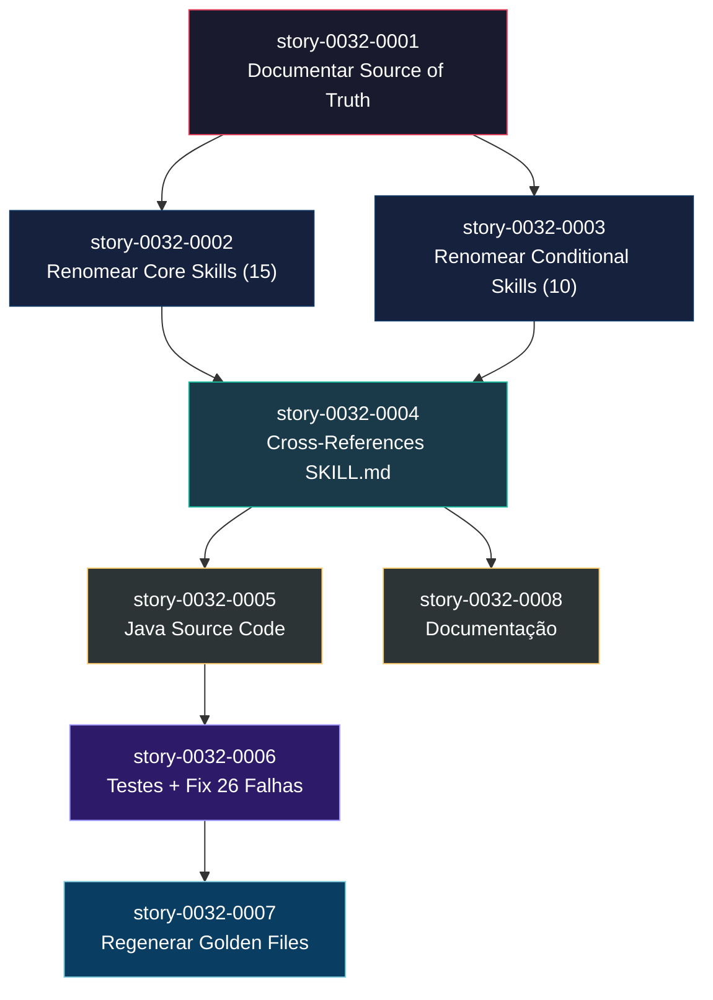

# Mapa de Implementação — Padronização de Nomenclatura de Skills

**Gerado a partir das dependências BlockedBy/Blocks de cada história do epic-0032.**

---

## 1. Matriz de Dependências

| Story | Título | Chave Jira | Blocked By | Blocks | Status |
| :--- | :--- | :--- | :--- | :--- | :--- |
| story-0032-0001 | Documentar Regra de Source of Truth | — | — | 0002, 0003 | Pendente |
| story-0032-0002 | Renomear Core Skills na Fonte Verdade | — | 0001 | 0004 | Pendente |
| story-0032-0003 | Renomear Conditional Skills na Fonte Verdade | — | 0001 | 0004 | Pendente |
| story-0032-0004 | Atualizar Referências Cruzadas nos SKILL.md | — | 0002, 0003 | 0005, 0008 | Pendente |
| story-0032-0005 | Atualizar Java Source Code | — | 0004 | 0006 | Pendente |
| story-0032-0006 | Atualizar Testes e Corrigir Falhas Pré-existentes | — | 0005 | 0007 | Pendente |
| story-0032-0007 | Regenerar Golden Files | — | 0006 | — | Pendente |
| story-0032-0008 | Atualizar Documentação | — | 0004 | — | Pendente |

> **Nota:** Stories 0002 e 0003 são independentes entre si (paralelas). Story 0008 é independente de 0005-0007 (paralela após fase 2).

---

## 2. Fases de Implementação

> As histórias são agrupadas em fases. Dentro de cada fase, as histórias podem ser implementadas **em paralelo**. Uma fase só pode iniciar quando todas as dependências das fases anteriores estiverem concluídas.

```
╔══════════════════════════════════════════════════════════════════════════════════╗
║                        FASE 0 — Foundation (1 story)                            ║
║                                                                                 ║
║  ┌──────────────────────────────────────────────────────────────────────────┐   ║
║  │  0001                                                                    │   ║
║  │  Documentar Regra de Source of Truth                                     │   ║
║  └────────────────────────────┬─────────────────────────────────────────────┘   ║
╚═══════════════════════════════╪═════════════════════════════════════════════════╝
                                │
                ┌───────────────┴───────────────┐
                ▼                               ▼
╔══════════════════════════════════════════════════════════════════════════════════╗
║                        FASE 1 — Rename (2 paralelas)                            ║
║                                                                                 ║
║  ┌────────────────────────────┐  ┌────────────────────────────────────────┐     ║
║  │  0002                      │  │  0003                                  │     ║
║  │  Renomear Core Skills      │  │  Renomear Conditional Skills           │     ║
║  │  (15 dirs)                 │  │  (10 dirs)                             │     ║
║  └────────────┬───────────────┘  └──────────────┬─────────────────────────┘     ║
╚═══════════════╪═════════════════════════════════╪═══════════════════════════════╝
                │                                 │
                └────────────────┬────────────────┘
                                 ▼
╔══════════════════════════════════════════════════════════════════════════════════╗
║                        FASE 2 — Cross-References (1 story)                      ║
║                                                                                 ║
║  ┌──────────────────────────────────────────────────────────────────────────┐   ║
║  │  0004                                                                    │   ║
║  │  Atualizar Referências Cruzadas nos SKILL.md                             │   ║
║  └────────────────┬───────────────────────────────────┬─────────────────────┘   ║
╚═══════════════════╪═══════════════════════════════════╪═════════════════════════╝
                    │                                   │
                    ▼                                   ▼
╔══════════════════════════════════════════════════════════════════════════════════╗
║                        FASE 3 — Code + Docs (2 paralelas)                       ║
║                                                                                 ║
║  ┌────────────────────────────┐  ┌────────────────────────────────────────┐     ║
║  │  0005                      │  │  0008                                  │     ║
║  │  Atualizar Java Source     │  │  Atualizar Documentação                │     ║
║  │  (← 0004)                 │  │  (← 0004)                             │     ║
║  └────────────┬───────────────┘  └────────────────────────────────────────┘     ║
╚═══════════════╪═════════════════════════════════════════════════════════════════╝
                │
                ▼
╔══════════════════════════════════════════════════════════════════════════════════╗
║                        FASE 4 — Tests (1 story)                                 ║
║                                                                                 ║
║  ┌──────────────────────────────────────────────────────────────────────────┐   ║
║  │  0006                                                                    │   ║
║  │  Atualizar Testes e Corrigir Falhas Pré-existentes                       │   ║
║  └────────────────────────────┬─────────────────────────────────────────────┘   ║
╚═══════════════════════════════╪═════════════════════════════════════════════════╝
                                │
                                ▼
╔══════════════════════════════════════════════════════════════════════════════════╗
║                        FASE 5 — Golden Files (1 story)                          ║
║                                                                                 ║
║  ┌──────────────────────────────────────────────────────────────────────────┐   ║
║  │  0007                                                                    │   ║
║  │  Regenerar Golden Files                                                  │   ║
║  └──────────────────────────────────────────────────────────────────────────┘   ║
╚══════════════════════════════════════════════════════════════════════════════════╝
```

---

## 3. Caminho Crítico

> O caminho crítico (a sequência mais longa de dependências) determina o tempo mínimo de implementação do projeto.

```
story-0032-0001 → story-0032-0002 → story-0032-0004 → story-0032-0005 → story-0032-0006 → story-0032-0007
     Fase 0            Fase 1            Fase 2            Fase 3            Fase 4            Fase 5
```

**6 fases no caminho crítico, 6 histórias na cadeia mais longa (0001 → 0002 → 0004 → 0005 → 0006 → 0007).**

As stories 0003 (Fase 1) e 0008 (Fase 3) estão fora do caminho crítico e podem ser executadas em paralelo com 0002 e 0005 respectivamente, sem impactar o tempo total.

---

## 4. Grafo de Dependências (Mermaid)



---

## 5. Resumo por Fase

| Fase | Histórias | Camada | Paralelismo | Pré-requisito |
| :--- | :--- | :--- | :--- | :--- |
| 0 | 0001 | Doc | 1 | — |
| 1 | 0002, 0003 | Config | 2 paralelas | Fase 0 |
| 2 | 0004 | Config | 1 | Fase 1 |
| 3 | 0005, 0008 | Application + Doc | 2 paralelas | Fase 2 |
| 4 | 0006 | Test | 1 | Fase 3 (0005) |
| 5 | 0007 | Test | 1 | Fase 4 |

**Total: 8 histórias em 6 fases.**

> **Nota:** Máximo paralelismo é 2 (fases 1 e 3). O gargalo principal é a cadeia serial 0004 → 0005 → 0006 → 0007.

---

## 6. Detalhamento por Fase

### Fase 0 — Foundation

| Story | Escopo Principal | Artefatos Chave |
| :--- | :--- | :--- |
| story-0032-0001 | Documentar source of truth | CLAUDE.md, AGENTS.md |

**Entregas da Fase 0:**

- Regra de source of truth documentada
- Agentes de IA sabem onde alterar skills

### Fase 1 — Rename

| Story | Escopo Principal | Artefatos Chave |
| :--- | :--- | :--- |
| story-0032-0002 | Renomear 15 core skills | 15 diretórios + 15 frontmatter + 15 GH Copilot |
| story-0032-0003 | Renomear 10 conditional skills | 10 diretórios + 10 frontmatter |

**Entregas da Fase 1:**

- 25 diretórios renomeados na fonte verdade
- Todos os SKILL.md com `name:` correto

### Fase 2 — Cross-References

| Story | Escopo Principal | Artefatos Chave |
| :--- | :--- | :--- |
| story-0032-0004 | Atualizar ~250 referências cruzadas | Todos os .md em resources/targets/ |

**Entregas da Fase 2:**

- Zero referências stale em qualquer .md de resources

### Fase 3 — Code + Docs

| Story | Escopo Principal | Artefatos Chave |
| :--- | :--- | :--- |
| story-0032-0005 | Atualizar Java assemblers | SkillGroupRegistry.java, SkillsSelection.java |
| story-0032-0008 | Atualizar documentação | CLAUDE.md, AGENTS.md, CHANGELOG.md |

**Entregas da Fase 3:**

- Gerador produz outputs com novos nomes
- Documentação alinhada com código

### Fase 4 — Tests

| Story | Escopo Principal | Artefatos Chave |
| :--- | :--- | :--- |
| story-0032-0006 | Atualizar testes + fix 26 pré-existentes | ~30 test classes |

**Entregas da Fase 4:**

- Suite de testes 100% verde (0 falhas)

### Fase 5 — Golden Files

| Story | Escopo Principal | Artefatos Chave |
| :--- | :--- | :--- |
| story-0032-0007 | Regenerar ~5000 golden files | src/test/resources/golden/ |

**Entregas da Fase 5:**

- Golden files byte-for-byte com output do gerador
- `mvn verify` 100% verde

---

## 7. Observações Estratégicas

### Gargalo Principal

**story-0032-0006** (Testes + Fix 26 falhas pré-existentes) é o maior gargalo porque:
1. Requer investigação individual de cada falha pré-existente
2. Pode exigir alterações nos SKILL.md da fonte verdade (adicionar markers CONTEXT ISOLATION)
3. É bloqueante para a regeneração de golden files

**Recomendação:** Priorizar investigação das falhas pré-existentes antes de iniciar as stories de rename.

### Histórias Folha (sem dependentes)

- **story-0032-0007** — Golden files são o último passo, sem slack
- **story-0032-0008** — Documentação pode ser feita em paralelo com código (Fase 3), sem impactar o caminho crítico

### Otimização de Tempo

- **Máximo paralelismo na Fase 1**: 2 stories podem começar simultaneamente (0002 + 0003)
- **Ponto de aceleração**: story-0032-0004 desbloqueia tanto code (0005) quanto docs (0008)
- **Fases 4-5 são seriais**: Testes devem passar antes de regenerar golden files

### Volume de Mudanças

| Fase | Arquivos Estimados |
| :--- | :--- |
| Fase 0 | 2 |
| Fase 1 | ~50 (25 dirs × 2 arquivos) |
| Fase 2 | ~250 (.md com cross-refs) |
| Fase 3 | ~5 (Java + docs) |
| Fase 4 | ~30 (test classes) |
| Fase 5 | ~5000 (golden files) |
| **Total** | **~5337** |

> O volume é alto mas o risco é baixo — 95% das mudanças são mecânicas (rename/replace).

---

## 8. Dependências entre Tasks (Cross-Story)

> Tasks neste epic são largamente independentes entre stories. A dependência principal é ao nível de story (uma story produz o rename, a seguinte consome).

### 8.1 Dependências Cross-Story entre Tasks

| Task | Depends On | Story Source | Story Target | Tipo |
| :--- | :--- | :--- | :--- | :--- |
| TASK-0032-0004-001 | TASK-0032-0002-001, TASK-0032-0003-001 | 0002, 0003 | 0004 | Rename → Cross-ref |
| TASK-0032-0005-001 | TASK-0032-0004-002 | 0004 | 0005 | Cross-ref → Java |
| TASK-0032-0006-001 | TASK-0032-0005-001 | 0005 | 0006 | Java → Tests |
| TASK-0032-0007-001 | TASK-0032-0006-004 | 0006 | 0007 | Tests → Golden |

### 8.2 Ordem de Merge (Topological Sort)

| Ordem | Task ID | Story | Parallelizável Com | Fase |
| :--- | :--- | :--- | :--- | :--- |
| 1 | TASK-0032-0001-001, 002 | 0001 | Entre si | 0 |
| 2 | TASK-0032-0002-001, 002 | 0002 | TASK-0032-0003-001 | 1 |
| 2 | TASK-0032-0003-001 | 0003 | TASK-0032-0002-* | 1 |
| 3 | TASK-0032-0004-001, 002 | 0004 | — | 2 |
| 4 | TASK-0032-0005-001, 002 | 0005 | TASK-0032-0008-* | 3 |
| 4 | TASK-0032-0008-001, 002, 003 | 0008 | TASK-0032-0005-* | 3 |
| 5 | TASK-0032-0006-001, 002, 003, 004 | 0006 | — | 4 |
| 6 | TASK-0032-0007-001 | 0007 | — | 5 |

**Total: ~18 tasks em 6 fases de execução.**
