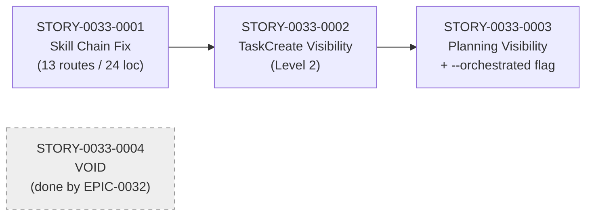

# IMPLEMENTATION-MAP — EPIC-0033: Fix Skill Delegation Chain and Subagent Observability

> **Reconciled with post-EPIC-0032 baseline.** STORY-0033-0004 (Naming Consolidation) is VOID — it was completed by EPIC-0032 (commit `7a5305377`, merged via PR #255). This map reflects the 3 remaining active stories in strict dependency order.

## Dependency Matrix

| Story | Depends On | Blocks | Status |
|-------|-----------|--------|--------|
| STORY-0033-0001 (Skill Chain Fix, **expanded scope**) | — | STORY-0033-0002 | **Concluida** (PR #257) |
| STORY-0033-0002 (TaskCreate Visibility) | STORY-0033-0001 | STORY-0033-0003 | **Concluida** (PR #258) |
| STORY-0033-0003 (Planning Subagent Visibility + `--orchestrated` flag) | STORY-0033-0002 | — | **Concluida** (PR #259 + PR #261 audit hardening) |
| STORY-0033-0004 (Naming Consolidation) | — | — | **VOID — done by EPIC-0032** |

## Dependency Graph



## Phased Execution Plan

### Phase 1: Core — Skill Chain Fix (Expanded)

| Story | Title | Size | Parallel? |
|-------|-------|------|-----------|
| STORY-0033-0001 | Add Skill to allowed-tools and standardize 13 delegation routes (24 physical locations) | L (upgraded from M) | Solo |

**Rationale:** The delegation chain must be fixed end-to-end before visibility can be added. Visibility without working delegation would show ghost progress that doesn't match reality. STORY-0033-0001 is the foundation — it (a) creates the formal rule `10-skill-invocation-protocol.md`, (b) enables `Skill` in `allowed-tools` of `x-test-tdd` and `x-git-commit`, (c) replaces 13 distinct logical delegation routes (24 physical locations, including 1 orphan reference to non-existent `/x-test-contract-lint` which is removed) with explicit `Skill(skill: ..., args: ...)` syntax, (d) regenerates golden files.

**Scope expansion note:** The original STORY-0033-0001 covered only the TDD→commit→format/lint chain (4 routes). Post-diagnostic, scope was expanded to cover all 13 logical routes found in `core/` (24 physical locations across 7 files), including the critical `x-review` Phase 2 parallel specialist list (9 of the 24 locations). This upgrades the story size from M to L.

**Exit Criteria:**
- `x-test-tdd` and `x-git-commit` include `Skill` in `allowed-tools`
- All 13 enumerated delegation routes (24 physical locations) use explicit `Skill(skill: ..., args: ...)` syntax; the orphan `/x-test-contract-lint` reference is removed
- `.claude/rules/10-skill-invocation-protocol.md` exists and is referenced in CLAUDE.md
- Golden files regenerated for 18 profiles
- `mvn test` green (5779/5779)

---

### Phase 2: Visibility — Task Tracking (Level 2)

| Story | Title | Size | Parallel? |
|-------|-------|------|-----------|
| STORY-0033-0002 | Add TaskCreate/TaskUpdate for Level 2 visibility | L | Solo |

**Rationale:** With delegation chain working, add `TaskCreate`/`TaskUpdate` at Phase level (4 tasks per story) and Task level (1 task per task-execution inside Phase 2). The user can now see real-time progress in Claude Code's native task list. execution-state.json tracking remains unchanged (complementary).

**Exit Criteria:**
- `x-dev-epic-implement` creates 1 task per story dispatch
- `x-dev-story-implement` creates tasks per phase (0, 1, 2, 3) and per task (inside Phase 2 loop)
- Both skills have `TaskCreate, TaskUpdate` in `allowed-tools`
- execution-state.json continues to be updated
- Functional test shows tasks appearing in Claude Code task list during execution

---

### Phase 3: Refinement — Planning Visibility + Orchestration Flag

| Story | Title | Size | Parallel? |
|-------|-------|------|-----------|
| STORY-0033-0003 | Add task tracking to planning subagent prompts + `--orchestrated` flag | M | Solo |

**Rationale:** With the TaskCreate pattern established in Phase 2, extend it to the 5 planning subagents inside Phase 1 (1B Implementation Plan, 1D Event Schema, 1F Compliance — subagents via Task; 1A Architecture Plan, 1B Test Plan, 1C Task Decomposition, 1E Threat Model — via `Skill(...)` direct, wrapped by orchestrator TaskCreate). Also replaces the fragile implicit detection in `x-test-tdd:302` ("if invoked via Skill tool") with an explicit `--orchestrated` flag passed by the parent orchestrator.

**Exit Criteria:**
- Planning subagent prompts include `TaskCreate`/`TaskUpdate` instructions (1B, 1D, 1F)
- Orchestrator wraps Skill-based planners (1A, 1B test-plan, 1C, 1E) with TaskCreate/TaskUpdate
- Skipped planners do NOT create tasks
- `x-test-tdd` compact mode activates based on `--orchestrated` flag (not implicit detection)
- Functional test shows 4-5 planning tasks in parallel during Phase 1

---

## Critical Path

```
STORY-0033-0001 → STORY-0033-0002 → STORY-0033-0003
     (Phase 1)         (Phase 2)         (Phase 3)
```

All 3 active stories are on the critical path — no parallelism possible due to strict delegation-then-visibility dependency. Story 0004 is VOID and does not appear on the path.

## Phase Summary

| Phase | Stories | Estimated Size | Cumulative |
|-------|---------|---------------|------------|
| 1 | 0001 (expanded) | L | L |
| 2 | 0002 | L | 2L |
| 3 | 0003 | M | 2L + M |

**Total:** ~6 working days (0.5 for Fase 0 reconciliation + 2 for 0001 + 2 for 0002 + 1 for 0003 + 0.5 for release).

## Strategic Observations

1. **Linear dependency chain:** All 3 active stories depend on the previous one. Delegation must work before visibility is added; visibility must be added at Phase level before it's extended to planning subagents. No parallelism is possible.

2. **Golden file regeneration cadence:** Regenerate golden files **once per story**, at the end of the story, before opening the PR. Never regenerate mid-story — it makes isolating regressions impossible.

3. **`x-review` Phase 2 is the riskiest change in Story 0001:** Converting the slash-command list to 9 parallel `Skill(...)` calls in a single message touches the largest number of golden files and may reveal pre-existing issues with how the parallel dispatch is tested. Allocate extra validation time.

4. **TaskCreate in subagents:** Subagents spawned via `Agent` tool (`general-purpose` type) have access to all tools including TaskCreate by default. Subagents invoked via `Skill()` tool use the skill's `allowed-tools` — Stories 0002 and 0003 explicitly add `TaskCreate, TaskUpdate` to the affected skills' frontmatter.

5. **Functional validation as a gate:** Each story's PR cannot be merged until the corresponding functional scenario (Cenário A, B, C) is executed against an epic fixture (`plans/epic-TEST/`, local-only). This is documented in the plan's Section 6.

6. **STORY-0033-0004 VOID rationale:** EPIC-0032 removed `x-dev-lifecycle/SKILL.md` entirely (820 lines) and consolidated all references in `x-dev-epic-implement` and other skills to use `x-dev-story-implement`. The story file is retained for historical traceability with a VOID banner.
