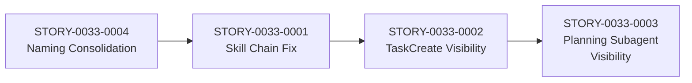

# IMPLEMENTATION-MAP — EPIC-0033: Fix Skill Delegation Chain and Subagent Observability

## Dependency Matrix

| Story | Depends On | Blocks |
|-------|-----------|--------|
| STORY-0033-0004 (Naming Consolidation) | — | STORY-0033-0001 |
| STORY-0033-0001 (Skill Chain Fix) | STORY-0033-0004 | STORY-0033-0002 |
| STORY-0033-0002 (TaskCreate Visibility) | STORY-0033-0001 | STORY-0033-0003 |
| STORY-0033-0003 (Planning Subagent Visibility) | STORY-0033-0002 | — |

## Dependency Graph



## Phased Execution Plan

### Phase 1: Foundation — Naming Consolidation

| Story | Title | Size | Parallel? |
|-------|-------|------|-----------|
| STORY-0033-0004 | Consolidate x-dev-lifecycle -> x-dev-story-implement | M | Solo |

**Rationale:** Must resolve naming before other stories can reference the correct skill name.

**Exit Criteria:**
- x-dev-story-implement is the canonical name
- x-dev-epic-implement references x-dev-story-implement
- No stale "x-dev-lifecycle" references in delegation instructions

---

### Phase 2: Core — Skill Chain Fix

| Story | Title | Size | Parallel? |
|-------|-------|------|-----------|
| STORY-0033-0001 | Add Skill to allowed-tools and standardize delegation chain | M | Solo |

**Rationale:** Fix the broken delegation chain so x-tdd can invoke x-commit and x-commit can invoke x-format/x-lint via Skill tool.

**Exit Criteria:**
- x-tdd and x-commit have `Skill` in allowed-tools
- All `/x-command` shorthand replaced with `Skill(skill: ..., args: ...)` in delegation instructions
- Golden files regenerated

---

### Phase 3: Visibility — Task Tracking

| Story | Title | Size | Parallel? |
|-------|-------|------|-----------|
| STORY-0033-0002 | Add TaskCreate/TaskUpdate for Level 2 visibility | L | Solo |

**Rationale:** With correct naming and working delegation, add task tracking to make execution visible.

**Exit Criteria:**
- x-dev-epic-implement creates tasks per story
- x-dev-story-implement creates tasks per phase and per task
- Claude Code task list shows progress during execution

---

### Phase 4: Refinement — Planning Visibility

| Story | Title | Size | Parallel? |
|-------|-------|------|-----------|
| STORY-0033-0003 | Add task tracking to planning subagent prompts | M | Solo |

**Rationale:** With the TaskCreate pattern established, extend to planning subagents.

**Exit Criteria:**
- Planning subagent prompts include TaskCreate/TaskUpdate instructions
- User can see individual planning artifact progress
- Skipped planners do not create tasks

---

## Critical Path

```
STORY-0033-0004 → STORY-0033-0001 → STORY-0033-0002 → STORY-0033-0003
     (Phase 1)        (Phase 2)         (Phase 3)          (Phase 4)
```

All stories are on the critical path — no parallelism possible due to linear dependencies.

## Phase Summary

| Phase | Stories | Estimated Size | Cumulative |
|-------|---------|---------------|------------|
| 1 | 0004 | M | M |
| 2 | 0001 | M | 2M |
| 3 | 0002 | L | 2M + L |
| 4 | 0003 | M | 3M + L |

## Strategic Observations

1. **Linear dependency chain:** All stories depend on the previous one, so parallel execution is not possible. This is because naming must be correct before fixing delegation, and delegation must work before adding observability.

2. **Golden file regeneration:** Every story requires regenerating golden files. Consider batching golden file regeneration as a final step after all stories, or regenerating per-story if tests require it.

3. **x-dev-lifecycle removal risk:** STORY-0033-0004 removes a skill that may be referenced in user projects already deployed. Consider a deprecation period with a redirect SKILL.md instead of immediate removal.

4. **TaskCreate in subagents:** Subagents spawned via Agent tool (general-purpose type) have access to all tools including TaskCreate. However, skill-invoked subagents via `Skill()` tool use the skill's `allowed-tools` — verify that TaskCreate is included or accessible.
