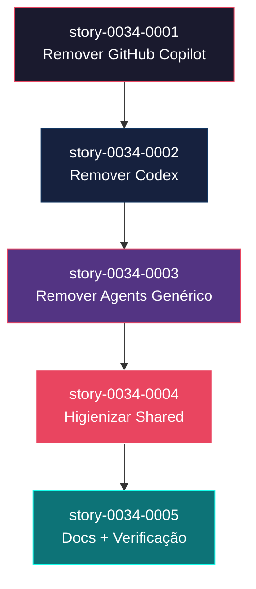

# Mapa de Implementação — Épico 0034 (Remoção de Targets Não-Claude)

**Gerado a partir das dependências BlockedBy/Blocks de cada história do epic-0034.**

---

## 1. Matriz de Dependências

| Story | Título | Chave Jira | Blocked By | Blocks | Status |
| :--- | :--- | :--- | :--- | :--- | :--- |
| story-0034-0001 | Remover Suporte a GitHub Copilot | — | — | story-0034-0002 | Concluída |
| story-0034-0002 | Remover Suporte a Codex | — | story-0034-0001 | story-0034-0003 | Concluída |
| story-0034-0003 | Remover Target Agents Genérico | — | story-0034-0002 | story-0034-0004 | Concluída |
| story-0034-0004 | Higienizar Classes Compartilhadas | — | story-0034-0003 | story-0034-0005 | Concluída |
| story-0034-0005 | Documentação e Verificação Final | — | story-0034-0004 | — | Concluída |

> **Valores de Status:** `Pendente` (padrão) · `Em Andamento` · `Concluída` · `Falha` · `Bloqueada` · `Parcial`

> **Nota:** As dependências são estritamente sequenciais (cadeia linear) por RULE-005 (Remoção Atômica por Target). Embora stories 0001, 0002 e 0003 tocam arquivos majoritariamente disjuntos (assemblers específicos de cada target), elas compartilham pontos de edição em `Platform.java`, `AssemblerTarget.java`, `AssemblerFactory.java`, `FileCategorizer.java`, `OverwriteDetector.java` e nos 17 YAMLs de config-templates. Executar sequencialmente evita conflitos de merge nessas classes compartilhadas e garante build verde incremental (RULE-001).

---

## 2. Fases de Implementação

> As histórias são agrupadas em fases. Neste épico, por decisão de atomicidade (RULE-005) e ordenação sequencial, cada fase contém exatamente uma story — não há paralelismo entre stories.

```
╔══════════════════════════════════════════════════════════════════════════╗
║  FASE 0 — Remoção GitHub Copilot                                         ║
║                                                                          ║
║   ┌──────────────────────────────────────────────────────────┐           ║
║   │  story-0034-0001  Delete 8 classes + 14 tests + 131 res  │           ║
║   │                    + 2.419 golden files                   │           ║
║   └──────────────────────────┬───────────────────────────────┘           ║
╚══════════════════════════════╪═══════════════════════════════════════════╝
                               │
                               ▼
╔══════════════════════════════════════════════════════════════════════════╗
║  FASE 1 — Remoção Codex                                                  ║
║                                                                          ║
║   ┌──────────────────────────────────────────────────────────┐           ║
║   │  story-0034-0002  Delete 7 classes + 6 tests + 15 res    │           ║
║   │                    + 2.944 golden files                   │           ║
║   └──────────────────────────┬───────────────────────────────┘           ║
╚══════════════════════════════╪═══════════════════════════════════════════╝
                               │
                               ▼
╔══════════════════════════════════════════════════════════════════════════╗
║  FASE 2 — Remoção Agents Genérico                                        ║
║                                                                          ║
║   ┌──────────────────────────────────────────────────────────┐           ║
║   │  story-0034-0003  Delete 6 tests + fixture + 2.910 gold  │           ║
║   │                    + AssemblerTarget.CODEX_AGENTS         │           ║
║   └──────────────────────────┬───────────────────────────────┘           ║
╚══════════════════════════════╪═══════════════════════════════════════════╝
                               │
                               ▼
╔══════════════════════════════════════════════════════════════════════════╗
║  FASE 3 — Higienização Shared Code                                       ║
║                                                                          ║
║   ┌──────────────────────────────────────────────────────────┐           ║
║   │  story-0034-0004  Clean 10+ shared classes + 5 smoke     │           ║
║   │                    tests. Delete ReadmeGithubCounter.     │           ║
║   │                    Preserve templates (RULE-004).         │           ║
║   └──────────────────────────┬───────────────────────────────┘           ║
╚══════════════════════════════╪═══════════════════════════════════════════╝
                               │
                               ▼
╔══════════════════════════════════════════════════════════════════════════╗
║  FASE 4 — Documentação e Verificação Final                               ║
║                                                                          ║
║   ┌──────────────────────────────────────────────────────────┐           ║
║   │  story-0034-0005  Update CLAUDE.md + rules + README.      │           ║
║   │                    Regenerate expected-artifacts.json.    │           ║
║   │                    E2E verification. Final PR.             │           ║
║   └──────────────────────────────────────────────────────────┘           ║
╚══════════════════════════════════════════════════════════════════════════╝
```

---

## 3. Caminho Crítico

> O caminho crítico (a sequência mais longa de dependências) determina o tempo mínimo de implementação do projeto.

```
story-0034-0001 → story-0034-0002 → story-0034-0003 → story-0034-0004 → story-0034-0005
    Fase 0            Fase 1            Fase 2            Fase 3             Fase 4
```

**5 fases no caminho crítico, 5 histórias na cadeia mais longa (todas as stories, cadeia linear).**

Atrasos em qualquer story propagam diretamente para todas as subsequentes. Como não há stories paralelas, o épico total = soma dos tempos individuais de cada story. Estimativa indicativa (não compromisso): ~1-2 dias por story de remoção atômica (0001, 0002, 0003), ~2-3 dias para higienização (0004), ~1 dia para docs/verificação (0005). Total: ~7-12 dias de trabalho focado.

---

## 4. Grafo de Dependências (Mermaid)



---

## 5. Resumo por Fase

| Fase | Histórias | Camada | Paralelismo | Pré-requisito |
| :--- | :--- | :--- | :--- | :--- |
| 0 | story-0034-0001 | Remoção por target | 1 | — |
| 1 | story-0034-0002 | Remoção por target | 1 | Fase 0 concluída |
| 2 | story-0034-0003 | Remoção por target | 1 | Fase 1 concluída |
| 3 | story-0034-0004 | Higienização shared | 1 | Fase 2 concluída |
| 4 | story-0034-0005 | Docs + verificação E2E | 1 | Fase 3 concluída |

**Total: 5 histórias em 5 fases.**

> **Nota sobre paralelismo:** Paralelismo entre stories NÃO é adotado neste épico, mas **é uma escolha de risco/benefício, não uma impossibilidade técnica**. Stories 0001, 0002 e 0003 tocam assemblers específicos de cada target (conjuntos majoritariamente disjuntos) e poderiam ser tecnicamente paralelizadas. A decisão de executá-las em cadeia sequencial é motivada por três benefícios mensuráveis:
>
> 1. **Revisabilidade isolada:** cada PR é revisado sem ter que raciocinar sobre o estado simultâneo de outros PRs nos mesmos enums compartilhados (`Platform.java`, `AssemblerTarget.java`, `AssemblerFactory.java`, `PlatformConverter.java`, 17 YAMLs de config-templates).
> 2. **Rollback cirúrgico:** build verde incremental permite reverter uma story específica sem desfazer as outras.
> 3. **Redução de merge conflicts triviais:** os 5 hotspots compartilhados gerariam ±5 linhas de conflito por story paralela — resolvíveis em minutos, mas adicionando carga cognitiva ao reviewer sem agregar valor.
>
> Stories 0004 e 0005 são estruturalmente sequenciais: 0004 depende do estado final pós-remoção dos 3 targets, e 0005 depende do código higienizado.

---

## 6. Detalhamento por Fase

### Fase 0 — Remoção GitHub Copilot

| Story | Escopo Principal | Artefatos Chave |
| :--- | :--- | :--- |
| story-0034-0001 | Delete 8 Java assemblers Github*, 14 test classes, 1 fixture, `targets/github-copilot/` (~131 res), subdirs `.github/` em 17 golden profiles (exceto `workflows/`). Update enum `Platform` (remove COPILOT), `AssemblerTarget` (remove GITHUB), `AssemblerFactory` (remove 2 métodos), `PlatformConverter`, `GenerateCommand`, `FileCategorizer`, `OverwriteDetector`, `PlatformContextBuilder`, 17 YAMLs. | Classes Java deletadas, golden files deletados, CLI rejeita `--platform copilot`, build verde. |

**Entregas da Fase 0:**

- Gerador deixa de produzir artefatos `.github/` para Copilot
- `Platform.COPILOT` não existe mais
- `--platform copilot` falha com mensagem clara
- Build verde com ~25% menos classes de teste

### Fase 1 — Remoção Codex

| Story | Escopo Principal | Artefatos Chave |
| :--- | :--- | :--- |
| story-0034-0002 | Delete 7 Codex assemblers, 6 test classes, `targets/codex/` (~15 res), subdirs `.codex/` em 17 golden profiles. Update `Platform` (remove CODEX), `AssemblerTarget` (remove CODEX), `AssemblerFactory` (remove `buildCodexAssemblers`), CLI, 17 YAMLs. | Classes Codex deletadas, `.codex/` golden dirs removidos, CLI rejeita `--platform codex`. |

**Entregas da Fase 1:**

- Gerador deixa de produzir artefatos `.codex/`
- `Platform.CODEX` não existe mais
- Maior volume de golden files removidos de uma só vez (~2.944)

### Fase 2 — Remoção Agents Genérico

| Story | Escopo Principal | Artefatos Chave |
| :--- | :--- | :--- |
| story-0034-0003 | Delete 6 `Agents*Test`, fixture `AgentsTestFixtures`, classes main `Agents*Assembler` (se existirem como distintas de Github/Codex), `targets/agents/` (se distinto), subdirs `.agents/` em 17 golden profiles. Update `AssemblerTarget` (remove CODEX_AGENTS), `PlatformFilter`, `FileCategorizer`, `OverwriteDetector`, `AssemblerTargetTest`. | `AssemblerTarget` fica com apenas `CLAUDE`, `.agents/` golden dirs removidos, código residual de agents limpo. |

**Entregas da Fase 2:**

- Terceiro e último target legado eliminado
- `AssemblerTarget` reduzido a 1 entrada
- Fim da "remoção por target" — próximas stories focam em higienização

### Fase 3 — Higienização Shared Code

| Story | Escopo Principal | Artefatos Chave |
| :--- | :--- | :--- |
| story-0034-0004 | Delete `ReadmeGithubCounter`. Edit 10+ shared classes (`ReadmeAssembler`, `MappingTableBuilder`, `SummaryTableBuilder`, `PlatformContextBuilder`, `PlanTemplatesAssembler`, `EpicReportAssembler`, `FileTreeWalker`, validators, `IaDevEnvApplication`). Edit 5 smoke tests (`PlatformDirectorySmokeTest`, `AssemblerRegressionSmokeTest`, `CliModesSmokeTest`, `GoldenFileCoverageTest`, `AssemblerTargetTest`). **PROIBIDO** tocar em `resources/shared/templates/` (RULE-004). | Código shared ~15% menor, smoke tests simplificados, templates shared intactos. |

**Entregas da Fase 3:**

- Classes compartilhadas sem lógica condicional para targets mortos
- `ReadmeGithubCounter` deletada
- `PlatformContextBuilder` com apenas `hasClaude`
- Smoke tests sem `@Nested Copilot/Codex`

### Fase 4 — Documentação e Verificação Final

| Story | Escopo Principal | Artefatos Chave |
| :--- | :--- | :--- |
| story-0034-0005 | Update `CLAUDE.md` raiz (−200 linhas), `.claude/rules/*.md`, `README.md`, `docs/`. Regenerate `expected-artifacts.json` via `ExpectedArtifactsGenerator` (~9.500 → ~830 entradas). Verificação E2E (build, grep sanity, CLI manual, contagem arquivos, templates intactos, workflows preservados). Criar PR final. | CLAUDE.md atualizado, manifest regenerado, PR mergeable em develop. |

**Entregas da Fase 4:**

- Documentação coerente com estado Claude-only
- Manifest de golden files refletindo novo volume
- Verificação quantitativa completa do épico
- PR final aprovado e mergeable

---

## 7. Observações Estratégicas

### Gargalo Principal

**story-0034-0001 (Remover GitHub Copilot)** é o maior gargalo do épico por três razões:

1. **Maior volume de arquivos afetados**: 8 classes Java + 14 classes de teste + 131 resources + ~2.419 golden files = ~2.572 arquivos em uma única story atômica. É aproximadamente 30% do trabalho total.
2. **Primeira story estabelece o padrão**: A mecânica de remoção atômica (código + testes + resources + golden + enum + YAMLs no mesmo commit) é estabelecida aqui e reutilizada nas stories 0002 e 0003. Erros de processo aqui propagam.
3. **RULE-003 mais relevante aqui**: A distinção crítica entre `.github/` (Copilot) e `.github/workflows/` (CI/CD) só se aplica a esta story, criando maior risco de erro humano.

Investir tempo extra em revisão cuidadosa da story 0001 compensa porque: (a) reduz retrabalho nas stories subsequentes ao padronizar o processo; (b) evita regressão de CI/CD por remoção acidental de workflows; (c) permite que 0002 e 0003 sejam executadas mais rapidamente por copiar o padrão já validado.

### Histórias Folha (sem dependentes)

- **story-0034-0005** é a única folha (não bloqueia nenhuma outra story). É o fechamento do épico.

### Otimização de Tempo

- **Paralelismo entre stories não é adotado por decisão explícita** (ver Seção 2, "Nota sobre paralelismo"), mas é tecnicamente viável se houver pressão de prazo. Se adotar, o ganho esperado é ~30-40% no tempo total ao custo de reviews mais difíceis.
- **Otimização possível dentro de cada story**: tasks dentro de uma story podem ser paralelizadas onde possível (por exemplo, em story-0034-0001 as tasks 004 e 005 — deletar `targets/github-copilot/` e deletar golden `.github/` — são marcadas como paralelizáveis na matriz de ordem de merge).
- **Aceleração via automação**: scripts shell para deletar subdirs `.github/`, `.codex/`, `.agents/` em massa (respeitando RULE-003 para workflows) acelera a parte mecânica. Revisão cuidadosa dos enums e assemblers continua sendo manual.

### Dependências Cruzadas

As stories 0001, 0002 e 0003 compartilham pontos de edição em:

- `Platform.java` (enum) — cada story remove uma constante
- `AssemblerTarget.java` (enum) — cada story remove uma entrada
- `AssemblerFactory.java` — cada story remove um método builder
- `PlatformConverter.java` — cada story remove um valor aceito
- `FileCategorizer.java`, `OverwriteDetector.java` — cada story remove uma categoria
- `PlatformContextBuilder.java` — stories 0001 e 0002 removem flags
- 17 YAMLs `setup-config.*.yaml` — cada story remove referências

**Convergência sequencial**: como executamos estritamente em ordem, não há conflito de merge. Cada story recebe o estado produzido pela anterior. Tentar paralelizar geraria merge conflicts garantidos nesses arquivos.

### Marco de Validação Arquitetural

**story-0034-0001 serve como marco de validação** porque estabelece a mecânica atômica que as próximas duas stories replicam. Após completar 0001 com sucesso (build verde, smoke tests verdes, grep sanity limpo para Copilot), temos alta confiança de que:

- O padrão de remoção atômica funciona
- O processo de editar enums sem quebrar build é repetível
- A distinção entre `.github/workflows/` (CI/CD) e `.github/instructions/` (Copilot) é respeitada
- O CI do projeto detecta regressões em templates shared

Sem essa validação inicial, as stories 0002 e 0003 têm maior risco de falha.

A **story-0034-0004** é um segundo marco: valida que, após a remoção física dos targets, o código shared pode ser higienizado sem quebrar o comportamento do gerador para Claude Code. Passar essa story confirma que o refactoring foi bem sucedido e a story final (docs + verificação) é apenas formalização.

---

## 8. Dependências entre Tasks (Cross-Story)

> Esta seção é gerada automaticamente quando as histórias contêm tasks formais com IDs `TASK-XXXX-YYYY-NNN`.

### 8.1 Dependências Cross-Story entre Tasks

| Task | Depends On | Story Source | Story Target | Tipo |
| :--- | :--- | :--- | :--- | :--- |
| TASK-0034-0002-001 | TASK-0034-0001-006 | story-0034-0001 | story-0034-0002 | structural (build verde baseline) |
| TASK-0034-0003-001 | TASK-0034-0002-005 | story-0034-0002 | story-0034-0003 | structural |
| TASK-0034-0004-001 | TASK-0034-0003-004 | story-0034-0003 | story-0034-0004 | structural |
| TASK-0034-0005-001 | TASK-0034-0004-006 | story-0034-0004 | story-0034-0005 | structural |

> **Validação RULE-012:** Todas as dependências cross-story são estritamente estruturais (cada story precisa do estado verde da anterior). Nenhuma dependência de dados, interface ou schema. Consistência validada: não há ciclos.

### 8.2 Ordem de Merge (Topological Sort)

| Ordem | Task ID | Story | Parallelizável Com | Fase |
| :--- | :--- | :--- | :--- | :--- |
| 1 | TASK-0034-0001-001 | story-0034-0001 | — | 0 |
| 2 | TASK-0034-0001-002 | story-0034-0001 | — | 0 |
| 3 | TASK-0034-0001-003 | story-0034-0001 | — | 0 |
| 4 | TASK-0034-0001-004 | story-0034-0001 | TASK-0034-0001-005 | 0 |
| 5 | TASK-0034-0001-005 | story-0034-0001 | TASK-0034-0001-004 | 0 |
| 6 | TASK-0034-0001-006 | story-0034-0001 | — | 0 |
| 7 | TASK-0034-0002-001 | story-0034-0002 | — | 1 |
| 8 | TASK-0034-0002-002 | story-0034-0002 | — | 1 |
| 9 | TASK-0034-0002-003 | story-0034-0002 | — | 1 |
| 10 | TASK-0034-0002-004 | story-0034-0002 | — | 1 |
| 11 | TASK-0034-0002-005 | story-0034-0002 | — | 1 |
| 12 | TASK-0034-0003-001 | story-0034-0003 | — | 2 |
| 13 | TASK-0034-0003-002 | story-0034-0003 | — | 2 |
| 14 | TASK-0034-0003-003 | story-0034-0003 | — | 2 |
| 15 | TASK-0034-0003-004 | story-0034-0003 | — | 2 |
| 16 | TASK-0034-0004-001 | story-0034-0004 | — | 3 |
| 17 | TASK-0034-0004-002 | story-0034-0004 | — | 3 |
| 18 | TASK-0034-0004-003 | story-0034-0004 | — | 3 |
| 19 | TASK-0034-0004-004 | story-0034-0004 | — | 3 |
| 20 | TASK-0034-0004-005 | story-0034-0004 | — | 3 |
| 21 | TASK-0034-0004-006 | story-0034-0004 | — | 3 |
| 22 | TASK-0034-0005-001 | story-0034-0005 | — | 4 |
| 23 | TASK-0034-0005-002 | story-0034-0005 | — | 4 |
| 24 | TASK-0034-0005-003 | story-0034-0005 | — | 4 |
| 25 | TASK-0034-0005-004 | story-0034-0005 | — | 4 |
| 26 | TASK-0034-0005-005 | story-0034-0005 | — | 4 |

**Total: 26 tasks em 5 fases de execução.**

### 8.3 Grafo de Dependências entre Tasks (Mermaid)

```mermaid
graph LR
    subgraph story-0034-0001["Story 0001 (Remover Copilot)"]
        style story-0034-0001 fill:#e8f4fd
        T101["TASK-0034-0001-001<br/>Delete Java classes"]
        T102["TASK-0034-0001-002<br/>Delete test classes"]
        T103["TASK-0034-0001-003<br/>Update enums + CLI"]
        T104["TASK-0034-0001-004<br/>Delete resources dir"]
        T105["TASK-0034-0001-005<br/>Delete golden files"]
        T106["TASK-0034-0001-006<br/>Cleanup YAML + verify"]
        T101 --> T102 --> T103 --> T104 --> T106
        T103 --> T105 --> T106
    end

    subgraph story-0034-0002["Story 0002 (Remover Codex)"]
        style story-0034-0002 fill:#fde8e8
        T201["TASK-0034-0002-001<br/>Delete Codex classes"]
        T205["TASK-0034-0002-005<br/>Verify + PR"]
        T201 --> T205
    end

    subgraph story-0034-0003["Story 0003 (Remover Agents)"]
        style story-0034-0003 fill:#e8fde8
        T301["TASK-0034-0003-001<br/>Delete Agents tests"]
        T304["TASK-0034-0003-004<br/>Verify + PR"]
        T301 --> T304
    end

    subgraph story-0034-0004["Story 0004 (Higienizar)"]
        style story-0034-0004 fill:#fdf0e8
        T401["TASK-0034-0004-001<br/>Delete ReadmeGithubCounter"]
        T406["TASK-0034-0004-006<br/>Final verify"]
        T401 --> T406
    end

    subgraph story-0034-0005["Story 0005 (Docs + E2E)"]
        style story-0034-0005 fill:#e8e8fd
        T501["TASK-0034-0005-001<br/>Update CLAUDE.md"]
        T505["TASK-0034-0005-005<br/>Final PR"]
        T501 --> T505
    end

    T106 -.->|cross-story| T201
    T205 -.->|cross-story| T301
    T304 -.->|cross-story| T401
    T406 -.->|cross-story| T501
```


