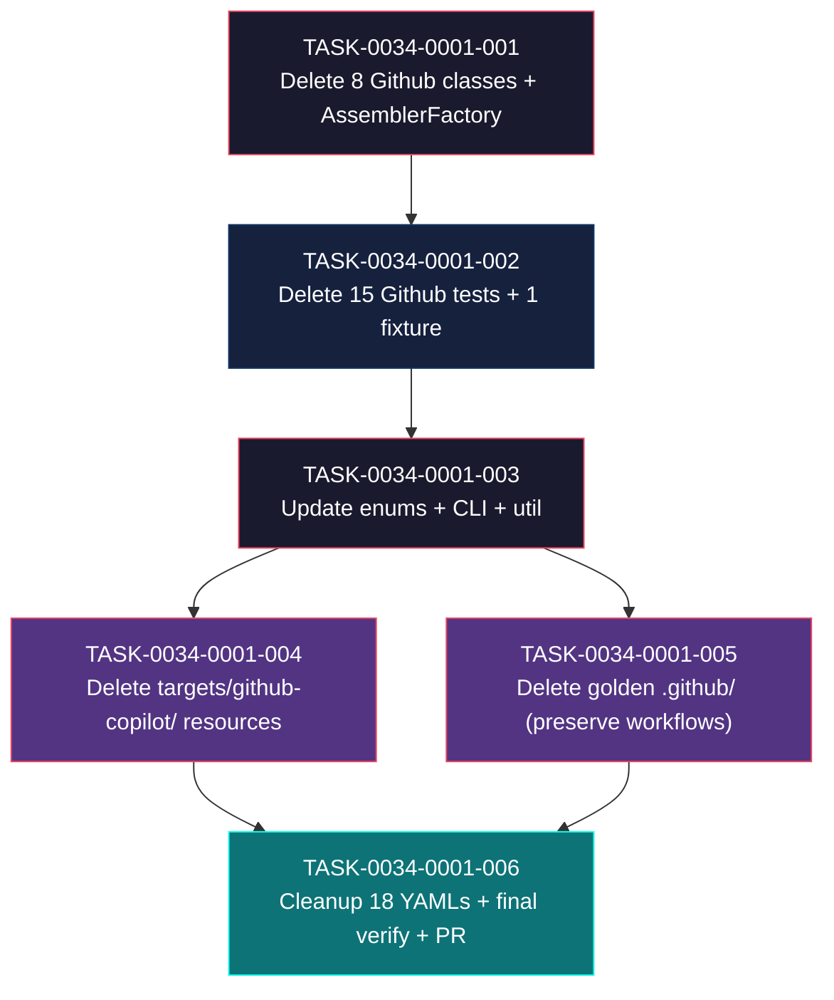

# Task Breakdown -- story-0034-0001

## Header

| Field | Value |
|-------|-------|
| Story ID | story-0034-0001 |
| Epic ID | 0034 |
| Date | 2026-04-10 |
| Author | x-story-plan (multi-agent, inline) |
| Template Version | 1.0.0 |

## Summary

| Metric | Value |
|--------|-------|
| Total Tasks | 6 |
| Parallelizable Tasks | 2 (TASK-004 and TASK-005) |
| Estimated Effort | M+M+S+S+M+S = ~2 dev-days |
| Mode | multi-agent (Architect + QA + Security + Tech Lead + PO) |
| Agents Participating | Architect, QA Engineer, Security Engineer, Tech Lead, Product Owner |

## Dependency Graph

## Tasks Table

| Task ID | Source Agent | Type | TDD Phase | TPP Level | Layer | Components | Parallel | Depends On | Estimated Effort | DoD (augmented) |
|---------|-------------|------|-----------|-----------|-------|-----------|----------|-----------|-----------------|-----|
| TASK-0034-0001-001 | Architect + TL | implementation (delete) | GREEN (compile-verified) | N/A | adapter.application | 8 Github*Assembler.java + AssemblerFactory.java | no | -- | M | (a) 8 main classes deleted: GithubInstructionsAssembler, GithubMcpAssembler, GithubSkillsAssembler, GithubAgentsAssembler, GithubHooksAssembler, GithubPromptsAssembler, GithubAgentRenderer, PrIssueTemplateAssembler; (b) AssemblerFactory.buildGithubInputAssemblers() and buildGithubOutputAssemblers() deleted; (c) AssemblerFactory.buildAllAssemblers() no longer invokes github builders; (d) mvn compile green; (e) AssemblerFactory.java <= 250 lines post-edit; (f) no orphan imports of deleted classes; (g) conventional commit `refactor(assembler)!: remove github copilot assemblers`; (h) [TL-006] buildAllAssemblers returns 26 descriptors (was 34, -8) |
| TASK-0034-0001-002 | Architect + QA | test (delete) | GREEN (compile-verified) | N/A | adapter.test | 15 Github*Test + GithubInstructionsTestFixtures | no | TASK-0034-0001-001 | M | (a) [QA-001/RULE-006] confirm all 16 Github test files passing on baseline BEFORE deletion; (b) 15 test classes deleted: GithubInstructionsCopilotTest, GithubInstructionsFormatTest, GithubInstructionsCoverageTest, GithubInstructionsFileGenTest, GithubInstructionsGoldenTest, GithubMcpAssemblerTest, GithubSkillsAssemblerTest, GithubSkillsAssemblerConditionalTest, GithubSkillsAssemblerIntegrationTest, GithubHooksAssemblerTest, GithubAgentsAssemblerTest, GithubAgentsEventTest, GithubAgentsConditionalTest, GithubAgentsRenderCoreTest, GithubPromptsAssemblerTest; (c) GithubInstructionsTestFixtures.java deleted; (d) mvn test-compile green; (e) mvn test green for remaining tests; (f) conventional commit `test(assembler)!: remove github copilot test suites` |
| TASK-0034-0001-003 | Architect + Security + TL | implementation (edit) | GREEN | N/A | domain + adapter.inbound + util | Platform.java, AssemblerTarget.java, PlatformConverter.java, GenerateCommand.java, FileCategorizer.java, OverwriteDetector.java, PlatformContextBuilder.java | no | TASK-0034-0001-002 | S | (a) Platform.COPILOT constant removed + allUserSelectable() updated; (b) AssemblerTarget.GITHUB(".github") entry removed; (c) PlatformConverter: "copilot" no longer in accepted values (via allUserSelectable); (d) GenerateCommand @Option --platform description lists only claude-code, codex; (e) FileCategorizer: .github/instructions/, .github/skills/, .github/agents/, .github/hooks/, .github/prompts/, .github/copilot-* branches removed; .github/workflows/ branch PRESERVED if present (RULE-003); (f) OverwriteDetector.ARTIFACT_DIRS: ".github" removed; (g) PlatformContextBuilder: hasCopilot flag removed; (h) [SEC-002/CWE-209] PlatformConverter error message contains only platform name + accepted values, no class/path/stack info; (i) [TL-003] grep -ri 'copilot' java/src/main/java returns 0 matches (source code only, not including leftover resources until task 004); (j) mvn compile green; mvn test green; (k) conventional commit with BREAKING CHANGE footer: `refactor(cli)!: remove Platform.COPILOT and AssemblerTarget.GITHUB` |
| TASK-0034-0001-004 | Architect + Security | config (delete) | GREEN | N/A | adapter.outbound | java/src/main/resources/targets/github-copilot/ | yes (with TASK-005) | TASK-0034-0001-003 | S | (a) Directory java/src/main/resources/targets/github-copilot/ deleted recursively; (b) ~131 files removed; (c) [SEC-003/CWE-22] verify `find java/src/main/resources/targets/github-copilot/ -type l` returns empty (pre-delete) to confirm no symlink escape; (d) [SEC-004] grep -ri 'copilot.*api\|copilot.*token\|copilot.*key' java/src/main returns 0 matches post-delete; (e) mvn compile green; mvn test green; (f) conventional commit `chore(resources)!: delete github-copilot target directory` |
| TASK-0034-0001-005 | QA + Tech Lead | migration (delete) | GREEN | boundary | adapter.test | 17 golden profiles `.github/` subdirs | yes (with TASK-004) | TASK-0034-0001-003 | M | (a) In each of 17 golden profiles under java/src/test/resources/golden/{profile}/: delete everything under .github/ EXCEPT .github/workflows/; (b) ~2324 files deleted (per baseline); (c) [QA-004/RULE-003] `find java/src/test/resources/golden/*/.github/workflows -type f \| wc -l` returns 95 (unchanged from baseline); (d) All 17 profiles still have .github/workflows/ as subdir; (e) no file with .yml or .yaml under workflows/ was deleted; (f) mvn compile green; (g) conventional commit `test(golden)!: delete copilot .github/ files preserving workflows` |
| TASK-0034-0001-006 | QA + Security + TL + PO | quality-gate + validation | VERIFY | N/A | config + test | 18 setup-config.*.yaml + final verification | no | TASK-0034-0001-004, TASK-0034-0001-005 | S | (a) 18 YAML files java/src/main/resources/shared/config-templates/setup-config.*.yaml: references to `copilot` in platform options removed (e.g. `# Options: claude-code, copilot, codex, all` -> `# Options: claude-code, codex, all`); (b) [SEC-001] grep -rE '(password\|secret\|token\|api_?key)' java/src/main/resources/shared/config-templates/setup-config.*.yaml returns 0 matches (or only allowlisted examples); (c) [QA-006/RULE-002/TL-004] `mvn clean verify` green with JaCoCo line coverage >= 95% AND branch >= 90%; degradation <= 2pp vs baseline (95.69% line / 90.69% branch); (d) [QA-005/AT-5] grep -rn 'GithubInstructionsAssembler\|GithubMcpAssembler\|GithubSkillsAssembler\|GithubAgentsAssembler\|GithubHooksAssembler\|GithubPromptsAssembler\|GithubAgentRenderer\|PrIssueTemplateAssembler' java/src/main/java returns 0; grep -rn 'Platform.COPILOT' java/src/main returns 0; (e) [AT-2] CLI smoke: `java -jar target/*.jar generate --platform copilot` exits non-zero with stderr containing "Invalid platform" and no reference to `copilot` in accepted list; (f) [AT-3] CLI smoke: `java -jar target/*.jar generate --platform claude-code --output-dir /tmp/test-out` succeeds and produces .claude/ but NOT .github/ (except workflows if configured); (g) [AT-6] CLI smoke: `java -jar target/*.jar generate --output-dir /tmp/test-out` succeeds with claude-code default; (h) [PO-003] CLI smoke: `java -jar target/*.jar generate --platform codex --output-dir /tmp/test-out` still accepted (codex removal is story 0002); (i) [TL-005] All 6 commits on branch follow Conventional Commits format with target scope; (j) [TL-007] PR created for feature/epic-0034-remove-non-claude-targets with story §3.5 metrics table in body (before/after counts) per [PO-004]; (k) PR body contains JaCoCo report link |

## Escalation Notes

| Task ID | Reason | Recommended Action |
|---------|--------|--------------------|
| TASK-0034-0001-002 | Story §3.2 declares 14 test classes + 1 fixture = 15 files, but baseline (`plans/epic-0034/baseline-pre-epic.md` §"Source Code Counts") reports 16 Github tests and `ls` confirms 15 test classes + 1 fixture (story missed `GithubPromptsAssemblerTest.java`). | Treat baseline as authoritative. Delete all 16 files (15 tests + 1 fixture). Update story §3.2 in a follow-up or note in PR description. |
| TASK-0034-0001-006 | Story §3.7 declares 17 YAMLs but actual count is 18 (`ls setup-config.*.yaml \| wc -l` = 18). | Treat actual count (18) as authoritative. Update story §3.7 text or add PR note. |
| TASK-0034-0001-003 | FileCategorizer.java currently has 6 `.github/*` branches (lines 51-69) but NO explicit `.github/workflows/` branch (RULE-003 is enforced indirectly because workflows don't match any specific prefix and fall through to "Other"). Risk: removing all `.github/` branches causes workflows files to be categorized as "Other" in display output. | Verify by running CliDisplay manually with a golden profile containing workflows files. If display regression is acceptable (workflows aren't generated by the tool itself, only preserved in golden), no action needed. Otherwise, add a `.github/workflows/` branch mapping to "CI/CD" category. Document decision in Task 003 commit. |
| TASK-0034-0001-001 | `PrIssueTemplateAssembler.java` is in story §3.1 but the class name does not follow the `Github*` prefix convention. Verify it belongs to the Copilot target before deletion. | Confirmed in `AssemblerFactory.buildGithubOutputAssemblers()` (lines 176-179) — registered under `AssemblerTarget.GITHUB` with `Platform.COPILOT`. Safe to delete. |
| TASK-0034-0001-003 | `PlatformConverter.ACCEPTED_VALUES` is computed dynamically from `Platform.allUserSelectable()` — no literal `"copilot"` string to remove. Removing `COPILOT` from the enum automatically propagates. Story §3.6 wording is inaccurate. | No explicit edit to PlatformConverter source needed for accepted values. Only ensure enum edit cascades correctly. Verify error message rendering in PlatformConverterTest. |
