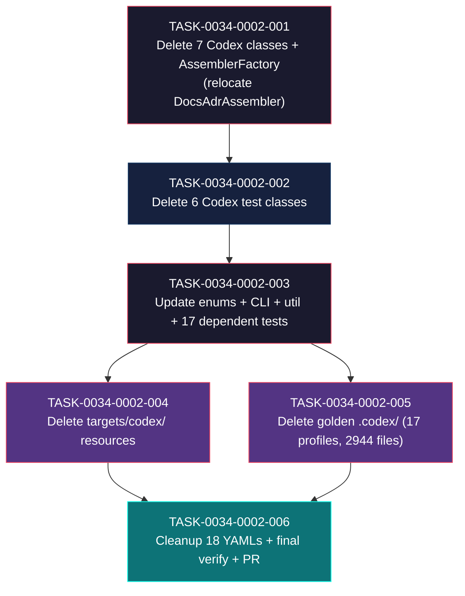

# Task Breakdown -- story-0034-0002

## Header

| Field | Value |
|-------|-------|
| Story ID | story-0034-0002 |
| Epic ID | 0034 |
| Date | 2026-04-10 |
| Author | x-story-plan (multi-agent, inline) |
| Template Version | 1.0.0 |

## Summary

| Metric | Value |
|--------|-------|
| Total Tasks | 6 |
| Parallelizable Tasks | 2 (TASK-004 and TASK-005) |
| Estimated Effort | M+S+S+S+M+S = ~2 dev-days |
| Mode | multi-agent (Architect + QA + Security + Tech Lead + PO) |
| Agents Participating | Architect, QA Engineer, Security Engineer, Tech Lead, Product Owner |

## Dependency Graph

## Tasks Table

| Task ID | Source Agent | Type | TDD Phase | TPP Level | Layer | Components | Parallel | Depends On | Estimated Effort | DoD (augmented) |
|---------|-------------|------|-----------|-----------|-------|-----------|----------|-----------|-----------------|-----|
| TASK-0034-0002-001 | Architect + TL | implementation (delete + relocate) | GREEN (compile-verified) | N/A | adapter.application | 7 Codex*.java + AssemblerFactory.java | no | -- | M | (a) 7 main classes deleted: CodexAgentsMdAssembler, CodexConfigAssembler, CodexSkillsAssembler, CodexRequirementsAssembler, CodexOverrideAssembler, CodexScanner, CodexShared; (b) AssemblerFactory.buildCodexAssemblers() deleted; (c) DocsAdrAssembler descriptor RELOCATED out of the deleted builder into an appropriate shared builder (e.g., buildCicdAssemblers or a new buildSharedDocsAssemblers) — MUST NOT be orphaned; (d) AssemblerFactory.buildAllAssemblers() no longer invokes buildCodexAssemblers(); (e) mvn compile green; (f) AssemblerFactory.java <= 250 lines post-edit; (g) no orphan imports of deleted classes; (h) conventional commit `refactor(assembler)!: remove codex assemblers`; (i) [TL-006] buildAllAssemblers returns 19 descriptors (was 26 post-story-0001, -7 = 5 Codex removed + DocsAdrAssembler RELOCATED so net change is -7 only if DocsAdrAssembler stays in a surviving builder; if DocsAdrAssembler is counted once in both old Codex builder and relocated builder, verify total) |
| TASK-0034-0002-002 | Architect + QA | test (delete) | GREEN (compile-verified) | N/A | adapter.test | 6 Codex*Test.java | no | TASK-0034-0002-001 | S | (a) [QA-001/RULE-006] confirm all 6 Codex test files passing on baseline BEFORE deletion (via post-story-0001 develop HEAD `mvn test`); (b) 6 test classes deleted: CodexAgentsMdAssemblerTest, CodexConfigAssemblerTest, CodexSkillsAssemblerTest, CodexRequirementsAssemblerTest, CodexOverrideAssemblerTest, CodexSharedTest; (c) mvn test-compile green; (d) mvn test green for remaining tests (some dependent tests may already fail on `Platform.CODEX`/`AssemblerTarget.CODEX` references — if so, this is a signal that TASK-003 edits must land atomically with TASK-002 deletions; in that case the task split is a single compile-verified unit); (e) conventional commit `test(assembler)!: remove codex test suites` |
| TASK-0034-0002-003 | Architect + Security + TL | implementation (edit) | GREEN | N/A | domain + adapter.inbound + util + adapter.test | Platform.java, AssemblerTarget.java, PlatformConverter.java, GenerateCommand.java, FileCategorizer.java, OverwriteDetector.java, PlatformContextBuilder.java, 17 dependent test files | no | TASK-0034-0002-002 | S | (a) Platform.CODEX constant removed + allUserSelectable() updated to EnumSet.of(CLAUDE_CODE) (post-story-0001 COPILOT already gone); (b) AssemblerTarget.CODEX(".codex") entry removed; the AssemblerTarget.CODEX_AGENTS entry REMAINS (deleted in story 0034-0003); (c) PlatformConverter: "codex" no longer in accepted values (propagated via allUserSelectable); (d) GenerateCommand @Option --platform description lists only "claude-code" (post-story-0001 "copilot" already gone); (e) FileCategorizer: `.codex/` branch (line 70-72) removed; `.agents/` branch PRESERVED until story 0034-0003; (f) OverwriteDetector.ARTIFACT_DIRS: `".codex"` removed; list becomes `{.claude, .agents}` + SDD dirs post-story-0001; (g) PlatformContextBuilder: `hasCodex` flag + local `codex` variable removed, `countActive()` signature reduced; (h) 17 dependent test files atomically updated to reflect reduced enum: PlatformTest, ProjectConfigTest, PipelineOptionsTest, AssemblerFactoryBuildAllTest, AssemblerPipelineTest, SummaryTableBuilderPlatformTest, AssemblerFactoryPlatformTest, PlatformContextBuilderTest, PlatformFilterTest, SummaryRowFilterTest, PlatformPrecedenceResolverTest, BuildPlatformSetTest, PlatformVerboseFormatterTest, ContextBuilderPlatformTest, PlatformPipelineIntegrationTest, AssemblerRegressionSmokeTest, PlatformDirectorySmokeTest — update assertions to reflect absence of Platform.CODEX / AssemblerTarget.CODEX / hasCodex; (i) [SEC-002/CWE-209] PlatformConverter error message contains only platform name + accepted values, no class/path/stack info; (j) [TL-003] `grep -rn 'Platform\\.CODEX\\|AssemblerTarget\\.CODEX\\|hasCodex' java/src/main` returns 0 matches; (k) `grep -rn 'Platform\\.CODEX\\|AssemblerTarget\\.CODEX\\|hasCodex' java/src/test` returns 0 matches; (l) mvn compile green; mvn test green; (m) conventional commit with BREAKING CHANGE footer: `refactor(cli)!: remove Platform.CODEX and AssemblerTarget.CODEX` |
| TASK-0034-0002-004 | Architect + Security | config (delete) | GREEN | N/A | adapter.outbound | java/src/main/resources/targets/codex/ | yes (with TASK-005) | TASK-0034-0002-003 | S | (a) Directory java/src/main/resources/targets/codex/ deleted recursively; (b) 15 files removed (confirmed by `find targets/codex -type f` baseline); (c) [SEC-003/CWE-22] verify `find java/src/main/resources/targets/codex/ -type l` returns empty (pre-delete) to confirm no symlink escape; (d) [SEC-004] `grep -rniE 'codex.*(api|token|key|secret|password)' java/src/main/resources/targets/codex/` returns 0 matches or only allowlisted template examples (pre-delete scan); (e) mvn compile green; mvn test green; (f) conventional commit `chore(resources)!: delete codex target directory` |
| TASK-0034-0002-005 | QA + Tech Lead | migration (delete) | GREEN | boundary | adapter.test | 17 golden profiles `.codex/` subdirs | yes (with TASK-004) | TASK-0034-0002-003 | M | (a) In each of 17 golden profiles under java/src/test/resources/golden/{profile}/: delete the entire `.codex/` subdir recursively; (b) 2944 files deleted (per baseline §"Golden Files"); (c) [QA-004] `find java/src/test/resources/golden -type d -name '.codex'` returns 0 after deletion; (d) [QA-004b] `find java/src/test/resources/golden -name 'config.toml'` returns 0 (TOML config files were exclusive to Codex); (e) `.agents/` subdirs REMAIN intact in all 17 profiles (story 0034-0003 scope); (f) `.github/workflows/` UNTOUCHED (RULE-003 — 95 files unchanged from baseline); (g) mvn compile green; (h) conventional commit `test(golden)!: delete codex .codex golden files` |
| TASK-0034-0002-006 | QA + Security + TL + PO | quality-gate + validation | VERIFY | N/A | config + test | 18 setup-config.*.yaml + final verification | no | TASK-0034-0002-004, TASK-0034-0002-005 | S | (a) 18 YAML files java/src/main/resources/shared/config-templates/setup-config.*.yaml: references to `codex` in platform options removed (e.g. `# Options: claude-code, codex, all` -> `# Options: claude-code, all`); (b) [SEC-001] `grep -rE '(password\|secret\|token\|api_?key)' java/src/main/resources/shared/config-templates/setup-config.*.yaml` returns 0 matches (or only allowlisted examples); (c) [QA-006/RULE-002/TL-004] `mvn clean verify` green with JaCoCo line coverage >= 95% AND branch >= 90%; degradation <= 2pp vs baseline (95.69% line / 90.69% branch); (d) [QA-005/AT-5] `grep -rn 'CodexConfigAssembler\\|CodexSkillsAssembler\\|CodexRequirementsAssembler\\|CodexOverrideAssembler\\|CodexAgentsMdAssembler\\|CodexScanner\\|CodexShared' java/src/main/java` returns 0; `grep -rn 'Platform\\.CODEX' java/src/main` returns 0; `grep -rn 'AssemblerTarget\\.CODEX\\b' java/src/main` returns 0 (word boundary — CODEX_AGENTS still exists); (e) [AT-2] CLI smoke: `java -jar target/*.jar generate --platform codex` exits non-zero with stderr containing `Invalid platform` and no reference to `codex` in accepted list; (f) [AT-3] CLI smoke: `java -jar target/*.jar generate --platform claude-code --output-dir /tmp/test-out` succeeds and produces `.claude/` but NOT `.codex/`; (g) [AT-6] CLI smoke: `java -jar target/*.jar generate --output-dir /tmp/test-out` succeeds with claude-code default; (h) [PO-003] CLI smoke: `java -jar target/*.jar generate --platform agents --output-dir /tmp/test-out` still accepted (agents removal is story 0003); (i) [TL-005] All 6 commits on branch follow Conventional Commits format with target scope and `!` on the breaking commit (TASK-003); (j) [TL-007] PR created for branch used by this story with story §3.5 metrics table in body (before/after counts) per [PO-004]: 26 -> 19 assemblers, 2944 golden files deleted, 15 resource files deleted, 7 classes deleted, 6 tests deleted; (k) PR body contains JaCoCo report link; (l) [QA-007] AssemblerRegressionSmokeTest passes OR expected-artifacts.json is regenerated in this task OR failure is documented as deferred to story 0034-0005 |

## Escalation Notes

| Task ID | Reason | Recommended Action |
|---------|--------|--------------------|
| TASK-0034-0002-001 | `AssemblerFactory.buildCodexAssemblers()` (lines 224-253) currently registers 6 descriptors: 5 Codex assemblers + 1 shared `DocsAdrAssembler`. If the entire method is deleted, DocsAdrAssembler is orphaned (wasn't included in `buildSharedAssemblers()` historically — it lived inside the Codex builder as an exception). | Relocate the `DocsAdrAssembler` descriptor into `buildCicdAssemblers()` OR `buildSharedAssemblers()` (wherever shared descriptors live post-story-0001) BEFORE deleting `buildCodexAssemblers()`. Document the relocation in the commit body. Verify `buildAllAssemblers()` assembler count invariant: 26 (post-story-0001) -> 19 (post-story-0002), a net -7 (5 Codex removed + 1 CodexSkillsAssembler writing to CODEX_AGENTS target removed + 1 CodexAgentsMdAssembler writing to ROOT target removed = 7 Codex descriptors, DocsAdrAssembler preserved via relocation). |
| TASK-0034-0002-001 | Story §3.1 declares 7 Codex classes. Baseline `ls Codex*.java` confirms 7 files. | Counts match. No reconciliation needed. |
| TASK-0034-0002-002 | Story §3.2 declares 6 test classes. Baseline `ls Codex*Test.java` confirms 6 files. | Counts match. No reconciliation needed. |
| TASK-0034-0002-002/003 | 17 test files in `java/src/test/` reference `Platform.CODEX`, `AssemblerTarget.CODEX`, or `hasCodex` directly. Deleting the enum constants without updating these assertions will cause cascade compile failures. | Bundle the dependent test adjustments into TASK-003 (not a separate task). They are minimal updates (reduce enum set size in assertions, remove `hasCodex` key-presence checks, remove entries from parametrized test data). Listed files: PlatformTest, ProjectConfigTest, PipelineOptionsTest, AssemblerFactoryBuildAllTest, AssemblerPipelineTest, SummaryTableBuilderPlatformTest, AssemblerFactoryPlatformTest, PlatformContextBuilderTest, PlatformFilterTest, SummaryRowFilterTest, PlatformPrecedenceResolverTest, BuildPlatformSetTest, PlatformVerboseFormatterTest, ContextBuilderPlatformTest, PlatformPipelineIntegrationTest, AssemblerRegressionSmokeTest, PlatformDirectorySmokeTest. |
| TASK-0034-0002-003 | `PlatformConverter.ACCEPTED_VALUES` is computed dynamically from `Platform.allUserSelectable()` — no literal `"codex"` string to remove. Removing `CODEX` from the enum automatically propagates. Story §3.6 wording ("remove `\"codex\"` from `ACCEPTED_VALUES`") is inaccurate. | No explicit edit to PlatformConverter source needed for accepted values. Only ensure enum edit cascades correctly. Verify error message rendering in PlatformConverterTest. |
| TASK-0034-0002-003 | Story §3.6 lists `AssemblerTarget.java — Remover CODEX(".codex")` — but the enum ALSO has `CODEX_AGENTS(".agents")` on line 40. The story text could be misread as "remove CODEX_AGENTS too". | Do NOT remove `CODEX_AGENTS` in this story — that entry is owned by story 0034-0003 (Agents Generic removal). Only remove the `CODEX(".codex")` entry on line 37. Test: `grep "CODEX_AGENTS" AssemblerTarget.java` MUST return the entry on line 40 after task 003 completes. |
| TASK-0034-0002-003 | `PlatformContextBuilder.countActive(boolean claude, boolean copilot, boolean codex)` — post-story-0001, the signature is already `countActive(boolean claude, boolean codex)` (copilot param removed). Post-story-0002, signature becomes `countActive(boolean claude)` — a single-arg method. Consider whether a helper of this shape is still meaningful or should be inlined. | Keep the helper (minimalist edit). Inlining is a refactor beyond story scope. Document in commit body that this method will become trivial. |
| TASK-0034-0002-005 | Story §3.4 declares 17 profiles ~2944 files. Baseline `find .codex -type f \| wc -l` confirms exactly 2944. | Counts match. No reconciliation needed. |
| TASK-0034-0002-006 | Story §3.7 declares 17 YAMLs. Baseline `ls setup-config.*.yaml \| wc -l` = 18. Grep confirms all 18 files reference `codex`. | Treat baseline as authoritative (18, not 17). Update story §3.7 in a follow-up or note in PR description. Same pattern as story-0001 YAML reconciliation. |
| TASK-0034-0002-006 | `AssemblerRegressionSmokeTest` compares against `expected-artifacts.json` — deleting Codex assemblers will cause this manifest to drift. | Options: (A) regenerate manifest in this task via `ExpectedArtifactsGenerator`; (B) defer manifest regeneration to story 0034-0005 and mark the test as expected-failure in this PR; (C) edit manifest inline. RECOMMENDED: (A) regenerate in TASK-006 — the manifest is a generated artifact, regenerating it mid-epic does not violate atomicity. |
| TASK-0034-0002-006 | Story says "mvn clean verify verde with coverage >= 95% line / >= 90% branch". Baseline is 95.69% / 90.69%. Deleting 7 classes (~several hundred lines) + 6 tests (proportional coverage) should not degrade more than 0.5pp. | Hard gate: fail the PR if degradation > 2pp (RULE-002). Soft warning: flag to TL if degradation > 0.5pp so unexpected test/production ratio can be investigated. |
