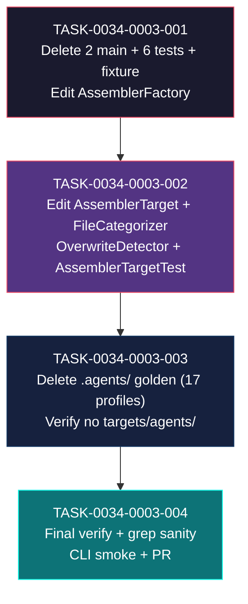

# Task Breakdown -- story-0034-0003

## Header

| Field | Value |
|-------|-------|
| Story ID | story-0034-0003 |
| Epic ID | 0034 |
| Date | 2026-04-10 |
| Author | x-story-plan (multi-agent, inline) |
| Template Version | 1.0.0 |

## Summary

| Metric | Value |
|--------|-------|
| Total Tasks | 4 |
| Parallelizable Tasks | 0 (strictly sequential per story §8) |
| Estimated Effort | M+S+M+S = ~1.0-1.5 dev-days |
| Mode | multi-agent (Architect + QA + Security + Tech Lead + PO) |
| Agents Participating | Architect, QA Engineer, Security Engineer, Tech Lead, Product Owner |

## Dependency Graph

## Classification Note (Pre-Planning)

Baseline (`plans/epic-0034/baseline-pre-epic.md`) reports **4** `*Agents*` Java main classes and **12** `*Agents*Test*` classes. Filesystem audit during planning (2026-04-10) classified each class:

### Main classes (4 total matching `*Agents*.java`)

| Class | Story Owner | Action for story-0034-0003 |
|-------|-------------|---------------------------|
| `AgentsAssembler.java` | **0034-0003** | DELETE |
| `AgentsSelection.java` | **0034-0003** | DELETE |
| `CodexAgentsMdAssembler.java` | 0034-0002 (Codex) | ALREADY DELETED by prior story — story-0003 MUST verify absent |
| `GithubAgentsAssembler.java` | 0034-0001 (Copilot) | ALREADY DELETED by prior story — story-0003 MUST verify absent |

### Test classes (12 total matching `*Agents*Test*`, plus `AgentsTestFixtures`)

| Class | Story Owner | Action for story-0034-0003 |
|-------|-------------|---------------------------|
| `AgentsAssemblerTest.java` | **0034-0003** | DELETE |
| `AgentsAssemblerCoverageTest.java` | **0034-0003** | DELETE |
| `AgentsSelectionTest.java` | **0034-0003** | DELETE |
| `AgentsGoldenMatchTest.java` | **0034-0003** | DELETE |
| `AgentsConditionalGoldenTest.java` | **0034-0003** | DELETE |
| `AgentsCoreAndDevTest.java` | **0034-0003** | DELETE |
| `AgentsTestFixtures.java` (fixture) | **0034-0003** | DELETE |
| `GithubAgentsEventTest.java` | 0034-0001 | ALREADY DELETED by prior story |
| `GithubAgentsAssemblerTest.java` | 0034-0001 | ALREADY DELETED by prior story |
| `GithubAgentsConditionalTest.java` | 0034-0001 | ALREADY DELETED by prior story |
| `GithubAgentsRenderCoreTest.java` | 0034-0001 | ALREADY DELETED by prior story |
| `CodexAgentsMdAssemblerTest.java` | 0034-0002 | ALREADY DELETED by prior story |

**Story 0034-0003 scope confirmed:** exactly 2 main + 6 test + 1 fixture, matching story §3.1 and §3.2 (aligned with story text — no baseline delta requiring escalation).

### Resources
`java/src/main/resources/targets/agents/` does NOT exist (filesystem verified 2026-04-10). Story §3.3 is correct — zero resource files to delete. Story 0003 does NOT own any `targets/` subdirectory deletion.

### Golden files
17 `.agents/` directories confirmed across all 17 profiles (filesystem verified 2026-04-10). Baseline reports 2910 files total under `.agents/`.

## Tasks Table

| Task ID | Source Agent | Type | TDD Phase | TPP Level | Layer | Components | Parallel | Depends On | Estimated Effort | DoD (augmented) |
|---------|-------------|------|-----------|-----------|-------|-----------|----------|-----------|-----------------|-----|
| TASK-0034-0003-001 | Architect + QA + Security + TL | implementation (delete) | GREEN (compile-verified) | N/A | application.assembler + adapter.test | AgentsAssembler.java, AgentsSelection.java, AssemblerFactory.java (edit), 6 Agents*Test classes + AgentsTestFixtures.java | no | -- | M | (a) [RULE-006/QA-001] Confirm all 6 Agents* test files + fixture were passing on baseline BEFORE deletion (baseline doc §"Baseline Validation" reports 837 tests passing — inclusive); (b) 2 main classes deleted: `AgentsAssembler.java`, `AgentsSelection.java`; (c) 6 test classes deleted: `AgentsAssemblerTest`, `AgentsAssemblerCoverageTest`, `AgentsSelectionTest`, `AgentsGoldenMatchTest`, `AgentsConditionalGoldenTest`, `AgentsCoreAndDevTest`; (d) fixture `AgentsTestFixtures.java` deleted; (e) `AssemblerFactory.java` edited to remove any registration / builder method referencing `AgentsAssembler` or `AgentsSelection` (if present — verify via grep before edit); (f) `AssemblerFactory.java` <= 250 lines post-edit (class length rule 03); (g) no orphan imports of deleted classes anywhere in main or test tree; (h) [SEC-001] `grep -rn "AgentsAssembler\|AgentsSelection" java/src/main/java` returns 0 post-edit; (i) [SEC-004] `grep -rn "import.*AgentsAssembler\|import.*AgentsSelection" java/src/test/java` returns 0; (j) `mvn compile` green; `mvn test-compile` green; (k) `mvn test` green for remaining tests (837 - N deleted tests from the 6 Agents* classes); (l) [TL-006] conventional commit with BREAKING CHANGE footer: `refactor(assembler)!: remove AgentsAssembler and AgentsSelection classes` |
| TASK-0034-0003-002 | Architect + Security + TL | implementation (edit) | GREEN | N/A | domain + adapter.inbound + util + adapter.test | AssemblerTarget.java, FileCategorizer.java, OverwriteDetector.java, AssemblerTargetTest.java | no | TASK-0034-0003-001 | S | (a) `AssemblerTarget.CODEX_AGENTS(".agents")` constant removed; `AssemblerTarget.values().length == 1` post-edit (only `CLAUDE(".claude")` remains); (b) `FileCategorizer.java`: any remaining `.agents/` branch / case removed (verify via grep before edit — may already be absent if story 0002 cleaned it; if absent, this item is a no-op and must be documented in commit body); (c) `OverwriteDetector.ARTIFACT_DIRS` set no longer contains `".agents"` (verify via grep); (d) `AssemblerTargetTest.java`: all asserts and parametrized cases referencing `CODEX_AGENTS` removed; test class compiles and passes; (e) [TL-007] `PlatformFilter.java` is NOT modified — verify via `git diff --name-only | grep PlatformFilter` returns empty (RULE: explicit scope boundary per story §3 note); (f) [SEC-002/CWE-209] no exception messages in edited classes expose internal paths or class names to end users; (g) [TL-003] `grep -rn "CODEX_AGENTS" java/src/main` returns 0; (h) `AssemblerTarget.java` class length stays <= 250 lines (trivially — single enum constant); (i) `mvn compile` green; `mvn test-compile` green; `mvn test` green; (j) [TL-006] conventional commit: `refactor(cli)!: remove AssemblerTarget.CODEX_AGENTS and .agents/ categorization` with BREAKING CHANGE footer |
| TASK-0034-0003-003 | QA + Security + TL | migration (delete) | GREEN | boundary | adapter.test | 17 golden profiles `.agents/` subdirs | no | TASK-0034-0003-002 | M | (a) [SEC-003/CWE-22] pre-delete check: `find java/src/test/resources/golden -type l -path '*/.agents/*'` returns empty (no symlink escape risk); (b) [SEC-002] pre-delete secrets scan: `grep -rE '(password\|secret\|token\|api_?key)' java/src/test/resources/golden/*/.agents/ 2>/dev/null` returns 0 matches (or only allow-listed template examples — document in commit body if hits found); (c) Delete `.agents/` subdirectory recursively in each of the 17 golden profiles under `java/src/test/resources/golden/{profile}/.agents/` (profiles: `java-quarkus`, `python-fastapi`, `python-fastapi-timescale`, `java-spring-elasticsearch`, `typescript-nestjs`, `java-spring-hexagonal`, `python-click-cli`, `rust-axum`, `java-spring-neo4j`, `java-spring-clickhouse`, `java-spring-event-driven`, `java-spring-fintech-pci`, `java-spring`, `kotlin-ktor`, `java-spring-cqrs-es`, `go-gin`, `typescript-commander-cli`); (d) ~2910 files removed (per baseline); (e) [QA-004] post-delete verification: `find java/src/test/resources/golden -type d -name '.agents' \| wc -l` returns 0; (f) [QA-005] no regression in other golden profiles: `find java/src/test/resources/golden -type d -name '.claude' \| wc -l` unchanged from baseline (17); (g) verify `java/src/main/resources/targets/agents/` does NOT exist (story §3.3 invariant — `ls java/src/main/resources/targets/ \| grep -c agents` returns 0); (h) `mvn compile` green; `mvn test-compile` green; `mvn test` green (golden-match tests should not fail because the AgentsGoldenMatchTest that consumed these files was deleted in TASK-001); (i) [TL-006] conventional commit: `test(golden)!: delete .agents/ golden subdirs from 17 profiles` |
| TASK-0034-0003-004 | QA + Security + TL + PO | quality-gate + validation | VERIFY | N/A | config + test | final verification + PR | no | TASK-0034-0003-003 | S | (a) [TL-001/RULE-001] `mvn clean verify` green end-to-end; (b) [TL-002/RULE-002] JaCoCo line coverage >= 95%, branch coverage >= 90%, absolute degradation <= 2pp vs. baseline (95.69% line / 90.69% branch); JaCoCo report file path recorded for PR; (c) [TL-004/QA-AT-3] grep sanity: `grep -rn "\.agents/\|CODEX_AGENTS\|AgentsAssembler\|AgentsSelection" java/src/main` returns 0; (d) [QA-AT-4] boundary: `find java/src/test/resources/golden -type d -name '.agents'` returns 0; (e) [QA-AT-2] enum invariant: `AssemblerTarget.values().length == 1` (verified indirectly via AssemblerTargetTest passing); (f) [QA-AT-5] CLI regression smoke: `java -jar target/*.jar generate --platform claude-code --output-dir /tmp/test-out` succeeds with exit 0 and produces `.claude/` but NOT `.agents/` (assert `test ! -d /tmp/test-out/.agents`); (g) [PO-001] epic cumulative golden removal: verify total deleted across 3 stories (stories 0001+0002+0003) matches projected ~8273 files per baseline (2324 .github + 2944 .codex + 2910 .agents = 8178 — document actual vs projected in PR body); (h) [PO-002] PR body contains metrics table: before/after counts for main classes (2 deleted), test classes (6 + 1 fixture deleted), golden dirs (17 removed), golden files (~2910 deleted), enum size (2 -> 1); (i) [PO-004/TL-007] `git diff --name-only origin/develop..HEAD -- '*/PlatformFilter*'` returns empty (PlatformFilter.java MUST NOT appear in changeset — owned by story-0034-0004); (j) [TL-005] all task commits on branch follow Conventional Commits format with scope (`assembler`, `cli`, `golden`) and BREAKING CHANGE footers where applicable; (k) [TL-006] PR created for `feature/epic-0034-remove-non-claude-targets` with story §3.5 Metrica de Sucesso checklist in PR body; (l) PR body contains link to JaCoCo report artifact; (m) [PO-003] PR body explicitly notes "Phase 2 of epic-0034 complete — next story (0004) is higienization, not removal"; (n) [SEC-005] final secrets scan post-commit: `grep -rnE '(password\|secret\|token\|api_?key)' java/src/main/resources/targets/` returns no new unintended matches |

## Escalation Notes

| Task ID | Reason | Recommended Action |
|---------|--------|--------------------|
| TASK-0034-0003-001 | Baseline reports 4 `*Agents*` main classes and 12 `*Agents*Test*` classes, but story §3.1/§3.2 declare only 2 main + 6 test + 1 fixture. Classification performed during planning (see "Classification Note" above) confirms the 2 extra main classes (`GithubAgentsAssembler`, `CodexAgentsMdAssembler`) and 5 extra test classes (`GithubAgents*` x4, `CodexAgentsMdAssemblerTest` x1) belong to stories 0034-0001 and 0034-0002 respectively. | No action: classification is correct. Story 0003 deletes exactly what §3.1/§3.2 declare. Before starting TASK-001, verify that stories 0001 and 0002 have been merged (or their branches integrated locally) so the 5 pre-owned files are already gone. If they still exist at TASK-001 start, escalate to x-dev-story-implement: prerequisite stories not met. |
| TASK-0034-0003-002 | Story §3.6 lists `FileCategorizer.java` and `OverwriteDetector.java` as editing targets for `.agents/` removal. If stories 0001 or 0002 (or story 0004 early cleanup) already removed the `.agents/` branches as collateral cleanup, this edit becomes a no-op. | Before editing, grep each file for `.agents` literal. If 0 matches, document in commit body "no-op: already cleaned by prior story". Do NOT fail the task — it's structurally valid. |
| TASK-0034-0003-002 | Story explicitly forbids touching `PlatformFilter.java` in this story (owned by story-0034-0004). `PlatformFilter` likely has residual branches for `.agents/` after this story completes, which is intentional. | Do NOT edit `PlatformFilter.java`. Verify in PR that `git diff --name-only` does NOT include `PlatformFilter.java`. Any residual `.agents/` branch inside that file is owned by story-0004 and must be left alone. |
| TASK-0034-0003-003 | Profile count: filesystem verified 17 profiles with `.agents/` subdirs (listed in DoD item (c)). Baseline reports same count. Story §3.4 says "17 profiles (~2.910 files total)". | Use the explicit 17-profile list in DoD (c). If a profile is missing its `.agents/` at delete time, skip it silently — either baseline was wrong or a prior story cleaned it. |
| TASK-0034-0003-003 | Story §3.3 says "targets/agents/ does not exist". Verified during planning. Should planning be wrong and the directory appear at runtime, the task must delete it recursively as a safety net. | Add pre-check `test -d java/src/main/resources/targets/agents && rm -rf` as a defensive step in the task execution. Document in commit body if the directory was found unexpectedly. |
| TASK-0034-0003-004 | Baseline §"Golden Files" projects ~8273 cumulative golden removal across epic (2324 .github + 2944 .codex + 2910 .agents + tolerance). Story §3.5 metric (5) cites same. Actual math: 2324 + 2944 + 2910 = **8178** files, not 8273. Discrepancy of 95. | Document the correct arithmetic in PR body: cumulative = 8178. The 95-file delta equals the exact count of `.github/workflows/` files (protected, NOT deleted). The 8273 figure may have included workflows in the projection by mistake. Final state is correct; only the commentary needs fixing. Do not block the story. |
