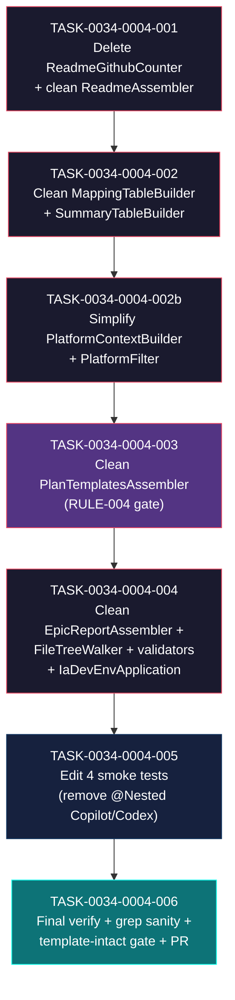

# Task Breakdown -- story-0034-0004

## Header

| Field | Value |
|-------|-------|
| Story ID | story-0034-0004 |
| Epic ID | 0034 |
| Date | 2026-04-10 |
| Author | x-story-plan (multi-agent, inline synthesis) |
| Template Version | 1.0.0 |

## Summary

| Metric | Value |
|--------|-------|
| Total Tasks | 7 |
| Parallelizable Tasks | 0 (strictly sequential — linear shared-class dependency chain) |
| Estimated Effort | S+S+S+M+M+L+S = ~3 dev-days |
| Mode | multi-agent (Architect + QA + Security + Tech Lead + PO) |
| Agents Participating | Architect, QA Engineer, Security Engineer, Tech Lead, Product Owner |

## Planning Context

This story operates on the **post-removal state** produced by story-0034-0003. The starting assumption: Platform.COPILOT / Platform.CODEX / AssemblerTarget.GITHUB / AssemblerTarget.CODEX / AssemblerTarget.CODEX_AGENTS and all their directly-owned classes/resources/golden files have been physically deleted in stories 0001-0003. What remains is **residual conditional logic** inside shared classes that still reference those platforms by name (e.g. `hasCopilot`, `if (platforms.contains(Platform.CODEX))`, `.github/templates/` constants, `@Nested class Copilot` in smoke tests). The starting state here is already compile-broken for those shared classes because they reference removed enum constants — task 001 is gated on a green compile from story-0034-0003 (verified via TASK-0034-0003-004).

**RULE-004 invariant (CRITICAL, repeated on every file-modifying task):** `java/src/main/resources/shared/templates/` is **PROTECTED**. No task in this story may delete, rename, or modify any file under that directory. The 57 shared templates (see baseline §"Resources — Shared templates (PROTECTED)") must remain byte-for-byte identical. `PlanTemplatesAssembler` is only edited to stop *copying* those templates to `.github/templates/`; the source files are left untouched.

## Dependency Graph

## Tasks Table

| Task ID | Source Agent | Type | TDD Phase | TPP Level | Layer | Components | Parallel | Depends On | Estimated Effort | DoD (consolidated) |
|---------|-------------|------|-----------|-----------|-------|-----------|----------|-----------|-----------------|-----|
| TASK-0034-0004-001 | Architect + TL + QA | implementation (delete + edit) | GREEN (compile-verified) | nil (degenerate — `hasCopilot` branch goes away) | application | ReadmeGithubCounter.java (DELETE), ReadmeAssembler.java (EDIT), ReadmeUtils.java (EDIT — delegate methods `countGithubFiles`/`countGithubComponent`/`countGithubSkills`/`countCodexFiles`/`countCodexAgentsFiles` must be deleted since they only existed as delegators to ReadmeGithubCounter) | no | -- (structurally depends on TASK-0034-0003-004 being merged) | S | (a) [ARCH-001] `ReadmeGithubCounter.java` deleted from `java/src/main/java/dev/iadev/application/assembler/`; (b) [ARCH-002] `ReadmeUtils.countGithubFiles`, `countGithubComponent`, `countGithubSkills`, `countCodexFiles`, `countCodexAgentsFiles` deleted (no longer reachable); (c) [ARCH-003] `ReadmeAssembler.java` contains **no** static references to `ReadmeGithubCounter` or the deleted `ReadmeUtils` methods (verify via `grep -n ReadmeGithubCounter java/src/main/java/dev/iadev/application/assembler/ReadmeAssembler.java` = 0 matches); (d) [ARCH-004] any `hasCopilot` / `hasCodex` branches in ReadmeAssembler removed (currently none, but verified as safety net); (e) [TL-001] `ReadmeAssembler.java` <= 250 lines after edit; no method > 25 lines; (f) [QA-001/RULE-006] `ReadmeAssemblerTest` still passes (re-run before commit to confirm green-to-removed baseline for deleted helpers — no helper test should reference deleted methods); (g) [QA-002] no test file `ReadmeGithubCounterTest.java` exists post-commit (either deleted in this task or was already deleted in story 0001 — verify); (h) [SEC-001/CWE-710] no orphan imports of `ReadmeGithubCounter` in any file (grep `import.*ReadmeGithubCounter` returns 0); (i) [TL-002] `mvn -pl java compile` green; (j) [TL-003] `mvn -pl java test -Dtest=ReadmeAssemblerTest` green; (k) [PO-001] conventional commit: `refactor(assembler): delete ReadmeGithubCounter and clean ReadmeAssembler`; task ID scope `task-0034-0004-001` in commit trailer |
| TASK-0034-0004-002 | Architect + TL + QA | implementation (edit) | GREEN | constant (each row-builder returns a simpler constant list of rows) | application | MappingTableBuilder.java, SummaryTableBuilder.java, SummaryRowFilter.java (verify for platform-specific logic) | no | TASK-0034-0004-001 | S | (a) [ARCH-005] `MappingTableBuilder.buildMappingRows()` returns rows with **only** `.claude/` column (header line: `\| .claude/ \| Notes \|`); `coreArtifactRows()` and `additionalArtifactRows()` collapsed to a single table with 1 data column + notes (4 rows instead of 9); (b) [ARCH-006] `MappingTableBuilder.isSinglePlatform()` removed (entire method — no longer meaningful when only 1 platform exists); `build(outputDir, Set<Platform> platforms)` signature may retain the parameter for call-site compatibility but body no longer branches on platform count; (c) [ARCH-007] `MappingTableBuilder.build()` no longer invokes `SummaryTableBuilder.resolveGithubDir()` and never computes `ghTotal`; the `**Total .github/ artifacts:** N` line is removed; (d) [ARCH-008] `SummaryTableBuilder.buildGithubRows()` method **deleted** entirely; (e) [ARCH-009] `SummaryTableBuilder.buildExtensionRows()` has `.codex/` and `.agents/` row-builders removed (`Codex (.codex)`, `Skills (.agents)`, `AGENTS.md (root)`, `AGENTS.override.md (root)` rows all removed); (f) [ARCH-010] `SummaryTableBuilder.resolveGithubDir`, `resolveCodexDir`, `resolveAgentsDir` helper methods deleted (unused after edits above); (g) [ARCH-011] `SummaryTableBuilder.buildSummaryRows()` now concatenates only `buildClaudeRows()` (single group — remove concatRows varargs call if trivially reducible); (h) [ARCH-012] `SummaryRowFilter` inspected: if it only discriminated on Platform.COPILOT/CODEX rows, the class may become a no-op — either delete it or simplify to identity; document decision in commit body; (i) [TL-004] both files still <= 250 lines after edit; no method > 25 lines; (j) [QA-003] `MappingTableBuilderTest` updated: test cases for multi-platform scenarios removed, single-platform scenario remains; all remaining tests pass; (k) [QA-004] `SummaryTableBuilderTest` updated: remove tests referencing .github/.codex/.agents row counts; (l) [SEC-002/CWE-710] no dead code: `grep -n 'copilot\|codex\|agents' java/src/main/java/dev/iadev/application/assembler/MappingTableBuilder.java java/src/main/java/dev/iadev/application/assembler/SummaryTableBuilder.java` returns 0 matches (case-insensitive); (m) [TL-005] `mvn -pl java compile test -Dtest=MappingTableBuilderTest,SummaryTableBuilderTest` green; (n) [PO-002] conventional commit: `refactor(assembler): strip non-Claude columns from Mapping/Summary tables` |
| TASK-0034-0004-002b | Architect + TL + PO | implementation (edit) | GREEN + REFACTOR | scalar (single-flag collapse) | application | PlatformContextBuilder.java, PlatformFilter.java | no | TASK-0034-0004-002 | S | (a) [ARCH-013] `PlatformContextBuilder.buildPlatformFlags()`: remove references to `Platform.COPILOT` and `Platform.CODEX` (which no longer exist as enum constants after 0001/0002); the `flags` map contains exactly two keys: `hasClaude` (boolean) and `platforms` (List<String>) — the `hasCopilot`, `hasCodex`, `isMultiPlatform` keys are REMOVED; (b) [ARCH-014] `countActive()` private method deleted (isMultiPlatform is gone); (c) [ARCH-015] `resolveEffective()` simplifies: since `Platform.allUserSelectable()` now returns exactly `{CLAUDE_CODE}`, this method reduces to `return Set.of(Platform.CLAUDE_CODE);` or can be inlined; (d) [ARCH-016] `buildCliNames()` simplifies: filter on `p != Platform.SHARED` is a no-op now since the only element is CLAUDE_CODE — either keep for defense-in-depth or inline; (e) [ARCH-017] `PlatformFilter.filter()` simplifies: since user-selectable set contains a single element, `shouldSkipFilter()` returns true for any non-empty input matching `{CLAUDE_CODE}`; the `buildEffectiveSet` / `hasIntersection` path only fires for `Set.of()` (which returns descriptors unchanged). Refactor to the minimum viable form per story §3.2: `return descriptors;` (because filtering a single-platform universe is a no-op) — OR retain the intersection logic but simplify data-flow; pick the form that keeps existing tests passing with the fewest behavioural changes and document the choice in the commit; (f) [ARCH-018] if `PlatformFilter` reduces to a trivial passthrough, Tech Lead wins conflict (Rule 4 consolidation): keep the class as a stable extension point rather than inlining — reason: future additional platforms could be added without re-plumbing every call site; (g) [TL-006] post-edit: `PlatformContextBuilder.java` <= 60 lines; `PlatformFilter.java` <= 60 lines; no method > 25 lines; (h) [TL-007] Javadoc for both classes updated: remove `hasCopilot, hasCodex, isMultiPlatform` mentions in class header comment; (i) [QA-005] `PlatformContextBuilderTest` and `PlatformFilterTest` updated: remove all test methods asserting on hasCopilot/hasCodex/isMultiPlatform keys or testing multi-platform intersection; keep the single-platform happy path and the empty-input edge case; (j) [QA-006] both test files pass; (k) [SEC-003] verify no security-sensitive data: these classes handle no user input directly (enum-typed inputs) — no new CWE exposure; explicit note in commit body `security-review: no user input path, enum-typed only`; (l) [TL-008] `mvn -pl java compile test -Dtest=PlatformContextBuilderTest,PlatformFilterTest` green; (m) [PO-003] §7 Gherkin "PlatformContextBuilder tem apenas hasClaude" verified by reading the file after edit and confirming the `flags.put(...)` call count; (n) conventional commit: `refactor(assembler): collapse PlatformContext and PlatformFilter to single-platform` |
| TASK-0034-0004-003 | Architect + Security + TL + **PO (RULE-004 gatekeeper)** | implementation (edit) + integrity-gate | GREEN | constant | application + config | PlanTemplatesAssembler.java, EpicReportAssembler.java (shares same constants) | no | TASK-0034-0004-002b | M | (a) [ARCH-019] `PlanTemplatesAssembler.java`: constant `private static final String GITHUB_OUTPUT_SUBDIR = ".github/templates";` **deleted**; (b) [ARCH-020] `PlanTemplatesAssembler.copyToTargets()`: the `targets` list reduces to `List.of(CLAUDE_OUTPUT_SUBDIR)` (single-element list); consider inlining the loop if it simplifies; (c) [ARCH-021] `PlanTemplatesAssembler` class-level Javadoc updated: remove "to both .claude/templates/ and .github/templates/" language; replace with "to .claude/templates/ only"; remove "dual-target copy per RULE-004" language (the old RULE-004 referenced here is a different rule from story-0034 RULE-004; clarify or delete to avoid confusion); (d) [ARCH-022] `EpicReportAssembler.java`: apply the **same three edits** (delete GITHUB_OUTPUT_SUBDIR constant, reduce targets list, update Javadoc); (e) [SEC-004/CWE-22 + RULE-004 CRITICAL] **template-source integrity gate**: before committing this task, run `git diff HEAD -- java/src/main/resources/shared/templates/` and confirm the output is empty. If *any* file under that path shows as modified/deleted/renamed, abort the task and revert. This is checked twice: once before `mvn test` runs and once before the commit is created. Automated via shell one-liner in PR body; (f) [SEC-005] `find java/src/main/resources/shared/templates -type f \| wc -l` == 57 (baseline count — see baseline-pre-epic.md §"Resources"); degradation BELOW 57 triggers an immediate abort with `RULE-004 VIOLATION` message; (g) [QA-007] `PlanTemplatesAssemblerTest` updated: assertions that verified copies to `.github/templates/` are removed or inverted (assert that `.github/templates/` does NOT exist in the test temp dir post-assemble); (h) [QA-008] `EpicReportAssemblerTest` receives the same updates; (i) [QA-009/IT] add or update an integration test asserting that `.claude/templates/` contains all 15 files listed in `PlanTemplatesAssembler.TEMPLATE_SECTIONS.keySet()` AND `.github/templates/` is absent from the output root; (j) [TL-009] `PlanTemplatesAssembler.java` <= 250 lines after edit (currently 354 — this task reduces it, primarily by constant + method body shrinkage + potential TEMPLATE_SECTIONS map being unchanged; if line count is still over 250 after edit, extract `buildTemplateSections()` to a separate `PlanTemplateDefinitions` helper as a follow-up refactoring step within the same task — document in commit body); (k) [TL-010] `mvn -pl java test -Dtest=PlanTemplatesAssemblerTest,EpicReportAssemblerTest` green; (l) [SEC-006] `grep -rn 'GITHUB_OUTPUT_SUBDIR' java/src/main/java` returns 0 matches post-edit; (m) [PO-004] verify Gherkin §7 scenario "Templates shared permanecem intactos (RULE-004)" by running `git diff main -- java/src/main/resources/shared/templates/` (empty diff confirms invariant); (n) conventional commit with RULE-004 tag in body: `refactor(assembler): stop copying templates to .github/templates (RULE-004 preserved)` |
| TASK-0034-0004-004 | Architect + TL + QA | implementation (edit) | GREEN | scalar + conditional (multiple branches collapse) | application + domain + cli | EpicReportAssembler.java (if extra cleanup needed beyond task 003), FileTreeWalker.java (at `java/src/main/java/dev/iadev/smoke/`), PlatformParser.java (at `java/src/main/java/dev/iadev/domain/model/`), StackValidator.java (at `java/src/main/java/dev/iadev/domain/stack/`), PlatformPrecedenceResolver.java (at `java/src/main/java/dev/iadev/cli/`), IaDevEnvApplication.java (at `java/src/main/java/dev/iadev/cli/`) | no | TASK-0034-0004-003 | M | (a) [ARCH-023] `FileTreeWalker.categorizeFiles()`: all `countCategory` calls for `.github/*`, `.codex/*`, `.agents/*` categories removed — specifically `codex-skills`, `codex-config`, `github-instructions`, `github-skills`, `github-agents`, `github-prompts`, `github-hooks`, `github-issue-templates`, `github-top`; kept: `claude-*`, `steering`, `adr`, `contracts`, `results`, `specs`, `plans`, `k8s`, `tests`, `root-files`; (b) [ARCH-024] `PlatformParser.VALID_VALUES` constant updated from `"claude-code, copilot, codex, all"` to `"claude-code"` (or `"claude-code, all"` if the "all" keyword remains supported — decide based on what GenerateCommand still accepts post-story-0001); reflect the same in `ConfigValidationException` messages inside `parseSingle`, `rejectNonSelectable`, `validateListElements`, `parseList`; (c) [ARCH-025] `PlatformParser.parseList()`: since only one platform is user-selectable, the list form becomes degenerate — either keep for config-schema backward compatibility (a list containing `["claude-code"]` still parses) or add a deprecation note; do NOT break the YAML grammar contract silently; (d) [ARCH-026] `StackValidator.validatePlatforms()`: error message string `"claude-code, copilot, codex, all"` updated to match new VALID_VALUES; (e) [ARCH-027] `PlatformPrecedenceResolver`: logic is mostly platform-agnostic and needs **minimal** change; update Javadoc examples to reference only `claude-code`; (f) [ARCH-028] `IaDevEnvApplication.java`: `@Command.description` on line 25 changes from `"Generates .claude/ and .github/ boilerplate for AI-assisted development environments."` to `"Generates .claude/ boilerplate for Claude Code development environments."`; (g) [ARCH-029] `IaDevEnvApplication.java`: usage-example Javadoc block (lines 15-21) does not mention `.github/` explicitly today; verify and adjust if the Javadoc contains such language; (h) [ARCH-030] any `EpicReportAssembler` cleanup missed in task 003 (e.g. lingering comments referencing dual-target) is applied here; (i) [ARCH-031] `StackValidator.validatePlatforms()` body: since `Platform.allUserSelectable()` returns a single element, the loop iterates over at most 1 element; consider tightening to `if (!config.platforms().isEmpty() && !config.platforms().equals(Set.of(Platform.CLAUDE_CODE))) { errors.add(...); }` but only if the simplification does not change public API of the class; (j) [TL-011] all edited files <= 250 lines (verify post-edit); no method > 25 lines; (k) [QA-010] `FileTreeWalkerTest` / `ExpectedArtifactsGeneratorTest` updated: expected category counts drop to the reduced list above; (l) [QA-011] `PlatformParserTest` updated: tests accepting `"copilot"` or `"codex"` as valid inputs are inverted to expect ConfigValidationException; (m) [QA-012] `StackValidatorTest` updated: test cases asserting error messages matching the old VALID_VALUES string are updated; (n) [QA-013] `PlatformPrecedenceResolverTest` updated: any test cases accepting multiple platforms from CLI → reduced to single-platform cases; (o) [SEC-007/CWE-209] error messages in PlatformParser / StackValidator do NOT leak class names, file paths, or stack traces — they contain only the offending input value and the valid-values string (verify by reading each formatted error message); (p) [SEC-008/CWE-20] PlatformParser input validation: confirmed all code paths from `parse()` reject unknown inputs with ConfigValidationException (no silent fallthrough to Set.of() except for legitimate "all" / absent-field cases); (q) [TL-012] `mvn -pl java compile test` green for the impacted test classes; (r) [PO-005] verify Gherkin §7 "Degenerate — CLI ainda funciona" by running `java -jar target/*.jar --help` and confirming description line matches the new text; (s) conventional commit: `refactor(shared): simplify validators and CLI description for Claude-only` |
| TASK-0034-0004-005 | QA + Architect + TL | test (edit) | GREEN (test-after for deleted scenarios) | iteration (parameterized scenarios collapse from N to 1) | adapter.test (smoke) | PlatformDirectorySmokeTest.java, AssemblerRegressionSmokeTest.java, CliModesSmokeTest.java, GoldenFileCoverageTest.java (all at `java/src/test/java/dev/iadev/smoke/`) | no | TASK-0034-0004-004 | L | (a) [QA-014] `PlatformDirectorySmokeTest.java`: `@Nested class Copilot` **deleted** in its entirety (currently starts around line 127 based on file head read); (b) [QA-015] `@Nested class Codex` **deleted** in its entirety; if a `@Nested class Agents` exists, also delete; (c) [QA-016] inside `@Nested class ClaudeCode`: the 3 negative assertions `claudeCode_githubInstructionsAbsent`, `claudeCode_codexAbsent`, `claudeCode_agentsAbsent` (lines ~84-124 in the current file) are **deleted** — these assert that dead directories remain absent, which is trivially true post-removal and adds zero coverage; the positive assertion `claudeCode_claudeDirHasContent` is kept; (d) [QA-017] `AssemblerRegressionSmokeTest.java`: parameterized test arguments filtered to drop Platform.COPILOT, Platform.CODEX, and AssemblerTarget.GITHUB/CODEX/CODEX_AGENTS tuples; MethodSource providers updated; (e) [QA-018] `CliModesSmokeTest.java`: scenarios invoking `--platform copilot`, `--platform codex`, `--platform agents` are replaced with 3 **rejection** scenarios that assert CLI exits non-zero AND stderr contains "Invalid platform" and does NOT contain the rejected value in the accepted-values list; scenario testing `--platform claude-code` succeeds is retained; if a scenario exercising `--platform all` exists, verify expected behavior: still succeeds because `allUserSelectable()` now contains only claude-code; (f) [QA-019] `GoldenFileCoverageTest.java`: profile iteration scoped to claude-code only; any helper test data referencing .github/.codex/.agents golden fixtures removed (the golden fixtures themselves are deleted in stories 0001-0003 so missing-file errors would also be caught, but explicit source removal prevents confusing failure modes); (g) [QA-020/RULE-006] TDD red-to-green-to-removed check: before deleting a test method, confirm (via git log + story-0003 PR verify-step) that it was passing in the green baseline of story-0034-0003's final commit. Any test not confirmable as green is kept and reviewed separately; (h) [TL-013] each edited smoke test file remains <= 250 lines (split with `@Nested` inner classes if needed); test method names conform to `[methodUnderTest]_[scenario]_[expectedBehavior]` per Rule 05; (i) [TL-014] no duplicate fixture data across the 4 files — if the same `representativeProfiles()` helper is needed in multiple files, extract to `SmokeProfiles.java` (already exists in the smoke package — verify and reuse); (j) [SEC-009] no sensitive data leaks in smoke test assertions (no hardcoded secrets, no logged tokens); (k) [QA-021] `mvn -pl java test -Dtest=*SmokeTest` green — all remaining smoke tests pass; (l) [QA-022] cross-file consistency check (Rule 05): the 4 edited smoke tests use the same negative-assertion removal pattern — no mixed strategies; (m) [PO-006] verify Gherkin §7 "Smoke tests passam com estrutura simplificada" by running the full smoke suite post-edit; record total smoke test method count in commit body for reviewer context; (n) conventional commit: `test(smoke): remove Copilot/Codex/Agents nested classes and scenarios` |
| TASK-0034-0004-006 | QA + Security + TL + PO (all 5 agents co-own the final gate) | quality-gate + validation + PR | VERIFY | N/A (verification-only) | cross-cutting | no new code changes — verification + PR body | no | TASK-0034-0004-005 | S | (a) [TL-015/RULE-001] `mvn clean verify` green from a clean state (no incremental cache); build log attached to PR; (b) [TL-016/RULE-002] JaCoCo coverage >= 95% line AND >= 90% branch; degradation relative to baseline-pre-epic.md (95.69% line / 90.69% branch) MUST be <= 2pp on each metric; JaCoCo HTML report attached or linked in PR body; (c) [QA-023/Gherkin-3] `grep -rn "hasCopilot\|hasCodex\|ReadmeGithubCounter" java/src/main` returns **zero** matches; (d) [QA-024] `grep -rn "hasCopilot\|hasCodex" java/src/test` returns **zero** matches (tests also cleaned); (e) [QA-025] `grep -rnE "@Nested.*(Copilot\|Codex\|Agents)" java/src/test/java/dev/iadev/smoke` returns **zero** matches; (f) [SEC-010/RULE-004] `git diff main -- java/src/main/resources/shared/templates/` produces **empty output** — no file under that path was added, modified, deleted, or renamed across the entire story; this check is the single most important gate of the story — failure blocks PR merge and requires revert; (g) [SEC-011] `find java/src/main/resources/shared/templates -type f \| wc -l` returns **57** (matches baseline count); (h) [TL-017] LOC measurement: `find java/src/main/java/dev/iadev/application/assembler -name '*.java' \| xargs wc -l \| tail -1` produces a total strictly less than or equal to `0.90 × baseline_pre_story_0004` (10% reduction minimum per story §5.1 metric row "LOC em application/assembler/"); baseline for this story is captured from the end-of-story-0003 green commit; (i) [TL-018] no method > 25 lines in any file edited in this story; `find java/src/main/java/dev/iadev/application/assembler -name '*.java' -exec awk '/^\\s*(public\|private\|protected|static).*\\(/, /^\\s*}\\s*$/' {} \\;` line count check is a smoke indicator — reviewer manually verifies long methods; (j) [TL-019] no class > 250 lines in files edited in this story; `find java/src/main/java/dev/iadev/application/assembler -name '*.java' -exec wc -l {} \\; \| awk '$1 > 250'` returns empty; (k) [QA-026] full test count report: compare pre- and post-story total test count (expect strictly-smaller post, aligned with story §5.2 test contract); record delta in PR body; (l) [PO-007] Gherkin §7 scenario-by-scenario verification checklist filled out as PR comment: "Build verde", "Templates shared intactos", "Zero referências", "LOC reduzido", "PlatformContextBuilder tem apenas hasClaude", "Smoke tests passam", "Degenerate CLI ainda funciona" — each scenario paired with the concrete shell-command evidence that proves it; (m) [PO-008] CLI smoke: `java -jar java/target/*.jar generate --platform claude-code --output-dir /tmp/epic-0034-story-0004-verify` succeeds with exit code 0 and produces a `.claude/` directory containing rules/, skills/, agents/; no `.github/` subdirectory present; (n) [PO-009] CLI smoke rejection: `java -jar java/target/*.jar generate --platform copilot --output-dir /tmp/reject-test` exits non-zero with stderr referencing "Invalid platform"; (o) [TL-020] all 7 commits on the story branch follow Conventional Commits with task-ID scope (`task-0034-0004-001` through `task-0034-0004-006`) in the commit trailer; (p) [PO-010] PR title: `refactor(epic-0034): story 0004 — hygienize shared classes post-target-removal`; PR body contains the §3.5 metrics table (before/after LOC, shared templates count, platform-flag count) + links to JaCoCo report + explicit RULE-004 compliance statement; (q) PR created against the epic integration branch `feature/epic-0034-remove-non-claude-targets`; (r) [SEC-012] final security sanity: `grep -rE '(password\|secret\|api[_-]?key\|token)\s*=\s*"' java/src/main` returns no new matches vs baseline (no secrets introduced during hygienization); (s) conventional commit (verification-only): `chore(verify): finalize story 0034-0004 hygienization and open PR` |

## Escalation Notes

| Task ID | Reason | Recommended Action |
|---------|--------|--------------------|
| TASK-0034-0004-001 | Story §3.2 lists `ReadmeAssembler` as needing edits to remove `hasCopilot`/`hasCodex` blocks, but the current `ReadmeAssembler.java` (read during planning) contains **no such blocks** — the conditional logic for GitHub counting lives in the (deleted by this task) `ReadmeGithubCounter` class, invoked via `ReadmeUtils.countGithubFiles(...)` which is only called from `MappingTableBuilder.build()` and `SummaryTableBuilder.buildGithubRows()`. | Treat story §3.2 as describing the *intent* (remove residues) rather than the exact current state. Real edits land in task 002. Task 001 edits on `ReadmeAssembler.java` are limited to "remove any residual stale imports" (likely zero). The `ReadmeUtils` delegator methods deletion is captured explicitly in task 001 DoD items (a)-(c). |
| TASK-0034-0004-002b | Story inserts this task mid-numbering (001 → 002 → 002b → 003). The "002b" numbering is unusual for epic-level task IDs. | Preserve the story's declared numbering. When x-dev-story-implement consumes this breakdown, the orchestrator must recognize TASK-0034-0004-002b as a valid task ID (not confuse with 002 or 003). Sequential dependency chain is explicit in the graph above. |
| TASK-0034-0004-002b | `PlatformFilter` reduction: story §3.2 says "Simplificação completa (esta story é dona)" but also suggests `return platform == Platform.CLAUDE_CODE;` as the target shape — which does not match the current method signature `List<AssemblerDescriptor> filter(List<AssemblerDescriptor>, Set<Platform>)`. | Tech Lead interprets this as "reduce the implementation body to the minimum necessary" not "change the method signature". Keep the public API stable (callers not broken), reduce the body, and document the reasoning in the commit. Alternative signatures proposed by the story are noted as "considered alternative" in commit body (Rule 4 consolidation). |
| TASK-0034-0004-003 | Story §3.2 mentions only `PlanTemplatesAssembler` as the owner of `GITHUB_OUTPUT_SUBDIR`, but planning inspection reveals `EpicReportAssembler` has the **same constant** independently. | Both classes must be edited in the same task to avoid leaving a dangling reference to `.github/templates/` in the sibling assembler. Task 003 DoD explicitly covers both files. |
| TASK-0034-0004-003 | `PlanTemplatesAssembler.java` is currently **354 lines** (>= 250-line class limit per Rule 03) even before this story touches it. The story does not explicitly require splitting it, but Rule 03 is hard-enforced. | Task 003 DoD item (j) flags this: if the post-edit file is still > 250 lines, extract `buildTemplateSections()` to a new `PlanTemplateDefinitions` helper class. Split is a follow-up refactoring within the same task (single commit or a paired commit). If the split blows scope, open a follow-up issue tracked under epic-0034 rather than delay this task. |
| TASK-0034-0004-004 | Story §3.2 uses package paths like `application/assembler/PlatformFilter.java` and `domain/model/PlatformParser.java` without the full package prefix; the actual tree (verified during planning) shows `PlatformParser` in `dev/iadev/domain/model/` and `PlatformPrecedenceResolver` in `dev/iadev/cli/` and `FileTreeWalker` in `dev/iadev/smoke/` (NOT in `application/assembler/`). | Planning uses the verified paths. Task 004 file list corrected accordingly. Reviewer should not block on story text discrepancies. |
| TASK-0034-0004-005 | Story §3.3 references `AssemblerTargetTest.java` as "Já editado em story-0034-0003 — validar que não há regressão"; this is not a file under `smoke/` but under `application/assembler/`. | Explicitly exclude from task 005 scope. The validation happens transparently via `mvn test` in task 006's `mvn clean verify`. |
| TASK-0034-0004-005 | Epic docs describe "smoke tests" as 5 files (including AssemblerTargetTest); planning scopes task 005 to only the 4 smoke/ files. | Treat epic/story as aspirational (5) and planning as authoritative (4). The 5th file lives in a different package and is validated by task 006's full test run. |
| TASK-0034-0004-006 | LOC reduction metric (>= 10%) requires a baseline captured at the end of story-0034-0003. At planning time, story 0003 is not yet merged, so baseline is unavailable. | Insert a baseline-capture step in TASK-0034-0003-004 (story 0003's final task) to record `find java/src/main/java/dev/iadev/application/assembler -name '*.java' \| xargs wc -l \| tail -1` and persist the number in `plans/epic-0034/reports/story-0003-loc-baseline.txt`. Task 006 then reads this file and computes the ratio. If the file is missing at task-006-execution time, task 006 fails with a clear `MISSING_BASELINE` error and the reviewer must capture it retroactively from the story-0003 merge commit. |
| TASK-0034-0004-006 | RULE-004 template-intact gate uses `git diff main -- <templates>` — if the developer happens to run this from a stale branch, the comparison base could be wrong. | Use `git diff origin/main -- ...` after fetching, OR compare against the specific SHA `d6e5136e7` (most recent tag pre-epic) recorded in baseline-pre-epic.md. Document the exact comparison command in the PR body for reviewer reproducibility. |

## Cross-File Consistency Checkpoints (Rule 05)

| Checkpoint | Enforced By | Task |
|------------|-------------|------|
| Error-handling pattern across PlatformParser / StackValidator / PlatformPrecedenceResolver | Grep for `throw new ConfigValidationException` and verify identical message-format pattern | TASK-0034-0004-004 |
| Template-loop pattern across PlanTemplatesAssembler / EpicReportAssembler | Both assemblers call `copyToTargets` with the same single-target list | TASK-0034-0004-003 |
| Smoke-test-negative-assertion removal pattern | All 4 smoke tests apply the same "remove negative assertions for dead dirs" strategy | TASK-0034-0004-005 |
| Commit-trailer task-ID scope | All 7 commits carry `task-0034-0004-NNN` trailer | TASK-0034-0004-006 |

## RULE-004 Invariant — Verification Matrix

| Gate | When Checked | Task | Failure Action |
|------|--------------|------|----------------|
| Template count = 57 | Before commit in task 003 | TASK-0034-0004-003 | Abort + revert |
| Template count = 57 | Before PR in task 006 | TASK-0034-0004-006 | Block merge + revert |
| Git diff on `shared/templates/` empty | Before commit in task 003 | TASK-0034-0004-003 | Abort + revert |
| Git diff on `shared/templates/` empty across full story | Before PR in task 006 | TASK-0034-0004-006 | Block merge + revert |
| Grep for `GITHUB_OUTPUT_SUBDIR` in main = 0 | After edit in task 003 | TASK-0034-0004-003 | Fix and re-run |

## Consolidation Notes

- **Merge rule applied:** TASK-0034-0004-001 merges ARCH-delete (ReadmeGithubCounter) with TL-cleanup (ReadmeUtils delegator methods) + QA-regression (re-run ReadmeAssemblerTest) into a single atomic task. Source becomes `merged(Architect, Tech Lead, QA Engineer)`.
- **Augmentation rule applied:** TASK-0034-0004-003 has `[SEC-004]`, `[SEC-005]`, `[SEC-006]` DoD items **injected** by the Security agent into what was originally a pure-implementation task — because it edits code that governs file I/O paths (template copy destinations). Retained SEC verification folded into task 006's `[SEC-010]`/`[SEC-011]`.
- **Pair rule applied:** No independent RED→GREEN pairs were created because this story is almost entirely test-after-code refactoring (green-to-removed TDD per RULE-006). Instead, for each implementation task, the corresponding existing tests are validated to remain green, and deleted test methods are flagged as "green-to-removed" in RULE-006 audit.
- **Tech Lead wins rule:** TASK-0034-0004-002b `PlatformFilter` simplification — the Architect's proposal to inline the filter was overridden by the Tech Lead's position to preserve the class as a future extension point. Architect's alternative recorded in the task escalation note.
- **PO amendments:** No new Gherkin scenarios added. The 7 pre-existing scenarios in story §7 fully cover the verification surface. PO adds verification-tracing items `[PO-001]` through `[PO-010]` cross-referencing each scenario to a concrete shell command in task 006.
