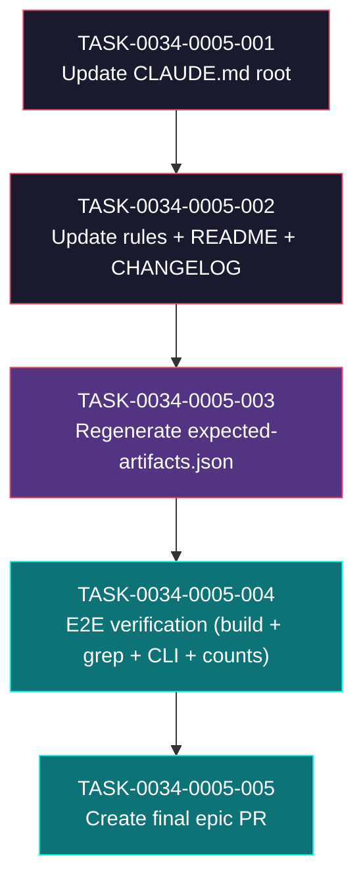

# Task Breakdown -- story-0034-0005

## Header

| Field | Value |
|-------|-------|
| Story ID | story-0034-0005 |
| Epic ID | 0034 |
| Date | 2026-04-10 |
| Author | x-story-plan (multi-agent, inline) |
| Template Version | 1.0.0 |

## Summary

| Metric | Value |
|--------|-------|
| Total Tasks | 5 |
| Parallelizable Tasks | 0 (strict sequential closer story) |
| Estimated Effort | M+M+S+M+S = ~1 dev-day |
| Mode | multi-agent (Architect + QA + Security + Tech Lead + PO) |
| Agents Participating | Architect, QA Engineer, Security Engineer, Tech Lead, Product Owner |

## Dependency Graph

## Tasks Table

| Task ID | Source Agent | Type | TDD Phase | TPP Level | Layer | Components | Parallel | Depends On | Estimated Effort | DoD (augmented) |
|---------|-------------|------|-----------|-----------|-------|-----------|----------|-----------|-----------------|-----|
| TASK-0034-0005-001 | merged(TechLead,ProductOwner,Security) | documentation | VERIFY | N/A | cross-cutting | CLAUDE.md (repo root) | no | -- | M | (a) [QA-002/PO-001] pre-edit wc -l CLAUDE.md recorded (expected ~283); (b) Section `### .github/ (GitHub Copilot)` deleted; (c) Mapping table `.claude/ <-> .github/ <-> .codex/` replaced with single-column `.claude/`-only table OR columns `.github/` / `.codex/` deleted; (d) line `**Total .github/ artifacts: 52**` deleted; (e) Generation Summary table contains only `.claude` rows (no `.github`, `Copilot`, `Codex`, `Agents` rows); (f) [TL-002] grep -iE 'copilot\|codex\|\.github/' CLAUDE.md returns 0 (allow-list: `.github/workflows/` in CI context only); (g) [SEC-001/CWE-798] grep -iE 'password\|secret\|token\|api[-_]?key\|bearer' CLAUDE.md returns 0 sensitive matches; (h) post-edit wc -l CLAUDE.md <= 130 (delta >= 150 lines removed; story 3.5 targets ~180); (i) manual read-through confirms single coherent voice (Claude-only); (j) conventional commit: `docs(claude): reduce CLAUDE.md to claude-only scope (EPIC-0034)` |
| TASK-0034-0005-002 | merged(TechLead,Security,ProductOwner) | documentation | VERIFY | N/A | cross-cutting | .claude/rules/*.md, README.md, docs/*, CHANGELOG.md | no | TASK-0034-0005-001 | M | (a) `grep -rn 'copilot\|codex\|\.agents/' .claude/rules/ README.md docs/` returns 0 (allow-list: `.github/workflows/` CI context); (b) any rules file referencing multi-target generator updated to reflect Claude-only scope; (c) README.md architecture section updated if it referenced multi-target; (d) [SEC-004/Rule 08] CHANGELOG.md `[Unreleased] > Removed` lists: `Platform.COPILOT`, `Platform.CODEX`, `AssemblerTarget.GITHUB`, `AssemblerTarget.CODEX`, `AssemblerTarget.CODEX_AGENTS`, `ReadmeGithubCounter`; (e) [SEC-004] CHANGELOG.md `[Unreleased] > Changed` notes "CLI `--platform` accepts only `claude-code`; previous values `copilot`, `codex`, `agents`, `all` are now rejected with error"; (f) [SEC-004] CHANGELOG.md `[Unreleased] > Migration` section instructs users with automated scripts to use `--platform claude-code` or drop the flag (default is now `claude-code`); (g) [SEC-004] BREAKING CHANGE annotation present; (h) [PO-003/Rule 08] rollback note in CHANGELOG or PR body: "Rollback: revert the merge commit to restore prior multi-target state; stateless generator, no data migration needed"; (i) [SEC-001/CWE-798] grep -iE 'password\|secret\|token\|api[-_]?key\|bearer' .claude/rules/ README.md docs/ CHANGELOG.md returns 0 sensitive matches; (j) conventional commit: `docs(changelog)!: document BREAKING removal of non-Claude targets` with `BREAKING CHANGE:` footer |
| TASK-0034-0005-003 | merged(Architect,QA,Security) | migration | VERIFY | boundary | adapter.test + config | java/src/test/resources/smoke/expected-artifacts.json, dev.iadev.smoke.ExpectedArtifactsGenerator | no | TASK-0034-0005-002 | S | (a) [ARCH-001] ExpectedArtifactsGenerator main class invocation contract documented (prefer `mvn -pl java exec:java -Dexec.mainClass=dev.iadev.smoke.ExpectedArtifactsGenerator` or equivalent from README.md §"Regenerating Golden Files" ~L820); (b) `mvn process-resources` executed BEFORE regeneration (per project memory: stale output otherwise); (c) ExpectedArtifactsGenerator executed successfully; (d) [SEC-003/CWE-22] Generator output path confirmed hardcoded to `java/src/test/resources/smoke/expected-artifacts.json` (no user-controlled filename); (e) [QA-007] regenerated manifest contains ~830 entries per profile (+/- 5%) for `java-spring`; pre-epic baseline was ~9500; (f) [QA-007] `grep -nE '\.agents\|\.codex\|"\.github/' java/src/test/resources/smoke/expected-artifacts.json` returns 0 (allow-list: `.github/workflows/` if present); (g) smoke tests pass against regenerated manifest: `PlatformDirectorySmokeTest`, `AssemblerRegressionSmokeTest`, `CliModesSmokeTest` all green; (h) golden total file count after regeneration: `find java/src/test/resources/golden -type f \| wc -l` in [5801, 6413] (6107 +/- 5%; baseline 14285 - 2324 - 2944 - 2910); (i) `find java/src/test/resources/golden -path '*/.github/workflows*' -type f \| wc -l` == 95 (RULE-003); (j) conventional commit: `test(smoke): regenerate expected-artifacts.json for claude-only output` |
| TASK-0034-0005-004 | merged(QA,Architect,Security,TechLead,ProductOwner) | quality-gate + validation | VERIFY | iteration | cross-cutting | pom.xml, java/src/main/java, target/*.jar, java/src/test/resources/golden/, resources/shared/templates/ | no | TASK-0034-0005-003 | M | (a) [QA-001/QA-009] `mvn -f java/pom.xml clean verify` exits 0 with BUILD SUCCESS; (b) [QA-009] 0 test failures, 0 errors, 0 skipped; (c) [QA-009/TL-001/RULE-002] JaCoCo line coverage >= 95.00% absolute AND >= 93.69% (baseline 95.69 - 2pp); (d) [QA-009/TL-001] JaCoCo branch coverage >= 90.00% absolute AND >= 88.69% (baseline 90.69 - 2pp); (e) [QA-009] build time <= 6:01 min baseline (expected REDUCTION from fewer golden comparisons); (f) [QA-003] 6 grep sanity checks all return 0: `grep -rn 'GithubInstructionsAssembler\|CodexConfigAssembler\|AgentsAssembler' java/src/main/java`; `grep -rn 'ReadmeGithubCounter\|hasCopilot\|hasCodex' java/src/main`; `grep -rn '\.codex/\|\.agents/' java/src/main`; `grep -rn 'COPILOT\|CODEX\|CODEX_AGENTS' java/src/main/java/dev/iadev/domain/model/Platform.java`; `grep -rn 'COPILOT\|CODEX\|CODEX_AGENTS' java/src/main/java/dev/iadev/application/assembler/AssemblerTarget.java`; `grep -A5 'ACCEPTED_VALUES' java/src/main/java/dev/iadev/cli/PlatformConverter.java` shows only `claude-code`; (g) [QA-004] CLI smoke: `java -jar java/target/*.jar generate --platform copilot` exits non-zero with stderr containing `Invalid platform`; equivalent for `--platform codex` and `--platform agents`; (h) [SEC-002/CWE-209] stderr of rejected platform contains NO class names, NO stack traces, NO file paths (only platform name + accepted values list); (i) [QA-005] `java -jar java/target/*.jar generate --platform claude-code --profile java-spring --output /tmp/gen-test` exits 0; `find /tmp/gen-test -type f \| wc -l` in [788, 872] (830 +/- 5%); (j) [QA-005] `java -jar java/target/*.jar generate --output /tmp/gen-default` (no flags) also exits 0 (default is claude-code); (k) [ARCH-002/RULE-004] `git diff origin/main -- java/src/main/resources/shared/templates/` returns empty; `find java/src/main/resources/shared/templates -type f \| wc -l` == 57; (l) [QA-006/RULE-003] `find java/src/test/resources/golden -path '*/.github/workflows*' -type f \| wc -l` == 95 (unchanged); no `.yml` or `.yaml` under `workflows/` deleted; (m) [QA-008] `find java/src/test/resources/golden -type f \| wc -l` in [5801, 6413] (6107 +/- 5%); (n) [PO-002] all 9 Gherkin scenarios validated against evidence produced in this task (each scenario mapped to specific check above); (o) JaCoCo report attached to final PR; (p) no changes to commit (verification only); if any evidence gap found, previous tasks must be reopened |
| TASK-0034-0005-005 | merged(TechLead,ProductOwner) | quality-gate + validation | VERIFY | N/A | cross-cutting | git, GitHub PR | no | TASK-0034-0005-004 | S | (a) [TL-005/Rule 09] feature branch is `feature/epic-0034-remove-non-claude-targets`; (b) [TL-005] PR target branch is `develop` (NOT `main`); (c) [TL-004] PR title: `feat(cli)!: remove non-Claude targets from generator (EPIC-0034)`; (d) [TL-004] PR body summarizes all 5 stories (0001-0005) with before/after metrics: LOC removed, classes deleted (18 main + ~34 test + 2 fixtures), golden files deleted (~8178), CLAUDE.md lines reduced (~180); (e) [TL-004] PR body contains coverage table: line 95.69% -> post, branch 90.69% -> post; (f) [TL-004] PR body contains golden count table: 14285 -> ~6107; (g) [TL-004/SEC-004] PR body BREAKING CHANGE section with migration instructions for `--platform` flag; (h) [PO-003] PR body rollback procedure: "revert merge commit"; (i) [TL-004] JaCoCo HTML report link attached (or artifact uploaded); (j) [TL-003] All commits on branch follow Conventional Commits format with epic scope; final commit on this story: none required (verification-only); (k) [TL-005] all pre-commit hooks pass: format, lint, compile; (l) CI green on feature branch; (m) [PO-002 final] PR mergeable without conflicts; (n) PR created via gh cli: `gh pr create --base develop --title "feat(cli)!: remove non-Claude targets from generator (EPIC-0034)" --body-file <epic-summary.md>`; (o) commit for any last-minute fixes: `chore(epic): final touches before PR (EPIC-0034)` (only if needed) |

## Escalation Notes

| Task ID | Reason | Recommended Action |
|---------|--------|--------------------|
| TASK-0034-0005-001 | Story §3.1 declares CLAUDE.md has 283 lines and targets ~100 post-edit (delta ~180). Current CLAUDE.md executive summary at repo root is the file shown in this session context and differs from the `.claude/README.md` verbose manual. Confirm WHICH CLAUDE.md is the 283-line target (repo root vs `.claude/README.md`). | Verify with `wc -l /Users/edercnj/workspaces/ia-dev-environment/CLAUDE.md` before editing. If repo-root CLAUDE.md is shorter than 283 (executive summary already claude-only), the editing scope shifts to `.claude/README.md` (which per context is ~250+ lines and IS generated output, not source of truth). Generated files must be regenerated via `ia-dev-env generate`, NOT hand-edited. Source of truth is `java/src/main/resources/targets/claude/`. |
| TASK-0034-0005-002 | Rules files under `.claude/rules/` are **generated output** (per CLAUDE.md: "generated only by `ia-dev-env`"). Source of truth lives in `java/src/main/resources/targets/claude/rules/`. Direct edit of `.claude/rules/*.md` will be overwritten on next regeneration. | Edit source templates under `java/src/main/resources/targets/claude/rules/` (or equivalent resource path); re-run the generator so `.claude/rules/` is rewritten from source. Same applies to CLAUDE.md if it is generated. CHANGELOG.md is a normal hand-maintained file and can be edited directly. |
| TASK-0034-0005-003 | `MEMORY.md` records: `mvn process-resources before regen` — otherwise GoldenFileRegenerator produces stale output. This is CRITICAL for this task. | Prepend `mvn -f java/pom.xml process-resources` to the regeneration command in the task plan. Also verify `GoldenFileRegenerator` runs BEFORE `ExpectedArtifactsGenerator` (golden files are the ground truth; manifest is computed over them). |
| TASK-0034-0005-003 | `ExpectedArtifactsGenerator` canonical invocation is buried in README.md around line 820 (per MEMORY.md). Story DoR does NOT record the exact command. | Read README.md §"Regenerating Golden Files" FIRST and copy the exact canonical command into the implementation plan. Do NOT improvise. |
| TASK-0034-0005-004 | Story §3.3 check (f) uses `grep -A5 "ACCEPTED_VALUES"` on PlatformConverter.java. Story 0001 escalation note 5 clarifies that `PlatformConverter.ACCEPTED_VALUES` is computed dynamically from `Platform.allUserSelectable()` — there may be no literal field named `ACCEPTED_VALUES`. | If the grep finds no hits, treat as GREEN (no literal to check). Instead verify runtime behavior: invoke CLI `--platform copilot` and inspect the error message for the accepted-values list content. This is the effective check. |
| TASK-0034-0005-004 | Sanity check (a) uses baseline coverage `95.69% line / 90.69% branch`. If the epic's earlier stories actually improved coverage (by deleting untested or poorly-tested code), the comparison must be against the baseline NOT the previous story's higher value. RULE-002 threshold is 2pp drop from PRE-epic baseline. | Always use baseline-pre-epic.md §"Baseline Validation" as the reference point. Any comparison at the end of the epic is against pre-epic figures, not intermediate. |
| TASK-0034-0005-005 | Story §3.5 metric (7) says `CHANGELOG.md with entries Removed/Changed for breaking change`. Story §8 TASK-002 owns CHANGELOG edits. Ensure TASK-005 does NOT duplicate the CHANGELOG work — it consumes what TASK-002 produced. | TASK-005 is PR creation only. Any CHANGELOG gap found in TASK-005 triggers re-opening TASK-002. Do not fix CHANGELOG inside TASK-005 commit. |
