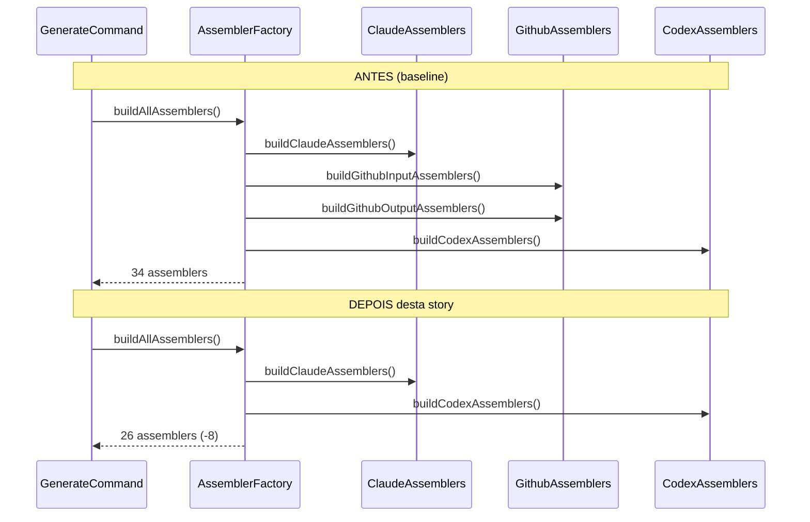
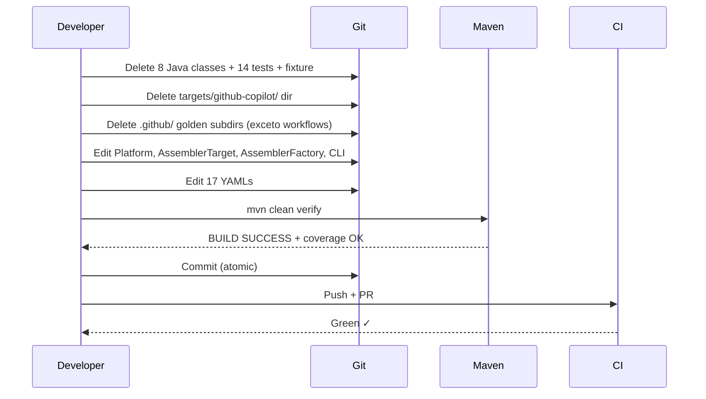

# História: Remover Suporte a GitHub Copilot

**ID:** story-0034-0001
**Chave Jira:** —
**Status:** Pendente

## 1. Dependências

| Blocked By | Blocks |
| :--- | :--- |
| — | story-0034-0002 |

## 2. Regras Transversais Aplicáveis

| ID | Título |
| :--- | :--- |
| RULE-001 | Build Sempre Verde Entre Stories |
| RULE-002 | Coverage Não Pode Degradar |
| RULE-003 | `.github/workflows/` é PROTEGIDO |
| RULE-005 | Remoção Atômica por Target |
| RULE-006 | TDD Compliance na Remoção |

## 3. Descrição

Como **Maintainer do gerador `ia-dev-environment`**, eu quero remover completamente o suporte a GitHub Copilot (target `.github/`) do código Java, resources, testes e golden files, garantindo que o gerador deixe de produzir artefatos para esta plataforma legada e que a CLI rejeite `--platform copilot` com erro claro.

Esta é a primeira de três stories atômicas de remoção por target (ver RULE-005). Ela precede a remoção de Codex (story-0034-0002) e Agents (story-0034-0003) porque o GitHub Copilot tem o maior volume de artefatos (~131 resources, ~2.419 golden files, 14 classes de teste, 8 assemblers), servindo como marco de validação da mecânica de remoção. Estabelece o padrão atômico que as próximas duas stories seguirão.

A remoção é ATÔMICA: em um único conjunto coerente de commits, são deletadas as 8 classes Java assemblers GitHub/Copilot, 14 classes de teste Github*, a fixture `GithubInstructionsTestFixtures`, o diretório `java/src/main/resources/targets/github-copilot/` (~131 arquivos), os subdirs `.github/` em 17 profiles de golden files (EXCETO `.github/workflows/` por RULE-003). Simultaneamente são atualizados os enums `Platform` (remove `COPILOT`), `AssemblerTarget` (remove `GITHUB(".github")`), o `PlatformConverter` (remove `"copilot"` de `ACCEPTED_VALUES`), o `GenerateCommand` (atualiza descrição do `@Option --platform`), o `AssemblerFactory` (remove `buildGithubInputAssemblers()` e `buildGithubOutputAssemblers()`), o `FileCategorizer` (remove categorização `.github/`), o `OverwriteDetector` (remove `".github"` de `ARTIFACT_DIRS`), e os 17 YAMLs `setup-config.*.yaml` (remove referências a `copilot`).

### 3.1 Classes Java a Deletar

8 arquivos em `java/src/main/java/dev/iadev/application/assembler/`:

- `GithubInstructionsAssembler.java`
- `GithubMcpAssembler.java`
- `GithubSkillsAssembler.java`
- `GithubAgentsAssembler.java`
- `GithubHooksAssembler.java`
- `GithubPromptsAssembler.java`
- `GithubAgentRenderer.java`
- `PrIssueTemplateAssembler.java`

### 3.2 Classes de Teste a Deletar

14 arquivos em `java/src/test/java/dev/iadev/application/assembler/`:

- `GithubInstructionsCopilotTest`, `GithubInstructionsFormatTest`, `GithubInstructionsCoverageTest`, `GithubInstructionsFileGenTest`, `GithubInstructionsGoldenTest`
- `GithubMcpAssemblerTest`
- `GithubSkillsAssemblerTest`, `GithubSkillsAssemblerConditionalTest`, `GithubSkillsAssemblerIntegrationTest`
- `GithubHooksAssemblerTest`
- `GithubAgentsAssemblerTest`, `GithubAgentsEventTest`, `GithubAgentsConditionalTest`, `GithubAgentsRenderCoreTest`

Mais a fixture `GithubInstructionsTestFixtures.java`.

### 3.3 Resources a Deletar

- Diretório completo `java/src/main/resources/targets/github-copilot/` (~131 arquivos):
  - `agents/` (23 arquivos)
  - `instructions/` (5 arquivos)
  - `prompts/` (4 arquivos)
  - `skills/` (65+ arquivos)
  - `hooks/` (3 arquivos)
  - `pr-issue-templates/` (4 arquivos)

### 3.4 Golden Files a Deletar

Em `java/src/test/resources/golden/{profile}/` para cada um dos 17 profiles:

- Deletar subdir `.github/` **EXCETO** `.github/workflows/` (RULE-003)
- Se `.github/workflows/` existir como subdir legítimo de CI/CD, preservar
- Total estimado: ~2.419 arquivos deletados

### 3.6 Arquivos Java a Editar

| Arquivo | Mudança |
|---------|---------|
| `domain/model/Platform.java` | Remover constante `COPILOT`. Atualizar `allUserSelectable()`. |
| `application/assembler/AssemblerTarget.java` | Remover `GITHUB(".github")` |
| `cli/PlatformConverter.java` | Remover `"copilot"` de `ACCEPTED_VALUES`. Testar falha com mensagem clara. |
| `cli/GenerateCommand.java` | Atualizar descrição do `@Option --platform` (linhas 96-103) |
| `cli/FileCategorizer.java` | Remover categorização de `.github/` (linhas ~51-60). MAS preservar categorização de `.github/workflows/` se existir como categoria separada (RULE-003). |
| `util/OverwriteDetector.java` | Remover `".github"` de `ARTIFACT_DIRS` |
| `application/assembler/AssemblerFactory.java` | Deletar `buildGithubInputAssemblers()` e `buildGithubOutputAssemblers()`. Remover chamadas em `buildAllAssemblers()`. |
| `application/assembler/PlatformContextBuilder.java` | Remover `hasCopilot` do contexto |

### 3.7 Resources YAML a Editar

17 arquivos `java/src/main/resources/shared/config-templates/setup-config.*.yaml`:

- Remover referências a `copilot` nas opções de `platform`
- Exemplo: `# Options: claude-code, copilot, codex, all` → `# Options: claude-code, codex`

## 3.5 Entrega de Valor

- **Valor Principal:** Usuários do `ia-dev-env` que hoje tentam gerar setup para GitHub Copilot (`--platform copilot`) passam a receber rejeição imediata e explícita da CLI, em vez de gerar artefatos `.github/` que não seriam mais mantidos ou evoluídos. Elimina compromisso implícito de compatibilidade entre o gerador e uma plataforma fora do roadmap. Platform team ganha autoridade formal para focar exclusivamente em Claude Code sem risco de regressão em Copilot gerar ticket.
- **Métrica de Sucesso:** (1) `mvn clean verify` verde com coverage ≥ 95% line / ≥ 90% branch. (2) CLI `--platform copilot` retorna exit code não-zero com mensagem `Invalid platform: copilot. Accepted: claude-code, codex`. (3) `grep -r "GithubInstructionsAssembler\|GithubMcpAssembler" java/src/main/java` = 0 matches. (4) Contagem de arquivos gerados para profile `java-spring` reduzida em ~300 (só Copilot; redução acumulada final na story 0005). (5) Tempo de `mvn test` reduzido proporcionalmente à deleção de 14 classes de teste.
- **Impacto no Negócio:** Primeiro passo concreto de um épico que, completo, elimina 87% do volume de golden files e ~200 linhas de contexto do CLAUDE.md. Estabelece o padrão atômico de remoção que stories 0002 e 0003 replicam. Contribuidores que fizerem onboarding no projeto após esta story não precisam entender o que é "GitHub Copilot target" no gerador — deixa de existir como conceito do produto.

## 4. Definições de Qualidade Locais

### DoR Local (Definition of Ready)

- [ ] Branch `feature/epic-0034-remove-non-claude-targets` existe e está atualizada
- [ ] Baseline de `mvn clean verify` registrada (tempo + coverage)
- [ ] Baseline de contagem de golden files por profile registrada
- [ ] Verificação: `.github/workflows/` existe como subdir legítimo em algum profile? (se sim, preservar)
- [ ] Confirmação: nenhuma outra story/PR em andamento toca os mesmos arquivos

### DoD Local (Definition of Done)

- [ ] 8 classes Java assembler GitHub/Copilot deletadas
- [ ] 14 classes de teste Github* deletadas
- [ ] Fixture `GithubInstructionsTestFixtures.java` deletada
- [ ] Diretório `java/src/main/resources/targets/github-copilot/` deletado
- [ ] Subdirs `.github/` deletados em 17 profiles de golden files (exceto `.github/workflows/`)
- [ ] `Platform.java` sem constante `COPILOT`
- [ ] `AssemblerTarget.java` sem entrada `GITHUB`
- [ ] `PlatformConverter.java` sem `"copilot"` em `ACCEPTED_VALUES`
- [ ] `AssemblerFactory.java` sem `buildGithubInputAssemblers()` / `buildGithubOutputAssemblers()`
- [ ] `FileCategorizer.java`, `OverwriteDetector.java`, `PlatformContextBuilder.java` higienizados
- [ ] 17 YAMLs `setup-config.*.yaml` limpos
- [ ] `mvn clean verify` verde (line coverage ≥ 95%, branch ≥ 90%)
- [ ] Smoke test: `java -jar target/*.jar generate --platform copilot` falha com mensagem clara
- [ ] Smoke test: `java -jar target/*.jar generate --platform claude-code` funciona
- [ ] `.github/workflows/` preservado onde existia (RULE-003)
- [ ] PR criado e aprovado

### Global Definition of Done (DoD)

> Copiado do épico-0034 para referência rápida durante code review.

- **Cobertura:** ≥ 95% line, ≥ 90% branch. Degradação máxima 2pp vs. baseline.
- **Testes Automatizados:** Todos remanescentes passando; remoção proporcional código↔teste.
- **Relatório de Cobertura:** JaCoCo report anexado ao PR.
- **Documentação:** Atualizações específicas desta story (mais ampla na story-0034-0005).
- **Performance:** Tempo de `mvn clean verify` não aumenta.

## 5. Contratos de Dados (Data Contract)

### 5.1 CLI Contract (Before → After)

| Campo | Antes | Depois | Origem/Regra |
| :--- | :--- | :--- | :--- |
| `--platform` accepted values | `claude-code`, `copilot`, `codex`, `all` | `claude-code`, `codex` *(após esta story; `codex` sai na próxima)* | `PlatformConverter.ACCEPTED_VALUES` |
| `--platform` error message | — | `Invalid platform: copilot. Accepted: claude-code, codex` | `PlatformConverter.convert()` |
| `GenerateCommand @Option description` | Menciona `claude-code, copilot, codex` | Menciona `claude-code, codex` | `GenerateCommand.java` |

### 5.2 File System Contract (Before → After)

| Caminho | Antes | Depois |
| :--- | :--- | :--- |
| `java/src/main/resources/targets/github-copilot/` | Existe (~131 arquivos) | **Deletado** |
| `java/src/main/java/dev/iadev/application/assembler/Github*.java` | 8 classes | **0 classes** |
| `java/src/test/java/dev/iadev/application/assembler/Github*Test.java` | 14 classes + 1 fixture | **0 classes** |
| `java/src/test/resources/golden/{profile}/.github/` (sem workflows) | ~142 arquivos/profile | **0 arquivos** (dirs removidos) |
| `java/src/test/resources/golden/{profile}/.github/workflows/` | Preservado se existir | **Preservado** (RULE-003) |
| `Platform.COPILOT` | Existe | **Removido** |
| `AssemblerTarget.GITHUB` | Existe | **Removido** |

### 5.3 Error Codes Mapeados

| HTTP Status | Error Code | Condição | Mensagem |
| :--- | :--- | :--- | :--- |
| N/A (CLI exit 2) | `INVALID_PLATFORM` | Usuário passa `--platform copilot` após esta story | `Invalid platform: copilot. Accepted: claude-code, codex` |
| N/A (build) | `COMPILATION_ERROR` | Se referência residual a `Platform.COPILOT` sobrou em alguma classe | Mensagem javac padrão — bloqueia merge via RULE-001 |

## 6. Diagramas

### 6.1 Call Graph — Geração Antes vs. Depois



### 6.2 Fluxo de Remoção Atômica



## 7. Critérios de Aceite (Gherkin)

```gherkin
Cenario: Build verde após remoção completa do Copilot
  DADO que todas as 8 classes assembler Github* foram deletadas
  E todas as 14 classes de teste Github* foram deletadas
  E o diretório targets/github-copilot/ foi deletado
  E os enums Platform e AssemblerTarget não referenciam mais Copilot/GitHub
  QUANDO executo "mvn clean verify" na raiz do projeto java/
  ENTÃO a build termina com BUILD SUCCESS
  E coverage line ≥ 95% e branch ≥ 90%
  E nenhum teste remanescente falha

Cenario: CLI rejeita --platform copilot com erro claro
  DADO que a story foi aplicada e o jar foi reconstruído
  QUANDO executo "java -jar target/ia-dev-env.jar generate --platform copilot"
  ENTÃO o processo sai com código de erro não-zero
  E stderr contém "Invalid platform: copilot"
  E stderr lista os valores aceitos sem incluir "copilot"

Cenario: CLI continua funcionando para claude-code
  DADO que a story foi aplicada e o jar foi reconstruído
  QUANDO executo "java -jar target/ia-dev-env.jar generate --platform claude-code"
  ENTÃO a geração completa com sucesso
  E o diretório .claude/ é produzido no output
  E nenhum diretório .github/ (exceto workflows se configurado) é produzido

Cenario: `.github/workflows/` preservado em golden files
  DADO que antes da story existiam 17 profiles com subdirs `.github/workflows/` em alguns
  QUANDO a deleção de subdirs `.github/` é aplicada conforme a spec
  ENTÃO todos os subdirs `.github/workflows/` que existiam permanecem intactos
  E `grep -r "workflows" java/src/test/resources/golden/*/.github/` retorna as mesmas linhas de antes
  E nenhum arquivo `.yml` ou `.yaml` em `workflows/` foi deletado

Cenario: Grep sanity check — zero referências a assemblers deletados
  DADO que a story foi aplicada
  QUANDO executo "grep -r 'GithubInstructionsAssembler\|GithubMcpAssembler\|GithubSkillsAssembler' java/src/main/java"
  ENTÃO o comando retorna zero matches
  E "grep -r 'Platform.COPILOT' java/src/main" também retorna zero matches

Cenario: Degenerate — CLI sem --platform continua com default
  DADO que a story foi aplicada
  QUANDO executo "java -jar target/ia-dev-env.jar generate" (sem --platform)
  ENTÃO a geração usa claude-code como default
  E completa com sucesso
```

### 7.1 Scenario Ordering (TPP)

Ordem dos cenários seguindo Transformation Priority Premise, do mais simples (degenerado/happy path) ao mais complexo (edge cases e validações de invariantes):

1. **Happy path**: Build verde após remoção (valida hipótese central)
2. **Error path**: CLI rejeita `--platform copilot`
3. **Regressão**: CLI continua funcional para `claude-code`
4. **Invariante protegida**: `.github/workflows/` preservado (RULE-003)
5. **Sanity check**: grep retorna zero matches
6. **Degenerate**: CLI sem `--platform` usa default

### 7.2 Mandatory Scenario Categories

- [x] Degenerate cases (CLI sem `--platform`)
- [x] Happy path (build verde, CLI `claude-code`)
- [x] Error paths (`--platform copilot` falha)
- [x] Boundary values (`.github/workflows/` = borda do escopo de deleção)

### 7.3 TDD Implementation Notes

- **Outer loop (acceptance test):** Cenário "Build verde após remoção completa do Copilot" é validado via execução manual de `mvn clean verify` antes do commit final e via CI após o push.
- **Inner loop (unit tests):** Smoke tests `CliModesSmokeTest` e `PlatformDirectorySmokeTest` (após edições em story-0034-0004) validam que CLI rejeita valores inválidos e gera estrutura correta.
- **RED:** Inicialmente os testes existentes para `Github*AssemblerTest` estão verdes (baseline). Ao deletá-los junto com o código, o teste implícito vira "build compila sem as classes deletadas".
- **GREEN:** Compilação e testes remanescentes passam.
- **REFACTOR:** `AssemblerFactory.buildAllAssemblers()` simplifica-se naturalmente ao remover chamadas para métodos deletados.

## 8. Tasks

> Each task is a formal, traceable unit of delivery following the 1 task = 1 branch = 1 PR model.
> Minimum 3 tasks, maximum 8. Tasks are atomic but sized to keep build verde após cada task.

### TASK-0034-0001-001: Deletar classes Java Github/Copilot assemblers

- **Layer:** Adapter
- **Test Type:** Verification (compile check)
- **Size:** M
- **Dependencies:** —
- **Branch:** `feature/task-0034-0001-001-delete-github-assemblers`
- **Testability:** Config + VerificationTest (remoção de código verificada via compile + testes remanescentes)
- **Files:**
  - `java/src/main/java/dev/iadev/application/assembler/GithubInstructionsAssembler.java` (DELETE)
  - `java/src/main/java/dev/iadev/application/assembler/GithubMcpAssembler.java` (DELETE)
  - `java/src/main/java/dev/iadev/application/assembler/GithubSkillsAssembler.java` (DELETE)
  - `java/src/main/java/dev/iadev/application/assembler/GithubAgentsAssembler.java` (DELETE)
  - `java/src/main/java/dev/iadev/application/assembler/GithubHooksAssembler.java` (DELETE)
  - `java/src/main/java/dev/iadev/application/assembler/GithubPromptsAssembler.java` (DELETE)
  - `java/src/main/java/dev/iadev/application/assembler/GithubAgentRenderer.java` (DELETE)
  - `java/src/main/java/dev/iadev/application/assembler/PrIssueTemplateAssembler.java` (DELETE)
  - `java/src/main/java/dev/iadev/application/assembler/AssemblerFactory.java` (EDIT — remove `buildGithubInputAssemblers()`, `buildGithubOutputAssemblers()`, chamadas em `buildAllAssemblers()`)
- **Acceptance Criteria:**
  - [ ] 8 classes deletadas
  - [ ] `AssemblerFactory` compila sem referências
  - [ ] `mvn compile` verde
  - [ ] `mvn test-compile` verde (previne `AssemblerFactoryTest` órfão referenciando métodos deletados)

### TASK-0034-0001-002: Deletar classes de teste Github* + fixture

- **Layer:** Test
- **Test Type:** Unit (remoção)
- **Size:** M
- **Dependencies:** TASK-0034-0001-001
- **Branch:** `feature/task-0034-0001-002-delete-github-tests`
- **Testability:** Test (remoção de testes obsoletos)
- **Files:**
  - `java/src/test/java/dev/iadev/application/assembler/GithubInstructionsCopilotTest.java` (DELETE)
  - `java/src/test/java/dev/iadev/application/assembler/GithubInstructionsFormatTest.java` (DELETE)
  - `java/src/test/java/dev/iadev/application/assembler/GithubInstructionsCoverageTest.java` (DELETE)
  - `java/src/test/java/dev/iadev/application/assembler/GithubInstructionsFileGenTest.java` (DELETE)
  - `java/src/test/java/dev/iadev/application/assembler/GithubInstructionsGoldenTest.java` (DELETE)
  - `java/src/test/java/dev/iadev/application/assembler/GithubMcpAssemblerTest.java` (DELETE)
  - `java/src/test/java/dev/iadev/application/assembler/GithubSkillsAssemblerTest.java` (DELETE)
  - `java/src/test/java/dev/iadev/application/assembler/GithubSkillsAssemblerConditionalTest.java` (DELETE)
  - `java/src/test/java/dev/iadev/application/assembler/GithubSkillsAssemblerIntegrationTest.java` (DELETE)
  - `java/src/test/java/dev/iadev/application/assembler/GithubHooksAssemblerTest.java` (DELETE)
  - `java/src/test/java/dev/iadev/application/assembler/GithubAgentsAssemblerTest.java` (DELETE)
  - `java/src/test/java/dev/iadev/application/assembler/GithubAgentsEventTest.java` (DELETE)
  - `java/src/test/java/dev/iadev/application/assembler/GithubAgentsConditionalTest.java` (DELETE)
  - `java/src/test/java/dev/iadev/application/assembler/GithubAgentsRenderCoreTest.java` (DELETE)
  - `java/src/test/java/dev/iadev/application/assembler/GithubInstructionsTestFixtures.java` (DELETE)
- **Acceptance Criteria:**
  - [ ] 14 classes de teste + 1 fixture deletadas
  - [ ] `mvn test-compile` verde

### TASK-0034-0001-003: Atualizar enums Platform e AssemblerTarget + CLI

- **Layer:** Domain + Config
- **Test Type:** Verification
- **Size:** S
- **Dependencies:** TASK-0034-0001-001, TASK-0034-0001-002
- **Branch:** `feature/task-0034-0001-003-update-enums-cli`
- **Testability:** Config + VerificationTest
- **Files:**
  - `java/src/main/java/dev/iadev/domain/model/Platform.java` (EDIT — remove `COPILOT`)
  - `java/src/main/java/dev/iadev/application/assembler/AssemblerTarget.java` (EDIT — remove `GITHUB(".github")`)
  - `java/src/main/java/dev/iadev/cli/PlatformConverter.java` (EDIT — remove `"copilot"`)
  - `java/src/main/java/dev/iadev/cli/GenerateCommand.java` (EDIT — atualizar descrição do `@Option --platform`)
  - `java/src/main/java/dev/iadev/cli/FileCategorizer.java` (EDIT — remove `.github/` categorization, preserve workflows per RULE-003)
  - `java/src/main/java/dev/iadev/util/OverwriteDetector.java` (EDIT — remove `".github"` de `ARTIFACT_DIRS`)
  - `java/src/main/java/dev/iadev/application/assembler/PlatformContextBuilder.java` (EDIT — remove `hasCopilot`)
- **Acceptance Criteria:**
  - [ ] Enums sem referências a Copilot/GitHub
  - [ ] CLI rejeita `--platform copilot` com mensagem clara
  - [ ] `mvn compile` verde

### TASK-0034-0001-004: Deletar resources targets/github-copilot/

- **Layer:** Config
- **Test Type:** Verification
- **Size:** S
- **Dependencies:** TASK-0034-0001-003
- **Branch:** `feature/task-0034-0001-004-delete-github-resources`
- **Testability:** Config + VerificationTest
- **Files:**
  - `java/src/main/resources/targets/github-copilot/` (DELETE recursivo — ~131 arquivos)
- **Acceptance Criteria:**
  - [ ] Diretório completamente removido
  - [ ] `mvn compile` verde (resources não são mais referenciados)

### TASK-0034-0001-005: Deletar golden files `.github/` (preservando workflows)

- **Layer:** Test
- **Test Type:** Smoke
- **Size:** M
- **Dependencies:** TASK-0034-0001-004
- **Branch:** `feature/task-0034-0001-005-delete-github-golden`
- **Testability:** Migration + Smoke (remoção de golden files validada por smoke test)
- **Files:**
  - `java/src/test/resources/golden/{profile}/.github/` em 17 profiles (DELETE recursivo, **EXCLUINDO** `workflows/`)
- **Acceptance Criteria:**
  - [ ] Subdirs `.github/` removidos em 17 profiles
  - [ ] `.github/workflows/` preservado onde existia (RULE-003)
  - [ ] `ls golden/*/.github/workflows/` retorna mesmo resultado de antes onde existia

### TASK-0034-0001-006: Limpar YAMLs config-templates e validar build completa

- **Layer:** Config + Test
- **Test Type:** Smoke + Verification
- **Size:** S
- **Dependencies:** TASK-0034-0001-005
- **Branch:** `feature/task-0034-0001-006-cleanup-yaml-verify`
- **Testability:** Config + VerificationTest
- **Files:**
  - `java/src/main/resources/shared/config-templates/setup-config.*.yaml` (17 arquivos — EDIT para remover `copilot`)
- **Acceptance Criteria:**
  - [ ] 17 YAMLs sem referências a `copilot`
  - [ ] `mvn clean verify` verde (line ≥ 95%, branch ≥ 90%)
  - [ ] CLI smoke: `--platform copilot` falha, `--platform claude-code` funciona
  - [ ] Grep sanity: `grep -r "GithubInstructionsAssembler" java/src/main/java` = 0 matches
  - [ ] PR criado para `feature/epic-0034-remove-non-claude-targets`
