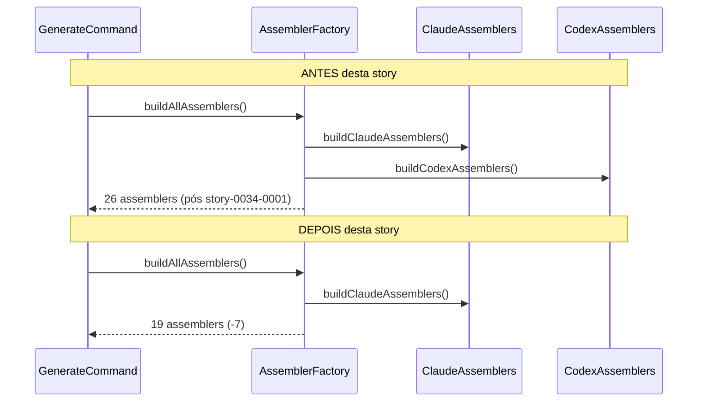
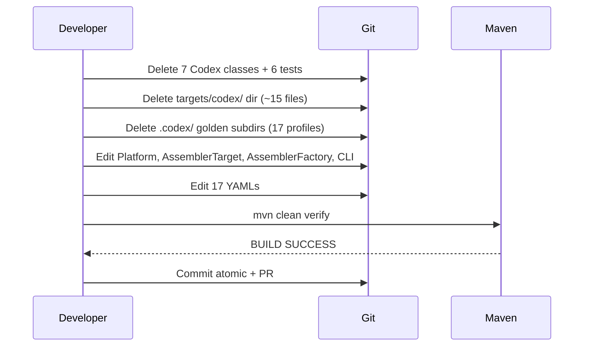

# História: Remover Suporte a Codex

**ID:** story-0034-0002
**Chave Jira:** —
**Status:** Pendente

## 1. Dependências

| Blocked By | Blocks |
| :--- | :--- |
| story-0034-0001 | story-0034-0003 |

## 2. Regras Transversais Aplicáveis

| ID | Título |
| :--- | :--- |
| RULE-001 | Build Sempre Verde Entre Stories |
| RULE-002 | Coverage Não Pode Degradar |
| RULE-005 | Remoção Atômica por Target |
| RULE-006 | TDD Compliance na Remoção |

## 3. Descrição

Como **Maintainer do gerador `ia-dev-environment`**, eu quero remover completamente o suporte a Codex (target `.codex/`) do código Java, resources, testes e golden files, garantindo que o gerador deixe de produzir artefatos para esta plataforma legada e que a CLI rejeite `--platform codex` com erro claro.

Esta é a segunda story atômica do épico, executada APÓS a remoção do GitHub Copilot (story-0034-0001). Segue o mesmo padrão atômico estabelecido: deleta 7 classes Java assemblers Codex, 6 classes de teste Codex*, o diretório `java/src/main/resources/targets/codex/` (~15 arquivos) e subdirs `.codex/` em 17 profiles de golden files (~2.944 arquivos). Simultaneamente atualiza `Platform` (remove `CODEX`), `AssemblerTarget` (remove `CODEX(".codex")`), `PlatformConverter`, `AssemblerFactory` (remove `buildCodexAssemblers()`), `FileCategorizer`, `OverwriteDetector` e os 17 YAMLs.

A dependência em story-0034-0001 é estritamente de ordenação (evitar conflitos de merge nos enums compartilhados `Platform` e `AssemblerTarget`, e no `AssemblerFactory`), não estrutural. Ambas as stories são independentes em termos de arquivos deletados (Copilot e Codex tocam conjuntos disjuntos de classes, resources e golden subdirs), mas compartilham pontos de edição nos enums.

### 3.1 Classes Java a Deletar

7 arquivos em `java/src/main/java/dev/iadev/application/assembler/`:

- `CodexConfigAssembler.java`
- `CodexSkillsAssembler.java`
- `CodexRequirementsAssembler.java`
- `CodexOverrideAssembler.java`
- `CodexAgentsMdAssembler.java`
- `CodexScanner.java`
- `CodexShared.java`

### 3.2 Classes de Teste a Deletar

6 arquivos em `java/src/test/java/dev/iadev/application/assembler/`:

- `CodexConfigAssemblerTest`
- `CodexSkillsAssemblerTest`
- `CodexRequirementsAssemblerTest`
- `CodexOverrideAssemblerTest`
- `CodexSharedTest`
- `CodexAgentsMdAssemblerTest`

### 3.3 Resources a Deletar

- Diretório completo `java/src/main/resources/targets/codex/` (~15 arquivos):
  - `templates/config.toml.njk`
  - `templates/requirements.toml.njk`
  - `templates/agents*.md.njk`
  - `templates/sections/*.md.njk`

### 3.4 Golden Files a Deletar

- Subdir `.codex/` em cada um dos 17 profiles (~2.944 arquivos total)

### 3.6 Arquivos Java a Editar

| Arquivo | Mudança |
|---------|---------|
| `domain/model/Platform.java` | Remover constante `CODEX` |
| `application/assembler/AssemblerTarget.java` | Remover `CODEX(".codex")` |
| `cli/PlatformConverter.java` | Remover `"codex"` de `ACCEPTED_VALUES` |
| `cli/GenerateCommand.java` | Atualizar descrição do `@Option --platform` |
| `cli/FileCategorizer.java` | Remover categorização de `.codex/` |
| `util/OverwriteDetector.java` | Remover `".codex"` de `ARTIFACT_DIRS` |
| `application/assembler/AssemblerFactory.java` | Deletar `buildCodexAssemblers()`. Remover chamada em `buildAllAssemblers()`. |
| `application/assembler/PlatformContextBuilder.java` | Remover `hasCodex` do contexto |

### 3.7 Resources YAML a Editar

17 arquivos `java/src/main/resources/shared/config-templates/setup-config.*.yaml`:

- Remover referências a `codex` nas opções de `platform`

## 3.5 Entrega de Valor

- **Valor Principal:** Usuários do `ia-dev-env` que hoje tentam gerar setup para Codex (`--platform codex`) passam a receber rejeição imediata da CLI. Segundo dos três targets legados removido, tornando o contrato público do CLI explícito sobre quais targets são suportados. Platform team elimina necessidade de manter lógica específica de TOML (`config.toml.njk`, `requirements.toml.njk`, `AGENTS.md.njk`) que era exclusiva deste target e não tinha paralelo em Claude Code.
- **Métrica de Sucesso:** (1) `mvn clean verify` verde com coverage ≥ 95% line / ≥ 90% branch. (2) CLI `--platform codex` retorna exit code não-zero com mensagem `Invalid platform: codex. Accepted: claude-code`. (3) `grep -r "CodexConfigAssembler\|CodexScanner" java/src/main/java` = 0 matches. (4) Contagem acumulada de golden files removidos desde o início do épico: ~5.363.
- **Impacto no Negócio:** Com dois dos três targets eliminados, a próxima story (agents) completa o ciclo de remoção por target. Documentação interna que mencione "gerador multi-target" fica desatualizada — sinalizando a próxima iteração do CLAUDE.md (story 0005). Carga cognitiva para novos contribuidores cai: não precisam mais entender quando/por que rodar CodexScanner vs. assemblers Claude.

## 4. Definições de Qualidade Locais

### DoR Local (Definition of Ready)

- [ ] story-0034-0001 completa e merged (ou pelo menos branch integrada)
- [ ] Build verde como baseline (pós story-0034-0001)
- [ ] Confirmação: `targets/codex/` e `targets/agents/` são diretórios distintos (se mesma coisa, ajustar spec)
- [ ] Verificação: nenhuma classe shared referencia `CodexShared` (se sim, cleanup fica para story-0034-0004)

### DoD Local (Definition of Done)

- [ ] 7 classes Java assembler Codex deletadas
- [ ] 6 classes de teste Codex* deletadas
- [ ] Diretório `java/src/main/resources/targets/codex/` deletado
- [ ] Subdirs `.codex/` deletados em 17 profiles de golden files
- [ ] `Platform.java` sem constante `CODEX`
- [ ] `AssemblerTarget.java` sem entrada `CODEX`
- [ ] `PlatformConverter.java` sem `"codex"` em `ACCEPTED_VALUES`
- [ ] `AssemblerFactory.java` sem `buildCodexAssemblers()`
- [ ] `FileCategorizer.java`, `OverwriteDetector.java`, `PlatformContextBuilder.java` higienizados para Codex
- [ ] 17 YAMLs `setup-config.*.yaml` sem `codex`
- [ ] `mvn clean verify` verde (line ≥ 95%, branch ≥ 90%)
- [ ] Smoke test: `--platform codex` falha com mensagem clara
- [ ] Smoke test: `--platform claude-code` funciona
- [ ] PR criado e aprovado

### Global Definition of Done (DoD)

> Copiado do épico-0034.

- **Cobertura:** ≥ 95% line, ≥ 90% branch.
- **Testes Automatizados:** Todos remanescentes passando; remoção proporcional.
- **Relatório de Cobertura:** JaCoCo anexado ao PR.
- **Documentação:** Atualizações pontuais (ampla na story-0034-0005).
- **Performance:** Tempo de build não aumenta.

## 5. Contratos de Dados (Data Contract)

### 5.1 CLI Contract (Before → After)

| Campo | Antes desta story | Depois desta story |
| :--- | :--- | :--- |
| `--platform` accepted values | `claude-code`, `codex` | `claude-code` *(apenas)* |
| `--platform` error message para `codex` | — | `Invalid platform: codex. Accepted: claude-code` |

### 5.2 File System Contract (Before → After)

| Caminho | Antes | Depois |
| :--- | :--- | :--- |
| `java/src/main/resources/targets/codex/` | ~15 arquivos | **Deletado** |
| `java/src/main/java/dev/iadev/application/assembler/Codex*.java` | 7 classes | **0 classes** |
| `java/src/test/java/dev/iadev/application/assembler/Codex*Test.java` | 6 classes | **0 classes** |
| `java/src/test/resources/golden/{profile}/.codex/` | ~173 arquivos/profile | **0 (dir removido)** |
| `Platform.CODEX` | Existe | **Removido** |
| `AssemblerTarget.CODEX` | Existe | **Removido** |

### 5.3 Error Codes Mapeados

| HTTP Status | Error Code | Condição | Mensagem |
| :--- | :--- | :--- | :--- |
| N/A (CLI exit 2) | `INVALID_PLATFORM` | Usuário passa `--platform codex` após esta story | `Invalid platform: codex. Accepted: claude-code` |
| N/A (build) | `COMPILATION_ERROR` | Referência residual a `Platform.CODEX` | javac padrão — bloqueia merge via RULE-001 |

## 6. Diagramas

### 6.1 Call Graph — Geração Antes vs. Depois



### 6.2 Fluxo de Remoção Atômica Codex



## 7. Critérios de Aceite (Gherkin)

```gherkin
Cenario: Build verde após remoção completa do Codex
  DADO que story-0034-0001 está completa e merged
  E as 7 classes assembler Codex* foram deletadas
  E as 6 classes de teste Codex* foram deletadas
  E o diretório targets/codex/ foi deletado
  E Platform.CODEX e AssemblerTarget.CODEX foram removidos
  QUANDO executo "mvn clean verify"
  ENTÃO a build termina com BUILD SUCCESS
  E coverage line ≥ 95% e branch ≥ 90%

Cenario: CLI rejeita --platform codex com erro claro
  DADO que a story foi aplicada
  QUANDO executo "java -jar target/ia-dev-env.jar generate --platform codex"
  ENTÃO o processo sai com código de erro não-zero
  E stderr contém "Invalid platform: codex"
  E stderr lista apenas "claude-code" como aceito

Cenario: CLI continua funcionando para claude-code
  DADO que a story foi aplicada
  QUANDO executo "java -jar target/ia-dev-env.jar generate --platform claude-code"
  ENTÃO a geração completa com sucesso
  E o diretório .claude/ é produzido
  E nenhum diretório .codex/ é produzido

Cenario: Golden files `.codex/` completamente removidos
  DADO que a story foi aplicada
  QUANDO executo "find java/src/test/resources/golden -type d -name '.codex'"
  ENTÃO o comando retorna zero resultados
  E "find java/src/test/resources/golden -name 'config.toml'" também retorna zero

Cenario: Grep sanity check
  DADO que a story foi aplicada
  QUANDO executo "grep -r 'CodexConfigAssembler\|CodexSkillsAssembler' java/src/main/java"
  ENTÃO retorna zero matches
  E "grep -r 'Platform.CODEX\|AssemblerTarget.CODEX' java/src/main" também retorna zero

Cenario: Degenerate — nenhuma classe shared quebra
  DADO que a story foi aplicada
  E PlatformContextBuilder, FileCategorizer e OverwriteDetector foram editados
  QUANDO executo testes de smoke
  ENTÃO PlatformDirectorySmokeTest e CliModesSmokeTest passam (com ajustes aplicados)
```

### 7.1 Scenario Ordering (TPP)

1. Happy path: build verde (hipótese central)
2. Error path: `--platform codex` rejeitado
3. Regressão: `--platform claude-code` funciona
4. Invariante: golden files `.codex/` removidos
5. Sanity check: grep zero matches
6. Degenerate: shared classes não quebram

### 7.2 Mandatory Scenario Categories

- [x] Degenerate cases (shared classes sem quebra)
- [x] Happy path (build verde, claude-code funciona)
- [x] Error paths (`--platform codex` falha)
- [x] Boundary values (golden files completamente limpos)

### 7.3 TDD Implementation Notes

- **Outer loop:** "Build verde após remoção completa do Codex" via `mvn clean verify` + CI.
- **Inner loop:** Smoke tests `CliModesSmokeTest` e `PlatformDirectorySmokeTest` (já editados na story anterior, edições adicionais na story-0034-0004).
- **RED:** Testes `Codex*Test` verdes no baseline (pós story-0034-0001). Deleção acompanhada de remoção de código preserva verde.
- **REFACTOR:** `AssemblerFactory.buildAllAssemblers()` fica mais simples ao remover a chamada `buildCodexAssemblers()`.

## 8. Tasks

### TASK-0034-0002-001: Deletar classes Java Codex assemblers

- **Layer:** Adapter
- **Test Type:** Verification
- **Size:** M
- **Dependencies:** —
- **Branch:** `feature/task-0034-0002-001-delete-codex-assemblers`
- **Testability:** Config + VerificationTest
- **Files:**
  - `java/src/main/java/dev/iadev/application/assembler/CodexConfigAssembler.java` (DELETE)
  - `java/src/main/java/dev/iadev/application/assembler/CodexSkillsAssembler.java` (DELETE)
  - `java/src/main/java/dev/iadev/application/assembler/CodexRequirementsAssembler.java` (DELETE)
  - `java/src/main/java/dev/iadev/application/assembler/CodexOverrideAssembler.java` (DELETE)
  - `java/src/main/java/dev/iadev/application/assembler/CodexAgentsMdAssembler.java` (DELETE)
  - `java/src/main/java/dev/iadev/application/assembler/CodexScanner.java` (DELETE)
  - `java/src/main/java/dev/iadev/application/assembler/CodexShared.java` (DELETE)
  - `java/src/main/java/dev/iadev/application/assembler/AssemblerFactory.java` (EDIT — remove `buildCodexAssemblers()`)
- **Acceptance Criteria:**
  - [ ] 7 classes deletadas
  - [ ] `mvn compile` verde

### TASK-0034-0002-002: Deletar classes de teste Codex*

- **Layer:** Test
- **Test Type:** Unit (remoção)
- **Size:** S
- **Dependencies:** TASK-0034-0002-001
- **Branch:** `feature/task-0034-0002-002-delete-codex-tests`
- **Testability:** Test
- **Files:**
  - `java/src/test/java/dev/iadev/application/assembler/CodexConfigAssemblerTest.java` (DELETE)
  - `java/src/test/java/dev/iadev/application/assembler/CodexSkillsAssemblerTest.java` (DELETE)
  - `java/src/test/java/dev/iadev/application/assembler/CodexRequirementsAssemblerTest.java` (DELETE)
  - `java/src/test/java/dev/iadev/application/assembler/CodexOverrideAssemblerTest.java` (DELETE)
  - `java/src/test/java/dev/iadev/application/assembler/CodexSharedTest.java` (DELETE)
  - `java/src/test/java/dev/iadev/application/assembler/CodexAgentsMdAssemblerTest.java` (DELETE)
- **Acceptance Criteria:**
  - [ ] 6 classes de teste deletadas
  - [ ] `mvn test-compile` verde

### TASK-0034-0002-003: Atualizar enums + CLI para Codex

- **Layer:** Domain + Config
- **Test Type:** Verification
- **Size:** S
- **Dependencies:** TASK-0034-0002-001, TASK-0034-0002-002
- **Branch:** `feature/task-0034-0002-003-update-enums-codex`
- **Testability:** Config + VerificationTest
- **Files:**
  - `java/src/main/java/dev/iadev/domain/model/Platform.java` (EDIT — remove `CODEX`)
  - `java/src/main/java/dev/iadev/application/assembler/AssemblerTarget.java` (EDIT — remove `CODEX(".codex")`)
  - `java/src/main/java/dev/iadev/cli/PlatformConverter.java` (EDIT — remove `"codex"`)
  - `java/src/main/java/dev/iadev/cli/GenerateCommand.java` (EDIT — descrição atualizada)
  - `java/src/main/java/dev/iadev/cli/FileCategorizer.java` (EDIT — remove `.codex/`)
  - `java/src/main/java/dev/iadev/util/OverwriteDetector.java` (EDIT — remove `".codex"`)
  - `java/src/main/java/dev/iadev/application/assembler/PlatformContextBuilder.java` (EDIT — remove `hasCodex`)
- **Acceptance Criteria:**
  - [ ] Enums sem `CODEX`
  - [ ] CLI rejeita `--platform codex`

### TASK-0034-0002-004: Deletar resources targets/codex/ + golden `.codex/`

- **Layer:** Config + Test
- **Test Type:** Smoke
- **Size:** M
- **Dependencies:** TASK-0034-0002-003
- **Branch:** `feature/task-0034-0002-004-delete-codex-resources-golden`
- **Testability:** Config + Smoke
- **Files:**
  - `java/src/main/resources/targets/codex/` (DELETE recursivo)
  - `java/src/test/resources/golden/{17-profiles}/.codex/` (DELETE recursivo)
- **Acceptance Criteria:**
  - [ ] Diretórios removidos
  - [ ] `find` sanity check limpo

### TASK-0034-0002-005: Limpar YAMLs e validar build completa

- **Layer:** Config + Test
- **Test Type:** Smoke + Verification
- **Size:** S
- **Dependencies:** TASK-0034-0002-004
- **Branch:** `feature/task-0034-0002-005-cleanup-yaml-verify`
- **Testability:** Config + VerificationTest
- **Files:**
  - `java/src/main/resources/shared/config-templates/setup-config.*.yaml` (17 arquivos — EDIT)
- **Acceptance Criteria:**
  - [ ] 17 YAMLs sem `codex`
  - [ ] `mvn clean verify` verde
  - [ ] Smoke tests CLI passam
  - [ ] Grep sanity limpo
  - [ ] PR criado

### 8.1 Detailed Tasks (generated by x-story-plan)

| # | Task ID | Description | Type | TDD Phase | Layer | Depends On | Effort |
|---|---------|-------------|------|-----------|-------|-----------|--------|
| 1 | TASK-0034-0002-001 | Delete 7 Codex Java classes + remove buildCodexAssemblers() from AssemblerFactory (relocate DocsAdrAssembler shared descriptor) | implementation (delete + relocate) | GREEN (compile) | adapter.application | — | M |
| 2 | TASK-0034-0002-002 | Delete 6 Codex test classes (RULE-006 pre-delete green check) | test (delete) | GREEN (compile) | adapter.test | TASK-0034-0002-001 | S |
| 3 | TASK-0034-0002-003 | Remove Platform.CODEX + AssemblerTarget.CODEX + hygiene pass on 7 production files + atomic adjustments to 17 dependent test files; preserve AssemblerTarget.CODEX_AGENTS for story 0034-0003 | implementation (edit) | GREEN | domain + adapter.inbound + util + adapter.test | TASK-0034-0002-002 | S |
| 4 | TASK-0034-0002-004 | Delete java/src/main/resources/targets/codex/ directory (15 files) with pre-delete symlink + credential grep | config (delete) | GREEN | adapter.outbound | TASK-0034-0002-003 | S |
| 5 | TASK-0034-0002-005 | Delete .codex/ subdirs from 17 golden profiles (2944 files); preserve .agents/ (story 0034-0003) | migration (delete) | GREEN (boundary) | adapter.test | TASK-0034-0002-003 | M |
| 6 | TASK-0034-0002-006 | Clean 18 setup-config.*.yaml; regenerate expected-artifacts.json if needed; mvn clean verify + 6 acceptance tests + PR | quality-gate + validation | VERIFY | config + test | TASK-0034-0002-004, TASK-0034-0002-005 | S |

> Generated by `/x-story-plan` on 2026-04-10. See `plans/epic-0034/plans/tasks-story-0034-0002.md` for the full breakdown, dependency graph, and escalation notes. The original §8 tasks (TASK-0034-0002-001 through 005) are preserved above; the 6-task version in §8.1 splits YAML cleanup from final verification to match story-0034-0001's successful execution pattern.
