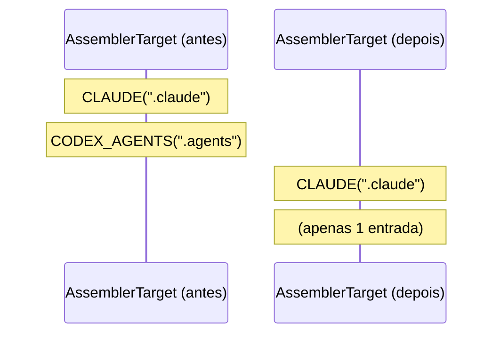
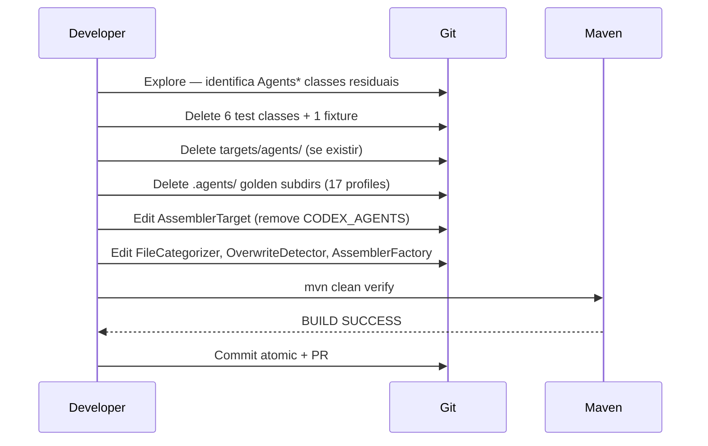

# História: Remover Target Agents Genérico

**ID:** story-0034-0003
**Chave Jira:** —
**Status:** Pendente

## 1. Dependências

| Blocked By | Blocks |
| :--- | :--- |
| story-0034-0002 | story-0034-0004 |

## 2. Regras Transversais Aplicáveis

| ID | Título |
| :--- | :--- |
| RULE-001 | Build Sempre Verde Entre Stories |
| RULE-002 | Coverage Não Pode Degradar |
| RULE-005 | Remoção Atômica por Target |
| RULE-006 | TDD Compliance na Remoção |

## 3. Descrição

Como **Maintainer do gerador `ia-dev-environment`**, eu quero remover completamente o suporte ao target genérico "agents" (`.agents/`) do código Java, testes e golden files, garantindo que o gerador deixe de produzir qualquer artefato para esta plataforma e que `AssemblerTarget.CODEX_AGENTS` seja removido do enum.

Esta é a terceira e última story atômica de remoção por target. Completa o ciclo iniciado em story-0034-0001 (Copilot) e continuado em story-0034-0002 (Codex). O target "agents" compartilha infraestrutura com Codex e não tem diretório de resources próprio (verificado: `java/src/main/resources/targets/` contém apenas `claude/`, `codex/` e `github-copilot/`; não existe `agents/`). Esta story foca em: (a) deleção de 2 classes Java main específicas para seleção/assembly de agents (`AgentsAssembler.java` e `AgentsSelection.java`), (b) deleção de 6 classes de teste `Agents*` + fixture, (c) deleção de subdirs `.agents/` em 17 profiles de golden files (~2.910 arquivos), (d) remoção de `AssemblerTarget.CODEX_AGENTS`, (e) verificação que nenhum código residual referencia `.agents/`.

`PlatformFilter` permanece propriedade da story-0034-0004 (higienização), que é dona da simplificação de classes compartilhadas; esta story apenas remove a entrada do enum e deixa a simplificação do filtro para o refactoring dedicado.

### 3.1 Classes Java Main a Deletar

2 arquivos em `java/src/main/java/dev/iadev/application/assembler/` (confirmados via filesystem):

- `AgentsAssembler.java`
- `AgentsSelection.java`

### 3.2 Classes de Teste a Deletar

6 arquivos em `java/src/test/java/dev/iadev/application/assembler/`:

- `AgentsAssemblerTest`
- `AgentsAssemblerCoverageTest`
- `AgentsSelectionTest`
- `AgentsGoldenMatchTest`
- `AgentsConditionalGoldenTest`
- `AgentsCoreAndDevTest`

Mais a fixture `AgentsTestFixtures.java`.

### 3.3 Resources a Deletar

**Nenhum.** Diretório `java/src/main/resources/targets/agents/` não existe (verificado). Target compartilha resources com Codex — já removido em story-0034-0002.

### 3.4 Golden Files a Deletar

- Subdir `.agents/` em cada um dos 17 profiles (~2.910 arquivos total)

### 3.6 Arquivos Java a Editar

| Arquivo | Mudança |
|---------|---------|
| `application/assembler/AssemblerTarget.java` | Remover `CODEX_AGENTS(".agents")` (esta é a única edição de enum nesta story) |
| `cli/FileCategorizer.java` | Remover categorização de `.agents/` (se ainda não removida) |
| `util/OverwriteDetector.java` | Remover `".agents"` de `ARTIFACT_DIRS` |
| `application/assembler/AssemblerFactory.java` | Remover chamadas/referências a `AgentsAssembler` e `AgentsSelection` se existirem |
| `application/assembler/AssemblerTargetTest.java` (test) | Remover asserts para `CODEX_AGENTS` |

> **Nota:** `PlatformFilter.java` **NÃO** é editado nesta story. A simplificação completa do filtro (inclusive remoção de branches residuais) é responsabilidade da story-0034-0004 (higienização). Isto evita double-work e ping-pong entre stories.

## 3.5 Entrega de Valor

- **Valor Principal:** Roteamento interno do gerador passa a ter contrato de target único (`AssemblerTarget.CLAUDE`), eliminando risco arquitetural de regressão em `.agents/` ser descoberta apenas em produção. Evoluções futuras do gerador (novas skills, novos hooks, nova organização de output) não precisam mais raciocinar sobre multi-target ou considerar "como isto afeta agents". Enum reduzido a um único valor fecha o contrato público interno.
- **Métrica de Sucesso:** (1) `mvn clean verify` verde com coverage ≥ 95% line / ≥ 90% branch. (2) `AssemblerTarget.java` contém exatamente 1 constante (`CLAUDE`). (3) `grep -r "\\.agents/\|CODEX_AGENTS" java/src/main` = 0 matches. (4) `find java/src/test/resources/golden -type d -name '.agents'` = 0 resultados. (5) Contagem acumulada de golden files removidos desde início do épico: ~8.273.
- **Impacto no Negócio:** Fim da fase de "remoção por target" do épico. Próximas stories focam em polir o estado final (higienização + docs), não em eliminar mais plataformas. Marco que permite comunicação interna "o gerador é Claude-only" sem ressalvas. Qualquer decisão arquitetural futura parte desse novo baseline.

## 4. Definições de Qualidade Locais

### DoR Local (Definition of Ready)

- [ ] story-0034-0002 completa e merged (ou branch integrada)
- [ ] Build verde como baseline (pós-story-0034-0002)
- [ ] Confirmado: `targets/agents/` NÃO existe como diretório (verificado no planejamento — nenhum resource a deletar)
- [ ] Confirmado: classes main a deletar = `AgentsAssembler.java` + `AgentsSelection.java` (exatamente 2, sem exploração adicional)

### DoD Local (Definition of Done)

- [ ] `AgentsAssembler.java` e `AgentsSelection.java` deletadas (2 classes main)
- [ ] 6 classes de teste Agents* deletadas
- [ ] Fixture `AgentsTestFixtures.java` deletada
- [ ] Subdirs `.agents/` deletados em 17 profiles de golden files
- [ ] `AssemblerTarget.CODEX_AGENTS` removido
- [ ] `AssemblerFactory.java` sem referências a `AgentsAssembler`/`AgentsSelection`
- [ ] `FileCategorizer.java`, `OverwriteDetector.java` limpos para `.agents/`
- [ ] `AssemblerTargetTest.java` sem asserts para `CODEX_AGENTS`
- [ ] `mvn clean verify` verde (line ≥ 95%, branch ≥ 90%)
- [ ] `grep -r "\\.agents/\|CODEX_AGENTS\|AgentsAssembler\|AgentsSelection" java/src/main` = zero
- [ ] `find java/src/test/resources/golden -type d -name '.agents'` = zero
- [ ] `PlatformFilter.java` NÃO foi tocado (pertence à story-0034-0004)
- [ ] PR criado e aprovado

### Global Definition of Done (DoD)

> Copiado do épico-0034.

- **Cobertura:** ≥ 95% line, ≥ 90% branch.
- **Testes Automatizados:** Todos remanescentes passando.
- **Relatório de Cobertura:** JaCoCo anexado ao PR.
- **Documentação:** Atualizações pontuais.
- **Performance:** Tempo de build não aumenta.

## 5. Contratos de Dados (Data Contract)

### 5.1 Enum Contract (Before → After)

| Enum | Antes desta story | Depois desta story |
| :--- | :--- | :--- |
| `AssemblerTarget` | `CLAUDE(".claude"), CODEX_AGENTS(".agents")` | `CLAUDE(".claude")` *(único)* |
| `Platform` | `CLAUDE_CODE, SHARED` | `CLAUDE_CODE, SHARED` *(inalterado — enum já estava reduzido pelas stories 1 e 2)* |

### 5.2 File System Contract (Before → After)

| Caminho | Antes | Depois |
| :--- | :--- | :--- |
| `java/src/test/java/dev/iadev/application/assembler/Agents*.java` | 6 classes + 1 fixture | **0** |
| `java/src/main/resources/targets/agents/` (se existir) | ? | **Deletado** |
| `java/src/test/resources/golden/{profile}/.agents/` | ~171 arquivos/profile | **0 (dir removido)** |
| `AssemblerTarget.CODEX_AGENTS` | Existe | **Removido** |

### 5.3 Error Codes Mapeados

| HTTP Status | Error Code | Condição | Mensagem |
| :--- | :--- | :--- | :--- |
| N/A (build) | `COMPILATION_ERROR` | Referência residual a `AssemblerTarget.CODEX_AGENTS` | javac padrão — bloqueia merge |

## 6. Diagramas

### 6.1 AssemblerTarget — Reduction



### 6.2 Fluxo de Remoção



## 7. Critérios de Aceite (Gherkin)

```gherkin
Cenario: Build verde após remoção do target Agents
  DADO que story-0034-0002 está completa
  E as 6 classes de teste Agents* foram deletadas
  E fixture AgentsTestFixtures foi deletada
  E subdirs .agents/ foram removidos de 17 profiles
  E AssemblerTarget.CODEX_AGENTS foi removido
  QUANDO executo "mvn clean verify"
  ENTÃO a build termina com BUILD SUCCESS
  E coverage line ≥ 95% e branch ≥ 90%

Cenario: AssemblerTarget tem apenas CLAUDE
  DADO que a story foi aplicada
  QUANDO leio AssemblerTarget.java
  ENTÃO o enum tem exatamente 1 constante (CLAUDE)
  E AssemblerTargetTest não contém asserts para CODEX_AGENTS

Cenario: Zero referências a .agents/ no código
  DADO que a story foi aplicada
  QUANDO executo "grep -r '\\.agents/' java/src/main"
  ENTÃO retorna zero matches
  E "grep -r 'CODEX_AGENTS' java/src/main" também retorna zero

Cenario: Golden files `.agents/` completamente removidos
  DADO que a story foi aplicada
  QUANDO executo "find java/src/test/resources/golden -type d -name '.agents'"
  ENTÃO retorna zero diretórios

Cenario: CLI continua funcionando para claude-code
  DADO que a story foi aplicada
  QUANDO executo "java -jar target/ia-dev-env.jar generate --platform claude-code"
  ENTÃO a geração completa com sucesso
  E nenhum diretório .agents/ é criado

Cenario: Degenerate — AssemblerTarget reduzido a um único valor
  DADO que a story foi aplicada
  E AssemblerTarget.CODEX_AGENTS foi removido
  QUANDO inspeciono AssemblerTarget.values()
  ENTÃO retorna array com exatamente 1 elemento (CLAUDE)
  E `mvn compile` continua verde
```

### 7.1 Scenario Ordering (TPP)

1. Happy path: build verde
2. Invariante: `AssemblerTarget` tem só CLAUDE
3. Sanity check: grep zero
4. Boundary: golden dirs removidos
5. Regressão: CLI funciona
6. Degenerate: `AssemblerTarget.values()` retorna array singleton

### 7.2 Mandatory Scenario Categories

- [x] Degenerate cases (`AssemblerTarget` com single value)
- [x] Happy path (build verde, CLI funciona)
- [x] Error paths (compilation error seria bloqueante)
- [x] Boundary values (golden dirs = fronteira final)

### 7.3 TDD Implementation Notes

- **Outer loop:** `mvn clean verify` + CI.
- **Inner loop:** `AssemblerTargetTest` editado confirma que enum tem só 1 constante.
- **RED:** Testes `Agents*Test` verdes no baseline.
- **REFACTOR:** Simplificações em classes compartilhadas ficam para a story-0034-0004 (higienização dedicada).

## 8. Tasks

### TASK-0034-0003-001: Deletar classes Agents (main + testes)

- **Layer:** Adapter + Test
- **Test Type:** Verification
- **Size:** M
- **Dependencies:** —
- **Branch:** `feature/task-0034-0003-001-delete-agents-classes`
- **Testability:** Test + VerificationTest
- **Files:**
  - `java/src/main/java/dev/iadev/application/assembler/AgentsAssembler.java` (DELETE)
  - `java/src/main/java/dev/iadev/application/assembler/AgentsSelection.java` (DELETE)
  - `java/src/main/java/dev/iadev/application/assembler/AssemblerFactory.java` (EDIT — remover referências a AgentsAssembler/AgentsSelection se existirem)
  - `java/src/test/java/dev/iadev/application/assembler/AgentsAssemblerTest.java` (DELETE)
  - `java/src/test/java/dev/iadev/application/assembler/AgentsAssemblerCoverageTest.java` (DELETE)
  - `java/src/test/java/dev/iadev/application/assembler/AgentsSelectionTest.java` (DELETE)
  - `java/src/test/java/dev/iadev/application/assembler/AgentsGoldenMatchTest.java` (DELETE)
  - `java/src/test/java/dev/iadev/application/assembler/AgentsConditionalGoldenTest.java` (DELETE)
  - `java/src/test/java/dev/iadev/application/assembler/AgentsCoreAndDevTest.java` (DELETE)
  - `java/src/test/java/dev/iadev/application/assembler/AgentsTestFixtures.java` (DELETE)
- **Acceptance Criteria:**
  - [ ] 2 classes main + 6 classes de teste + 1 fixture deletadas
  - [ ] `mvn compile` e `mvn test-compile` verdes

### TASK-0034-0003-002: Atualizar AssemblerTarget e classes dependentes

- **Layer:** Domain + Config
- **Test Type:** Verification
- **Size:** S
- **Dependencies:** TASK-0034-0003-001
- **Branch:** `feature/task-0034-0003-002-update-enum-target`
- **Testability:** Config + VerificationTest
- **Files:**
  - `java/src/main/java/dev/iadev/application/assembler/AssemblerTarget.java` (EDIT — remove `CODEX_AGENTS`)
  - `java/src/main/java/dev/iadev/cli/FileCategorizer.java` (EDIT — remove `.agents/` se ainda presente)
  - `java/src/main/java/dev/iadev/util/OverwriteDetector.java` (EDIT — remove `".agents"` se ainda presente)
  - `java/src/test/java/dev/iadev/application/assembler/AssemblerTargetTest.java` (EDIT — remove asserts para `CODEX_AGENTS`)
- **Acceptance Criteria:**
  - [ ] `AssemblerTarget` com apenas `CLAUDE(".claude")`
  - [ ] `mvn compile` + `mvn test-compile` verdes
  - [ ] `PlatformFilter.java` NÃO foi tocado (pertence à story-0034-0004)

### TASK-0034-0003-003: Deletar golden files `.agents/` + resources (se existirem)

- **Layer:** Test + Config
- **Test Type:** Smoke
- **Size:** M
- **Dependencies:** TASK-0034-0003-002
- **Branch:** `feature/task-0034-0003-003-delete-agents-golden`
- **Testability:** Migration + Smoke
- **Files:**
  - `java/src/main/resources/targets/agents/` (DELETE se existir)
  - `java/src/test/resources/golden/{17-profiles}/.agents/` (DELETE recursivo)
- **Acceptance Criteria:**
  - [ ] `targets/agents/` removido (se existia)
  - [ ] `find golden -type d -name .agents` = zero
  - [ ] `mvn clean verify` verde

### TASK-0034-0003-004: Validação final e PR

- **Layer:** Config + Test
- **Test Type:** Smoke + Verification
- **Size:** S
- **Dependencies:** TASK-0034-0003-003
- **Branch:** `feature/task-0034-0003-004-final-verify`
- **Testability:** Config + VerificationTest
- **Files:** (nenhum novo — apenas verificação)
- **Acceptance Criteria:**
  - [ ] `mvn clean verify` verde com coverage mantida
  - [ ] Grep sanity: `grep -r "CODEX_AGENTS\|\\.agents/" java/src/main` = zero
  - [ ] CLI smoke: `--platform claude-code` funciona
  - [ ] PR criado e aprovado

### 8.1 Detailed Tasks (generated by x-story-plan)

| # | Task ID | Description | Type | TDD Phase | Layer | Depends On | Effort |
|---|---------|-------------|------|-----------|-------|-----------|--------|
| 1 | TASK-0034-0003-001 | Delete 2 Agents main classes + 6 test classes + 1 fixture; edit AssemblerFactory | implementation (delete) | GREEN | application.assembler + adapter.test | — | M |
| 2 | TASK-0034-0003-002 | Edit AssemblerTarget (remove CODEX_AGENTS) + FileCategorizer + OverwriteDetector + AssemblerTargetTest | implementation (edit) | GREEN | domain + adapter.inbound + util + adapter.test | TASK-0034-0003-001 | S |
| 3 | TASK-0034-0003-003 | Delete `.agents/` golden subdirs in 17 profiles (~2910 files); verify no `targets/agents/` | migration (delete) | GREEN (boundary) | adapter.test | TASK-0034-0003-002 | M |
| 4 | TASK-0034-0003-004 | Final verify: mvn clean verify, coverage, grep sanity, CLI smoke, PR with metrics | quality-gate + validation | VERIFY | config + test | TASK-0034-0003-003 | S |

> Generated by `/x-story-plan` on 2026-04-10. See `plans/epic-0034/plans/tasks-story-0034-0003.md` for full breakdown. DoR verdict: **READY** (10/10 mandatory checks passed).
