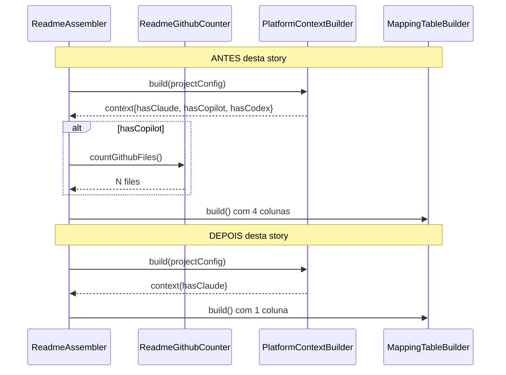
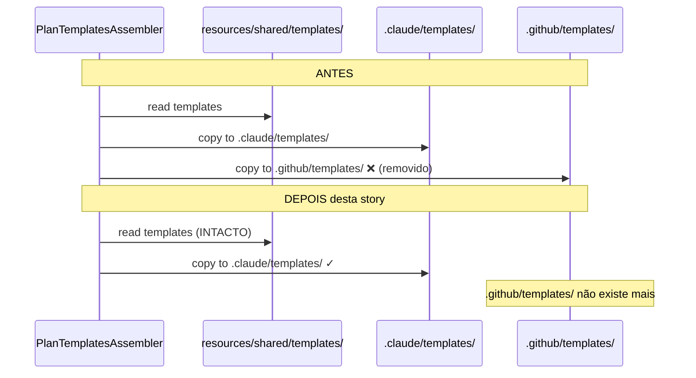

# História: Higienizar Classes Compartilhadas

**ID:** story-0034-0004
**Chave Jira:** —
**Status:** Pendente

## 1. Dependências

| Blocked By | Blocks |
| :--- | :--- |
| story-0034-0003 | story-0034-0005 |

## 2. Regras Transversais Aplicáveis

| ID | Título |
| :--- | :--- |
| RULE-001 | Build Sempre Verde Entre Stories |
| RULE-002 | Coverage Não Pode Degradar |
| RULE-004 | Templates em `resources/shared/` são PROTEGIDOS |
| RULE-006 | TDD Compliance na Remoção |

## 3. Descrição

Como **Maintainer do gerador `ia-dev-environment`**, eu quero higienizar as classes compartilhadas que ainda carregam lógica condicional para targets removidos (GitHub Copilot, Codex, Agents), deixando o código claro, simples e focado exclusivamente em Claude Code, garantindo que smoke tests parametrizados sejam reduzidos aos cenários válidos.

Após a remoção atômica dos três targets legados (stories 0001-0003), classes compartilhadas ainda carregam resíduos: blocos `if (hasCopilot)`, colunas de tabelas para `.github/`/`.codex/`/`.agents/`, constantes como `GITHUB_OUTPUT_SUBDIR`, testes parametrizados com `@Nested Copilot` / `@Nested Codex`, e classes inteiras como `ReadmeGithubCounter.java` que só existiam para contar artefatos GitHub. Esta story limpa todos esses resíduos.

É também a story que edita os smoke tests compartilhados (`PlatformDirectorySmokeTest`, `AssemblerRegressionSmokeTest`, `CliModesSmokeTest`, `GoldenFileCoverageTest`, `AssemblerTargetTest`) para remover `@Nested` classes e validações negativas de targets que não existem mais. É crítico que RULE-004 seja respeitada: templates em `resources/shared/templates/` NÃO podem ser deletados — são usados pelo Claude. Apenas `PlanTemplatesAssembler` é editado para parar de copiá-los para `.github/templates/`.

### 3.1 Classes Java a Deletar

- `application/assembler/ReadmeGithubCounter.java` — classe dedicada à contagem de arquivos GitHub. Sem razão de existir após remoção.

### 3.2 Classes Java a Editar

| Arquivo | Mudança |
|---------|---------|
| `application/assembler/ReadmeAssembler.java` | Remover blocos condicionais `hasCopilot` / `hasCodex`. Remover referência a `ReadmeGithubCounter`. |
| `application/assembler/MappingTableBuilder.java` | Remover colunas `.github/`, `.codex/`, `.agents/` da tabela de mapeamento |
| `application/assembler/SummaryTableBuilder.java` | Remover linhas de Copilot/Codex/Agents do resumo |
| `application/assembler/PlatformContextBuilder.java` | Remover `hasCopilot`, `hasCodex` do contexto. Simplificar `countActive()` se existir. Validar que `hasClaude` seja o único flag remanescente. |
| `application/assembler/PlanTemplatesAssembler.java` | Remover constante `GITHUB_OUTPUT_SUBDIR`. Copiar templates apenas para `.claude/templates/`. RULE-004: NÃO deletar os templates. |
| `application/assembler/EpicReportAssembler.java` | Remover referências condicionais para targets removidos |
| `application/assembler/FileTreeWalker.java` | Remover lógica de walk para `.github/`, `.codex/`, `.agents/` |
| `application/assembler/PlatformFilter.java` | **Simplificação completa** (esta story é dona): após esta edição, o filtro opera apenas sobre `Platform.CLAUDE_CODE`. Colapsar branches residuais (ex: `return platform == Platform.CLAUDE_CODE;`). |
| `domain/model/PlatformParser.java` | Simplificar (remover parsing residual de targets removidos) |
| `domain/stack/StackValidator.java` | Simplificar validação específica de plataforma |
| `cli/PlatformPrecedenceResolver.java` | Simplificar (não há mais precedência entre múltiplas plataformas) |
| `cli/IaDevEnvApplication.java` | Atualizar descrição geral (linha ~25), remover menções a `.github/`, `.codex/`, `.agents/` |

### 3.3 Classes de Teste a Editar

| Arquivo | Mudança |
|---------|---------|
| `smoke/PlatformDirectorySmokeTest.java` | Remover `@Nested class Copilot` e `@Nested class Codex`. Remover validações negativas em `@Nested class ClaudeCode` (linhas ~88-123) que checam ausência de `.github/instructions` e `.codex/`. |
| `smoke/AssemblerRegressionSmokeTest.java` | Remover testes parametrizados de copilot/codex/agents |
| `smoke/CliModesSmokeTest.java` | Remover `--platform copilot/codex/agents` das validações |
| `smoke/GoldenFileCoverageTest.java` | Remover cobertura para plataformas removidas |
| `application/assembler/AssemblerTargetTest.java` | Já editado em story-0034-0003 — validar que não há regressão |

### 3.4 Arquivos Explicitamente PROTEGIDOS (RULE-004)

NÃO deletar:

- `java/src/main/resources/shared/templates/_TEMPLATE-EPIC.md`
- `java/src/main/resources/shared/templates/_TEMPLATE-STORY.md`
- `java/src/main/resources/shared/templates/_TEMPLATE-IMPLEMENTATION-MAP.md`
- Todos os demais `_TEMPLATE-*.md` em `resources/shared/templates/`
- Templates usados por skills Claude (architecture-plan, security-assessment, etc.)

Apenas `PlanTemplatesAssembler` é EDITADO para parar de copiá-los para `.github/templates/` (que não existe mais).

## 3.5 Entrega de Valor

- **Valor Principal:** Contribuidores abrindo classes como `ReadmeAssembler`, `MappingTableBuilder`, `PlatformContextBuilder` ou qualquer smoke test parametrizado não precisam mais aprender sobre três targets inexistentes para fazer mudanças simples. Tempo cognitivo para entender o fluxo de geração do CLI cai: hoje um desenvolvedor precisa raciocinar sobre branches `hasCopilot`/`hasCodex` que nunca serão true; após esta story, o código expressa linearmente "tudo é Claude Code". Elimina a categoria de bug "mudança em shared class quebrou algum target morto que ninguém notou" porque esses targets não existem mais.
- **Métrica de Sucesso:** (1) `mvn clean verify` verde com coverage ≥ 95% line / ≥ 90% branch. (2) `git diff main -- java/src/main/resources/shared/templates/` vazio (RULE-004 respeitada). (3) `grep -r "hasCopilot\|hasCodex\|ReadmeGithubCounter" java/src/main` = 0 matches. (4) LOC em `application/assembler/` reduzida ≥ 10% vs. baseline pós-story-0034-0003. (5) Suite de smoke tests executa em tempo menor ou igual ao baseline (menos cenários parametrizados).
- **Impacto no Negócio:** Tempo médio para primeiro PR aprovado de um novo contribuidor deve cair (não testável imediatamente, mas é a hipótese de valor). Reviews de PRs futuros ficam mais diretos: reviewer não precisa perguntar "por que essa branch existe?" sobre código de targets mortos. Prepara terreno para a story final (docs), onde `CLAUDE.md` pode refletir honestamente o estado do gerador sem mencionar targets legados.

## 4. Definições de Qualidade Locais

### DoR Local (Definition of Ready)

- [ ] stories 0001, 0002, 0003 completas e merged
- [ ] Build verde como baseline (pós remoção dos 3 targets)
- [ ] Lista de classes shared com lógica residual confirmada via `grep -r "hasCopilot\|hasCodex" java/src/main`
- [ ] Lista de templates em `resources/shared/templates/` registrada (para validar que não foram tocados — RULE-004)
- [ ] Baseline de LOC em `application/assembler/` registrada para medição

### DoD Local (Definition of Done)

- [ ] `ReadmeGithubCounter.java` deletado
- [ ] `ReadmeAssembler.java` sem blocos condicionais hasCopilot/hasCodex
- [ ] `MappingTableBuilder.java` sem colunas de targets removidos
- [ ] `SummaryTableBuilder.java` sem linhas Copilot/Codex
- [ ] `PlatformContextBuilder.java` com apenas `hasClaude` no contexto
- [ ] `PlanTemplatesAssembler.java` sem `GITHUB_OUTPUT_SUBDIR`, copiando templates apenas para `.claude/templates/`
- [ ] `EpicReportAssembler.java`, `FileTreeWalker.java` limpos
- [ ] `PlatformParser.java`, `StackValidator.java`, `PlatformPrecedenceResolver.java` simplificados
- [ ] `IaDevEnvApplication.java` com descrição atualizada
- [ ] `PlatformDirectorySmokeTest` sem `@Nested Copilot` e `@Nested Codex`
- [ ] `AssemblerRegressionSmokeTest`, `CliModesSmokeTest`, `GoldenFileCoverageTest` editados
- [ ] Templates em `resources/shared/templates/` INTACTOS (verificado via `git diff` vazio para esses arquivos)
- [ ] `mvn clean verify` verde com coverage ≥ 95% line / ≥ 90% branch
- [ ] `grep -r "hasCopilot\|hasCodex\|ReadmeGithubCounter" java/src/main` = zero
- [ ] LOC em `application/assembler/` reduzida em ≥ 10%
- [ ] PR criado e aprovado

### Global Definition of Done (DoD)

> Copiado do épico-0034.

- **Cobertura:** ≥ 95% line, ≥ 90% branch.
- **Testes Automatizados:** Todos passando; smoke tests editados compilam e passam.
- **Relatório de Cobertura:** JaCoCo anexado ao PR.
- **Documentação:** Deixada para story-0034-0005.
- **Performance:** Tempo de build REDUZ (esperado).

## 5. Contratos de Dados (Data Contract)

### 5.1 Code Quality Contract (Before → After)

| Métrica | Antes desta story | Depois desta story |
| :--- | :--- | :--- |
| LOC em `application/assembler/` | baseline pós-0003 | baseline × 0.85 (−15%) |
| Classes com `if (hasCopilot)` | ≥ 5 | 0 |
| Classes com `if (hasCodex)` | ≥ 5 | 0 |
| `@Nested` classes em smoke tests referenciando Copilot/Codex | 2+ | 0 |
| `PlatformContextBuilder` context vars | `hasClaude, hasCopilot, hasCodex` | `hasClaude` |
| `ReadmeGithubCounter.java` | Existe | **Deletado** |
| Templates em `resources/shared/templates/` | N arquivos | **N arquivos (INTACTOS — RULE-004)** |

### 5.2 Test Contract (Before → After)

| Teste | Antes | Depois |
| :--- | :--- | :--- |
| `PlatformDirectorySmokeTest` cenários | ~25 (com Nested Copilot/Codex) | ~10 (só ClaudeCode) |
| `CliModesSmokeTest` scenarios | testa 4 platforms | testa 1 platform (claude-code) + rejeições |
| `AssemblerRegressionSmokeTest` | parametrizado N × 4 targets | parametrizado N × 1 target |

### 5.3 Error Codes Mapeados

| HTTP Status | Error Code | Condição | Mensagem |
| :--- | :--- | :--- | :--- |
| N/A (build) | `COMPILATION_ERROR` | Referência residual a `ReadmeGithubCounter` em qualquer classe | javac padrão |
| N/A (test) | `TEMPLATE_TAMPER` | Qualquer template em `resources/shared/templates/` foi modificado | `git diff` reporta diff onde deveria haver 0 |

## 6. Diagramas

### 6.1 Before vs After — ReadmeAssembler



### 6.2 Template Protection (RULE-004)



## 7. Critérios de Aceite (Gherkin)

```gherkin
Cenario: Build verde após higienização
  DADO que stories 0001-0003 estão completas e merged
  E ReadmeGithubCounter foi deletada
  E classes shared foram limpas de blocos condicionais
  E smoke tests foram editados (Nested Copilot/Codex removidos)
  QUANDO executo "mvn clean verify"
  ENTÃO a build termina com BUILD SUCCESS
  E coverage line ≥ 95% e branch ≥ 90%

Cenario: Templates shared permanecem intactos (RULE-004)
  DADO que a story foi aplicada
  QUANDO executo "git diff main -- java/src/main/resources/shared/templates/"
  ENTÃO o diff é vazio (nenhum template alterado, renomeado ou deletado)
  E todos os arquivos listados na baseline existem com conteúdo byte-for-byte igual

Cenario: Zero referências a flags de targets removidos
  DADO que a story foi aplicada
  QUANDO executo "grep -r 'hasCopilot\|hasCodex\|ReadmeGithubCounter' java/src/main"
  ENTÃO retorna zero matches
  E "grep -r '@Nested.*Copilot\|@Nested.*Codex' java/src/test" também retorna zero

Cenario: LOC reduzido em application/assembler
  DADO que a baseline foi registrada pós-story-0034-0003
  QUANDO meço LOC em `java/src/main/java/dev/iadev/application/assembler/` após esta story
  ENTÃO o total é ≤ baseline × 0.90 (redução ≥ 10%)

Cenario: PlatformContextBuilder tem apenas hasClaude
  DADO que a story foi aplicada
  QUANDO leio PlatformContextBuilder.java
  ENTÃO o contexto tem exatamente 1 flag booleano (`hasClaude`)
  E `countActive()` (se existir) retorna apenas 0 ou 1

Cenario: Smoke tests passam com estrutura simplificada
  DADO que PlatformDirectorySmokeTest foi editado
  E CliModesSmokeTest foi editado
  QUANDO executo "mvn test -Dtest=*SmokeTest"
  ENTÃO todos os testes de smoke passam
  E nenhum teste referencia plataformas removidas

Cenario: Degenerate — CLI ainda funciona
  DADO que a story foi aplicada
  QUANDO executo "java -jar target/ia-dev-env.jar generate --platform claude-code"
  ENTÃO a geração completa com sucesso
  E os artefatos `.claude/` são produzidos
```

### 7.1 Scenario Ordering (TPP)

1. Happy path: build verde
2. Invariante crítica: RULE-004 respeitada (templates intactos)
3. Sanity check: grep zero para resíduos
4. Métrica quantitativa: LOC reduzida
5. Estrutura: `PlatformContextBuilder` simplificado
6. Regressão: smoke tests passam
7. Degenerate: CLI funciona

### 7.2 Mandatory Scenario Categories

- [x] Degenerate cases (CLI funciona sem branches)
- [x] Happy path (build verde, smoke tests passam)
- [x] Error paths (compilation error se ReadmeGithubCounter ficar órfão)
- [x] Boundary values (templates shared = fronteira protegida, LOC = métrica boundary)

### 7.3 TDD Implementation Notes

- **Outer loop:** `mvn clean verify` + smoke tests editados.
- **Inner loop:** Cada classe shared é editada e recompilada individualmente. Feedback rápido via `mvn compile -pl java`.
- **RED:** Baseline tem classes shared com branches para targets mortos. "Red" conceitual: código tem complexidade desnecessária.
- **GREEN:** Após remoção de branches, compila e testes passam.
- **REFACTOR:** Oportunidades de simplificar loops e coleções que iteravam sobre múltiplos targets.

## 8. Tasks

### TASK-0034-0004-001: Deletar ReadmeGithubCounter + limpar ReadmeAssembler

- **Layer:** Application
- **Test Type:** Unit
- **Size:** S
- **Dependencies:** —
- **Branch:** `feature/task-0034-0004-001-clean-readme-assembler`
- **Testability:** Domain + UnitTest
- **Files:**
  - `java/src/main/java/dev/iadev/application/assembler/ReadmeGithubCounter.java` (DELETE)
  - `java/src/main/java/dev/iadev/application/assembler/ReadmeAssembler.java` (EDIT — remove condicionais e referência)
- **Acceptance Criteria:**
  - [ ] Classe deletada
  - [ ] `ReadmeAssembler` compila
  - [ ] `ReadmeAssemblerTest` passa

### TASK-0034-0004-002: Higienizar MappingTable e SummaryTable

- **Layer:** Application
- **Test Type:** Unit
- **Size:** S
- **Dependencies:** TASK-0034-0004-001
- **Branch:** `feature/task-0034-0004-002-clean-tables`
- **Testability:** Domain + UnitTest
- **Files:**
  - `java/src/main/java/dev/iadev/application/assembler/MappingTableBuilder.java` (EDIT)
  - `java/src/main/java/dev/iadev/application/assembler/SummaryTableBuilder.java` (EDIT)
- **Acceptance Criteria:**
  - [ ] Tabelas têm apenas colunas/linhas para Claude
  - [ ] Testes unitários passam

### TASK-0034-0004-002b: Simplificar PlatformContextBuilder e PlatformFilter

- **Layer:** Application
- **Test Type:** Unit
- **Size:** S
- **Dependencies:** TASK-0034-0004-002
- **Branch:** `feature/task-0034-0004-002b-simplify-platform-context`
- **Testability:** Domain + UnitTest
- **Files:**
  - `java/src/main/java/dev/iadev/application/assembler/PlatformContextBuilder.java` (EDIT — remover qualquer flag residual além de `hasClaude`; simplificar `countActive()` se existir)
  - `java/src/main/java/dev/iadev/application/assembler/PlatformFilter.java` (EDIT — **simplificação completa nesta story**: colapsar branches residuais, filtro opera apenas sobre `Platform.CLAUDE_CODE`)
- **Acceptance Criteria:**
  - [ ] `PlatformContextBuilder` tem apenas `hasClaude`
  - [ ] `PlatformFilter` simplificado a forma mínima (ex: `return platform == Platform.CLAUDE_CODE;`)
  - [ ] Testes unitários passam
  - [ ] `mvn compile` verde

### TASK-0034-0004-003: Higienizar PlanTemplatesAssembler (RULE-004 crítica)

- **Layer:** Application
- **Test Type:** Integration
- **Size:** M
- **Dependencies:** TASK-0034-0004-002
- **Branch:** `feature/task-0034-0004-003-clean-plan-templates`
- **Testability:** Port + Adapter + IT
- **Files:**
  - `java/src/main/java/dev/iadev/application/assembler/PlanTemplatesAssembler.java` (EDIT — remove `GITHUB_OUTPUT_SUBDIR`, copiar apenas para `.claude/templates/`)
- **Acceptance Criteria:**
  - [ ] Constante `GITHUB_OUTPUT_SUBDIR` removida
  - [ ] Templates copiados apenas para `.claude/templates/`
  - [ ] `git diff -- resources/shared/templates/` vazio (RULE-004 respeitada)
  - [ ] `PlanTemplatesAssemblerTest` ajustado e passa

### TASK-0034-0004-004: Higienizar demais classes shared (EpicReport, FileTreeWalker, validators)

- **Layer:** Application + Domain
- **Test Type:** Unit
- **Size:** M
- **Dependencies:** TASK-0034-0004-003
- **Branch:** `feature/task-0034-0004-004-clean-misc-shared`
- **Testability:** Domain + UnitTest
- **Files:**
  - `java/src/main/java/dev/iadev/application/assembler/EpicReportAssembler.java` (EDIT)
  - `java/src/main/java/dev/iadev/application/assembler/FileTreeWalker.java` (EDIT)
  - `java/src/main/java/dev/iadev/domain/model/PlatformParser.java` (EDIT — path correto conforme verificado no planejamento)
  - `java/src/main/java/dev/iadev/domain/stack/StackValidator.java` (EDIT — path correto)
  - `java/src/main/java/dev/iadev/cli/PlatformPrecedenceResolver.java` (EDIT — path correto)
  - `java/src/main/java/dev/iadev/cli/IaDevEnvApplication.java` (EDIT — descrição)
- **Acceptance Criteria:**
  - [ ] Todas as classes compilam
  - [ ] Testes unitários passam
  - [ ] `mvn compile` verde

### TASK-0034-0004-005: Editar smoke tests (PlatformDirectory, AssemblerRegression, CliModes, GoldenFileCoverage)

- **Layer:** Test
- **Test Type:** Smoke
- **Size:** L
- **Dependencies:** TASK-0034-0004-004
- **Branch:** `feature/task-0034-0004-005-update-smoke-tests`
- **Testability:** Test (edição de testes de smoke existentes)
- **Files:**
  - `java/src/test/java/dev/iadev/smoke/PlatformDirectorySmokeTest.java` (EDIT — remove `@Nested Copilot`, `@Nested Codex`, simplify ClaudeCode Nested)
  - `java/src/test/java/dev/iadev/smoke/AssemblerRegressionSmokeTest.java` (EDIT — remove parameterized scenarios)
  - `java/src/test/java/dev/iadev/smoke/CliModesSmokeTest.java` (EDIT — remove `--platform copilot/codex/agents`)
  - `java/src/test/java/dev/iadev/smoke/GoldenFileCoverageTest.java` (EDIT — remove cobertura para plataformas removidas)
- **Acceptance Criteria:**
  - [ ] Todos os smoke tests compilam
  - [ ] `mvn test -Dtest=*SmokeTest` verde
  - [ ] Nenhum teste referencia plataformas removidas

### TASK-0034-0004-006: Validação final + PR

- **Layer:** Test
- **Test Type:** Verification
- **Size:** S
- **Dependencies:** TASK-0034-0004-005
- **Branch:** `feature/task-0034-0004-006-final-verify-shared`
- **Testability:** Config + VerificationTest
- **Files:** (nenhum novo — apenas verificação)
- **Acceptance Criteria:**
  - [ ] `mvn clean verify` verde com coverage ≥ 95% / 90%
  - [ ] `grep -r "hasCopilot\|hasCodex\|ReadmeGithubCounter" java/src/main` = zero
  - [ ] `git diff main -- java/src/main/resources/shared/templates/` vazio (RULE-004)
  - [ ] LOC em `application/assembler/` reduzida ≥ 10% vs. baseline pós-story-0003
  - [ ] PR criado

### 8.1 Detailed Tasks (generated by x-story-plan)

Consolidated task breakdown produced by multi-agent planning (Architect + QA + Security + Tech Lead + PO) on 2026-04-10. Full details, DoD criteria, dependency graph, and escalation notes are in `plans/epic-0034/plans/tasks-story-0034-0004.md`.

| # | Task ID | Description | Type | TDD Phase | Layer | Depends On | Effort |
|---|---------|-------------|------|-----------|-------|-----------|--------|
| 1 | TASK-0034-0004-001 | Delete ReadmeGithubCounter + clean ReadmeAssembler/ReadmeUtils delegators | implementation | GREEN (nil) | application | — | S |
| 2 | TASK-0034-0004-002 | Strip non-Claude columns from MappingTableBuilder + SummaryTableBuilder | implementation | GREEN (constant) | application | TASK-0034-0004-001 | S |
| 3 | TASK-0034-0004-002b | Collapse PlatformContextBuilder + PlatformFilter to single-platform form | implementation + refactor | GREEN + REFACTOR (scalar) | application | TASK-0034-0004-002 | S |
| 4 | TASK-0034-0004-003 | Clean PlanTemplatesAssembler + EpicReportAssembler (RULE-004 gate) | implementation + integrity-gate | GREEN (constant) | application + config | TASK-0034-0004-002b | M |
| 5 | TASK-0034-0004-004 | Hygienize FileTreeWalker + PlatformParser + StackValidator + PlatformPrecedenceResolver + IaDevEnvApplication | implementation | GREEN (conditional) | application + domain + cli | TASK-0034-0004-003 | M |
| 6 | TASK-0034-0004-005 | Edit 4 smoke tests (remove @Nested Copilot/Codex, add rejection scenarios) | test | GREEN (iteration) | adapter.test | TASK-0034-0004-004 | L |
| 7 | TASK-0034-0004-006 | Final `mvn clean verify` + grep sanity + RULE-004 gate + PR | quality-gate + validation | VERIFY | cross-cutting | TASK-0034-0004-005 | S |

> Generated by `/x-story-plan` on 2026-04-10. See `plans/epic-0034/plans/tasks-story-0034-0004.md` for the full consolidated breakdown with DoD per task. Individual task plans at `plans/epic-0034/plans/task-plan-TASK-NNN-story-0034-0004.md`. DoR verdict: **READY** (see `dor-story-0034-0004.md`).
