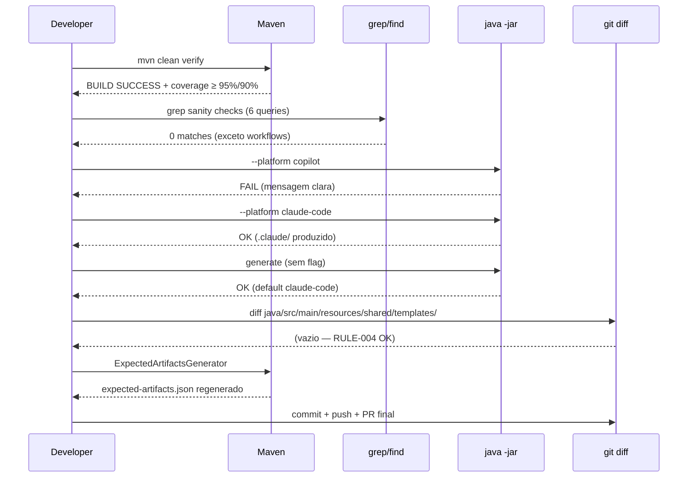
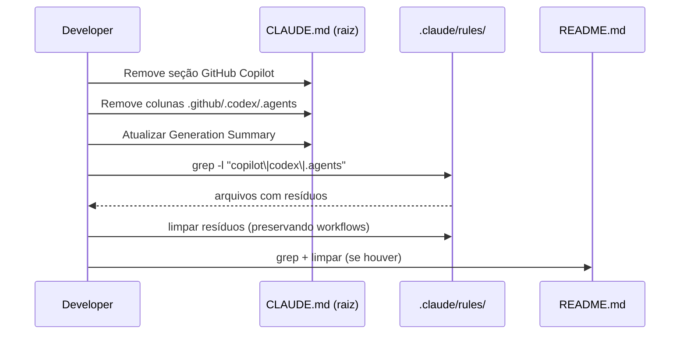

# História: Documentação e Verificação Final

**ID:** story-0034-0005
**Chave Jira:** —
**Status:** Pendente

## 1. Dependências

| Blocked By | Blocks |
| :--- | :--- |
| story-0034-0004 | — |

## 2. Regras Transversais Aplicáveis

| ID | Título |
| :--- | :--- |
| RULE-001 | Build Sempre Verde Entre Stories |
| RULE-002 | Coverage Não Pode Degradar |
| RULE-003 | `.github/workflows/` é PROTEGIDO |
| RULE-004 | Templates em `resources/shared/` são PROTEGIDOS |

## 3. Descrição

Como **Maintainer do gerador `ia-dev-environment`**, eu quero atualizar toda a documentação do projeto (CLAUDE.md raiz, `.claude/rules/`, README, docs) para refletir o novo escopo Claude-only, regenerar o manifest `expected-artifacts.json`, e executar a verificação end-to-end final do épico, garantindo que o estado do repositório esteja coerente, limpo e pronto para merge em `develop`.

Esta é a story de fechamento do épico 0034. As quatro stories anteriores deletaram código, resources, testes e golden files. Esta story garante que: (a) a documentação descreva o gerador Claude-only sem resíduos sobre Copilot/Codex/agents; (b) o manifest de golden files (`expected-artifacts.json`) reflita o novo volume de artefatos (~830 por profile vs. ~9.500); (c) a verificação end-to-end (build + smoke tests + grep sanity + CLI manual) confirme a qualidade do resultado.

É também a story que faz a validação quantitativa do épico como um todo: coverage mantida dentro do threshold, LOC reduzida, tempo de build reduzido, zero referências residuais via grep. O PR final desta story representa o fechamento do épico e o gate para merge em `develop`.

### 3.1 Documentação a Atualizar

**`CLAUDE.md` (raiz do repositório):**

Remover as seguintes seções/linhas:

- Seção `### .github/ (GitHub Copilot)` (linhas ~33-43)
- Coluna `.github/` da tabela `.claude/ <-> .github/ <-> .codex/ Mapping` (linhas ~49-58)
- Coluna `.codex/` da mesma tabela
- Linha `**Total .github/ artifacts: 52**` (linha ~60)
- Linhas de Copilot/Codex/Agents no `Generation Summary` (linhas ~271-277)

Atualizar:

- Descrição geral do projeto para refletir "gerador Claude Code" sem menção a outros targets
- Contadores totais no `Generation Summary`
- Qualquer tabela que compare os targets

**`.claude/rules/*.md`:**

- Verificar cada arquivo com grep `-l "copilot\|codex\|\.github/\|\.agents/"` e limpar referências residuais (exceto `.github/workflows/` quando referenciado em contexto de CI/CD — RULE-003).

**`README.md` (raiz):**

- Se houver referências a Copilot/Codex/Agents, remover.
- Atualizar descrição geral do projeto.

**`docs/` (se existir):**

- Varredura completa por referências residuais e limpeza.

### 3.2 Manifest de Golden Files a Regenerar

**`java/src/test/resources/smoke/expected-artifacts.json`:**

- Contém ~187 referências a `.agents`, `.codex`, `.github` no baseline.
- Deve ser REGENERADO via `ExpectedArtifactsGenerator.generate()` ou equivalente após todas as edições das stories anteriores.
- Conteúdo esperado pós-regeneração: ~830 arquivos por profile (vs. ~9.500 antes), representando redução de ~91%.
- Ferramenta: rodar o generator utilitário existente (provavelmente uma main class ou script Maven) que produz o manifest.

### 3.3 Verificações End-to-End

**1. Build e testes completos:**

```
cd java && mvn clean verify
```

Esperado:
- `BUILD SUCCESS`
- 0 falhas de teste
- Coverage line ≥ 95%, branch ≥ 90%
- Tempo de build comparável ou MENOR que baseline (esperado redução por menos golden comparisons)

**2. Grep sanity checks (todos devem retornar zero matches):**

```
grep -r "GithubInstructionsAssembler\|CodexConfigAssembler\|AgentsAssembler" java/src/main/java
grep -r "ReadmeGithubCounter\|hasCopilot\|hasCodex" java/src/main
grep -r "\\.codex/\|\\.agents/" java/src/main
grep -r "COPILOT\|CODEX\|CODEX_AGENTS" java/src/main/java/dev/iadev/domain/model/Platform.java
grep -r "COPILOT\|CODEX\|CODEX_AGENTS" java/src/main/java/dev/iadev/application/assembler/AssemblerTarget.java
grep -A5 "ACCEPTED_VALUES" java/src/main/java/dev/iadev/cli/PlatformConverter.java  # expected: apenas "claude-code" listado
```

**Exceção permitida:** linhas que referenciam `.github/workflows/` legitimamente (CI/CD — RULE-003).

**3. CLI smoke test manual:**

```
# Deve FALHAR com mensagem clara:
java -jar target/ia-dev-env.jar generate --platform copilot
java -jar target/ia-dev-env.jar generate --platform codex
java -jar target/ia-dev-env.jar generate --platform agents

# Devem FUNCIONAR:
java -jar target/ia-dev-env.jar generate --platform claude-code
java -jar target/ia-dev-env.jar generate  # default
```

**4. Contagem de arquivos gerados (profile de referência):**

```
# Antes do épico: ~9.500 arquivos para java-spring
# Depois do épico: ~830 arquivos para java-spring (esperado)
java -jar target/ia-dev-env.jar generate --profile java-spring --output /tmp/gen-test
find /tmp/gen-test -type f | wc -l
```

**5. Validação de templates protegidos (RULE-004):**

```
git diff main -- java/src/main/resources/shared/templates/
```

Esperado: diff vazio. Nenhum template alterado, renomeado ou deletado.

**6. Cross-check CLAUDE.md:**

- Abrir `CLAUDE.md` no root e confirmar que reflete o novo estado.
- Confirmar que `Generation Summary` tem contadores corretos.

## 3.5 Entrega de Valor

- **Valor Principal:** Conversas de desenvolvedores com Claude Code neste repositório passam a carregar um `CLAUDE.md` significativamente menor, liberando tokens de contexto que hoje são consumidos descrevendo targets (Copilot, Codex, Agents) que não existem mais no produto. Manifest `expected-artifacts.json` refletindo o novo estado permite que futuros testes de regressão detectem mudanças acidentais sem ruído de targets obsoletos. Marca formal de fechamento do épico — momento em que o produto e sua documentação voltam a estar alinhados.
- **Métrica de Sucesso:** (1) `mvn clean verify` verde com coverage ≥ 95% line / ≥ 90% branch. (2) `CLAUDE.md` reduzido de 283 linhas para ~100 linhas (remoção efetiva de ~180 linhas sobre targets não-Claude; verificar via `wc -l`). (3) 6 grep sanity checks retornam zero matches (lista na seção 3.3). (4) CLI smoke tests: `--platform copilot|codex|agents` falham com mensagem clara; `--platform claude-code` e default funcionam. (5) Contagem de arquivos gerados para `java-spring` ≈ 830 (tolerância ±5%). (6) `git diff main -- resources/shared/templates/` vazio (RULE-004). (7) `CHANGELOG.md` com entradas Removed/Changed para breaking change. (8) PR final aprovado e mergeable em `develop`.
- **Impacto no Negócio:** Épico 0034 fechado. Próximas iterações do gerador partem de um baseline simplificado, onde "target" é sempre Claude Code. Breaking change comunicado adequadamente via CHANGELOG e release notes (bump MAJOR no próximo release). Contribuidores e agentes de IA carregam menos contexto redundante ao trabalhar no repo.

## 4. Definições de Qualidade Locais

### DoR Local (Definition of Ready)

- [ ] stories 0001, 0002, 0003, 0004 completas e merged
- [ ] Build verde no estado pré-esta-story (pós-higienização)
- [ ] Ferramenta de regeneração de `expected-artifacts.json` identificada (main class, script Maven ou comando CLI)
- [ ] Baseline real medido e registrado: `wc -l CLAUDE.md` (esperado ≈ 283 antes da story) e `jq 'length' expected-artifacts.json` se aplicável
- [ ] Delta esperado de CLAUDE.md recalculado: quais seções específicas serão removidas e quanto cada uma contribui
- [ ] Contagem total de classes Java deletadas pelo épico acumulada e pronta para PR body (esperado: 18 classes main + 29 classes de teste + 2 fixtures)
- [ ] Lista de arquivos de documentação a editar confirmada via `grep -r "copilot\|codex\|\.agents/" .claude/ README.md docs/`

### DoD Local (Definition of Done)

- [ ] `CLAUDE.md` raiz sem seções/tabelas/linhas de Copilot/Codex/Agents
- [ ] `CLAUDE.md` raiz com `Generation Summary` atualizado
- [ ] `.claude/rules/*.md` sem referências residuais (exceto workflows CI/CD legítimos)
- [ ] `README.md` atualizado (se tinha referências)
- [ ] `docs/` limpo (se existir)
- [ ] `expected-artifacts.json` regenerado via `ExpectedArtifactsGenerator`
- [ ] `mvn clean verify` verde (line ≥ 95%, branch ≥ 90%)
- [ ] Todos os 6 grep sanity checks retornam zero (exceto workflows legítimos)
- [ ] CLI smoke tests manuais passam (`copilot` falha, `claude-code` funciona, default funciona)
- [ ] Contagem de arquivos para `java-spring` ≈ 830 (tolerância ±5%)
- [ ] `git diff main -- java/src/main/resources/shared/templates/` vazio (RULE-004)
- [ ] `.github/workflows/` preservado onde existia (RULE-003)
- [ ] PR final criado com body descrevendo todo o épico (resumo de cada story)
- [ ] PR aprovado e mergeable em `develop`

### Global Definition of Done (DoD)

> Copiado do épico-0034.

- **Cobertura:** ≥ 95% line, ≥ 90% branch, degradação ≤ 2pp vs. baseline pré-épico.
- **Testes Automatizados:** 100% dos remanescentes passando. Manifest regenerado consistente.
- **Relatório de Cobertura:** JaCoCo anexado ao PR final.
- **Documentação:** CLAUDE.md, rules, README, docs TODOS atualizados.
- **Persistência:** `expected-artifacts.json` regenerado e commitado.
- **Performance:** Tempo de `mvn clean verify` ≤ baseline pré-épico.

## 5. Contratos de Dados (Data Contract)

### 5.1 Documentation Contract (Before → After)

| Arquivo | Linhas antes | Linhas depois (esperado) | Delta |
| :--- | :--- | :--- | :--- |
| `CLAUDE.md` (raiz) | **283** (medido via `wc -l`) | ~100 | −~180 |
| `.claude/rules/*.md` | N (vários) | N − resíduos | varia |
| `README.md` | N | N − resíduos | varia |
| `java/src/test/resources/smoke/expected-artifacts.json` | ~baseline (medir em DoR) | ~830 entradas/profile | −~91% |
| `CHANGELOG.md` — `[Unreleased]` | N | N + Removed/Changed | +3 entradas |

### 5.2 Verification Contract

| Check | Expected |
| :--- | :--- |
| `mvn clean verify` exit code | 0 |
| Line coverage | ≥ 95% |
| Branch coverage | ≥ 90% |
| `grep "GithubInstructionsAssembler" java/src/main/java` | 0 matches |
| `grep "hasCopilot\|hasCodex" java/src/main` | 0 matches |
| `find target/gen-test -type f \| wc -l` (para java-spring) | ~830 (±5%) |
| `git diff main -- java/src/main/resources/shared/templates/` | vazio |
| `.github/workflows/` em golden files (se existia) | intacto |

### 5.3 Error Codes Mapeados

| HTTP Status | Error Code | Condição | Mensagem |
| :--- | :--- | :--- | :--- |
| N/A (build) | `COVERAGE_DROP` | Coverage caiu mais de 2pp | JaCoCo report mostra degradação > threshold |
| N/A (build) | `MANIFEST_MISMATCH` | `expected-artifacts.json` não regenerado | Smoke test falha com diff de arquivos |
| N/A (manual) | `CLI_REGRESSION` | `--platform claude-code` não funciona | CLI retorna erro inesperado |
| N/A (audit) | `TEMPLATE_TAMPER` | `java/src/main/resources/shared/templates/` modificado | `git diff` não-vazio |

## 6. Diagramas

### 6.1 Verification End-to-End Flow



### 6.2 Documentation Update



## 7. Critérios de Aceite (Gherkin)

```gherkin
Cenario: Build verde no estado final do épico
  DADO que stories 0001-0004 estão completas e merged
  E CLAUDE.md e rules foram atualizados
  E expected-artifacts.json foi regenerado
  QUANDO executo "mvn clean verify"
  ENTÃO a build termina com BUILD SUCCESS
  E coverage line ≥ 95% e branch ≥ 90%
  E tempo de build ≤ baseline pré-épico

Cenario: Grep sanity checks limpos
  DADO que o épico está completo
  QUANDO executo cada um dos 6 grep sanity checks documentados
  ENTÃO todos retornam zero matches
  E a única exceção permitida é `.github/workflows/` referenciado em contexto de CI/CD (RULE-003)

Cenario: CLI smoke test manual — targets removidos falham
  DADO que o épico está completo
  QUANDO executo "java -jar target/*.jar generate --platform copilot"
  ENTÃO o processo sai com código de erro
  E stderr contém "Invalid platform: copilot"
  QUANDO executo com "--platform codex"
  ENTÃO também falha com mensagem equivalente
  QUANDO executo com "--platform agents"
  ENTÃO também falha

Cenario: CLI smoke test manual — claude-code funciona
  DADO que o épico está completo
  QUANDO executo "java -jar target/*.jar generate --platform claude-code --profile java-spring --output /tmp/gen-test"
  ENTÃO a geração completa com sucesso
  E "find /tmp/gen-test -type f" retorna aproximadamente 830 arquivos (tolerância ±5%)
  E nenhum arquivo está fora de `.claude/`, `docs/`, `k8s/` ou outros subdirs esperados

Cenario: RULE-004 — Templates shared intactos
  DADO que o épico está completo
  QUANDO executo "git diff main -- java/src/main/resources/shared/templates/"
  ENTÃO o diff é vazio
  E "ls java/src/main/resources/shared/templates/" retorna a mesma lista de arquivos do baseline

Cenario: RULE-003 — workflows preservados
  DADO que o épico está completo
  E alguns profiles tinham `.github/workflows/` como subdir de golden files
  QUANDO executo "find java/src/test/resources/golden -path '*/.github/workflows*' -type f"
  ENTÃO retorna a mesma lista de arquivos de antes do épico (tolerância: adições legítimas, nunca remoções)

Cenario: CLAUDE.md atualizado sem referências residuais
  DADO que a story foi aplicada
  QUANDO leio CLAUDE.md na raiz do projeto
  ENTÃO não contém a seção "GitHub Copilot"
  E a tabela de mapeamento de artefatos tem apenas `.claude/`
  E o Generation Summary tem contadores apenas para `.claude/`
  E "grep -i 'copilot\|codex' CLAUDE.md" retorna zero matches (exceto se em contexto de workflows CI/CD)

Cenario: expected-artifacts.json regenerado
  DADO que o épico está completo
  QUANDO leio `java/src/test/resources/smoke/expected-artifacts.json`
  ENTÃO o arquivo contém ~830 entradas por profile (vs. ~9.500 antes)
  E não referencia `.agents`, `.codex`, `.github/` (exceto workflows se presente)
  E smoke tests que validam contra este manifest passam

Cenario: PR final mergeable em develop
  DADO que todas as verificações acima passaram
  QUANDO abro o PR final no GitHub
  ENTÃO CI/CD roda com sucesso
  E reviewers podem aprovar
  E o PR é mergeable em `develop` sem conflitos
```

### 7.1 Scenario Ordering (TPP)

1. Happy path: build verde no estado final
2. Sanity checks: grep zero
3. Error path: CLI rejeita targets removidos
4. Regression: CLI funciona para Claude Code
5. Invariante RULE-004: templates shared intactos
6. Invariante RULE-003: workflows preservados
7. Documentação atualizada
8. Boundary: manifest regenerado
9. Degenerate / final: PR mergeable

### 7.2 Mandatory Scenario Categories

- [x] Degenerate cases (PR mergeable sem conflitos)
- [x] Happy path (build verde, CLI funciona)
- [x] Error paths (CLI rejeita plataformas removidas)
- [x] Boundary values (contagem de arquivos em ±5%, templates intactos, workflows preservados)

### 7.3 TDD Implementation Notes

- **Outer loop:** Verificação end-to-end manual + automatizada via `mvn clean verify`.
- **Inner loop:** Cada grep sanity check e cada smoke test CLI é um "teste" incremental.
- **RED → GREEN → REFACTOR:** Não aplicável a uma story de documentação e verificação, mas o mesmo princípio de incrementalismo vale: validar um item de cada vez antes de passar para o próximo.
- **Acceptance test:** O cenário "PR final mergeable em develop" é o acceptance test do épico como um todo.

## 8. Tasks

### TASK-0034-0005-001: Atualizar CLAUDE.md raiz

- **Layer:** Doc
- **Test Type:** Verification (manual review)
- **Size:** M
- **Dependencies:** —
- **Branch:** `feature/task-0034-0005-001-update-claude-md`
- **Testability:** Doc (documentação manual verificada)
- **Files:**
  - `CLAUDE.md` (EDIT — na raiz do repositório)
- **Acceptance Criteria:**
  - [ ] Seção `### .github/ (GitHub Copilot)` removida
  - [ ] Colunas `.github/`, `.codex/`, `.agents/` removidas da tabela de mapeamento
  - [ ] `Total .github/ artifacts: 52` removido
  - [ ] `Generation Summary` atualizado
  - [ ] `grep -i "copilot\|codex" CLAUDE.md` retorna zero (ou apenas workflows)
  - [ ] Leitura manual confirma coerência

### TASK-0034-0005-002: Atualizar .claude/rules/, README e CHANGELOG

- **Layer:** Doc
- **Test Type:** Verification
- **Size:** M
- **Dependencies:** TASK-0034-0005-001
- **Branch:** `feature/task-0034-0005-002-update-rules-readme-changelog`
- **Testability:** Doc
- **Files:**
  - `.claude/rules/*.md` (EDIT conforme necessário)
  - `README.md` raiz (EDIT conforme necessário)
  - `docs/` (EDIT se existir)
  - `CHANGELOG.md` (EDIT — adicionar seções Removed e Changed em `[Unreleased]` documentando breaking change conforme seção 6 do epic-0034.md)
- **Acceptance Criteria:**
  - [ ] `grep -r "copilot\|codex\|\.agents/" .claude/rules/ README.md docs/` retorna zero (exceto workflows)
  - [ ] `CHANGELOG.md` contém entradas Removed (Platform.COPILOT, Platform.CODEX, AssemblerTarget.GITHUB, AssemblerTarget.CODEX, AssemblerTarget.CODEX_AGENTS) e Changed (CLI --platform aceita apenas claude-code)
  - [ ] Leitura manual confirma coerência

### TASK-0034-0005-003: Regenerar expected-artifacts.json

- **Layer:** Test + Config
- **Test Type:** Migration + Smoke
- **Size:** S
- **Dependencies:** TASK-0034-0005-002
- **Branch:** `feature/task-0034-0005-003-regen-manifest`
- **Testability:** Migration + Smoke
- **Files:**
  - `java/src/test/resources/smoke/expected-artifacts.json` (REGENERATED via `ExpectedArtifactsGenerator`)
- **Acceptance Criteria:**
  - [ ] Manifest regenerado contém ~830 entradas por profile
  - [ ] Não referencia `.agents`, `.codex`, `.github/` (exceto workflows se presente)
  - [ ] Smoke tests que validam contra o manifest passam

### TASK-0034-0005-004: Verificação end-to-end completa

- **Layer:** Test
- **Test Type:** Verification + Smoke
- **Size:** M
- **Dependencies:** TASK-0034-0005-003
- **Branch:** `feature/task-0034-0005-004-e2e-verify`
- **Testability:** Config + VerificationTest
- **Files:** (nenhum novo — apenas execução de checks)
- **Acceptance Criteria:**
  - [ ] `mvn clean verify` verde com coverage ≥ 95%/90%
  - [ ] Os 6 grep sanity checks retornam zero (exceto workflows)
  - [ ] `--platform copilot`, `--platform codex`, `--platform agents` falham com mensagens claras
  - [ ] `--platform claude-code` e default funcionam
  - [ ] Contagem de arquivos para `java-spring` ≈ 830 (±5%)
  - [ ] `git diff main -- resources/shared/templates/` vazio
  - [ ] `.github/workflows/` preservado

### TASK-0034-0005-005: Criar PR final do épico

- **Layer:** Doc + Config
- **Test Type:** Verification
- **Size:** S
- **Dependencies:** TASK-0034-0005-004
- **Branch:** `feature/task-0034-0005-005-final-pr`
- **Testability:** Doc + VerificationTest
- **Files:** (nenhum novo — criação do PR)
- **Acceptance Criteria:**
  - [ ] PR criado para `develop` a partir de `feature/epic-0034-remove-non-claude-targets`
  - [ ] PR body contém resumo das 5 stories e métricas finais (LOC reduzida, arquivos removidos, coverage, tempo de build)
  - [ ] CI/CD verde no PR
  - [ ] PR aprovado por revisores
  - [ ] Mergeable sem conflitos
