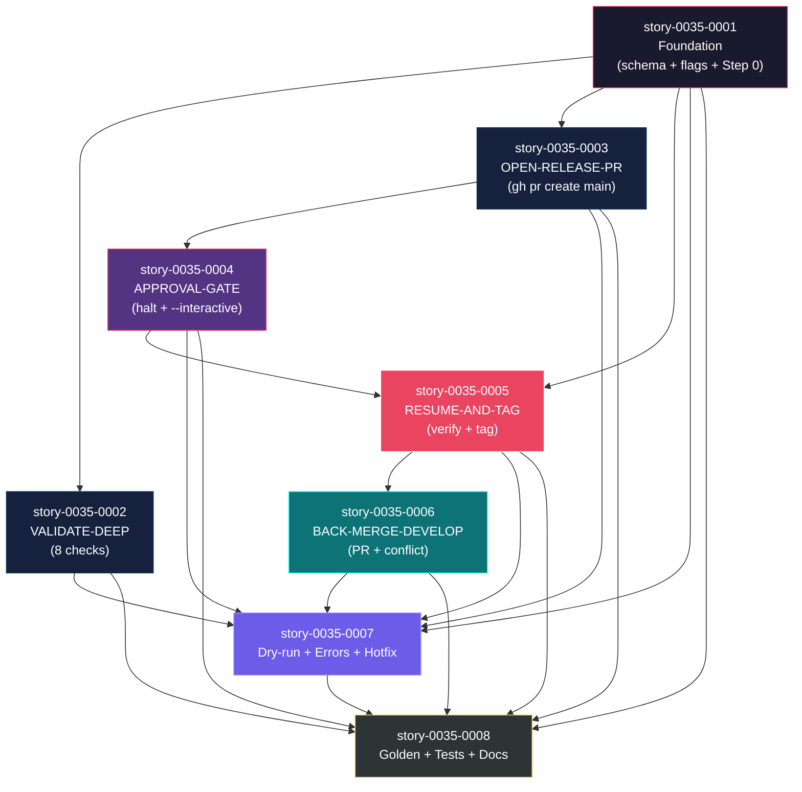

# Mapa de Implementação — Épico 0035 (Extensão do `x-release`)

**Gerado a partir das dependências BlockedBy/Blocks das histórias do epic-0035.**

---

## 1. Matriz de Dependências

| Story | Título | Chave Jira | Blocked By | Blocks | Status |
| :--- | :--- | :--- | :--- | :--- | :--- |
| [story-0035-0001](./story-0035-0001.md) | Foundation: Schema de State File, Novas Flags, Resume Detection | — | — | 0002, 0003, 0004, 0005, 0006, 0007, 0008 | Concluida |
| [story-0035-0002](./story-0035-0002.md) | Phase VALIDATE-DEEP (coverage, golden, consistency) | — | 0001 | 0007, 0008 | Pendente |
| [story-0035-0003](./story-0035-0003.md) | Phase OPEN-RELEASE-PR (gh pr create para main) | — | 0001 | 0004, 0007, 0008 | Concluida |
| [story-0035-0004](./story-0035-0004.md) | Phase APPROVAL-GATE (pausa humana + --interactive) | — | 0003 | 0005, 0007, 0008 | Pendente |
| [story-0035-0005](./story-0035-0005.md) | Phase RESUME-AND-TAG (--continue-after-merge, tag main) | — | 0001, 0004 | 0006, 0007, 0008 | Pendente |
| [story-0035-0006](./story-0035-0006.md) | Phase BACK-MERGE-DEVELOP (PR-flow + conflict detection) | — | 0005 | 0007, 0008 | Pendente |
| [story-0035-0007](./story-0035-0007.md) | Dry-run atualizado + Error Catalog + Hotfix PR-flow | — | 0001, 0002, 0003, 0004, 0005, 0006 | 0008 | Pendente |
| [story-0035-0008](./story-0035-0008.md) | Golden files + testes Java + docs + CHANGELOG | — | 0001, 0002, 0003, 0004, 0005, 0006, 0007 | — | Pendente |

> **Valores de Status:** `Pendente` (padrão) · `Em Andamento` · `Concluída` · `Falha` · `Bloqueada` · `Parcial`

> **Nota:** Stories 0002 e 0003 são paralelizáveis após 0001; o resto do épico segue um caminho crítico linear por causa das dependências semânticas (approval gate requer PR criado, resume requer approval gate, back-merge requer tag). Stories 0007 e 0008 são de consolidação e naturalmente dependem de todas anteriores.

---

## 2. Fases de Implementação

```
╔══════════════════════════════════════════════════════════════════════════╗
║                    FASE 0 — Foundation (sequencial)                    ║
║                                                                        ║
║   ┌─────────────────────────────────────────────────────────┐          ║
║   │  story-0035-0001  Schema de state file, flags, Step 0   │          ║
║   │  (Foundation — bloqueia TODAS as demais stories)        │          ║
║   └──────────────────────────┬──────────────────────────────┘          ║
╚══════════════════════════════╪═════════════════════════════════════════╝
                               │
                ┌──────────────┴──────────────┐
                ▼                             ▼
╔══════════════════════════════════════════════════════════════════════════╗
║                    FASE 1 — Core (paralelo parcial)                    ║
║                                                                        ║
║   ┌─────────────────────────┐     ┌─────────────────────────┐         ║
║   │  story-0035-0002        │     │  story-0035-0003        │         ║
║   │  VALIDATE-DEEP          │     │  OPEN-RELEASE-PR        │         ║
║   │  (tests + coverage +    │     │  (gh pr create --base   │         ║
║   │   golden + consistency) │     │   main, PR body from    │         ║
║   │                         │     │   CHANGELOG)            │         ║
║   └─────────────────────────┘     └────────────┬────────────┘         ║
╚════════════════════════════════════════════════╪═════════════════════════╝
                                                 │
                                                 ▼
╔══════════════════════════════════════════════════════════════════════════╗
║                    FASE 2 — Approval Gate (sequencial)                 ║
║                                                                        ║
║   ┌─────────────────────────────────────────────────────────┐          ║
║   │  story-0035-0004  APPROVAL-GATE                         │          ║
║   │  (state = APPROVAL_PENDING, halt, --interactive mode)   │          ║
║   └──────────────────────────┬──────────────────────────────┘          ║
╚══════════════════════════════╪═════════════════════════════════════════╝
                               │
                               ▼
╔══════════════════════════════════════════════════════════════════════════╗
║                    FASE 3 — Resume + Tag (sequencial)                  ║
║                                                                        ║
║   ┌─────────────────────────────────────────────────────────┐          ║
║   │  story-0035-0005  RESUME-AND-TAG                        │          ║
║   │  (--continue-after-merge, verify gh pr view MERGED,     │          ║
║   │   tag main, push tag)                                   │          ║
║   └──────────────────────────┬──────────────────────────────┘          ║
╚══════════════════════════════╪═════════════════════════════════════════╝
                               │
                               ▼
╔══════════════════════════════════════════════════════════════════════════╗
║                    FASE 4 — Back-Merge (sequencial)                    ║
║                                                                        ║
║   ┌─────────────────────────────────────────────────────────┐          ║
║   │  story-0035-0006  BACK-MERGE-DEVELOP                    │          ║
║   │  (gh pr create --base develop, conflict detection,      │          ║
║   │   Java SNAPSHOT advance preservado)                     │          ║
║   └──────────────────────────┬──────────────────────────────┘          ║
╚══════════════════════════════╪═════════════════════════════════════════╝
                               │
                               ▼
╔══════════════════════════════════════════════════════════════════════════╗
║                  FASE 5 — Cross-cutting consolidation                  ║
║                                                                        ║
║   ┌─────────────────────────────────────────────────────────┐          ║
║   │  story-0035-0007  Dry-run + Error Catalog + Hotfix      │          ║
║   │  (reescrever dry-run, consolidar 25+ error codes,       │          ║
║   │   hotfix com PR-flow)                                   │          ║
║   └──────────────────────────┬──────────────────────────────┘          ║
╚══════════════════════════════╪═════════════════════════════════════════╝
                               │
                               ▼
╔══════════════════════════════════════════════════════════════════════════╗
║                 FASE 6 — Consolidation Final                           ║
║                                                                        ║
║   ┌─────────────────────────────────────────────────────────┐          ║
║   │  story-0035-0008  Golden Files + Tests + Docs           │          ║
║   │  (85 golden files regen, 3 testes Java update +         │          ║
║   │   ReleaseStateFileSchemaTest, README, CHANGELOG)        │          ║
║   └─────────────────────────────────────────────────────────┘          ║
╚══════════════════════════════════════════════════════════════════════════╝
```

---

## 3. Caminho Crítico

```
story-0035-0001 ──→ story-0035-0003 ──→ story-0035-0004 ──→ story-0035-0005 ──→ story-0035-0006 ──→ story-0035-0007 ──→ story-0035-0008
    Fase 0            Fase 1              Fase 2              Fase 3              Fase 4              Fase 5              Fase 6
```

**7 fases no caminho crítico, 7 histórias na cadeia mais longa (0001 → 0003 → 0004 → 0005 → 0006 → 0007 → 0008).**

Story 0002 (VALIDATE-DEEP) está **fora do caminho crítico** — ela paralela com 0003 na Fase 1, mas como 0003 está no caminho crítico (bloqueia o approval gate), o tempo total é determinado por 0003, não por 0002. Qualquer atraso em 0002 pode ser absorvido desde que ela termine antes de 0007.

**Impacto de atrasos:** Atrasos em qualquer story do caminho crítico (0001, 0003, 0004, 0005, 0006, 0007, 0008) impactam diretamente o tempo total do épico, pois não há paralelismo compensatório. Atrasos em 0002 têm slack limitado ao tempo restante de 0003+0004+0005+0006.

---

## 4. Grafo de Dependências (Mermaid)



---

## 5. Resumo por Fase

| Fase | Histórias | Camada | Paralelismo | Pré-requisito |
| :--- | :--- | :--- | :--- | :--- |
| 0 | story-0035-0001 | Foundation | 1 | — |
| 1 | story-0035-0002, story-0035-0003 | Core (Validation + PR) | 2 paralelas | Fase 0 concluída |
| 2 | story-0035-0004 | Core (Approval Gate) | 1 | story-0035-0003 concluída |
| 3 | story-0035-0005 | Core (Resume + Tag) | 1 | story-0035-0001 + 0004 concluídas |
| 4 | story-0035-0006 | Core (Back-merge) | 1 | story-0035-0005 concluída |
| 5 | story-0035-0007 | Cross-cutting | 1 | Stories 0001-0006 concluídas |
| 6 | story-0035-0008 | Cross-cutting | 1 | Stories 0001-0007 concluídas |

**Total: 8 histórias em 7 fases.**

> **Nota:** O paralelismo real é limitado — apenas Fase 1 tem 2 stories concorrentes. Todas as outras fases têm 1 story. Isso reflete a natureza sequencial do fluxo de release (cada phase do skill depende da anterior semanticamente). A paralelização entre stories 0002 e 0003 funciona porque ambas modificam seções distintas do `SKILL.md` (Step 2 vs Step 7) — conflitos de merge são evitáveis.

---

## 6. Detalhamento por Fase

### Fase 0 — Foundation

| Story | Escopo Principal | Artefatos Chave |
| :--- | :--- | :--- |
| story-0035-0001 | Atualizar frontmatter (description, allowed-tools, argument-hint), adicionar 4 flags à Parameters table, criar `references/state-file-schema.md` com schema JSON completo (14 phases enum, 20 campos), implementar Step 0 "Resume Detection" com verificação `gh`/`jq`/`gh auth status` e detecção de state file existente | SKILL.md (frontmatter + Step 0 + Parameters table), `references/state-file-schema.md` (novo), golden files regenerados (17 profiles × 2 arquivos) |

**Entregas da Fase 0:**
- Contrato declarado para o resto do épico (flags, schema, ponto de entrada de resume)
- Dependências externas validadas em runtime (`gh`, `jq`, `gh auth`)
- Fundação para 7 stories downstream

### Fase 1 — Core (Validation + PR-Flow)

| Story | Escopo Principal | Artefatos Chave |
| :--- | :--- | :--- |
| story-0035-0002 | Substituir Step 2 por Phase VALIDATE-DEEP com 8 checks (dirty workdir, branch correta, CHANGELOG unreleased, build, coverage, golden files, hardcoded strings, cross-file consistency) + check 9 condicional (generation dry-run). Flag `--skip-tests` pula apenas checks 4-6. | SKILL.md (Step 2 reescrito), `ContextBuilder.java` (novos template vars), `ReleaseValidateDeepTest.java` (novo), golden files |
| story-0035-0003 | Remover Step 7 (MERGE-MAIN) antigo. Implementar Phase OPEN-RELEASE-PR com `gh pr create --base main`, PR body construído a partir do CHANGELOG entry, captura de `prNumber`/`prUrl` no state file. Flag `--skip-review` opcional invoca `x-review-pr`. | SKILL.md (Step 7 novo), `ReleaseOpenPrTest.java` (novo), golden files |

**Entregas da Fase 1:**
- Validação profunda elimina releases com artefatos defasados
- Rule 09 deixa de ser violada (PR em vez de merge local para main)
- State file tem o prNumber necessário para a Phase 2 (approval gate)

### Fase 2 — Approval Gate

| Story | Escopo Principal | Artefatos Chave |
| :--- | :--- | :--- |
| story-0035-0004 | Nova Phase APPROVAL-GATE após OPEN-RELEASE-PR: persiste `phase: APPROVAL_PENDING`, imprime instruções, encerra skill. Modo `--interactive`: usa `AskUserQuestion` com 3 opções (continuar, halt, cancelar) e verifica merge via `gh pr view` mesmo se usuário diz "PR merged". | SKILL.md (Step 8 novo), `references/approval-gate-workflow.md` (novo), `ReleaseApprovalGateTest.java` (novo), golden files |

**Entregas da Fase 2:**
- Pausa humana explícita entre PR creation e qualquer ação irreversível
- State persistence permite abortar fechando o PR (nada permanente criado)

### Fase 3 — Resume + Tag

| Story | Escopo Principal | Artefatos Chave |
| :--- | :--- | :--- |
| story-0035-0005 | Phase RESUME-AND-TAG ativada por `--continue-after-merge`: defense in depth via `gh pr view --json state,mergedAt` (NUNCA confia só no state file), checkout main worktree-safe, verificação de tag pré-existente (local + remoto), `git tag -a` ou `-s` conforme `--signed-tag`, push da tag com warning se falhar. | SKILL.md (Step 9 novo), `ReleaseResumeAndTagTest.java` (novo), golden files |

**Entregas da Fase 3:**
- Resume cross-session funciona (state sobrevive a fechar/reabrir Claude)
- Tag NUNCA criada sem verificação defensiva de merge real

### Fase 4 — Back-Merge

| Story | Escopo Principal | Artefatos Chave |
| :--- | :--- | :--- |
| story-0035-0006 | Remover Step 9 antigo (merge direto develop). Phase BACK-MERGE-DEVELOP: dry-run merge para detectar conflito, branch `chore/backmerge-v*`, se clean: SNAPSHOT advance (Java) + PR para develop; se conflito: commit com `--no-verify`, PR com body explicativo, state `BACKMERGE_CONFLICT`. | SKILL.md (Step 10 novo), `references/backmerge-strategies.md` (novo), `ReleaseBackMergeTest.java` (novo), golden files |

**Entregas da Fase 4:**
- Rule 09 compliance completa (zero merge direto em qualquer phase)
- Conflitos tratados como "release commercialmente completa + resolução diferida" em vez de abort

### Fase 5 — Cross-cutting (Dry-run + Errors + Hotfix)

| Story | Escopo Principal | Artefatos Chave |
| :--- | :--- | :--- |
| story-0035-0007 | Reescrever dry-run output com 12 phases e marcadores de halt. Consolidar Error Handling table com ≥25 entries (5 colunas: Phase/Code/Condition/Message/Exit). Atualizar Hotfix workflow para usar PR-flow com detecção de `release/*` ativo e `HOTFIX_INVALID_BUMP` error. | SKILL.md (Dry-Run, Error Handling, Hotfix sections), `ReleaseDryRunTest.java`, `ReleaseErrorCatalogTest.java`, `ReleaseHotfixWorkflowTest.java` (novos), golden files |

**Entregas da Fase 5:**
- Dry-run fiel ao fluxo real permite preview antes de release
- Catálogo de erros completo facilita troubleshooting
- Hotfix preservado sem regressão

### Fase 6 — Consolidation Final

| Story | Escopo Principal | Artefatos Chave |
| :--- | :--- | :--- |
| story-0035-0008 | Regenerar 85 golden files (17 profiles × 5 arquivos). Atualizar `ReleaseSkillTest`, `ReleaseChecklistAssemblerTest`, `ReleaseManagementGitFlowTest`. Criar `ReleaseStateFileSchemaTest` (6+ testes). Reescrever `README.md` do skill com Quick Start, tabela de phases, dependências. Adicionar CHANGELOG entry EPIC-0035. Ajustar Rule 08 se necessário. | 85 golden files, `README.md`, 4 testes Java (3 updates + 1 novo), `CHANGELOG.md`, possivelmente `rules/08-release-process.md` |

**Entregas da Fase 6:**
- Zero drift entre source of truth, golden files, docs e testes
- Skill pronto para release (dogfood)
- Contribuidores têm documentação de quickstart completa

---

## 7. Observações Estratégicas

### Gargalo Principal

**story-0035-0001** é o gargalo absoluto: bloqueia as 7 outras stories. Investir tempo extra nela (revisar schema JSON com cuidado, garantir que Step 0 captura todos os edge cases de resume) reduz retrabalho massivo nas stories subsequentes. Schema mal definido força re-edição em 0002-0006. Vale a pena pair-review ou code review aprofundado da 0001 antes de mergear.

Depois de 0001, o próximo gargalo é **story-0035-0003** (OPEN-RELEASE-PR), que bloqueia 0004 (Approval Gate) e portanto todo o caminho crítico a partir daí. Atraso em 0003 propaga para 0004, 0005, 0006, 0007, 0008.

### Histórias Folha (sem dependentes)

Apenas **story-0035-0008** é folha. Todas as outras stories bloqueiam pelo menos uma subsequente. Isso significa que quase não há slack no cronograma — qualquer atraso propaga.

### Otimização de Tempo

- **Paralelismo real**: stories 0002 e 0003 em Fase 1 — podem ser desenvolvidas por dois engenheiros simultaneamente, pois tocam seções distintas do `SKILL.md` (Step 2 vs Step 7).
- **Paralelismo parcial**: story-0035-0007 (dry-run + errors + hotfix) pode começar antes do término total de 0006 se o engenheiro focar nas partes que só dependem de 0001-0005 (ex: consolidação de error codes já conhecidos), deixando a seção "Hotfix" para o final.
- **Alocação**: Engenheiro sênior em 0001 (maior risco). Engenheiro pleno em 0002 (validação técnica direta). Outro engenheiro pleno em 0003 → 0004 → 0005 → 0006 (caminho crítico). Engenheiro júnior em 0007 → 0008 (consolidação de patterns já estabelecidos).

### Dependências Cruzadas

**Story 0035-0005** é o ponto de convergência mais crítico: depende tanto de 0001 (state file schema, para carregar state) quanto de 0004 (phase APPROVAL_PENDING existe no fluxo). Se 0004 atrasar, 0005 não pode começar nem mesmo em dry-run, pois o contrato de entry point (resume vindo de APPROVAL_PENDING) não existe.

**Stories 0035-0007 e 0035-0008** são pontos de convergência natural — ambas dependem de todas as anteriores. 0007 depende da semântica completa (para consolidar error codes e dry-run output), 0008 depende de todo o source of truth estável (para regenerar golden files sem retrabalho).

### Marco de Validação Arquitetural

**story-0035-0004 (APPROVAL-GATE)** é o marco de validação. É a story que prova que todo o approach do épico funciona:
- Se state file persistence funciona (0001)
- Se PR creation captura os dados certos (0003)
- Se o halt é limpo e permite resume (0005 depois)

Antes de prosseguir para 0005/0006, é recomendado rodar um **dogfood test end-to-end até a phase APPROVAL-GATE**: executar o skill parcial até 0004, verificar que state file tem `APPROVAL_PENDING`, verificar que re-invocação sem flag é bloqueada, verificar que `--continue-after-merge` carrega state corretamente. Só então implementar 0005.

---

## 8. Dependências entre Tasks (Cross-Story)

### 8.1 Dependências Cross-Story entre Tasks

| Task | Depends On | Story Source | Story Target | Tipo |
| :--- | :--- | :--- | :--- | :--- |
| TASK-0035-0002-002 | TASK-0035-0001-002 | story-0035-0001 | story-0035-0002 | schema (state file reader já definido) |
| TASK-0035-0003-001 | TASK-0035-0001-001 | story-0035-0001 | story-0035-0003 | interface (flags + Parameters table base) |
| TASK-0035-0004-001 | TASK-0035-0003-001 | story-0035-0003 | story-0035-0004 | data (prNumber no state file) |
| TASK-0035-0005-001 | TASK-0035-0001-002 | story-0035-0001 | story-0035-0005 | schema (state schema + Step 0 resume detection) |
| TASK-0035-0005-001 | TASK-0035-0004-001 | story-0035-0004 | story-0035-0005 | data (phase APPROVAL_PENDING existe) |
| TASK-0035-0006-001 | TASK-0035-0005-002 | story-0035-0005 | story-0035-0006 | data (phase TAGGED no state file) |
| TASK-0035-0007-001 | TASK-0035-0006-002 | story-0035-0006 | story-0035-0007 | data (lista completa de phases para dry-run) |
| TASK-0035-0007-002 | Todas as tasks 0001-0006 | múltiplas | story-0035-0007 | data (lista completa de error codes) |
| TASK-0035-0008-001 | TASK-0035-0007-003 | story-0035-0007 | story-0035-0008 | data (SKILL.md final para golden regen) |

> **Validação RULE-012:** Todas as cross-story task dependencies estão consistentes com as story dependencies declaradas na matriz (Seção 1). A task 0005-0001 formaliza o dual-dependency de 0005 em 0001 e 0004. Stories com mais de 1 dependência declarada (0005, 0007, 0008) têm suas tasks refletindo isso corretamente.

### 8.2 Ordem de Merge (Topological Sort)

| Ordem | Task ID | Story | Parallelizável Com | Fase |
| :--- | :--- | :--- | :--- | :--- |
| 1 | TASK-0035-0001-001 | story-0035-0001 | — | 0 |
| 2 | TASK-0035-0001-002 | story-0035-0001 | — | 0 |
| 3 | TASK-0035-0001-003 | story-0035-0001 | — | 0 |
| 4 | TASK-0035-0002-001 | story-0035-0002 | TASK-0035-0003-001 | 1 |
| 4 | TASK-0035-0003-001 | story-0035-0003 | TASK-0035-0002-001 | 1 |
| 5 | TASK-0035-0002-002 | story-0035-0002 | TASK-0035-0003-002 | 1 |
| 5 | TASK-0035-0003-002 | story-0035-0003 | TASK-0035-0002-002 | 1 |
| 6 | TASK-0035-0002-003 | story-0035-0002 | TASK-0035-0003-003 | 1 |
| 6 | TASK-0035-0003-003 | story-0035-0003 | TASK-0035-0002-003 | 1 |
| 7 | TASK-0035-0004-001 | story-0035-0004 | — | 2 |
| 8 | TASK-0035-0004-002 | story-0035-0004 | — | 2 |
| 9 | TASK-0035-0004-003 | story-0035-0004 | — | 2 |
| 10 | TASK-0035-0005-001 | story-0035-0005 | — | 3 |
| 11 | TASK-0035-0005-002 | story-0035-0005 | — | 3 |
| 12 | TASK-0035-0005-003 | story-0035-0005 | — | 3 |
| 13 | TASK-0035-0006-001 | story-0035-0006 | — | 4 |
| 14 | TASK-0035-0006-002 | story-0035-0006 | — | 4 |
| 15 | TASK-0035-0006-003 | story-0035-0006 | — | 4 |
| 16 | TASK-0035-0007-001 | story-0035-0007 | TASK-0035-0007-002 | 5 |
| 16 | TASK-0035-0007-002 | story-0035-0007 | TASK-0035-0007-001 | 5 |
| 17 | TASK-0035-0007-003 | story-0035-0007 | — | 5 |
| 18 | TASK-0035-0008-001 | story-0035-0008 | — | 6 |
| 19 | TASK-0035-0008-002 | story-0035-0008 | — | 6 |
| 20 | TASK-0035-0008-003 | story-0035-0008 | — | 6 |

**Total: 24 tasks em 7 fases de execução (ordens 1-20 com paralelismo em ordens 4-6 e 16).**

### 8.3 Grafo de Dependências entre Tasks (Mermaid)

```mermaid
graph LR
    subgraph story-0035-0001["Story 0001 (Foundation)"]
        style story-0035-0001 fill:#e8f4fd
        T1001["TASK-001-001<br/>Frontmatter"]
        T1002["TASK-001-002<br/>Schema + Step 0"]
        T1003["TASK-001-003<br/>Golden regen"]
        T1001 --> T1002 --> T1003
    end

    subgraph story-0035-0002["Story 0002 (VALIDATE-DEEP)"]
        style story-0035-0002 fill:#fde8e8
        T2001["TASK-002-001<br/>Checks 1-3"]
        T2002["TASK-002-002<br/>Checks 4-6"]
        T2003["TASK-002-003<br/>Checks 7-9 + golden"]
        T2001 --> T2002 --> T2003
    end

    subgraph story-0035-0003["Story 0003 (OPEN-RELEASE-PR)"]
        style story-0035-0003 fill:#e8fde8
        T3001["TASK-003-001<br/>Step 7 structure"]
        T3002["TASK-003-002<br/>--skip-review"]
        T3003["TASK-003-003<br/>Tests + golden"]
        T3001 --> T3002 --> T3003
    end

    subgraph story-0035-0004["Story 0004 (APPROVAL-GATE)"]
        style story-0035-0004 fill:#fdf4e8
        T4001["TASK-004-001<br/>Default halt"]
        T4002["TASK-004-002<br/>--interactive"]
        T4003["TASK-004-003<br/>Tests + golden"]
        T4001 --> T4002 --> T4003
    end

    subgraph story-0035-0005["Story 0005 (RESUME-AND-TAG)"]
        style story-0035-0005 fill:#f4e8fd
        T5001["TASK-005-001<br/>Verify defensive"]
        T5002["TASK-005-002<br/>Tag create + push"]
        T5003["TASK-005-003<br/>Tests + golden"]
        T5001 --> T5002 --> T5003
    end

    subgraph story-0035-0006["Story 0006 (BACK-MERGE)"]
        style story-0035-0006 fill:#e8f4e8
        T6001["TASK-006-001<br/>Clean merge + PR"]
        T6002["TASK-006-002<br/>Conflict flow"]
        T6003["TASK-006-003<br/>Tests + golden"]
        T6001 --> T6002 --> T6003
    end

    subgraph story-0035-0007["Story 0007 (Cross-cutting)"]
        style story-0035-0007 fill:#fde8f4
        T7001["TASK-007-001<br/>Dry-run"]
        T7002["TASK-007-002<br/>Error catalog"]
        T7003["TASK-007-003<br/>Hotfix PR-flow"]
        T7001 --> T7003
        T7002 --> T7003
    end

    subgraph story-0035-0008["Story 0008 (Consolidation)"]
        style story-0035-0008 fill:#f4fde8
        T8001["TASK-008-001<br/>Golden regen"]
        T8002["TASK-008-002<br/>Java tests"]
        T8003["TASK-008-003<br/>Docs + CHANGELOG"]
        T8001 --> T8002 --> T8003
    end

    %% Cross-story dependencies
    T1002 -.->|schema| T2002
    T1001 -.->|flags| T3001
    T3001 -.->|prNumber| T4001
    T1002 -.->|state| T5001
    T4001 -.->|phase| T5001
    T5002 -.->|phase TAGGED| T6001
    T6002 -.->|phases list| T7001
    T7003 -.->|final SKILL.md| T8001
```


