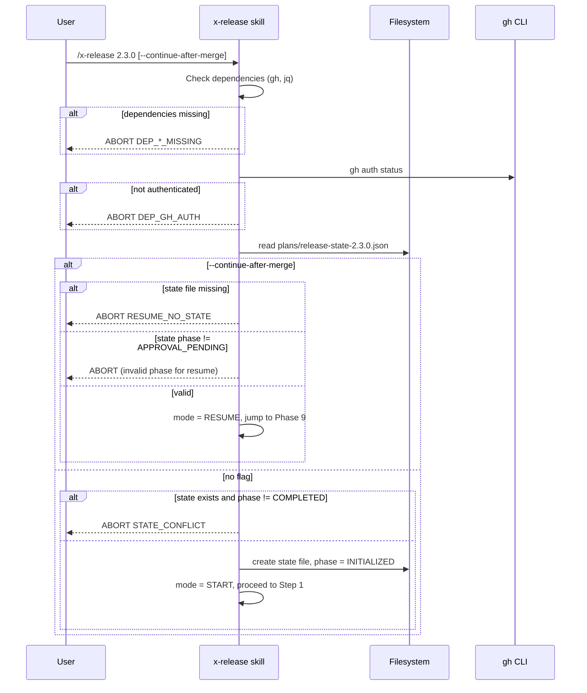

# História: Estabelecer Schema de State File, Novas Flags e Resume Detection

**ID:** story-0035-0001
**Chave Jira:** —
**Status:** Pendente

## 1. Dependências

| Blocked By | Blocks |
| :--- | :--- |
| — | story-0035-0002, 0003, 0004, 0005, 0006, 0007, 0008 |

## 2. Regras Transversais Aplicáveis

| ID | Título |
| :--- | :--- |
| RULE-002 | Preservação de Comportamento Existente |
| RULE-003 | Idempotência via State File |
| RULE-005 | Source of Truth (SKILL Edit Exclusivo em `targets/`) |
| RULE-006 | Coverage Não Pode Degradar |
| RULE-008 | `gh` CLI e `jq` como Dependências Externas |

## 3. Descrição

Como **platform engineer** responsável por orquestrar releases do `ia-dev-env`, eu quero uma fundação técnica explícita para o fluxo estendido do `x-release` — novas flags declaradas, schema JSON do state file formalizado, e lógica de detecção de resume no início do skill — garantindo que todas as outras stories deste épico possam ser desenvolvidas sem ambiguidade sobre contrato de interface, formato de persistência, ou ponto de entrada do resume.

Esta é a história de fundação: nenhuma phase nova pode ser implementada sem saber que flags existem, como ler/escrever o state file, e quando o skill está sendo invocado para resume vs. início. O escopo cobre apenas metadados declarativos (frontmatter, Parameters table, schema JSON documentado em `references/state-file-schema.md`) e uma Phase 0 "Resume Detection" que carrega/valida o state file quando presente.

### 3.1 Atualização do Frontmatter

Modificar o frontmatter do `SKILL.md`:
- `description`: Reescrever refletindo approval gate, PR-flow e deep validation
- `allowed-tools`: Adicionar `Skill, AskUserQuestion` aos existentes `Read, Write, Edit, Bash, Glob, Grep, Agent`
- `argument-hint`: `"[major|minor|patch|version] [--dry-run] [--skip-tests] [--no-publish] [--hotfix] [--continue-after-merge] [--interactive] [--signed-tag] [--state-file <path>]"`

### 3.2 Novas Flags na Parameters Table

| Parameter | Required | Description |
|---|---|---|
| `--continue-after-merge` | No | Resume fluxo a partir de RESUME-AND-TAG após merge manual do PR de release. Requer state file `phase: APPROVAL_PENDING` existente. |
| `--interactive` | No | Ativa pausa in-session no APPROVAL-GATE via `AskUserQuestion` em vez de encerrar o skill. State file continua sendo persistido. |
| `--signed-tag` | No | Cria tag GPG assinada (`git tag -s`) em vez de anotada (`git tag -a`). |
| `--state-file <path>` | No | Override do caminho do state file (default: `plans/release-state-<X.Y.Z>.json`). |

### 3.3 Schema JSON Formal do State File

Criar `java/src/main/resources/targets/claude/skills/core/x-release/references/state-file-schema.md`:
- Campo `schemaVersion: 1` (integer, obrigatório)
- Campo `version`: SemVer string
- Campo `phase`: enum de 14 valores
- Campos de contexto: `branch`, `baseBranch`, `hotfix`, `dryRun`, `signedTag`, `interactive`
- Campos do PR: `prNumber`, `prUrl`, `prTitle`
- Campos de timing: `startedAt`, `lastPhaseCompletedAt` (ISO-8601 UTC)
- Campos derivados: `phasesCompleted` (array), `targetVersion`, `previousVersion`, `bumpType`
- Campos de cache: `changelogEntry`, `tagMessage`

### 3.4 Phase 0 — Resume Detection

Adicionar seção "Step 0 — Resume Detection" **antes** do Step 1 (DETERMINE). Lógica:

1. Verificar dependências: `command -v gh`, `command -v jq`, `gh auth status`
2. Determinar caminho do state file (default ou `--state-file`)
3. Se `--continue-after-merge`:
   - State file DEVE existir e ter `phase: APPROVAL_PENDING`
   - Marcar modo `RESUME`, pular Steps 1-7, ir direto para Phase 9
4. Se não:
   - Se state file existe com phase != COMPLETED: WARNING + abort
   - Senão: criar state file com `schemaVersion: 1, phase: INITIALIZED`

## 3.5 Entrega de Valor

- **Valor Principal:** Todas as stories downstream (0002–0008) ganham um contrato de schema estável e um ponto de entrada de resume bem definido, eliminando retrabalho por divergência de formato entre phases desenvolvidas em paralelo.
- **Métrica de Sucesso:** `ReleaseStateFileSchemaTest` (criado na story 0008) valida que o schema casa com JSON serializado pelas phases operacionais; zero falhas em cross-story testing.
- **Impacto no Negócio:** Platform team pode desenvolver stories 0002–0006 em paralelo sem alinhamento verbal contínuo — o spec escrito é a fonte de verdade.

## 4. Definições de Qualidade Locais

### DoR Local

- [ ] `x-release/SKILL.md` atual lido integralmente
- [ ] Spec do épico revisado, especialmente seção "State File Schema"
- [ ] Convenção de naming de state file confirmada
- [ ] Golden files baseline conhecido

### DoD Local

- [ ] Frontmatter do SKILL.md atualizado (description, allowed-tools, argument-hint)
- [ ] Tabela Parameters tem 4 novas flags sem remover existentes
- [ ] Seção "Step 0 — Resume Detection" adicionada antes do Step 1
- [ ] `references/state-file-schema.md` criado com schema completo + exemplo
- [ ] Dependências externas (`gh`, `jq`) verificadas no Step 0
- [ ] Golden files regenerados nos 17+ profiles no mesmo commit
- [ ] Commit atômico em `feature/story-0035-0001-foundation`
- [ ] PR aberto contra `develop` com JaCoCo report anexado
- [ ] `mvn clean verify -Pall-tests` verde

### Global Definition of Done (DoD)

- **Cobertura:** ≥ 95% line, ≥ 90% branch
- **Testes Automatizados:** Golden file tests + `ReleaseSkillTest` assertions sobre frontmatter
- **Relatório de Cobertura:** JaCoCo anexado ao PR
- **Documentação:** SKILL.md + state-file-schema.md atualizados
- **Performance:** Sem impacto (só edita markdown)

## 5. Contratos de Dados

### 5.1 Enum `phase` do State File

| Value | Significado | Próxima phase válida |
| :--- | :--- | :--- |
| `INITIALIZED` | State file criado | DETERMINED |
| `DETERMINED` | Step 1 completo | VALIDATED |
| `VALIDATED` | VALIDATE-DEEP completa | BRANCHED |
| `BRANCHED` | Step 3 completo | UPDATED |
| `UPDATED` | Step 4 completo | CHANGELOG_DONE |
| `CHANGELOG_DONE` | Step 5 completo | COMMITTED |
| `COMMITTED` | Step 6 completo | PR_OPENED |
| `PR_OPENED` | OPEN-RELEASE-PR completa | APPROVAL_PENDING |
| `APPROVAL_PENDING` | **APPROVAL-GATE halted** | MERGED (via --continue-after-merge) |
| `MERGED` | PR confirmado MERGED | TAGGED |
| `TAGGED` | Tag criada e pushed | BACKMERGE_OPENED ou BACKMERGE_CONFLICT |
| `BACKMERGE_OPENED` | Back-merge PR aberto | COMPLETED |
| `BACKMERGE_CONFLICT` | Back-merge travado | COMPLETED (após resolução manual) |
| `COMPLETED` | Cleanup executado | (terminal) |

### 5.2 Error Codes

| Condição | Código | Mensagem |
| :--- | :--- | :--- |
| `gh` ausente | `DEP_GH_MISSING` | `gh CLI not installed. See https://cli.github.com/` |
| `jq` ausente | `DEP_JQ_MISSING` | `jq not installed. Install via your package manager.` |
| `gh` não autenticado | `DEP_GH_AUTH` | `gh not authenticated. Run 'gh auth login'.` |
| State file corrompido | `STATE_INVALID_JSON` | `State file exists but is not valid JSON: <path>` |
| Schema version desconhecido | `STATE_SCHEMA_VERSION` | `Unknown schemaVersion: <n>. Expected: 1.` |
| Resume sem state file | `RESUME_NO_STATE` | `No release in progress. Run /x-release <version> first.` |
| State file conflitante | `STATE_CONFLICT` | `Release in progress for v<X.Y.Z>. Use --continue-after-merge or delete state.` |

## 6. Diagramas

### 6.1 Fluxo Step 0 — Resume Detection



## 7. Critérios de Aceite (Gherkin)

```gherkin
Cenario: Degenerate — skill sem argumentos em repositório sem release em andamento
  DADO que não existe arquivo plans/release-state-*.json
  E gh CLI está instalado e autenticado
  QUANDO o usuário executa /x-release
  ENTÃO o Step 0 verifica dependências com sucesso
  E cria um novo state file com schemaVersion: 1 e phase: INITIALIZED
  E prossegue para Step 1 (DETERMINE)

Cenario: Happy path — resume com state file válido em APPROVAL_PENDING
  DADO que existe plans/release-state-2.3.0.json com phase: APPROVAL_PENDING e prNumber: 262
  QUANDO o usuário executa /x-release 2.3.0 --continue-after-merge
  ENTÃO o Step 0 carrega o state file com sucesso
  E valida schemaVersion == 1
  E marca mode = RESUME
  E encaminha para Phase 9 (RESUME-AND-TAG) sem re-executar Steps 1-7

Cenario: Error — flag --continue-after-merge sem state file
  DADO que NÃO existe plans/release-state-2.3.0.json
  QUANDO o usuário executa /x-release 2.3.0 --continue-after-merge
  ENTÃO o Step 0 aborta com código RESUME_NO_STATE
  E retorna exit code 1

Cenario: Error — dependência gh CLI ausente
  DADO que o comando gh não está disponível no PATH
  QUANDO o usuário executa /x-release 2.3.0
  ENTÃO o Step 0 aborta com código DEP_GH_MISSING
  E NÃO cria state file

Cenario: Error — state file corrompido (JSON inválido)
  DADO que existe plans/release-state-2.3.0.json com conteúdo "{corrupted"
  QUANDO o usuário executa /x-release 2.3.0
  ENTÃO o Step 0 aborta com código STATE_INVALID_JSON
  E NÃO sobrescreve o arquivo

Cenario: Boundary — state file com schemaVersion futuro (2)
  DADO que existe plans/release-state-2.3.0.json com "schemaVersion": 2
  QUANDO o usuário executa /x-release 2.3.0 --continue-after-merge
  ENTÃO o Step 0 aborta com código STATE_SCHEMA_VERSION
```

### 7.1 Scenario Ordering (TPP)
Degenerate → happy → errors → boundary.

### 7.2 Mandatory Scenario Categories
- [x] Degenerate (sem state file)
- [x] Happy path (resume válido)
- [x] Error paths (resume sem state, dep ausente, JSON corrompido)
- [x] Boundary values (schemaVersion futuro)

## 8. Tasks

### TASK-0035-0001-001: Atualizar frontmatter e Parameters table

- **Layer:** Doc
- **Test Type:** Verification
- **Size:** S
- **Dependencies:** —
- **Branch:** `feature/task-0035-0001-001-frontmatter`
- **Testability:** Config + VerificationTest
- **Files:**
  - `java/src/main/resources/targets/claude/skills/core/x-release/SKILL.md`
- **Acceptance Criteria:**
  - [ ] Frontmatter tem novo `description`, `allowed-tools` com `Skill, AskUserQuestion`, `argument-hint` com 4 flags novas
  - [ ] Parameters table tem 4 linhas novas sem remover existentes
  - [ ] `ReleaseSkillTest` existente continua verde

### TASK-0035-0001-002: Criar state-file-schema.md e Step 0

- **Layer:** Doc + Config
- **Test Type:** Verification
- **Size:** M
- **Dependencies:** TASK-0035-0001-001
- **Branch:** `feature/task-0035-0001-002-state-schema`
- **Testability:** Config + VerificationTest
- **Files:**
  - `java/src/main/resources/targets/claude/skills/core/x-release/SKILL.md`
  - `java/src/main/resources/targets/claude/skills/core/x-release/references/state-file-schema.md` (novo)
- **Acceptance Criteria:**
  - [ ] `state-file-schema.md` tem schema completo com 14 phases
  - [ ] Tem exemplo JSON canonical
  - [ ] Tem seção "Transições Válidas"
  - [ ] SKILL.md tem seção "Step 0 — Resume Detection"
  - [ ] Step 0 verifica `gh`, `jq`, `gh auth status`

### TASK-0035-0001-003: Regenerar golden files

- **Layer:** Test
- **Test Type:** Smoke
- **Size:** S
- **Dependencies:** TASK-0035-0001-001, TASK-0035-0001-002
- **Branch:** `feature/task-0035-0001-003-golden-regen`
- **Testability:** Migration + Smoke
- **Files:**
  - `java/src/test/resources/golden/*/.claude/skills/x-release/SKILL.md` (17+ profiles)
  - `java/src/test/resources/golden/*/.claude/skills/x-release/references/state-file-schema.md` (17+ profiles)
- **Acceptance Criteria:**
  - [ ] `mvn process-resources` executado (fix para cache stale)
  - [ ] Golden files regenerados via `GoldenFileRegenerator`
  - [ ] `mvn verify -Pall-tests` verde
  - [ ] `PlatformDirectorySmokeTest` verde
