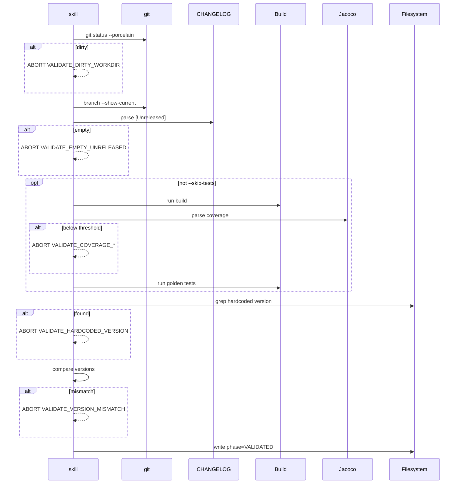

# História: Implementar Phase VALIDATE-DEEP com Coverage, Golden Files e Consistência Cruzada

**ID:** story-0035-0002
**Chave Jira:** —
**Status:** Pendente

## 1. Dependências

| Blocked By | Blocks |
| :--- | :--- |
| story-0035-0001 | story-0035-0007, story-0035-0008 |

## 2. Regras Transversais Aplicáveis

| ID | Título |
| :--- | :--- |
| RULE-002 | Preservação de Comportamento Existente |
| RULE-005 | Source of Truth (SKILL Edit Exclusivo em `targets/`) |
| RULE-006 | Coverage Não Pode Degradar |

## 3. Descrição

Como **platform engineer** disparando uma release, eu quero que o `x-release` rode uma bateria de validação profunda (não apenas `mvn test`) antes de criar a release branch, garantindo que coverage esteja nos thresholds, golden files estejam consistentes, versão esteja alinhada entre pom.xml / CHANGELOG / branch name, e não haja strings de versão hardcoded espalhadas pelo repo — eliminando uma classe inteira de falhas pós-release onde artefatos são publicados com conteúdo defasado ou inconsistente.

Esta story substitui o Step 2 por uma **Phase VALIDATE-DEEP** com 8-9 checks orquestrados, cada um com mensagem de erro específica e código de abort. Flag `--skip-tests` continua funcionando mas agora pula apenas os checks 4-6 (tests, coverage, golden files), mantendo checks 1-3, 7, 8 como sempre-obrigatórios.

### 3.1 Lista dos 8 Checks (+1 condicional)

| # | Check | Lógica | Abort se |
|---|---|---|---|
| 1 | Working dir clean | `git status --porcelain` | output não-vazio |
| 2 | Branch correta | develop ou main (hotfix) | outra branch |
| 3 | `[Unreleased]` não-vazio | parse CHANGELOG.md | seção vazia |
| 4 | Build + tests | `{{BUILD_COMMAND}}` | exit ≠ 0 |
| 5 | Coverage thresholds | parse `jacoco.xml` | line < 95% ou branch < 90% |
| 6 | Golden file consistency | `{{GOLDEN_TEST_COMMAND}}` | exit ≠ 0 |
| 7 | Hardcoded version strings | `grep -rn $CURRENT_VERSION` | matches fora de allowed paths |
| 8 | Cross-file version consistency | pom ↔ target ↔ branch | mismatch |
| 9 (cond) | Generation dry-run compare | `{{GENERATION_COMMAND}} --dry-run` | diff não-vazio |

### 3.2 Template Variables Novas

Adicionar ao `ContextBuilder.java`:
- `{{COVERAGE_LINE_THRESHOLD}}` — default `95`
- `{{COVERAGE_BRANCH_THRESHOLD}}` — default `90`
- `{{GOLDEN_TEST_COMMAND}}` — default vazio; preenchido por profile
- `{{GENERATION_COMMAND}}` — default vazio; preenchido só em geradores

### 3.3 Flag --skip-tests

Pula apenas checks 4, 5, 6 (não checks 1, 2, 3, 7, 8). Os checks de consistência (7, 8) são sempre obrigatórios porque não dependem de executar testes.

## 3.5 Entrega de Valor

- **Valor Principal:** Releases tornam-se impossíveis de disparar com golden files defasados, coverage abaixo do threshold, ou versão inconsistente entre `pom.xml` / CHANGELOG / branch name. Uma classe inteira de bugs pós-release (artefatos publicados com conteúdo errado) é eliminada automaticamente.
- **Métrica de Sucesso:** `ReleaseValidateDeepTest` simula 6 cenários de falha (dirty workdir, empty unreleased, build fail, coverage low, golden drift, hardcoded string) e verifica que cada um aborta com o código correto; happy path executa todos os 8 checks.
- **Impacto no Negócio:** Platform team para de depender de checklists manuais pré-release; o custo de uma release reduz para "digitar `/x-release minor` e revisar o PR".

## 4. Definições de Qualidade Locais

### DoR Local

- [ ] Story 0035-0001 merged em develop
- [ ] Step 0 (Resume Detection) funcional
- [ ] Valores das template vars definidos no ContextBuilder
- [ ] Comando de golden file tests identificado (`{{GOLDEN_TEST_COMMAND}}`)

### DoD Local

- [ ] Step 2 antigo removido
- [ ] Phase VALIDATE-DEEP com 8 checks obrigatórios + 1 condicional
- [ ] Flag `--skip-tests` pula apenas checks 4, 5, 6
- [ ] Error codes `VALIDATE_*` na Error Handling table
- [ ] Template vars novas no `ContextBuilder.java`
- [ ] Golden files regenerados
- [ ] Novo teste `ReleaseValidateDeepTest.java`
- [ ] `mvn verify -Pall-tests` verde
- [ ] JaCoCo mostra coverage ≥ 95% / 90%

## 5. Contratos de Dados

### 5.1 Error Codes

| Check | Error Code | Mensagem |
| :--- | :--- | :--- |
| 1 | `VALIDATE_DIRTY_WORKDIR` | Uncommitted changes in working directory |
| 2 | `VALIDATE_WRONG_BRANCH` | Not on develop/release (or main for hotfix) |
| 3 | `VALIDATE_EMPTY_UNRELEASED` | CHANGELOG [Unreleased] section empty |
| 4 | `VALIDATE_BUILD_FAILED` | Build or tests failed |
| 5a | `VALIDATE_COVERAGE_LINE` | Line coverage below threshold |
| 5b | `VALIDATE_COVERAGE_BRANCH` | Branch coverage below threshold |
| 6 | `VALIDATE_GOLDEN_DRIFT` | Golden files out of sync |
| 7 | `VALIDATE_HARDCODED_VERSION` | Hardcoded version string found |
| 8 | `VALIDATE_VERSION_MISMATCH` | pom.xml version mismatch |
| 9 | `VALIDATE_GENERATION_DRIFT` | Generator output differs from baseline |

## 6. Diagramas

### 6.1 Sequência dos Checks



## 7. Critérios de Aceite (Gherkin)

```gherkin
Cenario: Degenerate — working directory sujo
  DADO que o repositório tem um arquivo modificado não commitado
  QUANDO Phase VALIDATE-DEEP é executada
  ENTÃO check 1 aborta com VALIDATE_DIRTY_WORKDIR
  E state file NÃO é atualizado

Cenario: Happy path — todos os checks passam
  DADO working dir limpo, branch develop, CHANGELOG populado, coverage 96/92%
  QUANDO Phase VALIDATE-DEEP é executada
  ENTÃO os 8 checks passam em ordem
  E state file avança para phase: VALIDATED

Cenario: Error — CHANGELOG [Unreleased] vazio
  DADO CHANGELOG.md tem "## [Unreleased]" sem entradas
  QUANDO Phase VALIDATE-DEEP é executada
  ENTÃO check 3 aborta com VALIDATE_EMPTY_UNRELEASED

Cenario: Error — line coverage 94.5% (abaixo de 95%)
  DADO jacoco.xml reporta line coverage 94.5%
  QUANDO check 5 é executado
  ENTÃO aborta com VALIDATE_COVERAGE_LINE
  E inclui valor atual e threshold

Cenario: Error — hardcoded version em shell script
  DADO versão 2.2.2 e scripts/deploy.sh contém "2.2.2"
  QUANDO check 7 é executado
  ENTÃO aborta com VALIDATE_HARDCODED_VERSION
  E lista scripts/deploy.sh

Cenario: Boundary — coverage exatamente no threshold
  DADO jacoco.xml com line=95.00%, branch=90.00%
  QUANDO check 5 é executado
  ENTÃO o check passa (não é menor que threshold)

Cenario: Happy path — --skip-tests pula apenas 4-6
  DADO flag --skip-tests fornecida
  QUANDO Phase VALIDATE-DEEP é executada
  ENTÃO checks 1, 2, 3, 7, 8 executam normalmente
  E checks 4, 5, 6 são pulados com warning
```

### 7.1 Scenario Ordering (TPP)
Degenerate → happy → errors → boundary → happy com skip.

### 7.2 Mandatory Scenario Categories
- [x] Degenerate (dirty workdir)
- [x] Happy path (todos + skip-tests)
- [x] Error paths (empty unreleased, coverage, hardcoded)
- [x] Boundary (coverage exato no threshold)

## 8. Tasks

### TASK-0035-0002-001: Checks 1-3 da Phase VALIDATE-DEEP

- **Layer:** Config
- **Test Type:** Unit
- **Size:** M
- **Dependencies:** —
- **Branch:** `feature/task-0035-0002-001-validate-basic`
- **Testability:** Config + VerificationTest
- **Files:**
  - `java/src/main/resources/targets/claude/skills/core/x-release/SKILL.md`
  - `java/src/test/java/dev/iadev/application/assembler/ReleaseValidateDeepTest.java` (novo, parcial)
- **Acceptance Criteria:**
  - [ ] Checks 1-3 documentados com bash
  - [ ] Cada check tem error code único
  - [ ] Teste unitário valida cada check

### TASK-0035-0002-002: Checks 4-6 (build, coverage, golden)

- **Layer:** Config
- **Test Type:** Integration
- **Size:** M
- **Dependencies:** TASK-0035-0002-001
- **Branch:** `feature/task-0035-0002-002-validate-tests`
- **Testability:** Port + Adapter + IT
- **Files:**
  - `java/src/main/resources/targets/claude/skills/core/x-release/SKILL.md`
  - `java/src/main/java/dev/iadev/config/ContextBuilder.java` (novos template vars)
- **Acceptance Criteria:**
  - [ ] Checks 4-6 com template vars
  - [ ] `--skip-tests` pula exatamente esses 3
  - [ ] Template vars no ContextBuilder com defaults

### TASK-0035-0002-003: Checks 7-9 e golden regen

- **Layer:** Config + Test
- **Test Type:** Integration + Smoke
- **Size:** M
- **Dependencies:** TASK-0035-0002-002
- **Branch:** `feature/task-0035-0002-003-validate-consistency`
- **Testability:** Migration + Smoke
- **Files:**
  - `java/src/main/resources/targets/claude/skills/core/x-release/SKILL.md`
  - `java/src/main/java/dev/iadev/config/ContextBuilder.java` (+{{GENERATION_COMMAND}})
  - `java/src/test/resources/golden/*/.claude/skills/x-release/SKILL.md` (17+ profiles)
- **Acceptance Criteria:**
  - [ ] Checks 7-8 obrigatórios, check 9 condicional
  - [ ] Golden files regenerados
  - [ ] `mvn verify -Pall-tests` verde
  - [ ] Coverage ≥95/90
