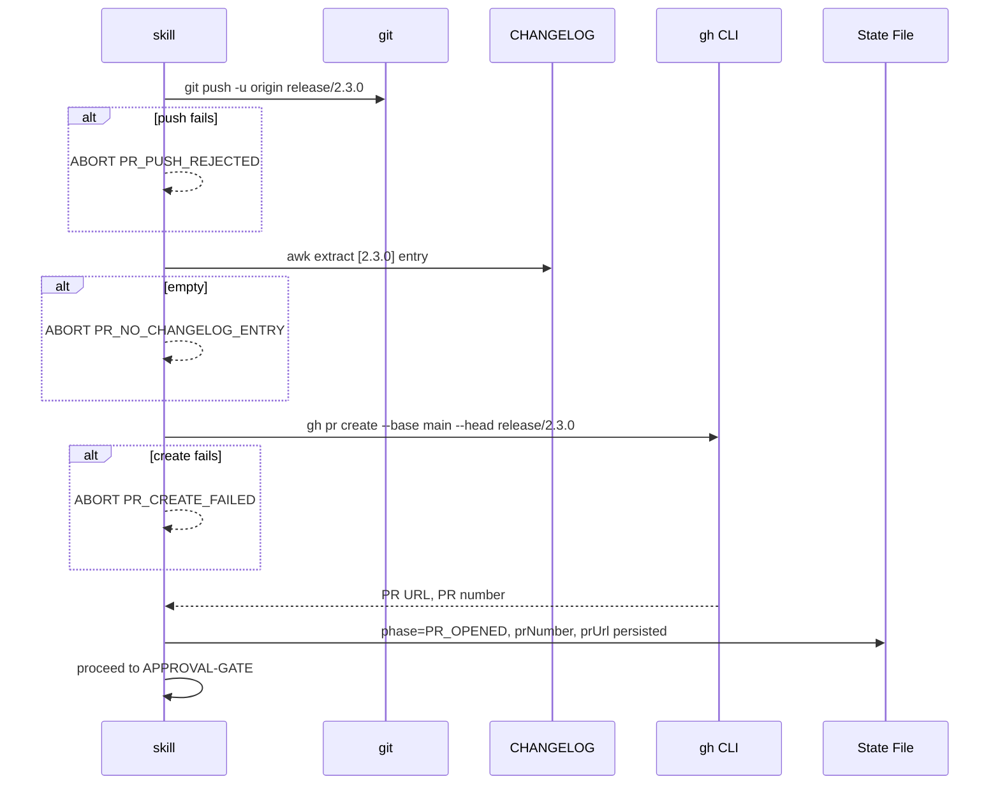

# História: Substituir Merge Direto para main por PR via gh CLI

**ID:** story-0035-0003
**Chave Jira:** —
**Status:** Pendente

## 1. Dependências

| Blocked By | Blocks |
| :--- | :--- |
| story-0035-0001 | story-0035-0004, 0007, 0008 |

## 2. Regras Transversais Aplicáveis

| ID | Título |
| :--- | :--- |
| RULE-001 | PR-Flow Obrigatório (Rule 09 Compliance) |
| RULE-002 | Preservação de Comportamento Existente |
| RULE-005 | Source of Truth |
| RULE-007 | Conventional Commits + Rule 08 |
| RULE-008 | `gh` CLI e `jq` |

## 3. Descrição

Como **platform engineer** fazendo release em projeto com branch protection ativada em `main`, eu quero que o `x-release` abra um PR via `gh pr create` em vez de fazer `git merge` local direto para `main`, garantindo que a Rule 09 não seja mais violada pelo próprio tooling e que toda release tenha trilha de auditoria via PR histórico no GitHub.

O `x-release` atual executa Step 7 (MERGE-MAIN) como `git checkout main && git merge release/X.Y.Z --no-ff && git push origin main`. Isso falha silenciosamente em projetos com branch protection ou bypassa code review. Esta story substitui Step 7 por **Phase OPEN-RELEASE-PR**: push da release branch, extração da entry `[X.Y.Z]` do CHANGELOG, `gh pr create --base main --head release/X.Y.Z`, captura de `prNumber`/`prUrl` no state file, transição para `phase: PR_OPENED`.

### 3.1 Remoção do Step 7 Antigo

Remover a seção "Step 7 — Merge to Main" do SKILL.md.

### 3.2 Nova Phase OPEN-RELEASE-PR

```bash
# Push release branch
git push -u origin "release/${VERSION}"

# Extract CHANGELOG entry
CHANGELOG_ENTRY=$(awk "/^## \[${VERSION}\]/,/^## \[/" CHANGELOG.md | sed '$d')
if [ -z "$CHANGELOG_ENTRY" ]; then
  echo "ABORT [PR_NO_CHANGELOG_ENTRY]: no [${VERSION}] entry in CHANGELOG.md"
  exit 1
fi

# Build PR body and create PR
gh pr create \
  --base main \
  --head "release/${VERSION}" \
  --title "release: v${VERSION}" \
  --body "$(build_pr_body)"

# Capture and persist to state file
PR_NUMBER=$(gh pr view --json number -q .number)
jq --arg url "$PR_URL" --arg num "$PR_NUMBER" \
  '.phase = "PR_OPENED" | .prNumber = ($num|tonumber) | .prUrl = $url | .phasesCompleted += ["OPEN_RELEASE_PR"]' \
  plans/release-state-${VERSION}.json > tmp && mv tmp plans/release-state-${VERSION}.json
```

### 3.3 PR Body Template

```markdown
## Release v${VERSION}

${CHANGELOG_ENTRY}

---

**Release type:** ${BUMP_TYPE}
**Previous version:** ${PREVIOUS_VERSION}

## Approval Gate

After merging this PR, re-run:
```
/x-release ${VERSION} --continue-after-merge
```

## Checklist (validated by VALIDATE-DEEP)

- [x] Tests passing
- [x] Coverage ≥ 95% line, ≥ 90% branch
- [x] Golden files consistent
- [x] CHANGELOG [${VERSION}] section populated
- [x] No hardcoded version strings
- [x] Cross-file version consistency
```

### 3.4 Atualização do Step 10 PUBLISH

Push de `main`/`develop` era feito em Step 10. Com o novo fluxo, esses pushes acontecem via merge de PRs (stories 0035-0004 e 0035-0006). O push da **tag** e da **release branch** continuam diretos: release branch push move-se para dentro de OPEN-RELEASE-PR, tag push move-se para RESUME-AND-TAG (story 0035-0005).

Flag `--no-publish` continua: se presente, `gh pr create` é substituído por uma mensagem dry-run e o skill encerra sem modificar estado remoto.

### 3.5 Integração Opcional com x-review-pr

Nova flag `--skip-review`. Se não fornecida E `x-review-pr` existe, invocar `Skill("x-review-pr", "$PR_NUMBER")` em fire-and-forget após criação do PR.

## 3.5 Entrega de Valor

- **Valor Principal:** `x-release` deixa de violar a Rule 09 do próprio projeto. Projetos com branch protection em main passam a funcionar corretamente. Releases ganham trilha de auditoria via PR histórico.
- **Métrica de Sucesso:** `ReleaseOpenPrTest` valida que `gh pr create` é invocado com os parâmetros corretos (base=main, head=release/X.Y.Z) e que nenhum `git merge main` é executado.
- **Impacto no Negócio:** Auditores e novos contribuidores têm visibilidade completa do histórico de releases via GitHub UI.

## 4. Definições de Qualidade Locais

### DoR Local

- [ ] Story 0035-0001 merged
- [ ] `gh pr create` testado manualmente
- [ ] Estrutura do CHANGELOG verificada

### DoD Local

- [ ] Step 7 antigo removido
- [ ] Phase OPEN-RELEASE-PR documentada com bash completo
- [ ] PR body inclui CHANGELOG entry + instruções de resume
- [ ] `prNumber`/`prUrl`/`prTitle`/`changelogEntry` persistidos no state file
- [ ] Step 10 PUBLISH atualizado (só tag e release branch)
- [ ] Flag `--skip-review` adicionada
- [ ] Error code `PR_NO_CHANGELOG_ENTRY` na tabela
- [ ] Teste `ReleaseOpenPrTest`
- [ ] Golden files regenerados
- [ ] `mvn verify -P all-tests` verde

## 5. Contratos de Dados

### 5.1 State File Delta

| Campo | Antes | Depois |
| :--- | :--- | :--- |
| `phase` | `COMMITTED` | `PR_OPENED` |
| `prNumber` | absent | integer |
| `prUrl` | absent | URL |
| `prTitle` | absent | `release: v${VERSION}` |
| `changelogEntry` | absent | conteúdo |

### 5.2 Error Codes

| Código | Condição | Mensagem |
| :--- | :--- | :--- |
| `PR_NO_CHANGELOG_ENTRY` | awk não encontra entry | `No [${VERSION}] entry in CHANGELOG.md` |
| `PR_CREATE_FAILED` | `gh pr create` falha | `Failed to create PR: ${stderr}` |
| `PR_PUSH_REJECTED` | push rejeitado | `Push rejected. Check branch protection.` |

## 6. Diagramas



## 7. Critérios de Aceite (Gherkin)

```gherkin
Cenario: Degenerate — CHANGELOG sem entry para a versão
  DADO state file phase: COMMITTED, version: 2.3.0
  E CHANGELOG.md NÃO contém "## [2.3.0]"
  QUANDO Phase OPEN-RELEASE-PR executa
  ENTÃO aborta com PR_NO_CHANGELOG_ENTRY
  E NENHUM gh pr create é invocado

Cenario: Happy path — release com CHANGELOG populado
  DADO state file phase: COMMITTED, CHANGELOG com entry [2.3.0]
  QUANDO Phase OPEN-RELEASE-PR executa
  ENTÃO git push da release branch é executado
  E gh pr create --base main é invocado
  E PR body contém CHANGELOG entry e instrução de resume
  E state file avança para PR_OPENED com prNumber populado

Cenario: Error — push da release branch rejeitado
  DADO git push origin release/2.3.0 retorna "protected branch"
  QUANDO OPEN-RELEASE-PR tenta push
  ENTÃO aborta com PR_PUSH_REJECTED
  E state permanece em COMMITTED

Cenario: Error — gh pr create falha
  DADO git push OK, gh pr create retorna exit 1
  QUANDO OPEN-RELEASE-PR tenta criar PR
  ENTÃO aborta com PR_CREATE_FAILED

Cenario: Boundary — --no-publish não cria PR real
  DADO --no-publish fornecida
  QUANDO OPEN-RELEASE-PR executa
  ENTÃO NÃO é feito git push
  E NÃO é feito gh pr create
  E saída mostra dry-run message
  E state NÃO é modificado

Cenario: Happy path com integração — --skip-review ausente
  DADO Phase OPEN-RELEASE-PR cria PR com prNumber=262
  E --skip-review ausente
  QUANDO Phase finaliza
  ENTÃO Skill("x-review-pr", "262") é invocada em fire-and-forget
```

### 7.1 Scenario Ordering (TPP)
Degenerate → happy → errors → boundary → happy com integração.

### 7.2 Mandatory Scenario Categories
- [x] Degenerate (CHANGELOG sem entry)
- [x] Happy path (básico + integração)
- [x] Error paths (push reject, gh fail)
- [x] Boundary (--no-publish)

## 8. Tasks

### TASK-0035-0003-001: Phase OPEN-RELEASE-PR estrutura básica

- **Layer:** Config
- **Test Type:** Unit
- **Size:** M
- **Dependencies:** —
- **Branch:** `feat/task-0035-0003-001-open-pr-structure`
- **Testability:** Config + VerificationTest
- **Files:**
  - `java/src/main/resources/targets/claude/skills/core/x-release/SKILL.md`
- **Acceptance Criteria:**
  - [ ] Step 7 antigo removido
  - [ ] Phase OPEN-RELEASE-PR documentada
  - [ ] PR body template documentado
  - [ ] Error codes na tabela

### TASK-0035-0003-002: Step 10 update + --skip-review

- **Layer:** Config
- **Test Type:** Unit
- **Size:** S
- **Dependencies:** TASK-0035-0003-001
- **Branch:** `feat/task-0035-0003-002-skip-review`
- **Testability:** Config + VerificationTest
- **Files:**
  - `java/src/main/resources/targets/claude/skills/core/x-release/SKILL.md`
- **Acceptance Criteria:**
  - [ ] Step 10 remove push main/develop
  - [ ] Flag `--skip-review` documentada
  - [ ] Integração x-review-pr fire-and-forget

### TASK-0035-0003-003: Testes e golden files

- **Layer:** Test
- **Test Type:** Integration + Smoke
- **Size:** M
- **Dependencies:** TASK-0035-0003-001, 0003-002
- **Branch:** `feat/task-0035-0003-003-open-pr-tests`
- **Testability:** Migration + Smoke
- **Files:**
  - `java/src/test/java/dev/iadev/application/assembler/ReleaseOpenPrTest.java` (novo)
  - `java/src/test/resources/golden/*/.claude/skills/x-release/SKILL.md` (17+ profiles)
- **Acceptance Criteria:**
  - [ ] `ReleaseOpenPrTest` valida ausência de `git merge main`
  - [ ] Valida presença de `gh pr create --base main`
  - [ ] Golden files regenerados
  - [ ] `mvn verify -P all-tests` verde
