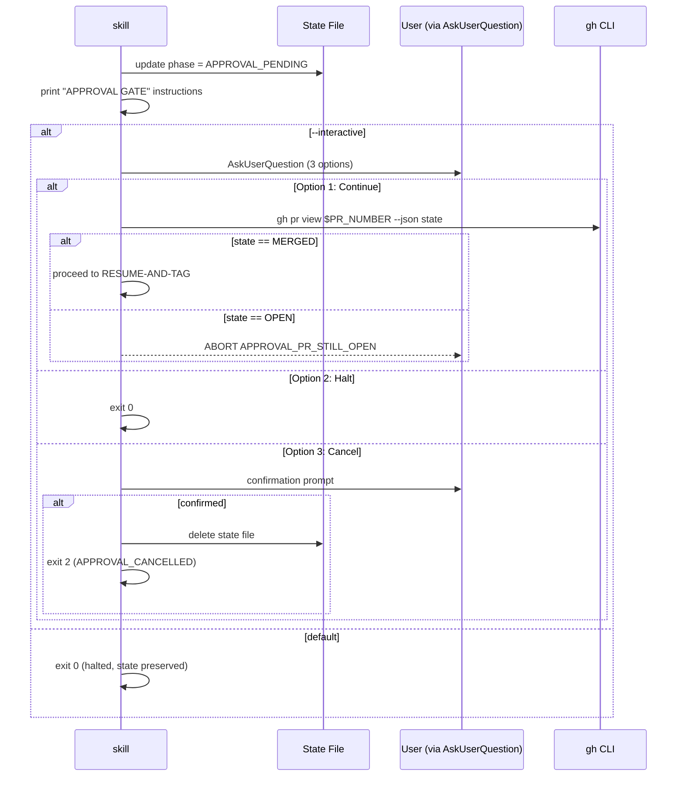

# História: Criar Gate de Aprovação Humana com Pausa Persistente do Skill

**ID:** story-0035-0004
**Chave Jira:** —
**Status:** Pendente

## 1. Dependências

| Blocked By | Blocks |
| :--- | :--- |
| story-0035-0003 | story-0035-0005, 0007, 0008 |

## 2. Regras Transversais Aplicáveis

| ID | Título |
| :--- | :--- |
| RULE-003 | Idempotência via State File |
| RULE-005 | Source of Truth |

## 3. Descrição

Como **operador humano** disparando uma release, eu quero uma pausa explícita no skill entre a abertura do PR para main e a aplicação da tag, permitindo que eu revise o PR, aguarde CI rodar, colete aprovações, e decida quando merge — sem que o skill continue automaticamente e crie artefatos irreversíveis (tag, back-merge) antes dessa decisão.

O approval gate é o coração deste épico. O `x-release` atual faz MERGE → TAG → BACK-MERGE → PUBLISH em sequência, sem pausa. Esta story implementa a **Phase APPROVAL-GATE** que executa após OPEN-RELEASE-PR e antes de RESUME-AND-TAG. Comportamento padrão: persiste `phase: APPROVAL_PENDING` no state file, imprime mensagem com o PR URL e comando de resume, e **encerra o skill**. Comportamento com `--interactive`: usa `AskUserQuestion` com 3 opções.

### 3.1 Comportamento Default

```bash
# Persist APPROVAL_PENDING
jq '.phase = "APPROVAL_PENDING" | .phasesCompleted += ["APPROVAL_GATE_REACHED"]' \
  "$STATE_FILE" > tmp && mv tmp "$STATE_FILE"

# Print instructions
cat <<EOF
============================================================
APPROVAL GATE — RELEASE v${VERSION}
============================================================

PR opened: ${PR_URL}
PR number: #${PR_NUMBER}

NEXT STEPS (MANUAL):
  1. Open the PR in GitHub: ${PR_URL}
  2. Ensure all CI checks pass
  3. Collect required code review approvals
  4. Merge the PR via GitHub UI (prefer merge commit)
  5. Re-run this skill:
     /x-release ${VERSION} --continue-after-merge

State saved to: ${STATE_FILE}
The skill will now exit. Nothing irreversible has happened yet.
To cancel: close the PR and delete state file + release branch.
============================================================
EOF

exit 0
```

### 3.2 Modo Interactive (`--interactive`)

Após imprimir as instruções, invoca `AskUserQuestion` com 3 opções:

1. **"PR merged, continue to tag (Recommended)"** — verifica via `gh pr view` que state == MERGED antes de prosseguir; se OPEN, aborta com `APPROVAL_PR_STILL_OPEN`
2. **"Halt — resume later with --continue-after-merge"** — comportamento idêntico ao default (exit 0)
3. **"Cancel release entirely"** — pede confirmação dupla; se confirmado, apaga state file e imprime script de cleanup manual (`gh pr close`, `git push --delete`); exit 2

### 3.3 Idempotência

Se o skill é re-invocado sem `--continue-after-merge` e state file tem `phase: APPROVAL_PENDING`, o Step 0 (story 0035-0001) emite WARNING e aborta com instrução. Portanto, APPROVAL-GATE nunca executa duas vezes para a mesma release.

## 3.5 Entrega de Valor

- **Valor Principal:** Operador humano ganha uma janela explícita para revisar a release antes de qualquer ação irreversível. Tag nunca é criada sem intervenção humana consciente.
- **Métrica de Sucesso:** `ReleaseApprovalGateTest` verifica que após OPEN-RELEASE-PR, skill escreve `APPROVAL_PENDING` e retorna exit 0; segunda invocação sem flag é bloqueada.
- **Impacto no Negócio:** Reduz risco de publicar release com bug tardiamente detectado. Operador pode rodar testes manuais, demos, validação em staging, ou abortar fechando o PR.

## 4. Definições de Qualidade Locais

### DoR Local

- [ ] Story 0035-0003 merged
- [ ] `prNumber`/`prUrl` presentes no state file após OPEN-RELEASE-PR
- [ ] Comportamento de `AskUserQuestion` em skill context verificado
- [ ] Convenção de exit codes alinhada

### DoD Local

- [ ] Seção "Step 8 — Approval Gate" após Step 7
- [ ] Comportamento default: state atualizado + mensagem + exit 0
- [ ] Comportamento interactive: `AskUserQuestion` com 3 opções
- [ ] Opção 1 verifica via `gh pr view` antes de prosseguir (defense in depth)
- [ ] Opção 3 requer confirmação dupla
- [ ] Flag `--interactive` documentada
- [ ] Error codes `APPROVAL_PR_STILL_OPEN`, `APPROVAL_CANCELLED`
- [ ] Teste `ReleaseApprovalGateTest`
- [ ] `references/approval-gate-workflow.md` criado
- [ ] Golden files regenerados
- [ ] `mvn verify -Pall-tests` verde

## 5. Contratos de Dados

### 5.1 State File Delta (Default)

| Campo | Antes | Depois |
| :--- | :--- | :--- |
| `phase` | `PR_OPENED` | `APPROVAL_PENDING` |
| `phasesCompleted` | `[..., OPEN_RELEASE_PR]` | `[..., OPEN_RELEASE_PR, APPROVAL_GATE_REACHED]` |

### 5.2 State File Delta (Interactive Opção 3 — Cancel)

State file DELETADO.

### 5.3 Error Codes

| Código | Condição | Mensagem |
| :--- | :--- | :--- |
| `APPROVAL_PR_STILL_OPEN` | Opção 1 mas `gh pr view` retorna OPEN | `PR is still OPEN. Merge first.` |
| `APPROVAL_CANCELLED` | Opção 3 confirmada (exit 2) | `Release cancelled by user.` |

## 6. Diagramas



## 7. Critérios de Aceite (Gherkin)

```gherkin
Cenario: Degenerate — sem --interactive
  DADO Phase OPEN-RELEASE-PR completou com prNumber=262
  QUANDO Phase APPROVAL-GATE executa
  ENTÃO state file avança para APPROVAL_PENDING
  E mensagem APPROVAL GATE impressa com PR URL
  E skill encerra com exit 0
  E nenhuma tag ou merge ocorre

Cenario: Happy path — re-invocação sem --continue é bloqueada
  DADO state file tem phase: APPROVAL_PENDING
  QUANDO usuário executa /x-release 2.3.0
  ENTÃO Step 0 detecta state file e aborta com STATE_CONFLICT

Cenario: Error — interactive Opção 1 mas PR ainda OPEN
  DADO --interactive fornecida, usuário escolhe Opção 1
  E gh pr view retorna state: OPEN
  QUANDO Phase verifica merge
  ENTÃO aborta com APPROVAL_PR_STILL_OPEN
  E state permanece em APPROVAL_PENDING

Cenario: Happy path — interactive Opção 1 PR merged
  DADO --interactive fornecida, usuário escolhe Opção 1
  E gh pr view retorna state: MERGED
  QUANDO Phase verifica merge
  ENTÃO prossegue para RESUME-AND-TAG in-session
  E state avança para MERGED

Cenario: Boundary — interactive Opção 3 com confirmação
  DADO --interactive fornecida, usuário escolhe Opção 3
  E usuário confirma cancelamento
  QUANDO Phase processa cancelamento
  ENTÃO state file é DELETADO
  E script de cleanup manual é impresso
  E exit code é 2 (APPROVAL_CANCELLED)

Cenario: Boundary — interactive Opção 3 sem confirmação
  DADO usuário escolhe Opção 3 mas responde "No"
  QUANDO Phase processa não-cancelamento
  ENTÃO state file NÃO é deletado
  E as 3 opções são re-apresentadas
```

### 7.1 Scenario Ordering (TPP)
Degenerate → happy (bloqueio) → error (PR open) → happy (merged) → boundary cancel → boundary cancel abort.

### 7.2 Mandatory Scenario Categories
- [x] Degenerate (default halt)
- [x] Happy path (re-invoke blocked, interactive merged)
- [x] Error paths (PR still open)
- [x] Boundary (cancel with/without confirmation)

## 8. Tasks

### TASK-0035-0004-001: Phase APPROVAL-GATE default

- **Layer:** Config
- **Test Type:** Unit
- **Size:** S
- **Dependencies:** —
- **Branch:** `feature/task-0035-0004-001-gate-default`
- **Testability:** Config + VerificationTest
- **Files:**
  - `java/src/main/resources/targets/claude/skills/core/x-release/SKILL.md`
- **Acceptance Criteria:**
  - [ ] Seção "Step 8 — Approval Gate" após Step 7
  - [ ] State update via `jq` atomic
  - [ ] Mensagem com PR URL + comando de resume
  - [ ] `exit 0` default

### TASK-0035-0004-002: Modo --interactive com AskUserQuestion

- **Layer:** Config
- **Test Type:** Integration
- **Size:** M
- **Dependencies:** TASK-0035-0004-001
- **Branch:** `feature/task-0035-0004-002-gate-interactive`
- **Testability:** UseCase + AT
- **Files:**
  - `java/src/main/resources/targets/claude/skills/core/x-release/SKILL.md`
  - `java/src/main/resources/targets/claude/skills/core/x-release/references/approval-gate-workflow.md` (novo)
- **Acceptance Criteria:**
  - [ ] Flag `--interactive` ativa bloco `AskUserQuestion`
  - [ ] 3 opções implementadas
  - [ ] Opção 1 faz `gh pr view` (defense in depth)
  - [ ] Opção 3 requer confirmação dupla
  - [ ] Error codes na tabela
  - [ ] `references/approval-gate-workflow.md` com diagrama

### TASK-0035-0004-003: Testes e golden files

- **Layer:** Test
- **Test Type:** Acceptance + Smoke
- **Size:** M
- **Dependencies:** TASK-0035-0004-001, 0004-002
- **Branch:** `feature/task-0035-0004-003-gate-tests`
- **Testability:** UseCase + AT
- **Files:**
  - `java/src/test/java/dev/iadev/application/assembler/ReleaseApprovalGateTest.java` (novo)
  - `java/src/test/resources/golden/*/.claude/skills/x-release/SKILL.md` (17+)
  - `java/src/test/resources/golden/*/.claude/skills/x-release/references/approval-gate-workflow.md` (17+)
- **Acceptance Criteria:**
  - [ ] Teste valida presença de "Step 8 — Approval Gate"
  - [ ] Valida 3 AskUserQuestion options
  - [ ] Valida `exit 0` no default
  - [ ] Golden files regenerados
  - [ ] `mvn verify -Pall-tests` verde
