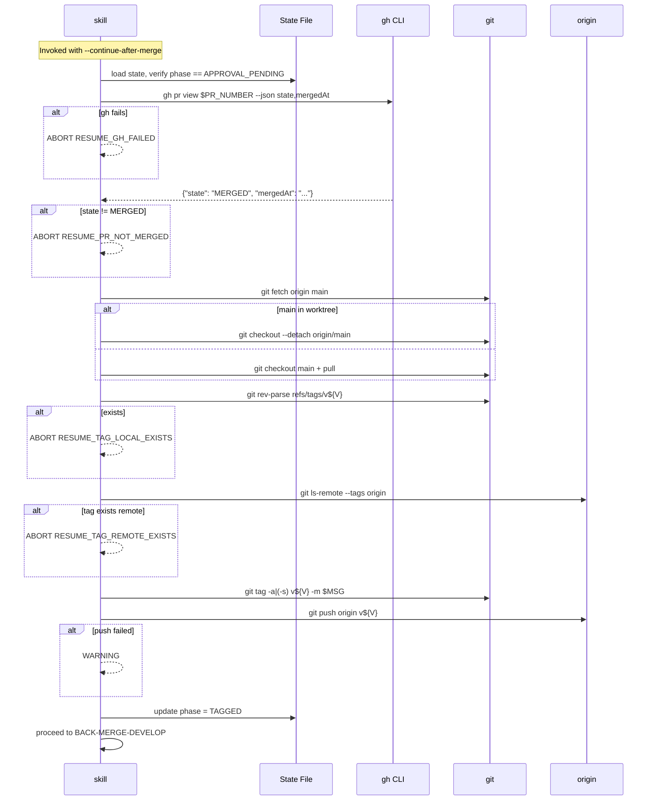

# História: Implementar Fluxo de Resume com Verificação de Merge e Tagging

**ID:** story-0035-0005
**Chave Jira:** —
**Status:** Concluida

## 1. Dependências

| Blocked By | Blocks |
| :--- | :--- |
| story-0035-0001, story-0035-0004 | story-0035-0006, 0007, 0008 |

## 2. Regras Transversais Aplicáveis

| ID | Título |
| :--- | :--- |
| RULE-003 | Idempotência via State File |
| RULE-004 | Defense in Depth no Resume |
| RULE-005 | Source of Truth |
| RULE-008 | `gh` CLI e `jq` |

## 3. Descrição

Como **platform engineer** que pausou uma release no approval gate, eu quero poder retomar o fluxo exatamente do ponto onde parei (após merge manual do PR no GitHub), com verificação defensiva de que o PR foi efetivamente merged antes de criar a tag, garantindo que sessões longas de release não dependam de uma única sessão do Claude Code permanecer aberta.

Esta story implementa a **Phase RESUME-AND-TAG** ativada por `--continue-after-merge`. O Step 0 (story 0035-0001) carrega o state file em `APPROVAL_PENDING` e salta direto para esta phase. O fluxo: (1) verifica via `gh pr view --json state` que PR está MERGED (defense in depth — nunca confia só no state file), (2) checkout main worktree-safe, (3) cria tag anotada (ou assinada se `--signed-tag`), (4) push da tag, (5) avança state para `TAGGED`.

### 3.1 Verificação Defensiva (RULE-004)

```bash
PR_NUMBER=$(jq -r .prNumber plans/release-state-${VERSION}.json)
PR_STATE_JSON=$(gh pr view "$PR_NUMBER" --json state,mergedAt 2>&1)
if [ $? -ne 0 ]; then
  echo "ABORT [RESUME_GH_FAILED]: failed to query PR #${PR_NUMBER}"
  exit 1
fi

PR_STATE=$(echo "$PR_STATE_JSON" | jq -r .state)
PR_MERGED_AT=$(echo "$PR_STATE_JSON" | jq -r .mergedAt)

if [ "$PR_STATE" != "MERGED" ]; then
  echo "ABORT [RESUME_PR_NOT_MERGED]: PR #${PR_NUMBER} is ${PR_STATE}, not MERGED"
  echo "Merge the PR first, then re-run"
  exit 1
fi

if [ "$PR_MERGED_AT" = "null" ] || [ -z "$PR_MERGED_AT" ]; then
  echo "ABORT [RESUME_PR_NO_MERGE_TIME]: mergedAt is null"
  exit 1
fi
```

**NUNCA pular esta verificação**, mesmo em modo `--interactive` onde o usuário disse "PR merged".

### 3.2 Checkout worktree-safe

```bash
git fetch origin main
if git worktree list | grep -q "main\s"; then
  git checkout --detach origin/main
else
  git checkout main
  git pull origin main
fi
```

### 3.3 Criação da Tag

```bash
# Verify tag doesn't exist (local and remote)
if git rev-parse -q --verify "refs/tags/v${VERSION}" >/dev/null; then
  echo "ABORT [RESUME_TAG_LOCAL_EXISTS]: tag v${VERSION} already exists locally"
  exit 1
fi

if git ls-remote --tags origin "refs/tags/v${VERSION}" | grep -q "v${VERSION}"; then
  echo "ABORT [RESUME_TAG_REMOTE_EXISTS]: tag v${VERSION} already exists on origin"
  exit 1
fi

# Load tag message from state (or build fresh from CHANGELOG)
TAG_MESSAGE=$(jq -r .tagMessage plans/release-state-${VERSION}.json)
if [ "$TAG_MESSAGE" = "null" ] || [ -z "$TAG_MESSAGE" ]; then
  TAG_MESSAGE="Release v${VERSION}

$(awk "/^## \[${VERSION}\]/,/^## \[/" CHANGELOG.md | sed '1d;$d' | head -20)"
fi

# Create tag (signed if flag)
if [ "$SIGNED_TAG" = "true" ]; then
  git tag -s "v${VERSION}" -m "$TAG_MESSAGE"
  if [ $? -ne 0 ]; then
    echo "ABORT [RESUME_TAG_SIGN_FAILED]: check GPG configuration"
    exit 1
  fi
else
  git tag -a "v${VERSION}" -m "$TAG_MESSAGE"
fi
```

### 3.4 Push da Tag

```bash
git push origin "v${VERSION}"
if [ $? -ne 0 ]; then
  # WARNING, not abort — tag exists locally, user can push manually
  echo "WARNING [RESUME_TAG_PUSH_FAILED]: tag created locally but push failed"
  echo "Run: git push origin v${VERSION}"
  # State still transitions to TAGGED
fi
```

### 3.5 Atualização do State File

Esta phase executa **duas transições atômicas** do state file para manter o enum coerente com o fluxo `APPROVAL_PENDING → MERGED → TAGGED` declarado na story 0035-0001:

1. **`APPROVAL_PENDING → MERGED`** — imediatamente após `gh pr view` confirmar `state == MERGED`, antes de qualquer operação de tag. Isso marca que a verificação defensiva foi bem-sucedida e o skill está avançando para criar a tag. Se a criação de tag falhar (tag duplicada, GPG missing, etc.), o state file permanece em `MERGED` e o usuário pode retomar sem refazer a verificação.

2. **`MERGED → TAGGED`** — após `git tag` + `git push origin v${VERSION}` (ou apenas `git tag` com warning quando push falha, per Section 3.4).

```bash
# Transição 1: após verificação defensiva bem-sucedida
jq --arg pr_merged_at "$PR_MERGED_AT" \
  '.phase = "MERGED" | .mergedAt = $pr_merged_at | .phasesCompleted += ["RESUME_VERIFIED_MERGE"]' \
  plans/release-state-${VERSION}.json > tmp && mv tmp plans/release-state-${VERSION}.json

# ... criar/assinar/pushar a tag (Sections 3.3 e 3.4) ...

# Transição 2: após criação e push da tag
jq '.phase = "TAGGED" | .phasesCompleted += ["RESUME_AND_TAG"]' \
  plans/release-state-${VERSION}.json > tmp && mv tmp plans/release-state-${VERSION}.json
```

## 3.5 Entrega de Valor

- **Valor Principal:** Sessões longas de release (horas entre merge do PR e tag) deixam de depender de sessão única do Claude Code aberta. Estado persistido sobrevive a crashes, fechamento do Claude, e reboot. Operador pode iniciar release à tarde, fechar laptop, retomar na manhã seguinte.
- **Métrica de Sucesso:** `ReleaseResumeAndTagTest` simula state file em `APPROVAL_PENDING`, mock de `gh pr view` retornando MERGED, e verifica criação da tag + transição para TAGGED. Segundo teste simula PR ainda OPEN e verifica abort sem modificar main.
- **Impacto no Negócio:** Elimina pressão temporal em releases. Operador não precisa acompanhar CI em tempo real — pode merge o PR quando CI passar e retomar o skill assincronamente.

## 4. Definições de Qualidade Locais

### DoR Local

- [ ] Stories 0035-0001 e 0035-0004 merged
- [ ] `gh pr view --json state,mergedAt` testado manualmente
- [ ] Comportamento de `git checkout` com main em worktree verificado
- [ ] GPG configurado no ambiente de teste (para `--signed-tag`)

### DoD Local

- [ ] Seção "Step 9 — Resume and Tag" após Step 8
- [ ] Verificação defensiva via `gh pr view` sempre executada
- [ ] Tag anotada por default, assinada se `--signed-tag`
- [ ] Push da tag com warning se falhar (não abort)
- [ ] Checkout worktree-safe
- [ ] Verificação de tag pré-existente (local e remoto)
- [ ] Error codes `RESUME_*` na tabela
- [ ] State file transita `APPROVAL_PENDING → TAGGED` atomicamente
- [ ] Teste `ReleaseResumeAndTagTest` com 6+ cenários
- [ ] Golden files regenerados
- [ ] `mvn verify -Pall-tests` verde

## 5. Contratos de Dados

### 5.1 State File Delta

| Campo | Antes | Depois |
| :--- | :--- | :--- |
| `phase` | `APPROVAL_PENDING` | `TAGGED` |
| `mergedAt` | absent | ISO-8601 timestamp |
| `phasesCompleted` | `[..., APPROVAL_GATE_REACHED]` | `[..., APPROVAL_GATE_REACHED, RESUME_AND_TAG]` |

### 5.2 Error Codes

| Código | Condição | Mensagem |
| :--- | :--- | :--- |
| `RESUME_GH_FAILED` | `gh pr view` retorna ≠ 0 | `Failed to query PR #${PR}` |
| `RESUME_PR_NOT_MERGED` | state != MERGED | `PR #${PR} is ${state}, not MERGED` |
| `RESUME_PR_NO_MERGE_TIME` | mergedAt == null | `PR state inconsistency` |
| `RESUME_TAG_LOCAL_EXISTS` | tag local existe | `Tag v${V} already exists locally` |
| `RESUME_TAG_REMOTE_EXISTS` | tag remota existe | `Tag v${V} already exists on origin` |
| `RESUME_TAG_SIGN_FAILED` | `git tag -s` falha | `Check GPG configuration` |
| `RESUME_TAG_PUSH_FAILED` | push da tag falha | WARNING (não abort) |

## 6. Diagramas



## 7. Critérios de Aceite (Gherkin)

```gherkin
Cenario: Degenerate — resume sem state file
  DADO não existe plans/release-state-2.3.0.json
  QUANDO /x-release 2.3.0 --continue-after-merge é executado
  ENTÃO Step 0 aborta com RESUME_NO_STATE antes de RESUME-AND-TAG
  E nenhuma operação git ocorre

Cenario: Error — state APPROVAL_PENDING mas PR ainda OPEN
  DADO state phase: APPROVAL_PENDING, prNumber: 262
  E gh pr view 262 retorna state: OPEN
  QUANDO RESUME-AND-TAG verifica defensivamente
  ENTÃO aborta com RESUME_PR_NOT_MERGED
  E state permanece em APPROVAL_PENDING
  E nenhuma tag é criada

Cenario: Happy path — PR merged, tag criada
  DADO state phase: APPROVAL_PENDING, gh pr view retorna MERGED
  E tag v2.3.0 não existe local nem remoto
  QUANDO RESUME-AND-TAG executa
  ENTÃO git checkout main + pull
  E git tag -a v2.3.0 criada
  E git push origin v2.3.0
  E state avança para TAGGED, mergedAt populado

Cenario: Error — tag remota já existe (release duplicada)
  DADO gh pr view retorna MERGED
  E git ls-remote encontra refs/tags/v2.3.0
  QUANDO RESUME-AND-TAG verifica tag
  ENTÃO aborta com RESUME_TAG_REMOTE_EXISTS

Cenario: Happy path — --signed-tag cria tag GPG
  DADO --signed-tag fornecida, GPG configurado
  E gh pr view retorna MERGED
  QUANDO RESUME-AND-TAG cria tag
  ENTÃO git tag -s é executado (não git tag -a)
  E state avança para TAGGED

Cenario: Boundary — push da tag falha mas criação local OK
  DADO git tag -a criou v2.3.0 localmente
  E git push origin v2.3.0 falha com "remote unreachable"
  QUANDO RESUME-AND-TAG processa resultado
  ENTÃO WARNING com instrução de push manual
  E state avança para TAGGED mesmo assim
```

### 7.1 Scenario Ordering (TPP)
Degenerate → errors → happy básico → happy com signed → boundary.

### 7.2 Mandatory Scenario Categories
- [x] Degenerate (sem state file)
- [x] Happy path (MERGED + tag, signed variante)
- [x] Error paths (PR open, tag existe)
- [x] Boundary (push falha)

## 8. Tasks

### TASK-0035-0005-001: Verificação defensiva via gh pr view

- **Layer:** Config
- **Test Type:** Integration
- **Size:** S
- **Dependencies:** —
- **Branch:** `feature/task-0035-0005-001-resume-verify`
- **Testability:** Port + Adapter + IT
- **Files:**
  - `java/src/main/resources/targets/claude/skills/core/x-release/SKILL.md`
- **Acceptance Criteria:**
  - [ ] Bloco `gh pr view --json state,mergedAt` documentado
  - [ ] 3 error codes (`RESUME_GH_FAILED`, `RESUME_PR_NOT_MERGED`, `RESUME_PR_NO_MERGE_TIME`)
  - [ ] Comentário explicando RULE-004

### TASK-0035-0005-002: Criação e push da tag

- **Layer:** Config
- **Test Type:** Integration
- **Size:** M
- **Dependencies:** TASK-0035-0005-001
- **Branch:** `feature/task-0035-0005-002-tag-creation`
- **Testability:** Port + Adapter + IT
- **Files:**
  - `java/src/main/resources/targets/claude/skills/core/x-release/SKILL.md`
- **Acceptance Criteria:**
  - [ ] Verificação de tag pré-existente (local + remoto)
  - [ ] `git tag -a` ou `-s` baseado em `--signed-tag`
  - [ ] Push com warning (não abort) se falhar
  - [ ] Checkout worktree-safe
  - [ ] State file `APPROVAL_PENDING → TAGGED`

### TASK-0035-0005-003: Testes e golden files

- **Layer:** Test
- **Test Type:** Integration + Smoke
- **Size:** M
- **Dependencies:** TASK-0035-0005-001, 0005-002
- **Branch:** `feature/task-0035-0005-003-resume-tests`
- **Testability:** Migration + Smoke
- **Files:**
  - `java/src/test/java/dev/iadev/application/assembler/ReleaseResumeAndTagTest.java` (novo)
  - `java/src/test/resources/golden/*/.claude/skills/x-release/SKILL.md` (17+)
- **Acceptance Criteria:**
  - [ ] Teste cobre 6 cenários
  - [ ] Mock de `gh` CLI
  - [ ] Golden files regenerados
  - [ ] `mvn verify -Pall-tests` verde
