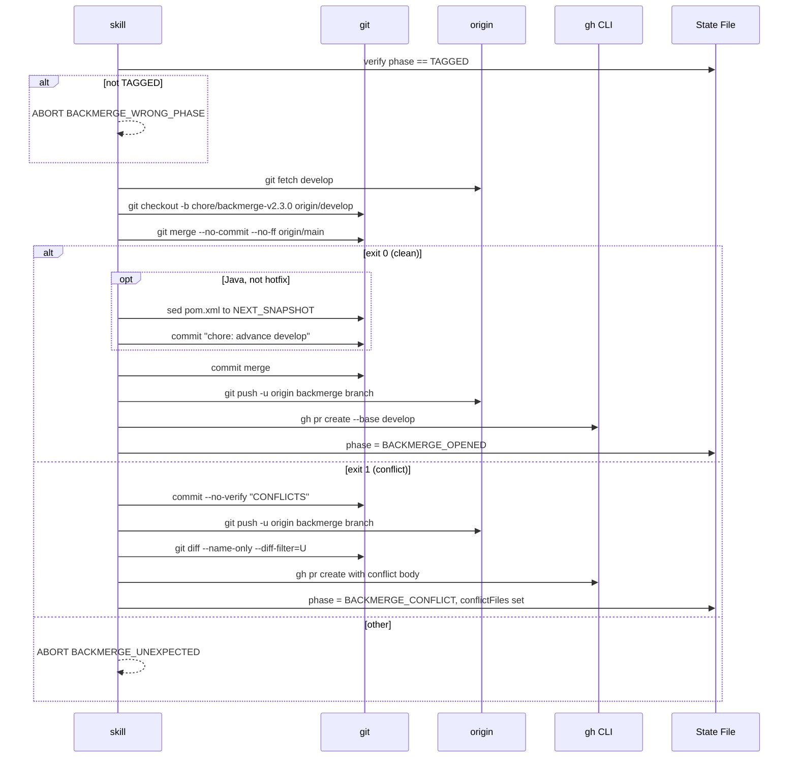

# História: Substituir Back-Merge Direto por PR-Flow com Detecção de Conflito

**ID:** story-0035-0006
**Chave Jira:** —
**Status:** Pendente

## 1. Dependências

| Blocked By | Blocks |
| :--- | :--- |
| story-0035-0005 | story-0035-0007, 0008 |

## 2. Regras Transversais Aplicáveis

| ID | Título |
| :--- | :--- |
| RULE-001 | PR-Flow Obrigatório (Rule 09 Compliance) |
| RULE-002 | Preservação de Comportamento Existente |
| RULE-005 | Source of Truth |
| RULE-008 | `gh` CLI e `jq` |

## 3. Descrição

Como **platform engineer** que acabou de taggear main, eu quero que o back-merge para develop seja feito via PR (respeitando Rule 09), com detecção automática de conflito — se clean, abre PR de auditoria; se houver conflito, salva state `BACKMERGE_CONFLICT` e abre PR explícito para resolução humana — em vez de `git merge` direto que pode falhar silenciosamente em branch protection ou deixar develop em estado inconsistente.

O `x-release` atual faz o back-merge via Step 9 `git checkout develop && git merge release/X.Y.Z --no-ff && git push origin develop`, violando Rule 09 pela segunda vez. Esta story substitui o Step 9 pela **Phase BACK-MERGE-DEVELOP** com fluxo: (1) dry-run merge para detectar conflitos, (2) se clean: cria branch `chore/backmerge-v*`, aplica SNAPSHOT advance Java, abre PR `--base develop --head chore/backmerge-*`; (3) se conflito: commit `--no-verify`, push, PR com body explicativo, state `BACKMERGE_CONFLICT`.

### 3.1 Remoção do Step 9 Antigo

Remover a seção "Step 9 — Merge Back to Develop" que contém `git merge` direto.

### 3.2 Nova Phase BACK-MERGE-DEVELOP

```bash
# Verify phase == TAGGED
PHASE=$(jq -r .phase plans/release-state-${VERSION}.json)
if [ "$PHASE" != "TAGGED" ]; then
  echo "ABORT [BACKMERGE_WRONG_PHASE]: expected TAGGED, got $PHASE"
  exit 1
fi

BACKMERGE_BRANCH="chore/backmerge-v${VERSION}"

# Create backmerge branch from develop
git fetch origin develop
git checkout -b "$BACKMERGE_BRANCH" origin/develop

# Dry-run merge to detect conflicts
git merge --no-commit --no-ff origin/main 2>/dev/null
MERGE_EXIT=$?
```

### 3.3 Clean Merge Flow

```bash
if [ $MERGE_EXIT -eq 0 ]; then
  # Preserve Java SNAPSHOT advance
  if [ -f pom.xml ] && [ "$HOTFIX" != "true" ]; then
    NEXT_MINOR=$((MINOR + 1))
    NEXT_SNAPSHOT="${MAJOR}.${NEXT_MINOR}.0-SNAPSHOT"
    sed -i '' '/<parent>/,/<\/parent>/!{
      0,/<version>.*<\/version>/s|<version>.*</version>|<version>'"$NEXT_SNAPSHOT"'</version>|
    }' pom.xml
    git add pom.xml
    git commit -m "chore: advance develop to ${NEXT_SNAPSHOT}"
  else
    git commit -m "release: merge v${VERSION} back into develop"
  fi

  git push -u origin "$BACKMERGE_BRANCH"

  gh pr create \
    --base develop \
    --head "$BACKMERGE_BRANCH" \
    --title "chore(release): back-merge v${VERSION} to develop" \
    --body "Automated back-merge from main after v${VERSION} release. Clean merge."

  # State: BACKMERGE_OPENED
  jq '.phase = "BACKMERGE_OPENED" | .backmergePrUrl = $url | .phasesCompleted += ["BACK_MERGE_DEVELOP"]' \
    plans/release-state-${VERSION}.json > tmp && mv tmp plans/release-state-${VERSION}.json
fi
```

### 3.4 Conflict Flow

```bash
if [ $MERGE_EXIT -eq 1 ]; then
  # Commit conflicted state (with --no-verify to bypass hooks)
  git add -A
  git commit -m "chore(release): back-merge v${VERSION} (CONFLICTS — needs manual resolution)" --no-verify
  git push -u origin "$BACKMERGE_BRANCH"

  CONFLICT_LIST=$(git diff --name-only --diff-filter=U | head -20)

  gh pr create \
    --base develop \
    --head "$BACKMERGE_BRANCH" \
    --title "chore(release): back-merge v${VERSION} (CONFLICTS)" \
    --body "⚠️ CONFLICTS DETECTED. Manual resolution required.

Conflicting files:
\`\`\`
${CONFLICT_LIST}
\`\`\`

Java SNAPSHOT advance was NOT applied — add it manually if needed."

  # State: BACKMERGE_CONFLICT
  jq '.phase = "BACKMERGE_CONFLICT" | .conflictFiles = [...] | .phasesCompleted += ["BACK_MERGE_DEVELOP_CONFLICT"]' \
    plans/release-state-${VERSION}.json > tmp && mv tmp plans/release-state-${VERSION}.json
fi
```

### 3.5 Preservação do Java SNAPSHOT Advance

Só aplica em projetos Java/Maven (detecta `pom.xml`), só em modo não-hotfix, computa próxima MINOR, atualiza pom.xml via `sed`, commit separado `chore: advance develop to ${NEXT_SNAPSHOT}`.

### 3.6 Phase COMPLETED

`COMPLETED` é alcançada apenas após o back-merge PR ter sido merged manualmente. O skill termina em `BACKMERGE_OPENED` ou `BACKMERGE_CONFLICT` e cleanup final é feito pelo Step 11 (escopo: delete release branch + state file). Transição para `COMPLETED` é responsabilidade do Step 11.

## 3.5 Entrega de Valor

- **Valor Principal:** Back-merge deixa de ser ponto silencioso de falha. Clean merges geram PR de auditoria respeitando Rule 09. Conflitos viram PRs explícitos com instruções, em vez de abortar a release no meio.
- **Métrica de Sucesso:** `ReleaseBackMergeTest` com 4 cenários: clean Java, clean hotfix, conflito, não-Java. Cada um verifica state file, branch, PR body, e SNAPSHOT advance.
- **Impacto no Negócio:** Platform engineer sabe exatamente o que fazer mesmo em releases com conflitos. Tag já foi aplicada com sucesso, release é "commercialmente final" mesmo com back-merge pendente.

## 4. Definições de Qualidade Locais

### DoR Local

- [ ] Story 0035-0005 merged
- [ ] Comportamento de `git merge --no-commit` verificado
- [ ] `gh pr create --base develop` testado
- [ ] Lógica atual do `sed` para pom.xml SNAPSHOT advance revisada

### DoD Local

- [ ] Step 9 antigo removido
- [ ] Phase BACK-MERGE-DEVELOP com ambos fluxos (clean, conflict)
- [ ] Branch `chore/backmerge-v${VERSION}`
- [ ] PR para develop via `gh pr create --base develop`
- [ ] Java SNAPSHOT advance preservado no fluxo clean
- [ ] Conflict flow com `--no-verify`
- [ ] State `BACKMERGE_OPENED` ou `BACKMERGE_CONFLICT`
- [ ] Campos `conflictFiles`, `backmergePrUrl`, `backmergePrNumber` no state
- [ ] Error codes `BACKMERGE_*`
- [ ] Teste `ReleaseBackMergeTest` com 4+ cenários
- [ ] Golden files regenerados
- [ ] `mvn verify -P all-tests` verde

## 5. Contratos de Dados

### 5.1 State File Delta — Clean

| Campo | Antes | Depois |
| :--- | :--- | :--- |
| `phase` | `TAGGED` | `BACKMERGE_OPENED` |
| `backmergePrUrl` | absent | URL |
| `backmergePrNumber` | absent | integer |

### 5.2 State File Delta — Conflict

| Campo | Antes | Depois |
| :--- | :--- | :--- |
| `phase` | `TAGGED` | `BACKMERGE_CONFLICT` |
| `conflictFiles` | absent | array de paths |
| `backmergePrUrl`, `backmergePrNumber` | absent | presentes |

### 5.3 Error Codes

| Código | Condição | Mensagem |
| :--- | :--- | :--- |
| `BACKMERGE_WRONG_PHASE` | phase != TAGGED | `Expected TAGGED, got ${phase}` |
| `BACKMERGE_UNEXPECTED` | `git merge` retorna código estranho | `Unexpected exit code: ${code}` |

## 6. Diagramas



## 7. Critérios de Aceite (Gherkin)

```gherkin
Cenario: Degenerate — state não está em TAGGED
  DADO state phase: PR_OPENED
  QUANDO BACK-MERGE-DEVELOP é invocada
  ENTÃO aborta com BACKMERGE_WRONG_PHASE
  E nenhuma operação git ocorre

Cenario: Happy path — clean merge em projeto Java
  DADO state phase: TAGGED, version: 2.3.0
  E main tem commit da release
  E develop sem divergência conflitante
  E pom.xml existe, --hotfix ausente
  QUANDO BACK-MERGE-DEVELOP executa
  ENTÃO branch chore/backmerge-v2.3.0 criada de origin/develop
  E git merge origin/main clean
  E pom.xml atualizado para 2.4.0-SNAPSHOT
  E commit "chore: advance develop to 2.4.0-SNAPSHOT"
  E gh pr create --base develop invocado
  E state avança para BACKMERGE_OPENED

Cenario: Error — conflito detectado
  DADO main modifica README.md, develop modifica README.md (conflito)
  QUANDO BACK-MERGE-DEVELOP tenta merge
  ENTÃO git merge retorna exit 1
  E skill commita estado com --no-verify
  E PR aberto com body listando README.md
  E state avança para BACKMERGE_CONFLICT, conflictFiles: ["README.md"]

Cenario: Happy path — hotfix mode (sem SNAPSHOT advance)
  DADO state TAGGED, hotfix: true, version: 2.2.3
  QUANDO BACK-MERGE-DEVELOP executa clean merge
  ENTÃO NÃO executa sed no pom.xml
  E apenas merge commit é criado
  E PR aberto normalmente

Cenario: Happy path — projeto não-Java
  DADO state TAGGED, NÃO existe pom.xml
  QUANDO BACK-MERGE-DEVELOP executa clean merge
  ENTÃO NÃO tenta SNAPSHOT advance
  E apenas merge commit criado

Cenario: Boundary — conflito em um único arquivo
  DADO conflito apenas em CHANGELOG.md
  QUANDO BACK-MERGE-DEVELOP detecta conflito
  ENTÃO conflictFiles = ["CHANGELOG.md"]
  E PR body lista CHANGELOG.md
```

### 7.1 Scenario Ordering (TPP)
Degenerate → happy (clean Java) → error (conflict) → happy (hotfix) → happy (non-Java) → boundary.

### 7.2 Mandatory Scenario Categories
- [x] Degenerate (wrong phase)
- [x] Happy path (clean Java, hotfix, non-Java)
- [x] Error paths (conflict)
- [x] Boundary (single conflict file)

## 8. Tasks

### TASK-0035-0006-001: Fluxo clean merge + PR creation

- **Layer:** Config
- **Test Type:** Integration
- **Size:** M
- **Dependencies:** —
- **Branch:** `feat/task-0035-0006-001-backmerge-clean`
- **Testability:** Port + Adapter + IT
- **Files:**
  - `java/src/main/resources/targets/claude/skills/core/x-release/SKILL.md`
- **Acceptance Criteria:**
  - [ ] Step 9 antigo removido
  - [ ] Nova "Step 10 — Back-Merge Develop"
  - [ ] Fluxo clean: branch → merge → SNAPSHOT advance → commit → push → PR
  - [ ] Verificação de phase == TAGGED
  - [ ] State `BACKMERGE_OPENED`

### TASK-0035-0006-002: Fluxo conflict detection + PR explicativo

- **Layer:** Config
- **Test Type:** Integration
- **Size:** M
- **Dependencies:** TASK-0035-0006-001
- **Branch:** `feat/task-0035-0006-002-backmerge-conflict`
- **Testability:** Port + Adapter + IT
- **Files:**
  - `java/src/main/resources/targets/claude/skills/core/x-release/SKILL.md`
  - `java/src/main/resources/targets/claude/skills/core/x-release/references/backmerge-strategies.md` (novo)
- **Acceptance Criteria:**
  - [ ] Detecção via exit code 1
  - [ ] Commit `--no-verify` do estado conflitado
  - [ ] PR body lista arquivos conflitados
  - [ ] State `BACKMERGE_CONFLICT` com `conflictFiles`
  - [ ] `references/backmerge-strategies.md` documenta ambos fluxos

### TASK-0035-0006-003: Testes e golden files

- **Layer:** Test
- **Test Type:** Integration + Smoke
- **Size:** M
- **Dependencies:** TASK-0035-0006-001, 0006-002
- **Branch:** `feat/task-0035-0006-003-backmerge-tests`
- **Testability:** Migration + Smoke
- **Files:**
  - `java/src/test/java/dev/iadev/application/assembler/ReleaseBackMergeTest.java` (novo)
  - `java/src/test/resources/golden/*/.claude/skills/x-release/SKILL.md` (17+)
  - `java/src/test/resources/golden/*/.claude/skills/x-release/references/backmerge-strategies.md` (17+)
- **Acceptance Criteria:**
  - [ ] Teste cobre 6 cenários
  - [ ] Mock de git merge com exit codes variados
  - [ ] Golden files regenerados
  - [ ] `mvn verify -P all-tests` verde
