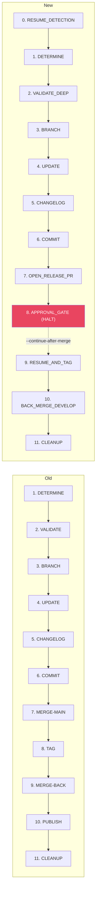

# História: Atualizar Dry-Run, Expandir Error Catalog e Preservar Hotfix Workflow

**ID:** story-0035-0007
**Chave Jira:** —
**Status:** Pendente

## 1. Dependências

| Blocked By | Blocks |
| :--- | :--- |
| story-0035-0001, story-0035-0002, story-0035-0003, story-0035-0004, story-0035-0005, story-0035-0006 | story-0035-0008 |

## 2. Regras Transversais Aplicáveis

| ID | Título |
| :--- | :--- |
| RULE-002 | Preservação de Comportamento Existente |
| RULE-005 | Source of Truth (SKILL Edit Exclusivo em `targets/`) |

## 3. Descrição

Como **platform engineer** avaliando se vou disparar uma release pela primeira vez no fluxo novo, eu quero que `--dry-run` reflita fielmente toda a nova sequência de phases (incluindo approval gate e resume), que os cenários de erro tenham mensagens acionáveis organizadas em uma tabela única, e que o hotfix workflow continue funcionando com PR-flow sem regressão — para que eu possa confiar no skill antes de cutover em produção.

Esta é uma story de consolidação cross-cutting. Ela não introduz phases novas, mas (1) atualiza o output do dry-run para mostrar a nova sequência `VALIDATE-DEEP → BRANCH → UPDATE → CHANGELOG → COMMIT → OPEN-RELEASE-PR → APPROVAL-GATE (halt) → RESUME-AND-TAG → BACK-MERGE-DEVELOP → CLEANUP`, incluindo o ponto de halt; (2) consolida todos os 20+ error codes introduzidos pelas stories 0001–0006 em uma tabela "Error Handling" única e bem formatada; (3) atualiza o fluxo de hotfix (branch de `main`, PATCH only, merge para `main` + `develop`) para usar PR-flow em vez de merge direto, preservando toda a semântica existente.

### 3.1 Dry-Run Output Atualizado

Substituir a seção "Dry-Run Mode" do SKILL.md por nova versão que mostra todas as phases novas:

```
=== RELEASE PLAN (DRY-RUN) ===

Current version:  2.2.2
Target version:   2.3.0
Bump type:        minor
Source branch:    develop
Mode:             standard (not hotfix)
State file:       plans/release-state-2.3.0.json

Phases:
  0. RESUME_DETECTION  -> check state file, verify gh/jq
                        -> will create new state with phase: INITIALIZED
  1. DETERMINE         -> bump: minor, current: 2.2.2, target: 2.3.0
  2. VALIDATE_DEEP     -> will run 8 checks:
                           [1] working dir clean
                           [2] on develop branch
                           [3] CHANGELOG [Unreleased] populated
                           [4] mvn clean verify -Pall-tests
                           [5] coverage >= 95% line, 90% branch
                           [6] golden file tests pass
                           [7] no hardcoded version strings outside pom/CHANGELOG
                           [8] cross-file version consistency
                        -> skip tests (4-6) if --skip-tests
  3. BRANCH            -> create release/2.3.0 from develop
  4. UPDATE            -> pom.xml: 2.2.2-SNAPSHOT -> 2.3.0
  5. CHANGELOG         -> invoke x-release-changelog skill
                        -> moves [Unreleased] -> [2.3.0] - 2026-04-10
  6. COMMIT            -> git commit -m "release: v2.3.0"
  7. OPEN_RELEASE_PR   -> git push origin release/2.3.0
                        -> gh pr create --base main --head release/2.3.0
                        -> PR body from CHANGELOG entry
                        -> save prNumber, prUrl to state
                        -> skip review automation if --skip-review
 ------------------------------------------------------------
  8. APPROVAL_GATE     -> SKILL WILL HALT HERE
                        -> phase: APPROVAL_PENDING persisted
                        -> exit 0, waiting for manual PR merge
                        -> with --interactive: AskUserQuestion pause instead
 ------------------------------------------------------------
 === HUMAN MUST MERGE PR IN GITHUB ===
 ------------------------------------------------------------
  9. RESUME_AND_TAG    -> requires --continue-after-merge flag
                        -> gh pr view 262 --json state,mergedAt
                        -> verify state == MERGED (defense in depth)
                        -> git checkout main, pull
                        -> git tag -a v2.3.0 (or -s if --signed-tag)
                        -> git push origin v2.3.0
 10. BACK_MERGE_DEVELOP-> git checkout -b chore/backmerge-v2.3.0 origin/develop
                        -> git merge --no-ff origin/main
                        -> if clean: SNAPSHOT advance to 2.4.0-SNAPSHOT (Java only)
                        -> gh pr create --base develop --head chore/backmerge-v2.3.0
                        -> if conflict: PR body explains, state = BACKMERGE_CONFLICT
 11. CLEANUP           -> delete release/2.3.0 (local + remote)
                        -> delete plans/release-state-2.3.0.json
                        -> print final report

Flags active: (none)
Estimated duration:
  Phases 0-7 (until halt):    ~5-10 min
  Human wait (approval):      minutes to hours
  Phases 9-11 (after resume): ~2-3 min

=== NO CHANGES MADE ===
```

Para modo hotfix (`--hotfix`), o dry-run mostra:
```
Source branch:    main (hotfix mode)
Bump type:        patch (forced)
Branch created:   hotfix/2.2.3 (from main)
```

### 3.2 Consolidação do Error Handling Table

Substituir a tabela "Error Handling" existente por uma versão consolidada com ~25 entries organizadas por phase:

| Phase | Error Code | Condição | Mensagem | Exit |
| :--- | :--- | :--- | :--- | :--- |
| 0 | `DEP_GH_MISSING` | `gh` ausente | `gh CLI not installed. See https://cli.github.com/` | 1 |
| 0 | `DEP_JQ_MISSING` | `jq` ausente | `jq not installed. Install via your package manager.` | 1 |
| 0 | `DEP_GH_AUTH` | `gh` não autenticado | `gh not authenticated. Run 'gh auth login'.` | 1 |
| 0 | `STATE_INVALID_JSON` | JSON corrompido | `State file exists but is not valid JSON: <path>` | 1 |
| 0 | `STATE_SCHEMA_VERSION` | `schemaVersion` desconhecido | `Unknown schemaVersion: <n>. Expected: 1.` | 1 |
| 0 | `RESUME_NO_STATE` | Resume sem state file | `No release in progress. Run /x-release <version> first.` | 1 |
| 0 | `STATE_CONFLICT` | State file existente bloqueia nova release | `Release in progress for v<X.Y.Z>. Use --continue-after-merge or delete state.` | 1 |
| 2 | `VALIDATE_DIRTY_WORKDIR` | `git status` sujo | `Uncommitted changes in working directory` | 1 |
| 2 | `VALIDATE_WRONG_BRANCH` | Não em develop/main | `Not on develop/release branch (or main for hotfix)` | 1 |
| 2 | `VALIDATE_EMPTY_UNRELEASED` | CHANGELOG sem entradas | `CHANGELOG [Unreleased] section empty or missing entries` | 1 |
| 2 | `VALIDATE_BUILD_FAILED` | `mvn verify` falha | `Build or tests failed — see output above` | 1 |
| 2 | `VALIDATE_COVERAGE_LINE` | Line cov < threshold | `Line coverage <actual>% below threshold 95%` | 1 |
| 2 | `VALIDATE_COVERAGE_BRANCH` | Branch cov < threshold | `Branch coverage <actual>% below threshold 90%` | 1 |
| 2 | `VALIDATE_GOLDEN_DRIFT` | Golden tests falham | `Golden files out of sync. Run GoldenFileRegenerator.` | 1 |
| 2 | `VALIDATE_HARDCODED_VERSION` | Version string em local inesperado | `Found hardcoded version <V> in: <files>` | 1 |
| 2 | `VALIDATE_VERSION_MISMATCH` | pom ↔ target mismatch | `pom.xml version <pom> != target version <target>` | 1 |
| 2 | `VALIDATE_GENERATION_DRIFT` | Generator output diff | `Generator output differs from golden baseline` | 1 |
| 7 | `PR_NO_CHANGELOG_ENTRY` | CHANGELOG sem entry nova | `No [<V>] entry found in CHANGELOG.md. Ensure Step 5 completed.` | 1 |
| 7 | `PR_PUSH_REJECTED` | git push rejeitado | `Push rejected. Check branch protection or network.` | 1 |
| 7 | `PR_CREATE_FAILED` | `gh pr create` falha | `Failed to create PR: <stderr>` | 1 |
| 8 | `APPROVAL_PR_STILL_OPEN` | Interactive Opção 1 com PR OPEN | `PR is still OPEN. Merge first, then --continue-after-merge.` | 1 |
| 8 | `APPROVAL_CANCELLED` | Interactive Opção 3 confirmada | `Release cancelled by user. Manual cleanup required.` | 2 |
| 9 | `RESUME_GH_FAILED` | `gh pr view` falha | `Failed to query PR #<n>. Check gh auth and network.` | 1 |
| 9 | `RESUME_PR_NOT_MERGED` | state != MERGED | `PR #<n> is <state>, not MERGED. Merge first.` | 1 |
| 9 | `RESUME_PR_NO_MERGE_TIME` | `mergedAt == null` | `PR state inconsistency — mergedAt is null.` | 1 |
| 9 | `RESUME_TAG_LOCAL_EXISTS` | Tag local já existe | `Tag v<V> already exists locally` | 1 |
| 9 | `RESUME_TAG_REMOTE_EXISTS` | Tag remota já existe | `Tag v<V> already exists on origin. Release already cut.` | 1 |
| 9 | `RESUME_TAG_SIGN_FAILED` | `git tag -s` falha | `Failed to create signed tag. Check GPG configuration.` | 1 |
| 9 | `RESUME_TAG_PUSH_FAILED` | `git push` da tag falha (warning não abort) | `Tag created locally but push failed. Run 'git push origin v<V>' manually.` | — |
| 10 | `BACKMERGE_WRONG_PHASE` | Phase != TAGGED | `Expected phase TAGGED, got <phase>` | 1 |
| 10 | `BACKMERGE_UNEXPECTED` | `git merge` com código estranho | `Unexpected git merge exit code: <n>` | 1 |

### 3.3 Hotfix Workflow com PR-Flow

Substituir a seção "Hotfix Release" existente por versão que usa PR-flow:

```markdown
## Hotfix Release (com PR-Flow)

Hotfix releases seguem o mesmo fluxo de phases, mas com diferenças:

| Diferença | Standard | Hotfix |
|---|---|---|
| Branch base | develop | main |
| Branch criada | release/X.Y.Z | hotfix/description ou hotfix/X.Y.Z |
| Bump type | major/minor/patch | patch only (MAJOR/MINOR proibidos) |
| SNAPSHOT advance | Sim (X.(Y+1).0-SNAPSHOT) | Não |
| Back-merge target | develop | develop E release/* ativo (se existir) |

**Phases modificadas em hotfix mode:**

- **Phase 1 (DETERMINE)**: Força bump = patch. MAJOR/MINOR passam a erro `HOTFIX_INVALID_BUMP`.
- **Phase 2 (VALIDATE-DEEP)**: Check 2 (branch correta) espera `main`, não `develop`.
- **Phase 3 (BRANCH)**: Cria `hotfix/X.Y.Z` a partir de `main`.
- **Phase 7 (OPEN-RELEASE-PR)**: PR tem `--base main --head hotfix/X.Y.Z`, título `fix: v${VERSION} (hotfix)`.
- **Phase 10 (BACK-MERGE)**:
  - Se existe `release/*` ativo: abre PR adicional `--base release/X.Y.Z --head hotfix/X.Y.Z`
  - Sempre: PR `--base develop --head hotfix/X.Y.Z`
  - SNAPSHOT advance é SKIPPED

**Detecção de `release/*` ativo:**

```bash
RELEASE_BRANCH=$(git branch -r | grep -E 'origin/release/' | head -1 | sed 's|origin/||' | tr -d ' ')
if [ -n "$RELEASE_BRANCH" ]; then
  # Create additional PR from hotfix to active release
  gh pr create \
    --base "$RELEASE_BRANCH" \
    --head "hotfix/${VERSION}" \
    --title "chore(hotfix): merge hotfix v${VERSION} into ${RELEASE_BRANCH}" \
    --body "Propagates hotfix v${VERSION} fixes to active release branch."
fi
```
```

### 3.4 Novo Error Code para Hotfix

Adicionar à tabela de erros:

| Phase | Error Code | Condição | Mensagem | Exit |
| :--- | :--- | :--- | :--- | :--- |
| 1 | `HOTFIX_INVALID_BUMP` | `--hotfix` com bump type ≠ patch | `Hotfix mode only allows patch bump. Got: <type>` | 1 |

## 3.5 Entrega de Valor

- **Valor Principal:** Platform engineer ganha confiança no fluxo novo antes de usá-lo em produção, via dry-run fiel e catálogo de erros completo. Hotfix workflow — caminho crítico para incidentes de produção — continua funcionando sem regressão e com melhorias (PR-flow).
- **Métrica de Sucesso:** Teste `ReleaseDryRunTest` verifica que output do dry-run inclui todas as 12 phases (0-11) com anotações `SKILL WILL HALT HERE` e `HUMAN MUST MERGE PR`. Teste `ReleaseHotfixWorkflowTest` valida que hotfix mode cria PR para main + develop (+ release/* se ativo) sem merge direto.
- **Impacto no Negócio:** Dry-run confiável permite o time rodar preview antes de cada release sem risco. Hotfix preservado significa que o fluxo de incidentes de produção não é impactado pelo épico.

## 4. Definições de Qualidade Locais

### DoR Local

- [ ] Stories 0001-0006 merged (todas as phases implementadas)
- [ ] Lista de error codes compilada de todas as stories (20+ entries)
- [ ] Comportamento atual de hotfix validado via teste manual no baseline
- [ ] `ReleaseManagementGitFlowTest` lido — entender o que ele valida sobre hotfix

### DoD Local

- [ ] Seção "Dry-Run Mode" do SKILL.md atualizada com fluxo completo de 12 phases
- [ ] Seção "Error Handling" consolidada em tabela única com ≥25 entries organizadas por phase
- [ ] Seção "Hotfix Release" atualizada para usar PR-flow
- [ ] Novo error code `HOTFIX_INVALID_BUMP` implementado no Step 1
- [ ] Detecção de `release/*` ativo adicional em hotfix mode
- [ ] `ReleaseManagementGitFlowTest` existente continua verde (ou atualizado com justificativa no PR)
- [ ] Novos testes `ReleaseDryRunTest` e `ReleaseHotfixWorkflowTest` criados
- [ ] Golden files regenerados
- [ ] `mvn verify -Pall-tests` verde

## 5. Contratos de Dados

### 5.1 Dry-Run Output Sections

O dry-run output DEVE incluir, em ordem:
1. Header: current/target version, bump type, source branch, mode, state file
2. Lista numerada de phases (0-11) com breve descrição do que cada uma faz
3. Marcadores visuais `------` antes e depois de Phase 8 (APPROVAL_GATE)
4. Label `=== HUMAN MUST MERGE PR IN GITHUB ===` na pausa
5. Lista de flags ativas (ou "(none)")
6. Estimated duration por segmento
7. Footer: `=== NO CHANGES MADE ===`

### 5.2 Error Handling Table Schema

Cada entry da tabela tem 5 colunas fixas:
- `Phase` (0-11)
- `Error Code` (UPPER_SNAKE_CASE)
- `Condição` (quando dispara)
- `Mensagem` (o que é impresso ao usuário)
- `Exit` (código de saída — 1 para erro, 2 para cancel user, — para warning)

### 5.3 Hotfix Behavioral Matrix

| Flag | Phase 1 (DETERMINE) | Phase 2 (VALIDATE) | Phase 3 (BRANCH) | Phase 7 (PR) | Phase 10 (BACK-MERGE) |
|---|---|---|---|---|---|
| Standard | any bump | branch == develop | release/X.Y.Z from develop | --base main | develop + SNAPSHOT advance |
| `--hotfix` | patch ONLY | branch == main | hotfix/X.Y.Z from main | --base main | develop + release/* (if exists), NO SNAPSHOT |

## 6. Diagramas

### 6.1 Comparação Dry-Run Old vs New



## 7. Critérios de Aceite (Gherkin)

```gherkin
Cenario: Degenerate — dry-run sem argumentos
  DADO que state file não existe
  E versão atual no pom.xml é 2.2.2
  QUANDO o usuário executa /x-release --dry-run
  ENTÃO o output imprime "Current version: 2.2.2"
  E imprime todas as 12 phases numeradas (0-11)
  E inclui o marcador "SKILL WILL HALT HERE" na Phase 8
  E inclui a mensagem "HUMAN MUST MERGE PR IN GITHUB"
  E imprime "=== NO CHANGES MADE ===" no final
  E NENHUMA modificação ocorre no filesystem, git ou GitHub

Cenario: Happy path — error catalog tem todas as 25+ entries
  DADO que o SKILL.md do x-release foi atualizado
  QUANDO o teste ReleaseErrorCatalogTest conta entries na tabela
  ENTÃO a tabela tem ≥25 linhas
  E cada linha tem 5 colunas (Phase, Error Code, Condição, Mensagem, Exit)
  E cada error code tem formato UPPER_SNAKE_CASE
  E nenhum error code é duplicado

Cenario: Error — hotfix mode com bump major
  DADO que a flag --hotfix foi fornecida
  E o argumento posicional é "major"
  QUANDO Phase 1 (DETERMINE) tenta computar versão
  ENTÃO aborta com código HOTFIX_INVALID_BUMP
  E a mensagem inclui "Hotfix mode only allows patch bump. Got: major"

Cenario: Happy path — hotfix com release/* ativo
  DADO que a flag --hotfix foi fornecida
  E existe branch remota origin/release/2.3.0
  E o tipo de bump é patch (2.2.2 -> 2.2.3)
  QUANDO Phase 10 (BACK-MERGE) executa
  ENTÃO cria PR --base main --head hotfix/2.2.3 (feito na Phase 7 OPEN-RELEASE-PR)
  E cria PR --base develop --head hotfix/2.2.3
  E cria PR adicional --base release/2.3.0 --head hotfix/2.2.3
  E NÃO aplica SNAPSHOT advance em develop
  E state file é atualizado normalmente

Cenario: Happy path — hotfix sem release/* ativo
  DADO que a flag --hotfix foi fornecida
  E NÃO existe branch remota origin/release/*
  QUANDO Phase 10 (BACK-MERGE) executa
  ENTÃO cria apenas PR --base develop --head hotfix/2.2.3
  E NÃO tenta criar PR para release/*

Cenario: Boundary — dry-run em hotfix mode
  DADO que a flag --hotfix foi fornecida
  E --dry-run foi fornecida
  QUANDO o skill é executado
  ENTÃO o output mostra "Mode: hotfix"
  E "Source branch: main"
  E "Bump type: patch (forced)"
  E "Branch created: hotfix/2.2.3 (from main)"
  E NÃO tenta criar branch real
```

### 7.1 Scenario Ordering (TPP)

Degenerate (dry-run) → happy (catalog complete) → error (hotfix invalid bump) → happy (hotfix with active release) → happy (hotfix without active release) → boundary (hotfix dry-run).

### 7.2 Mandatory Scenario Categories

- [x] Degenerate (plain dry-run)
- [x] Happy path (catalog check, hotfix variants)
- [x] Error paths (HOTFIX_INVALID_BUMP)
- [x] Boundary (hotfix + dry-run combo)

## 8. Tasks

### TASK-0035-0007-001: Reescrever dry-run output com fluxo completo

- **Layer:** Doc
- **Test Type:** Verification
- **Size:** M
- **Dependencies:** —
- **Branch:** `feature/task-0035-0007-001-dry-run-update`
- **Testability:** Config + VerificationTest
- **Files:**
  - `java/src/main/resources/targets/claude/skills/core/x-release/SKILL.md`
  - `java/src/test/java/dev/iadev/application/assembler/ReleaseDryRunTest.java` (novo)
- **Acceptance Criteria:**
  - [ ] Seção "Dry-Run Mode" reescrita com 12 phases (0-11)
  - [ ] Marcadores visuais antes/depois de Phase 8
  - [ ] Label "HUMAN MUST MERGE PR IN GITHUB"
  - [ ] Estimated duration por segmento
  - [ ] `ReleaseDryRunTest` valida estrutura do output

### TASK-0035-0007-002: Consolidar Error Handling table

- **Layer:** Doc
- **Test Type:** Verification
- **Size:** M
- **Dependencies:** —
- **Branch:** `feature/task-0035-0007-002-error-catalog`
- **Testability:** Config + VerificationTest
- **Files:**
  - `java/src/main/resources/targets/claude/skills/core/x-release/SKILL.md`
  - `java/src/test/java/dev/iadev/application/assembler/ReleaseErrorCatalogTest.java` (novo)
- **Acceptance Criteria:**
  - [ ] Tabela "Error Handling" reescrita com ≥25 entries
  - [ ] 5 colunas fixas (Phase, Code, Condition, Message, Exit)
  - [ ] Zero duplicatas (error codes únicos)
  - [ ] Organizada por Phase (0-10)
  - [ ] `ReleaseErrorCatalogTest` valida contagem, formato, unicidade

### TASK-0035-0007-003: Atualizar Hotfix Workflow com PR-flow + testes

- **Layer:** Config
- **Test Type:** Integration
- **Size:** M
- **Dependencies:** TASK-0035-0007-001, TASK-0035-0007-002
- **Branch:** `feature/task-0035-0007-003-hotfix-pr-flow`
- **Testability:** UseCase + AT
- **Files:**
  - `java/src/main/resources/targets/claude/skills/core/x-release/SKILL.md`
  - `java/src/test/java/dev/iadev/application/assembler/ReleaseHotfixWorkflowTest.java` (novo ou atualizado)
  - `java/src/test/resources/golden/*/.claude/skills/x-release/SKILL.md` (17+ profiles)
- **Acceptance Criteria:**
  - [ ] Seção "Hotfix Release" usa PR-flow (não merge direto)
  - [ ] Matriz Phase-by-Phase de diferenças Standard vs Hotfix documentada
  - [ ] Detecção de `release/*` ativo com lógica adicional de PR
  - [ ] `HOTFIX_INVALID_BUMP` error code implementado na Phase 1
  - [ ] `ReleaseHotfixWorkflowTest` cobre 4+ cenários
  - [ ] Golden files regenerados
  - [ ] `mvn verify -Pall-tests` verde
