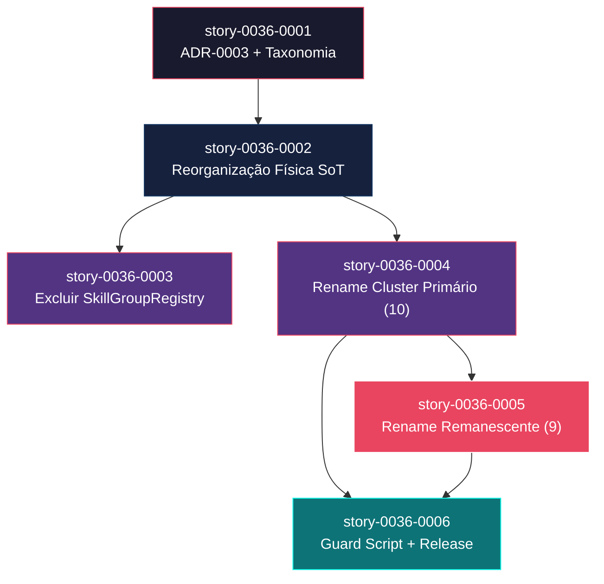

# Mapa de Implementação — Skill Taxonomy and Naming Refactor

**Gerado a partir das dependências BlockedBy/Blocks de cada história do epic-0036.**

---

## 1. Matriz de Dependências

| Story | Título | Chave Jira | Blocked By | Blocks | Status |
| :--- | :--- | :--- | :--- | :--- | :--- |
| story-0036-0001 | ADR-0003 e Taxonomia Aprovada | — | — | story-0036-0002 | Concluída |
| story-0036-0002 | Reorganização Física do Source of Truth | — | story-0036-0001 | story-0036-0003, story-0036-0004 | Concluída |
| story-0036-0003 | Exclusão do SkillGroupRegistry | — | story-0036-0002 | — | Concluída |
| story-0036-0004 | Rename do Cluster Primário (10 skills) | — | story-0036-0002 | story-0036-0005, story-0036-0006 | Pendente |
| story-0036-0005 | Rename Global Remanescente (9 skills) | — | story-0036-0004 | story-0036-0006 | Concluida |
| story-0036-0006 | Guard Script de CI e Release Notes | — | story-0036-0004, story-0036-0005 | — | Pendente |

> **Nota:** story-0036-0005 depende de story-0036-0004 para evitar conflitos em superfícies compartilhadas (templates, regras, testes). Ambos os clusters de rename tocam os mesmos arquivos (Rule 13, _TEMPLATE-*.md, golden files), e serializar as PRs garante consistência sem merge conflicts.

---

## 2. Fases de Implementação

> As histórias são agrupadas em fases. Dentro de cada fase, as histórias podem ser implementadas **em paralelo**. Uma fase só pode iniciar quando todas as dependências das fases anteriores estiverem concluídas.

```
╔══════════════════════════════════════════════════════════════════════════╗
║                   FASE 0 — Decisão Arquitetural                        ║
║                                                                        ║
║   ┌─────────────────────────────────────────────┐                      ║
║   │  story-0036-0001  ADR-0003 + Taxonomia      │                      ║
║   └──────────────────────┬──────────────────────┘                      ║
╚══════════════════════════╪═════════════════════════════════════════════╝
                           │
                           ▼
╔══════════════════════════════════════════════════════════════════════════╗
║                   FASE 1 — Reorganização Física                        ║
║                                                                        ║
║   ┌─────────────────────────────────────────────┐                      ║
║   │  story-0036-0002  Reorganizar SoT em 10 cat │                      ║
║   └──────┬──────────────────────┬───────────────┘                      ║
╚══════════╪══════════════════════╪══════════════════════════════════════╝
           │                      │
           ▼                      ▼
╔══════════════════════════════════════════════════════════════════════════╗
║              FASE 2 — Core + Rename Primário (paralelo)                ║
║                                                                        ║
║   ┌──────────────────────┐  ┌──────────────────────────┐               ║
║   │  story-0036-0003     │  │  story-0036-0004         │               ║
║   │  Excluir Registry    │  │  Rename 10 skills        │               ║
║   └──────────────────────┘  └────────────┬─────────────┘               ║
╚══════════════════════════════════════════╪═════════════════════════════╝
                                           │
                                           ▼
╔══════════════════════════════════════════════════════════════════════════╗
║                   FASE 3 — Rename Remanescente                         ║
║                                                                        ║
║   ┌─────────────────────────────────────────────┐                      ║
║   │  story-0036-0005  Rename 9 skills           │                      ║
║   └──────────────────────┬──────────────────────┘                      ║
╚══════════════════════════╪═════════════════════════════════════════════╝
                           │
                           ▼
╔══════════════════════════════════════════════════════════════════════════╗
║                   FASE 4 — Guard + Release                             ║
║                                                                        ║
║   ┌─────────────────────────────────────────────┐                      ║
║   │  story-0036-0006  Guard Script + Rel. Notes │                      ║
║   └─────────────────────────────────────────────┘                      ║
╚══════════════════════════════════════════════════════════════════════════╝
```

---

## 3. Caminho Crítico

> O caminho crítico (a sequência mais longa de dependências) determina o tempo mínimo de implementação do projeto.

```
story-0036-0001 → story-0036-0002 → story-0036-0004 → story-0036-0005 → story-0036-0006
   Fase 0            Fase 1            Fase 2            Fase 3            Fase 4
```

**5 fases no caminho crítico, 5 histórias na cadeia mais longa (0001 → 0002 → 0004 → 0005 → 0006).**

O caminho crítico atravessa todas as fases porque os renames são sequenciais (cluster primário antes do remanescente) e o guard script depende de todos os renames concluídos. A story-0036-0003 (SkillGroupRegistry) está fora do caminho crítico — pode absorver atrasos sem impacto na entrega final.

---

## 4. Grafo de Dependências (Mermaid)



---

## 5. Resumo por Fase

| Fase | Histórias | Camada | Paralelismo | Pré-requisito |
| :--- | :--- | :--- | :--- | :--- |
| 0 | story-0036-0001 | Foundation (Doc) | 1 | — |
| 1 | story-0036-0002 | Foundation (Infra) | 1 | Fase 0 concluída |
| 2 | story-0036-0003, story-0036-0004 | Core + Extension | 2 paralelas | Fase 1 concluída |
| 3 | story-0036-0005 | Extension | 1 | story-0036-0004 concluída |
| 4 | story-0036-0006 | Cross-cutting | 1 | Fases 2 e 3 concluídas |

**Total: 6 histórias em 5 fases.**

> **Nota:** A Fase 2 é a única com paralelismo (story-0036-0003 e story-0036-0004). story-0036-0003 é uma folha que pode ser executada independentemente do caminho crítico.

---

## 6. Detalhamento por Fase

### Fase 0 — Decisão Arquitetural

| Story | Escopo Principal | Artefatos Chave |
| :--- | :--- | :--- |
| story-0036-0001 | ADR-0003 com 6 sub-decisões + staging document | `adr/ADR-0003-skill-taxonomy-and-naming.md`, `plans/epic-0036/skill-renames.md`, CLAUDE.md patch |

**Entregas da Fase 0:**

- ADR-0003 com status "Proposed" documentando D1-D6
- Staging document com tabela de 19 renames e checklist de 8 superfícies
- CLAUDE.md atualizado com nota EPIC-0036

### Fase 1 — Reorganização Física

| Story | Escopo Principal | Artefatos Chave |
| :--- | :--- | :--- |
| story-0036-0002 | Mover ~78 skills para 10 subpastas + atualizar SkillsAssembler | 10 subpastas em `core/`, 3 subpastas em `conditional/`, `SkillsAssembler` com traversal recursivo |

**Entregas da Fase 1:**

- Estrutura hierárquica `core/{category}/{name}/` com 10 categorias
- `SkillsAssembler.selectCoreSkills()` traversando subdiretórios recursivamente
- Output flat idêntico ao anterior (invariante verificada por golden files)

### Fase 2 — Core + Rename Primário

| Story | Escopo Principal | Artefatos Chave |
| :--- | :--- | :--- |
| story-0036-0003 | Excluir SkillGroupRegistry + derivar grupos do filesystem | `GithubSkillsAssembler` atualizado, `SkillGroupRegistry.java` excluído |
| story-0036-0004 | Renomear 10 skills do eixo epic/story/task/dev/arch/adr | 10 diretórios renomeados, ~133 referências textuais atualizadas, golden files regeneradas |

**Entregas da Fase 2:**

- `SkillGroupRegistry.java` removido — single source of truth via filesystem
- 10 skills com nomes inequívocos: `x-epic-create`, `x-task-implement`, `x-story-implement`, `x-epic-decompose`, `x-epic-map`, `x-epic-orchestrate`, `x-epic-implement`, `x-arch-plan`, `x-arch-update`, `x-adr-generate`
- Regra 13, templates e cross-skill refs atualizados com nomes novos

### Fase 3 — Rename Remanescente

| Story | Escopo Principal | Artefatos Chave |
| :--- | :--- | :--- |
| story-0036-0005 | Unificar `run-*` → `x-test-*` + simplificações pontuais | 9 diretórios renomeados, prefixo `x-` universal, simetria no cluster security |

**Entregas da Fase 3:**

- Prefixo `run-` eliminado — todas as skills usam `x-`
- `x-test-e2e`, `x-test-smoke-api`, `x-test-smoke-socket`, `x-test-contract`, `x-test-perf`
- `x-pr-fix`, `x-pr-fix-epic`, `x-runtime-eval`, `x-security-secrets`

### Fase 4 — Guard + Release

| Story | Escopo Principal | Artefatos Chave |
| :--- | :--- | :--- |
| story-0036-0006 | Guard script de CI + release notes + CHANGELOG | Guard script, release notes com tabela de migração, CHANGELOG.md atualizado |

**Entregas da Fase 4:**

- Guard script integrado ao CI detectando 19 nomes antigos
- Release notes com tabela completa de migração (old → new)
- CHANGELOG.md com entries Changed (19 renames), Removed (SkillGroupRegistry), Added (guard script, 10 categorias)
- ADR-0003 atualizado para status "Accepted"

---

## 7. Observações Estratégicas

### Gargalo Principal

**story-0036-0004 (Rename do Cluster Primário)** é o maior gargalo — bloqueia tanto story-0036-0005 (rename remanescente) quanto story-0036-0006 (guard script). Esta story toca ~133 referências textuais em 8 categorias de superfícies e exige a maior atenção na revisão de PR. Investir tempo extra no grep sanity e na regeneração de golden files compensa: um rename esquecido aqui propaga inconsistência para as Fases 3 e 4.

### Histórias Folha (sem dependentes)

- **story-0036-0003 (Excluir SkillGroupRegistry):** Não bloqueia nenhuma outra história. Pode absorver atrasos sem impacto no caminho crítico. Candidata ideal para desenvolvedor paralelo ou para ser feita simultaneamente com story-0036-0004 na Fase 2.
- **story-0036-0006 (Guard Script + Release Notes):** Folha final — é o último deliverable do épico.

### Otimização de Tempo

- **Paralelismo máximo na Fase 2:** story-0036-0003 e story-0036-0004 podem iniciar simultaneamente após Fase 1. Se dois desenvolvedores estiverem disponíveis, a Fase 2 leva o tempo da story mais longa (0004, estimada como a mais pesada).
- **story-0036-0001 pode já estar parcialmente concluída:** O ADR-0003 e o staging document já existem no repositório. Esta story pode ser a mais rápida se apenas revisão/ajustes forem necessários.
- **Guard script (0006) pode ter desenvolvimento antecipado:** O script pode ser escrito na Fase 2 em paralelo, sem integrar ao CI até que todos os renames estejam concluídos na Fase 3.

### Dependências Cruzadas

- **story-0036-0006** é o único ponto de convergência: depende de story-0036-0004 (Fase 2) e story-0036-0005 (Fase 3). Não pode iniciar até que ambos os ramos de rename estejam concluídos.
- Não há dependências cruzadas complexas — o grafo é essencialmente linear com um fork na Fase 2 (0003 ∥ 0004) e um join na Fase 4 (0006 ← 0004 + 0005).

### Marco de Validação Arquitetural

**story-0036-0002 (Reorganização Física)** é o checkpoint de validação. Após sua conclusão:
- A invariante SoT-hierárquico / output-flat está validada
- O `SkillsAssembler` traversa corretamente a nova estrutura
- Golden files confirmam que o output não mudou
- O pipeline `mvn clean verify` está green

Se story-0036-0002 introduzir problemas no assembly ou na geração de output, as Fases 2-4 devem ser pausadas até a correção. Este é o "ponto de não retorno" — após a Fase 1, a estrutura hierárquica é permanente.

---

## 8. Dependências entre Tasks (Cross-Story)

### 8.1 Dependências Cross-Story entre Tasks

| Task | Depends On | Story Source | Story Target | Tipo |
| :--- | :--- | :--- | :--- | :--- |
| TASK-0036-0002-001 | TASK-0036-0001-001 | story-0036-0002 | story-0036-0001 | data (tabela de categorias do ADR) |
| TASK-0036-0002-003 | TASK-0036-0002-001, TASK-0036-0002-002 | story-0036-0002 | story-0036-0002 | interface (diretórios reorganizados) |
| TASK-0036-0003-001 | TASK-0036-0002-003 | story-0036-0003 | story-0036-0002 | interface (SkillsAssembler com traversal) |
| TASK-0036-0004-001 | TASK-0036-0002-003 | story-0036-0004 | story-0036-0002 | schema (estrutura de diretórios hierárquica) |
| TASK-0036-0005-001 | TASK-0036-0004-006 | story-0036-0005 | story-0036-0004 | data (cluster primário renomeado) |
| TASK-0036-0006-001 | TASK-0036-0005-006 | story-0036-0006 | story-0036-0005 | data (todos os 19 renames concluídos) |

> **Validação RULE-012:** Todas as dependências cross-story de tasks são consistentes com as dependências de stories. Nenhum erro ou warning detectado.

### 8.2 Ordem de Merge (Topological Sort)

| Ordem | Task ID | Story | Parallelizável Com | Fase |
| :--- | :--- | :--- | :--- | :--- |
| 1 | TASK-0036-0001-001 | story-0036-0001 | — | 0 |
| 2 | TASK-0036-0001-002 | story-0036-0001 | TASK-0036-0001-003 | 0 |
| 3 | TASK-0036-0001-003 | story-0036-0001 | TASK-0036-0001-002 | 0 |
| 4 | TASK-0036-0001-004 | story-0036-0001 | — | 0 |
| 5 | TASK-0036-0002-001 | story-0036-0002 | TASK-0036-0002-002 | 1 |
| 6 | TASK-0036-0002-002 | story-0036-0002 | TASK-0036-0002-001 | 1 |
| 7 | TASK-0036-0002-003 | story-0036-0002 | — | 1 |
| 8 | TASK-0036-0002-004 | story-0036-0002 | — | 1 |
| 9 | TASK-0036-0002-005 | story-0036-0002 | — | 1 |
| 10 | TASK-0036-0003-001 | story-0036-0003 | TASK-0036-0004-001 | 2 |
| 11 | TASK-0036-0004-001 | story-0036-0004 | TASK-0036-0003-001 | 2 |
| 12 | TASK-0036-0003-002 | story-0036-0003 | TASK-0036-0004-002, TASK-0036-0004-003 | 2 |
| 13 | TASK-0036-0004-002 | story-0036-0004 | TASK-0036-0003-002, TASK-0036-0004-003 | 2 |
| 14 | TASK-0036-0004-003 | story-0036-0004 | TASK-0036-0003-002, TASK-0036-0004-002 | 2 |
| 15 | TASK-0036-0003-003 | story-0036-0003 | TASK-0036-0004-004 | 2 |
| 16 | TASK-0036-0004-004 | story-0036-0004 | TASK-0036-0003-003 | 2 |
| 17 | TASK-0036-0004-005 | story-0036-0004 | — | 2 |
| 18 | TASK-0036-0004-006 | story-0036-0004 | — | 2 |
| 19 | TASK-0036-0005-001 | story-0036-0005 | TASK-0036-0005-002 | 3 |
| 20 | TASK-0036-0005-002 | story-0036-0005 | TASK-0036-0005-001 | 3 |
| 21 | TASK-0036-0005-003 | story-0036-0005 | — | 3 |
| 22 | TASK-0036-0005-004 | story-0036-0005 | TASK-0036-0005-005 | 3 |
| 23 | TASK-0036-0005-005 | story-0036-0005 | TASK-0036-0005-004 | 3 |
| 24 | TASK-0036-0005-006 | story-0036-0005 | — | 3 |
| 25 | TASK-0036-0006-001 | story-0036-0006 | TASK-0036-0006-003 | 4 |
| 26 | TASK-0036-0006-002 | story-0036-0006 | TASK-0036-0006-004 | 4 |
| 27 | TASK-0036-0006-003 | story-0036-0006 | TASK-0036-0006-001 | 4 |
| 28 | TASK-0036-0006-004 | story-0036-0006 | TASK-0036-0006-002 | 4 |
| 29 | TASK-0036-0006-005 | story-0036-0006 | — | 4 |

**Total: 29 tasks em 5 fases de execução.**

### 8.3 Grafo de Dependências entre Tasks (Mermaid)

```mermaid
graph LR
    subgraph story-0036-0001["Story 0001 (ADR + Taxonomia)"]
        style story-0036-0001 fill:#e8f4fd
        T001_001["TASK-0036-0001-001<br/>Redigir ADR-0003"]
        T001_002["TASK-0036-0001-002<br/>Criar staging doc"]
        T001_003["TASK-0036-0001-003<br/>Atualizar CLAUDE.md"]
        T001_004["TASK-0036-0001-004<br/>Validar consistência"]
        T001_001 --> T001_002
        T001_001 --> T001_003
        T001_002 --> T001_004
        T001_003 --> T001_004
    end

    subgraph story-0036-0002["Story 0002 (Reorganização Física)"]
        style story-0036-0002 fill:#fde8e8
        T002_001["TASK-0036-0002-001<br/>Mover skills core"]
        T002_002["TASK-0036-0002-002<br/>Mover skills cond."]
        T002_003["TASK-0036-0002-003<br/>Atualizar Assembler"]
        T002_004["TASK-0036-0002-004<br/>Corrigir testes"]
        T002_005["TASK-0036-0002-005<br/>Regen golden files"]
        T002_001 --> T002_003
        T002_002 --> T002_003
        T002_003 --> T002_004
        T002_004 --> T002_005
    end

    subgraph story-0036-0003["Story 0003 (Excluir Registry)"]
        style story-0036-0003 fill:#e8fde8
        T003_001["TASK-0036-0003-001<br/>Excluir Registry"]
        T003_002["TASK-0036-0003-002<br/>Atualizar GH Assembler"]
        T003_003["TASK-0036-0003-003<br/>Testes + golden files"]
        T003_001 --> T003_002
        T003_002 --> T003_003
    end

    subgraph story-0036-0004["Story 0004 (Rename 10 skills)"]
        style story-0036-0004 fill:#fdf8e8
        T004_001["TASK-0036-0004-001<br/>Renomear dirs + frontmatter"]
        T004_002["TASK-0036-0004-002<br/>Cross-skill refs"]
        T004_003["TASK-0036-0004-003<br/>Regras + templates"]
        T004_004["TASK-0036-0004-004<br/>Docs do projeto"]
        T004_005["TASK-0036-0004-005<br/>Testes + golden files"]
        T004_006["TASK-0036-0004-006<br/>Verificação final"]
        T004_001 --> T004_002
        T004_001 --> T004_003
        T004_002 --> T004_004
        T004_003 --> T004_004
        T004_002 --> T004_005
        T004_004 --> T004_006
        T004_005 --> T004_006
    end

    subgraph story-0036-0005["Story 0005 (Rename 9 skills)"]
        style story-0036-0005 fill:#f0e8fd
        T005_001["TASK-0036-0005-001<br/>run-* → x-test-*"]
        T005_002["TASK-0036-0005-002<br/>Pointwise renames"]
        T005_003["TASK-0036-0005-003<br/>Cross-refs + templates"]
        T005_004["TASK-0036-0005-004<br/>Docs"]
        T005_005["TASK-0036-0005-005<br/>Testes + golden files"]
        T005_006["TASK-0036-0005-006<br/>Verificação final"]
        T005_001 --> T005_003
        T005_002 --> T005_003
        T005_003 --> T005_004
        T005_003 --> T005_005
        T005_004 --> T005_006
        T005_005 --> T005_006
    end

    subgraph story-0036-0006["Story 0006 (Guard + Release)"]
        style story-0036-0006 fill:#e8fdfa
        T006_001["TASK-0036-0006-001<br/>Guard script"]
        T006_002["TASK-0036-0006-002<br/>Permitted locations"]
        T006_003["TASK-0036-0006-003<br/>Release notes"]
        T006_004["TASK-0036-0006-004<br/>CHANGELOG"]
        T006_005["TASK-0036-0006-005<br/>Validar guard"]
        T006_001 --> T006_002
        T006_003 --> T006_004
        T006_002 --> T006_005
        T006_004 --> T006_005
    end

    T001_001 -.->|cross-story| T002_001
    T002_003 -.->|cross-story| T003_001
    T002_003 -.->|cross-story| T004_001
    T004_006 -.->|cross-story| T005_001
    T005_006 -.->|cross-story| T006_001
```


