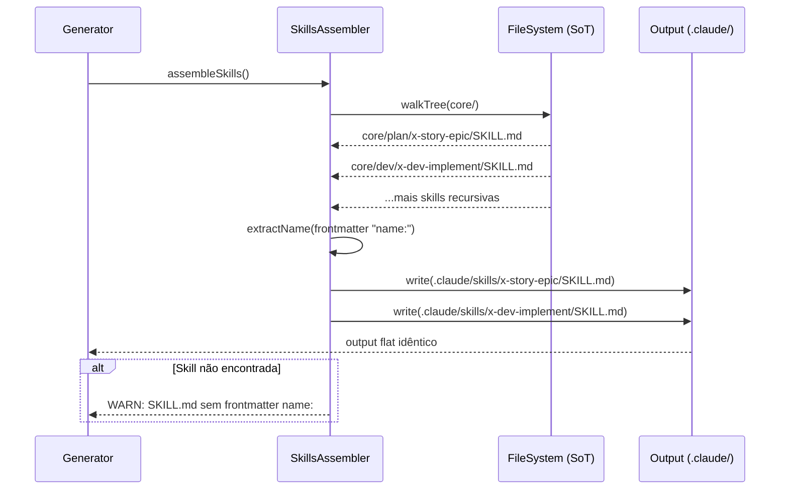

# História: Reorganização Física do Source of Truth

**ID:** story-0036-0002
**Chave Jira:** —
**Status:** Concluida

## 1. Dependências

| Blocked By | Blocks |
| :--- | :--- |
| story-0036-0001 | story-0036-0003, story-0036-0004 |

## 2. Regras Transversais Aplicáveis

| ID | Título |
| :--- | :--- |
| RULE-002 | SoT Hierárquico, Output Flat |
| RULE-003 | Taxonomia de 10 Categorias |
| RULE-007 | Golden File Regeneration |
| RULE-008 | Documentação como Deliverable |

## 3. Descrição

Como **Desenvolvedor do ia-dev-env**, eu quero reorganizar os diretórios de skills no source of truth em 10 categorias funcionais, garantindo que novos contribuidores encontrem skills por intenção (`plan/`, `dev/`, `review/`) em vez de escanear uma listagem flat de ~78 entradas.

Esta é a primeira mudança estrutural do épico. Sem renomear nenhuma skill, os diretórios sob `java/src/main/resources/targets/claude/skills/core/` e `conditional/` são movidos para subpastas de categoria. O `SkillsAssembler` é atualizado para traversar subdiretórios recursivamente, mantendo o output flat (`.claude/skills/{name}/SKILL.md`).

A invariante fundamental é: o output gerado não muda. Os mesmos SKILLs, com os mesmos nomes, nos mesmos caminhos de output. Apenas o source of truth muda de localização. Isso garante que nenhuma referência textual existente quebra.

### 3.1 Estrutura de Diretórios Alvo

```
targets/claude/skills/
├── core/
│   ├── plan/       (11 skills)
│   ├── dev/        (7 skills)
│   ├── test/       (4 skills core)
│   ├── review/     (16 skills)
│   ├── security/   (14 skills core)
│   ├── code/       (2 skills)
│   ├── git/        (3 skills)
│   ├── pr/         (3 skills)
│   ├── ops/        (6 skills)
│   ├── jira/       (2 skills)
│   └── lib/        (3 skills — inalterado)
├── conditional/
│   ├── test/       (5 runners)
│   ├── review/     (3 reviews)
│   └── security/   (7 scans)
└── knowledge-packs/ (inalterado, flat)
```

### 3.2 SkillsAssembler — Traversal Recursivo

- `selectCoreSkills()` e `selectConditionalSkills()` devem traversar subdiretórios recursivamente
- O nome da skill continua sendo extraído do campo `name:` no frontmatter do SKILL.md
- O caminho de output continua flat: `.claude/skills/{name}/SKILL.md`
- Adicionar comentário load-bearing no topo de `selectCoreSkills()` explicando a assimetria SoT-hierárquico / output-flat

### 3.3 Testes e Golden Files

- Atualizar caminhos hardcoded em `*SkillsTest*.java` e `*AssemblerTest*.java`
- Executar `mvn process-resources` seguido de `GoldenFileRegenerator`
- Golden files devem ser idênticas ao output anterior (pois nenhum nome mudou)

## 3.5 Entrega de Valor

- **Valor Principal:** Skills organizadas em 10 categorias navegáveis, reduzindo tempo de descoberta para novos contribuidores e eliminando a necessidade de `grep` para encontrar skills por funcionalidade
- **Métrica de Sucesso:** `ls targets/claude/skills/core/` exibe 10 categorias em vez de ~78 diretórios flat; `mvn clean verify` green; output gerado idêntico ao anterior
- **Impacto no Negócio:** Desbloqueio de story-0036-0003 (SkillGroupRegistry) e story-0036-0004 (renames) — ambas dependem da estrutura hierárquica

## 4. Definições de Qualidade Locais

### DoR Local (Definition of Ready)

- [ ] ADR-0003 aprovado com status "Proposed" (story-0036-0001 concluída)
- [ ] Tabela de categorias validada (seção 1 do staging document)
- [ ] Mapeamento completo: cada skill → exatamente 1 categoria

### DoD Local (Definition of Done)

- [ ] 10 subpastas criadas sob `core/` com skills movidas
- [ ] Skills condicionais movidas para subpastas sob `conditional/`
- [ ] `SkillsAssembler` traversa recursivamente e produz output flat idêntico
- [ ] Todos os testes passando: `mvn clean verify`
- [ ] Golden files regeneradas e idênticas ao output anterior
- [ ] Pelo menos 1 teste automatizado validando traversal recursivo
- [ ] Smoke test: skill invocada com sucesso em projeto de teste

### Global Definition of Done (DoD)

- **Cobertura:** ≥ 95% Line, ≥ 90% Branch
- **Testes Automatizados:** Unit tests para assemblers, golden file tests
- **Relatório de Cobertura:** JaCoCo por módulo
- **Documentação:** CLAUDE.md, README.md atualizados
- **Persistência:** N/A
- **Performance:** Tempo de assembly sem degradação > 10%

## 5. Contratos de Dados (Data Contract)

> Nenhum endpoint REST declarado nesta story. O contrato é a invariante de output do SkillsAssembler.

### 5.1 Invariante de Output

| Propriedade | Antes | Depois | Validação |
| :--- | :--- | :--- | :--- |
| Caminho de output | `.claude/skills/{name}/SKILL.md` | `.claude/skills/{name}/SKILL.md` (idêntico) | Diff vazio entre outputs |
| Campo `name:` no frontmatter | `x-story-epic` | `x-story-epic` (inalterado) | Golden file match |
| Quantidade de skills no output | N | N (mesmo número) | Contagem idêntica |
| Caminho SoT core | `core/{name}/` | `core/{category}/{name}/` | Diretório existe |
| Caminho SoT conditional | `conditional/{name}/` | `conditional/{category}/{name}/` | Diretório existe |

## 6. Diagramas

### 6.1 Fluxo de Assembly com Traversal Recursivo



## 7. Critérios de Aceite (Gherkin)

```gherkin
Cenario: Diretório core vazio (sem skills)
  DADO que o diretório "targets/claude/skills/core/" existe mas está vazio
  QUANDO o SkillsAssembler.selectCoreSkills() é executado
  ENTÃO o resultado deve ser uma lista vazia
  E nenhum erro deve ser lançado

Cenario: Traversal recursivo encontra skills em subpastas
  DADO que o diretório "targets/claude/skills/core/plan/" contém 11 skills
  E o diretório "targets/claude/skills/core/dev/" contém 7 skills
  QUANDO o SkillsAssembler.selectCoreSkills() é executado
  ENTÃO o resultado deve conter 18 skills (11 + 7)
  E cada skill deve ter o nome extraído do frontmatter "name:"

Cenario: Output flat é idêntico ao anterior
  DADO que todas as skills foram movidas para subpastas de categoria
  QUANDO o assembly completo é executado
  ENTÃO os arquivos em ".claude/skills/" devem ser idênticos ao output anterior
  E o diff entre outputs deve ser vazio

Cenario: Skill sem frontmatter name: gera warning
  DADO que existe um arquivo SKILL.md sem campo "name:" no frontmatter
  QUANDO o SkillsAssembler processa esse arquivo
  ENTÃO um warning deve ser logado
  E a skill deve ser ignorada no output

Cenario: Todas as 10 categorias existem
  DADO que a reorganização foi concluída
  QUANDO o conteúdo de "targets/claude/skills/core/" é listado
  ENTÃO devem existir exatamente 10 subpastas: plan, dev, test, review, security, code, git, pr, ops, jira
  E a subpasta "lib" deve continuar existindo (11 total com lib)

Cenario: Skills condicionais organizadas por categoria
  DADO que o diretório "targets/claude/skills/conditional/" foi reorganizado
  QUANDO o conteúdo é listado
  ENTÃO devem existir subpastas: test (5 runners), review (3 reviews), security (7 scans)
  E o total de skills condicionais deve ser 15

Cenario: mvn clean verify green após reorganização
  DADO que todas as skills foram movidas e o assembler atualizado
  QUANDO "mvn clean verify" é executado
  ENTÃO o build deve passar com sucesso
  E a cobertura deve ser ≥ 95% line e ≥ 90% branch
```

## 8. Tasks

| ID | Descrição | Camada | Dependências | Tag | Padrão de Testabilidade | Estimativa LOC |
| :--- | :--- | :--- | :--- | :--- | :--- | :--- |
| TASK-0036-0002-001 | Criar 10 subpastas de categoria sob core/ e mover skills core | Config | — | [Dev] | Config+VerificationTest | 150 |
| TASK-0036-0002-002 | Criar subpastas de categoria sob conditional/ e mover skills condicionais | Config | — | [Dev] | Config+VerificationTest | 80 |
| TASK-0036-0002-003 | Atualizar SkillsAssembler para traversal recursivo com comment load-bearing | Application | TASK-0036-0002-001, TASK-0036-0002-002 | [Dev] | Domain+UnitTest | 120 |
| TASK-0036-0002-004 | Atualizar testes Java com caminhos de diretório corrigidos | Test | TASK-0036-0002-003 | [Dev] | Domain+UnitTest | 100 |
| TASK-0036-0002-005 | Regenerar golden files e validar output idêntico via mvn clean verify | Test | TASK-0036-0002-004 | [Test] | Migration+Smoke | 80 |
